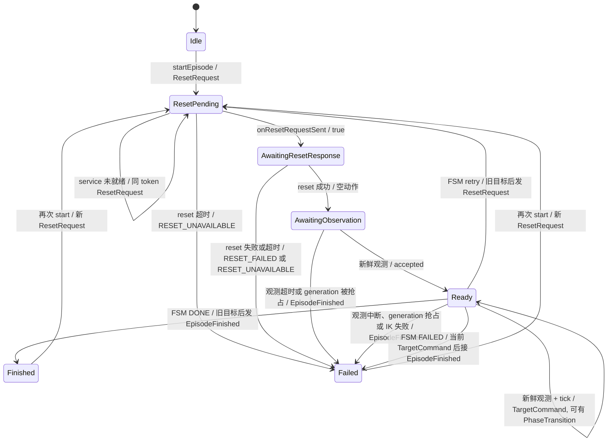

# Week 3.5 学习笔记

> 本文件记录 `task_executor` episode 编排重构。它承接 Week 3 的 Stage O 和三层职责整理，目标是让 episode 控制逻辑脱离 ROS 回调，成为一个可以用事件和动作单独测试的控制对象。

## 0. 如果一开始就了解整体架构，应该怎样指挥 AI 开发

> 假设我不是这样，以学习为目的，逐渐地打通和测试每一个模块，而是一开始就已经对整个理论和程序大致架构有所了解，整个 vibe coding 过程会有什么变换？我应该给出哪个 level 的指令？是直接一段话描述目标？还是只大概知道节点之间的职能和通信方式？还是需要深入到每个节点的组件的设计模式？还是需要再一步，去设计编排器、适配器的结构？

### 0.1 先回答：给到哪一层

**默认给到“目标、职责边界、跨模块契约、验收证据”这一层。** 比只说目标具体，但通常不需要预先画出每个类、接口和方法。指令的价值不在于术语多，而在于说明哪些决定已经确定、哪些可以让实现者选择，以及怎样判断结果真的工作。

| 指令粒度 | 本项目中的例子 | 适用情况与缺口 |
| --- | --- | --- |
| 只描述结果 | “做一个 Panda 在 MuJoCo 中抓放盒子的 ROS2 系统” | 可用于探索原型；没有限定 reset 后旧观测、时钟、成功判据，容易得到能演示却不可靠的链路。 |
| 描述节点职责和通信 | “bridge 管仿真与观测，executor 管任务，通过 ROS service/topic 通信” | 合适的架构起点；仍需说明消息何时可信、失败怎样结束、如何实测。 |
| **加上行为契约和验收** | “reset 回执关联同一批观测；旧观测不能驱动 IK；每次 episode 只发一次 outcome；用正常、retry、故障场景验证” | **推荐的默认层级。** 实现者可自行选择内部结构，用户仍有客观标准审核。 |
| 指定组件结构 | “用 controller 持有生命周期，ROS node 转换事件并执行动作；FSM 保持纯函数” | 已发现状态重复、回调膨胀等具体风险时再指定。这里 P0 对 `onTimer()` 的审查给出了足够证据。 |
| 指定每个模式和方法 | “每个 phase 一个类；这些方法按某个 UML 实现” | 只有接口已被外部约束、迁移必须兼容，或某个实现细节本身是研究目标时才值得做；否则会提前锁死尚未验证的设计。 |

因此，“了解理论和大致架构”不等于必须替 AI 设计 `EpisodeController` 的每个字段。用户应先定**系统不能违背的事实和行为**，例如谁直接调用 MuJoCo、谁负责 ROS、一次 reset 后哪份观测可用、什么算任务成功。`EpisodeController` + `TaskExecutorNode` 的具体分工，可以作为架构约束，也可以让 AI 在阅读现有代码后提出并给出证据；不必为了使用 Adapter、Strategy 等术语而增加类。

### 0.2 开发过程会怎样变化

学习驱动的本次过程，是逐个模块打通、实验、追问，再从重复问题中发现架构边界。若一开始已有全局理解，前期会改成一次较集中的**契约与风险审查**：先读仓库和现有接口，列出数据流、状态所有者、异步事件顺序、时钟和验收场景，确认最容易返工的边界。之后可以按完整的纵向链路推进：仿真观测与 reset 协议、纯 C++ 决策、ROS 适配、真实 episode 回归，而不必每增加一个小函数就停下来讨论概念。

减少的是“靠实现过程学习基础概念”的往返，**不减少实测**。机器人系统的接触、IK 收敛、DDS 排队和 reset 时序不会因为理论上理解了就自动正确。此时用户的主要工作也会从逐行指定实现，转为审查接口契约、关键权衡、失败样本和验收数据；AI 负责提出局部设计、写代码、跑测试并报告与目标不符的证据。

### 0.3 一份可直接使用的起始指令

下面是“假设从一开始就有全局架构认识”的版本；它约束结果和边界，仍给内部实现留空间：

> 在现有 ROS2 Humble + MuJoCo Panda 仓库里，实现可连续运行的抓取放置 episode。先阅读 `CLAUDE.md`、`docs/architecture.md` 和现有代码，核对我的假设；发现冲突时指出证据并调整方案。MuJoCo C API 只由 bridge 使用；executor 的 ROS 层负责消息、service 和命令发布；任务判断与 episode 状态应能脱离 ROS 单测。保持现有 topic、service、参数和 `EpisodeOutcome` 契约。
>
> 请先列出 bridge 到 executor 的观测/reset 契约、episode 状态由谁持有、仿真时间与故障看门狗的用途，以及目标发布、FSM 决策、retry、outcome 的顺序。reset 后只接受与回执匹配的新鲜观测；旧 session/generation/sequence 不能驱动目标；失败结果只发布一次。选择最少的内部组件和接口，解释关键权衡后实施。每个可运行阶段都构建、测试并跑真实可执行文件；至少验证固定场景成功、旧观测、reset 失败或超时、retry 和 IK 不可达。记录命令、结果、失败排查和仍未验证的范围；先不要提交。

这段话不是要求 AI 预先发明一整套类图。若仓库还没有 reset generation 协议，可以先把“reset 后只用本次新鲜观测”作为行为契约，再设计能证明样本归属的机制；固定等待或松散的时间戳本身不足以证明这一点。若协议已存在，则直接复用。**未知的实现方式可以开放，已知的风险与验收条件不应开放。**

### 0.4 粒度过低或过高的失败模式

| 指令问题 | 可能得到的结果 | 如何发现或纠正 |
| --- | --- | --- |
| 只有“抓放成功”这一句话 | 固定演示能跑，但 reset 前样本进入新 episode，或成功只代表命令发出 | 注入旧 generation 观测；核对真实物体落点与 `EpisodeOutcome`。 |
| 只有节点通信图 | 知道 bridge 与 executor 怎么连，却继续把 IK、FSM、retry 和日志堆进一个 timer 回调 | 检查状态所有权、`onTimer()` 的职责，以及纯 C++ 单测能否覆盖动作序列。 |
| 预先规定所有类与设计模式 | 新增接口很多，状态仍重复；实现者忙于满足类图而忽略测量结果 | 对照实际变化点删除无用抽象；以行为契约和回归结果决定是否保留组件。 |
| 只看单测，不跑真实链路 | 时钟、DDS、接触与 IK 的问题直到集成时才出现 | 运行真实 bridge/executor，检查 `/clock` publisher、outcome、telemetry 和最终落点。 |

可复用的判断句是：**我负责规定目标、不可违背的边界和证据；AI 负责在这些约束内选择最小实现，并用实测证明选择成立。** 本项目的学习约定仍要求逐 stage 构建、运行、讲解和写笔记；上面的假设改变的是起始指令和讨论重心，不会取消这些项目约定。

## 学习重点范围

本阶段只处理 episode 编排边界，不扩展 FK、IK、MuJoCo bridge 或任务状态机的能力。重点是：

1. 明确 `start`、reset 回执、观测和 tick 在 episode 生命周期中的顺序。
2. 让控制对象返回 `request reset`、`publish target`、`finish episode` 等无 ROS 的动作值。
3. 让 ROS 节点只做消息转换、服务/话题通信、定时触发和动作执行。
4. 在每次搬动职责后用单测和固定场景回归证明行为没有漂移。

## 目录

- [0. 如果一开始就了解整体架构，应该怎样指挥 AI 开发](#0-如果一开始就了解整体架构应该怎样指挥-ai-开发)
  - [0.1 先回答：给到哪一层](#01-先回答给到哪一层)
  - [0.2 开发过程会怎样变化](#02-开发过程会怎样变化)
  - [0.3 一份可直接使用的起始指令](#03-一份可直接使用的起始指令)
  - [0.4 粒度过低或过高的失败模式](#04-粒度过低或过高的失败模式)
- [1. 背景与现状](#1-背景与现状)
- [2. 原始提问与本阶段回答](#2-原始提问与本阶段回答)
- [3. 目标与边界](#3-目标与边界)
- [4. 控制对象契约](#4-控制对象契约)
  - [4.1 这里用了哪些设计模式](#41-这里用了哪些设计模式)
  - [4.2 EpisodeState 整体状态转移](#42-episodestate-整体状态转移)
- [5. 分阶段实施计划](#5-分阶段实施计划)
- [6. 验收与测试矩阵](#6-验收与测试矩阵)
- [7. 权衡、失败模式与可观测性](#7-权衡失败模式与可观测性)
- [8. 主动补充的问题](#8-主动补充的问题)
- [9. 后续记录入口](#9-后续记录入口)
- [10. P0：现有行为基线](#10-p0现有行为基线)
- [11. P1：最小 episode 控制对象](#11-p1最小-episode-控制对象)
- [12. P2：接管 reset 与观测生命周期](#12-p2接管-reset-与观测生命周期)

---

## 1. 背景与现状

P0 基线时 `onTimer()` 从 [task_executor_node.cpp](../../src/task_executor/src/task_executor_node.cpp) 开始串联 reset 超时、观测准入、IK seed、waypoint 求解、FSM 输入组装、目标发布、阶段 telemetry、retry 和 episode outcome。P2 已将 reset 与观测生命周期交给 `EpisodeController`；IK/FSM 与阶段 telemetry 仍在节点中，属于 P3 的迁移范围。

已有组件不在本阶段重写：

| 组件 | 当前职责 | 本阶段处理 |
| --- | --- | --- |
| `fsm.cpp` | 根据 `FsmInputs` 和 `JointTarget` 计算阶段决策 | 保持不变，继续作为纯决策函数 |
| `WaypointSource` | 从阶段和物体位姿生成关节目标 | 保持接口不变 |
| `ObservationSnapshot` | 把一份观测整理成 FSM/IK 输入 | 作为控制对象的输入值 |
| `ResetGate` | P0 时节点的 reset/观测流程状态机 | P2 已删除，相关状态由 `EpisodeController` 持有 |
| `EpisodeTelemetry` | 按阶段积累诊断并展开为旧 `EpisodeOutcome` | P2 节点仍负责填充，P3 再迁移 |

Week 3 已记录的 reset generation、同一步观测包和目标配置契约继续有效；本阶段不是再次修改这些 ROS 契约。

## 2. 原始提问与本阶段回答

> 我认为屎山主要堆在 task executor，而且未来明显会越来越大。FK/IK 和 mujoco bridge 都还好。
>
> 先重构 episode 编排：让一个可独立测试的控制对象接收“开始、reset 回执、观测、tick”，返回“请求 reset、发布目标、结束 episode”等动作；ROS 节点负责通信和执行这些动作。先用现有回归固定行为，再移动职责。无需为了拆文件而增加 ROS 节点，也不必给每个小步骤造一个接口。

本阶段采用这个方向，但把迁移拆成小步：先冻结动作顺序和失败语义，再建立最小控制对象，最后让节点成为适配层。不会把 ROS action、插件系统或新的进程边界提前写进设计。

## 3. 目标与边界

### 3.1 本阶段目标

- 控制对象不包含 `rclcpp`、ROS message、ROS publisher/client 或 `mjModel`。
- 控制对象拥有 episode 状态、reset/观测门控信息、当前阶段、retry 计数、waypoint/IK 诊断和 telemetry；不再嵌套另一套流程状态机。
- ROS 节点把消息转换成领域输入，把领域动作转换成 ROS 发布或 service 请求。
- 原有话题名、服务名、消息类型、参数名和 `EpisodeOutcome` 字段保持不变。
- 保持当前单线程 executor 的顺序假设，并把这个假设写入测试和文档。

### 3.2 明确不做

- 不修改 `fsm.cpp` 的阶段逻辑、成功判据或 retry 语义。
- 不修改 `arm_kinematics`、`DiffIkWaypointSource` 或 MuJoCo bridge。
- 不新增 ROS 节点、ROS action server、通用事件总线或后端插件注册表。
- 不在本阶段引入多线程 executor；如果未来需要，另开阶段处理同步。
- 不以“文件行数变少”作为验收标准；验收看职责、行为和测试边界。

## 4. 控制对象契约

第一版使用少量明确的方法和一个动作批次，不为每个内部步骤建接口。P1 冻结的领域边界如下：

```text
EpisodeController
  startEpisode(wall_time, sim_time_s) -> EpisodeActions
  onResetRequestSent(request_token) -> bool
  onResetResponse(request_token, ResetReceipt, sim_time_s) -> EpisodeActions
  onObservation(ObservationEnvelope, wall_time, sim_time_s) -> EpisodeActions
  tick(sim_time_s, wall_time) -> EpisodeActions
```

`ObservationEnvelope` 包含 `ObservationFrame` 以及 bridge session、generation、sample sequence 和仿真时间戳。控制对象只接收普通 C++ 值，不接收 ROS message。

P1 前 `ObservationSnapshot` 的头文件包含 ROS message 类型，`EpisodeTelemetry` 也直接提供了展开为 `EpisodeOutcome` ROS message 的方法。P1 保留现有转换函数作为适配层入口，控制对象使用不包含 ROS 的 `ObservationFrame`、`PhaseTelemetry` 和 `EpisodeFinished`；ROS message 的组装仍留在节点中。

`onObservation()` 负责按 session/generation/sequence 门控并保存最新完整观测；它不会因为消息到达就推进 FSM 或发布目标。它可以在检测到更高 generation 时结束当前 episode。目标重发和将来的阶段推进由 `tick()` 驱动，这样控制频率仍由现有 20 Hz timer 决定，而不会被观测发布频率隐式改变。

`EpisodeActions` 至少表达：

```text
ResetRequest { request_token }
TargetCommand { JointTarget }
PhaseTransition { from, to, reason, telemetry }
EpisodeFinished { success, failure_code, retries, telemetry }
DiagnosticEvent { accepted/rejected observation, episode finish, IK failure }
```

动作是值而不是回调。节点收到 `ResetRequest` 后，在 service 就绪时发送请求、用 token 确认已发送，并把回执连同 token 送回控制对象；收到 `TargetCommand` 后发布现有两个命令话题；收到 `EpisodeFinished` 后展开为原有 `EpisodeOutcome`。动作批次可以为空，且结束动作只产生一次。

时间边界也要显式化：节点把 `rclcpp::Time` 转成仿真秒数，把 `steady_clock` 只用于 reset/观测看门狗；控制对象不直接读取系统时钟。这样单测可以精确复现“仿真时间不前进但墙钟超时”和“reset 回调晚到”的场景。

### 4.1 这里用了哪些设计模式

> 这里有什么设计模式

这里不需要把代码硬套进一组经典 GoF 模板。当前代码和计划中的重构，主要使用几种反复出现的工程组织方式：

| 模式或原则 | 当前/计划中的位置 | 它解决的问题 |
| --- | --- | --- |
| **显式状态机** | `Phase` + [`step()`](../../src/task_executor/include/task_executor/fsm.hpp#L140) | 用“当前阶段 + 观测”得到“下一阶段 + 原因”。当前不是每个阶段一个类，而是一个更容易测试的纯函数。 |
| **Strategy 策略模式** | [`WaypointSource`](../../src/task_executor/include/task_executor/waypoint_source.hpp#L48)、`KeyframeWaypointSource`、`DiffIkWaypointSource` | FSM 不需要知道目标由查表还是 IK 计算；替换目标算法时不必改 FSM。 |
| **Observer / 发布订阅** | ROS topics 和 subscriptions | bridge 与 executor 通过 ROS 消息通信，不直接调用对方；消息到达顺序和延迟因此需要单独处理。 |
| **Guard / 门控** | P0 的 `ResetGate`；P2 起为 `EpisodeController` 内的观测检查 | 只有 session、generation 和 sample sequence 正确的观测才能驱动 episode。P2 后流程状态只由 `EpisodeController` 保存。 |
| **Adapter 适配器** | 计划中的 `TaskExecutorNode` | ROS message 转成领域数据，`EpisodeActions` 再转成 ROS publish/service 调用。节点负责翻译，不负责 episode 决策。 |
| **Command 命令对象** | 计划中的 `ResetRequest`、`TargetCommand`、`EpisodeFinished` | 控制对象返回“要做什么”的值，节点之后执行它们；这样单测可以直接断言动作序列，不必启动 ROS。 |
| **应用层编排器** | 计划中的 `EpisodeController` | 它安排 reset、观测、waypoint、FSM、retry 和 telemetry 的顺序。这是应用服务式的编排边界，不是一个需要大量子类的经典模式。 |

另外还有两个更基础的工程原则：`JointTarget`、`ObjectPose` 和 `FsmInputs` 是值对象，便于构造测试输入；`fsm.cpp` 依赖数据和抽象接口，而不是 ROS 或具体 IK 实现，体现了依赖倒置。

P1 之前的分层还没有完全干净：`ObservationSnapshot` 的头文件包含 ROS message 类型，`EpisodeTelemetry` 也直接提供 ROS `EpisodeOutcome` 的展开方法。因此 P1 把 ROS message 转换留在适配层，让 `EpisodeController` 使用 ROS-free 的 `ObservationFrame`、`EpisodeFinished` 等领域数据。设计模式的价值在这里不是增加类的数量，而是让每个边界的输入、输出和副作用变得清楚、可测试。

### 4.2 EpisodeState 整体状态转移

> 看起来 `EpisodeState` 是一个明显更复杂的状态机。能否在 controller 每个函数前列出当前状态、状态转移、返回，并在 week3.5 画整体状态图？

`EpisodeState` 回答“这次 episode 的 reset 和观测准备到了哪一步”；`Phase` 回答“抓取任务进行到哪一步”。图中 `Ready` 的自环包含 HOME 到 VERIFY 等 `Phase` 变化，这些变化不会产生新的 `EpisodeState`。



运行中再次 `startEpisode()` 也会直接转到 `ResetPending` 并换新 request id；图中只画了 Idle 和终态的 start 箭头，以免相同的七条箭头遮住主路径。`finishEpisode()` 也可从任何非终态直接结束，本图着重画实际调用路径。旧/重复回执以及旧 session、generation、sequence 的观测通常保持原状态，不产生目标；观测准入检测到超时或更高 generation 时则会直接返回失败 outcome。因此 [节点的 `collectObservation()`](../../src/task_executor/src/task_executor_node.cpp) 在 `onObservation()` 后执行动作：正常接受时只收到诊断，失败时可能收到 `EpisodeFinished`。`TargetCommand` 和 IK 错误诊断由后续 `tick()` 产生。

函数前的 `Current / Transition / Return` 摘要对应这张图。它是一张 **episode 生命周期图**，不是 `Phase` 的完整状态图；reset 失败、观测失败和 FSM 失败虽然都到 `Failed`，其 failure code 与 telemetry 仍各自保留。画图的权衡是把许多无状态变化的旧消息拒绝压缩成文字说明，避免图被自环淹没；验证时仍要用旧 token、旧 generation 和 terminal exactly-once 单测检查这些被压缩的分支。

## 5. 分阶段实施计划

### P0：冻结现有行为契约

在写控制对象前整理当前行为快照：正常 tick 的目标发布顺序、terminal 阶段是否继续发布、retry 时 reset 请求的次数、IK 失败和 reset 失败的 outcome 字段，以及 `start_episode` 在运行中再次到达时的处理。记录现有单测数量和 Week 3 的固定场景、keyframe、偏移场景、旧观测探针结果。

**状态：已完成。** 结果见 [10. P0：现有行为基线](#10-p0现有行为基线)。

**出口条件：** 有一组可重复的基线命令和结果文件；所有后续差异都能归因到重构，而不是基线变化。

### P1：建立最小控制对象和事件/动作类型

新增纯 C++ 的 `EpisodeController` 及其领域类型。控制对象自己拥有 reset/观测流程状态，复用 `WaypointSource` 和 ROS-free 的 `EpisodeTelemetry` 数据，不改节点行为。现有 `ResetGate` 在 P2 节点迁移前仍供旧节点使用。单测覆盖 idle、start、reset pending、reset success、等待新鲜观测和 terminal 状态。

**出口条件：** 不启动 ROS 也能用测试构造一轮最小 episode，并断言动作序列；没有 ROS include 或 `rclcpp` 依赖。

### P2：迁移 episode 生命周期和 reset

让节点改用 P1 控制对象已有的 start、reset request token、reset response、观测准入和看门狗路径，并迁移 retry reset。节点在 reset 路径只负责发送 service、确认已发送并回传回执；观测消息转换后交给控制对象校验。保留旧日志字段，但日志内容由 `DiagnosticEvent` 携带必要数据。迁移完节点对 `ResetGate` 的全部调用后，删除 `reset_gate.hpp`、`reset_gate.cpp`、`test_reset_gate.cpp` 及 CMake 中的旧编译/测试引用；不能仅把成员从节点移走，却留下另一套无人使用的流程状态机。

**出口条件：** 连续 start、回执乱序、旧回执、service 未就绪或失败、retry reset、旧/重复观测、观测超时和 bridge 重启 session 都有单测及必要的真实节点回归；正常链路仍只发送预期次数的 reset 请求；仓库不再编译或引用 `ResetGate`。

**状态：已完成。** 实现与实测见 [12. P2：接管 reset 与观测生命周期](#12-p2接管-reset-与观测生命周期)。

### P3：迁移 tick 决策和阶段诊断

在 P2 已接管 reset 和观测准入的基础上，把当前 `onTimer()` 中的 IK seed、waypoint 求解、FSM 输入组装和阶段迁移搬入控制对象。节点的 timer 只提供时间、转发最新领域观测并执行返回动作。保留当前语义：每个可用 tick 重发当前目标，阶段改变时记录一条 telemetry，IK 异常只生成一次失败 outcome。

**出口条件：** 单测覆盖 stale/duplicate/superseded observation、IK failure、phase no-op、retry、done 和 failed；控制对象的动作序列能解释每一次命令或 outcome。

**状态：已完成。** 实现与实测见 [13. P3：迁移 tick 决策](#13-p3迁移-tick-决策)。

### P4：收窄 ROS 节点为适配层

删除节点中重复的 episode 成员和分支，只保留 ROS entity 创建、消息到领域值的转换、service 回调、timer 驱动、动作执行和日志格式化。不要为了让节点“看起来薄”而继续抽出零价值的小类。

**出口条件：** 节点不再直接调用 `step()`、`jointTargetFor()` 或修改 phase/retry/telemetry；这些调用只出现在控制对象中。话题、服务和参数的外部契约不变。

**状态：已完成。** 实现与实测见 [14. P4：收窄 ROS 节点](#14-p4收窄-ros-节点)。

### P5：回归、文档和架构记录

在 `robotics-dev` 中执行 build、test 和真实可执行文件回归。覆盖固定 IK 20 次、keyframe 旧模式、偏移物体、故意不可达 IK、retry reset、延迟旧观测探针。完成后补一份 `docs/adr/004-episode-controller.md`，记录采用的控制对象边界、动作幂等性和单线程前提，并把最终项目事实同步到 `docs/architecture.md`。

**出口条件：** 所有基线结果不退化；ADR 与 architecture 只写已经实现和实测的结论；本文件追加每个 P 阶段的改动、验证和排查记录。

## 6. 验收与测试矩阵

| 场景 | 预期控制对象动作 | 验证方式 |
| --- | --- | --- |
| 未 start，只有 tick | 空动作 | 单测 |
| start 后 service 未就绪 | 保持 reset pending，不发布目标 | 单测 + 日志 |
| reset 回执失败或超时 | 一次失败 outcome，进入 terminal | 单测 |
| 旧 session/generation/sequence 观测 | 拒绝观测，不发布目标 | 单测 + 旧观测探针 |
| 新鲜完整观测 | 发布当前 `JointTarget`，允许 FSM 前进 | 单测 + ROS 回归 |
| 当前阶段未到位 | 重发目标，不追加 telemetry | 单测 |
| 阶段迁移 | 追加一条 `PhaseTelemetry`，更新 phase | 单测 + CSV |
| IK 抛错 | `IK_FAILED`，不发送无效目标，outcome 只发布一次 | 单测 + 故意不可达目标 |
| retry | 记录真实失败原因，增加 retry，发一次 reset 请求 | 单测 + retry 实跑 |
| `DONE`/`FAILED` | 发布一次 outcome，后续 tick 为空 | 单测 + 固定场景 |
| episode 运行中再次 start | 按 P0 冻结的现有语义执行，并测试旧回执不会污染新 episode | 单测 |

运行验证仍遵守项目约定：先用 `ps -eo pid,comm` 确认没有遗留 bridge，检查 `/clock` 只有一个 publisher，直接运行安装目录可执行文件；构建使用 `colcon build --symlink-install`，测试使用 `colcon test` 和 `colcon test-result --all --verbose`。

## 7. 权衡、失败模式与可观测性

### 7.1 设计权衡

采用“有状态控制对象 + 值动作批次”，而不是把 episode 写成一个泛化事件总线。控制对象需要持有当前 phase、reset gate、waypoint 缓存和 telemetry；把它强行改成无状态 reducer 会增加状态重建和事件序列复杂度。采用少量明确方法，而不是为每个阶段或每种 ROS 回调造接口，保留替换观测来源和执行后端的空间，同时避免接口数量跟着 FSM 阶段增长。

动作值的代价是节点需要做一次转换，且必须定义动作顺序；收益是单测能直接断言“发生了什么”，不会依赖 mock publisher 或 ROS graph。动作设计必须保持幂等边界：持续目标可以每 tick 重发；reset 发送意图在确认前也可重复，但同一个 token 只应实际发送一次；outcome 由 terminal 状态防重复。

### 7.2 主要失败模式

| 失败模式 | 现象 | 防止/发现 |
| --- | --- | --- |
| reset 回执属于旧 episode | 新 episode 收到旧 generation 或旧 token | token/session 单测，日志打印 request token |
| 同一 tick 重复结束 | runner 收到两个 outcome | controller terminal guard + exactly-once 单测 |
| 把旧观测当新 seed | IK 报越界或动作突然跳变 | generation/sequence gate + 延迟观测探针 |
| 动作执行顺序改变 | phase 已变但发布了错误阶段目标 | P0 记录顺序，动作批次顺序断言 |
| sim time 与 wall time 混用 | 阶段立即超时或永不超时 | 时间作为输入，分别注入两类时钟 |
| 迁移后多线程竞态 | reset、观测和 tick 修改同一状态 | 先保持单线程；启用多线程前另开同步设计 |

## 8. 主动补充的问题

这些问题不是当前用户提问的主线，但会直接决定控制对象是否可测试：

1. **动作幂等性：** timer 重入或 service 回调重复到达时，哪些动作可以重放，哪些必须由 token/terminal 状态去重？P0/P1 用单测回答。
2. **观测保留策略：** 控制对象只保留最新完整观测，还是需要按 `sample_sequence` 排队？当前 FSM 每 tick 只消费最新值，先用单最新值并测试丢帧行为；视觉接入后再评估队列。
3. **episode 抢占：** 运行中再次 `start_episode` 是否明确表示取消旧 episode 并开启新 episode？当前实现会重置自身状态，P0 先把这个行为固定下来，不能让迁移时偶然改变。
4. **并发前提：** 如果以后改用 `MultiThreadedExecutor`，哪些成员需要锁或串行 callback group？当前不提前加锁，先把单线程前提写进 controller 的测试和 ADR。

## 9. 后续记录入口

P0、P1、P2、P3 已完成，下一阶段是 P4。每个 P 阶段完成后按项目约定追加：

配套的重构前后架构图：[规格 JSON](../../docs/task_executor_episode_orchestration.json) · [交互式 HTML](../../docs/task_executor_episode_orchestration.html) · [visual-check 回执](../../docs/task_executor_episode_orchestration.visual-check.json)。图中的源码证据固定到生成时的 git revision；浏览器截图检查需要本机提供 Chrome/Chromium。

1. 改动文件和真实验证输出。
2. 控制对象机制、至少一项替代方案和一个失败模式。
3. 用户追问及尚未解锁的问题。
4. 排查过程和被推翻的结论。

完成 P5 后，再把结论性的接口和线程模型同步到 [`docs/architecture.md`](../../docs/architecture.md)，并新增 ADR 004。

## 10. P0：现有行为基线

### 10.0 一句话总结

P0 没有修改 `task_executor` 的运行代码，只建立了重构前的可重复基线。构建和测试通过；固定 IK 场景 20/20 成功，keyframe 旧模式固定场景 1/1 成功，偏移场景清楚地区分了 IK 的泛化能力和 keyframe 的失败边界。reset retry、不可达 IK 和旧 generation 观测也分别得到预期的失败结果。

### 10.1 改动清单与验证结果

本阶段新增的是结果记录，不是生产代码：

| 文件 | 内容 |
| --- | --- |
| [`results/p0_fixed_20.csv`](../../results/p0_fixed_20.csv) | 默认 diff-IK 固定场景 20 次 |
| [`results/p0_keyframe.csv`](../../results/p0_keyframe.csv) | keyframe 固定场景 1 次 |
| [`results/p0_shifted_ik.csv`](../../results/p0_shifted_ik.csv) | 物体沿 `+y` 偏移 4cm，diff-IK 1 次 |
| [`results/p0_shifted_keyframe.csv`](../../results/p0_shifted_keyframe.csv) | 同一偏移场景，keyframe 1 次 |
| [`results/p0_ik_failed.csv`](../../results/p0_ik_failed.csv) | `target.place_x_m:=10.0` 的不可达 IK |
| [`results/p0_retry.csv`](../../results/p0_retry.csv) | 错误验收中心、`max_retries:=1` 的 retry |
| [`src/task_executor/test/reset_generation_probe.py`](../../src/task_executor/test/reset_generation_probe.py) | 旧 generation 观测探针，复用已有脚本 |

验证命令和结果：

| 验证 | 结果 |
| --- | --- |
| `colcon build --symlink-install` | 5 packages finished |
| `colcon test` + `colcon test-result --all --verbose` | 354 tests，0 errors，0 failures，54 skipped |
| 真实节点运行前后 `ps -eo pid,comm` | 无遗留 `mujoco_bridge` 或 `task_executor_node` |
| 实跑时 `/clock` | 只有当前 bridge 发布；进程清理后无残留 publisher |

每次实跑都直接启动 `install/*/lib/*/*_node`，没有使用 `ros2 run` wrapper。失败场景的 runner 退出码为 1 是预期的任务失败，不是 runner 崩溃；脚本仍正常写出 outcome CSV。

### 10.2 当前行为契约

下表是后续 P1 重构必须保持的行为。带“源码确认”的条目来自当前代码路径；带“实测确认”的条目同时有本次运行证据。

| 输入或时机 | 当前行为 | 证据 |
| --- | --- | --- |
| 第一次 `start_episode` | 清空本地 episode 记录，phase 设为 `HOME`，retry 清零，调用一次 reset；reset 成功后等待匹配 generation 的观测 | `onStartEpisode()`、`beginReset()`；固定场景实测确认 |
| reset pending | 每个 timer tick 都会检查 service 是否就绪；未就绪则继续 pending，不发布目标 | `onTimer()` 263–295 行源码确认 |
| 接受一份完整新鲜观测 | 先给 diff-IK 设置 seed，再为当前 phase 求目标并发布关节/夹爪命令，之后才调用 FSM | `onTimer()` 297–361 行源码确认；日志按 phase 记录 |
| 当前 phase 未完成 | 继续重发当前目标，不追加阶段 telemetry | `decision.next_phase == phase_` 分支源码确认 |
| phase 发生变化 | 追加一条 `PhaseTelemetry`，更新 phase 和 `phase_start_time_` | `onTimer()` 368–441 行源码确认 |
| retry | 记录进入 `RECOVER` 的真实失败原因，retry 加一，reset generation 递增，重新从 `HOME` 开始 | [`results/p0_retry.csv`](../../results/p0_retry.csv) 和 executor 日志：generation 1 → 2 |
| `DONE` 或 `FAILED` | 发布一次 `EpisodeOutcome`，后续 timer 直接返回，不再发布目标 | `phase.hpp` 的 terminal 说明、`onTimer()` 263–268 行源码确认 |
| IK 抛错 | 当前 phase 不发布无效目标，立即发布 `IK_FAILED`，不增加 retry | [`results/p0_ik_failed.csv`](../../results/p0_ik_failed.csv)，失败阶段为 `PREPLACE` |
| 旧 session/generation/sequence 观测 | 不进入 IK/FSM；看门狗超时后发布 `OBSERVATION_STALE`，关节命令数为 0 | stale probe 实测确认 |
| episode 运行中再次 `start_episode` | 当前回调会立即重置本地状态并发起新的 reset；实测在 `CLOSE` 阶段收到第二次 start 后回到 `HOME`，generation `1 → 2`，接受 generation 2 观测，未等待第一个 episode 结束 | `onStartEpisode()`、`ResetGate` 源码和 `/tmp/p0_start_interrupt_executor.log` |

一个容易忽略的顺序约束是：当前实现会在调用 `step()` 前发布当前 phase 的目标；只有 phase 发生变化时才记录转换 telemetry。P1 的 `EpisodeActions` 必须先用单测固定这个顺序，再决定是否有理由改变它。

### 10.3 实跑基线

| 场景 | 结果 | 关键数据 |
| --- | --- | --- |
| 默认 diff-IK，固定物体，20 次 | **20/20 成功，0 retry** | 最终 box 均值 `(0.497417, 0.295315)m`；放置误差均值 `5.352mm`，最大 `6.078mm`；episode 时长均值 `6.915s` |
| keyframe，固定物体，1 次 | **1/1 成功，0 retry** | 最终 box `(0.433726, 0.309654)m`；CSV 中 Cartesian 诊断为空是既有语义 |
| diff-IK，物体沿 `+y` 偏移 4cm，1 次 | **1/1 成功，0 retry** | 最终 box `(0.497483, 0.294921)m`；相对任务 TCP 放置误差 `5.668mm` |
| keyframe，同一偏移场景，1 次 | **0/1，3 retry** | 最终 `GRASP_EMPTY`；box 仍在 `y≈0.04m`，说明查表目标没有随物体移动 |
| diff-IK，`target.place_x_m:=10.0`，1 次 | **0/1，0 retry** | `PREPLACE` 返回 `IK_FAILED`；模型位置残差约 `9.10m` |
| keyframe，验收中心设为 `(0,0)m`，`max_retries:=1` | **0/1，1 retry** | 最终 `PLACE_MISSED`；reset generation `1 → 2` |
| stale generation probe | **通过保护条件** | outcome=`OBSERVATION_STALE`，关节命令数 `0` |

固定 IK 20 次的完整 CSV 仍保留每个 phase 的持续时间、IK 残差、关节跟踪误差、实际 TCP 误差和最终放置误差；这些量不能互相替代。keyframe 的 `NaN`/空字段表示该模式没有 Cartesian 诊断，不表示误差为零。

### 10.4 机制、权衡与失败模式

P0 采用“正常成功 + 有意失败 + 时序注入”三类基线。只跑 20 次成功 episode 只能证明 happy path 没有立刻坏掉，不能固定 `IK_FAILED`、retry 或旧观测拒绝的行为；因此故意不可达目标、错误验收中心和旧 generation 探针必须一起保留。

当前基线的主要失败模式如下：

| 失败模式 | 已观察现象 | 重构时必须保留的验证 |
| --- | --- | --- |
| 目标算法不泛化 | 偏移物体时 keyframe 进入 `GRASP_EMPTY`，diff-IK 成功 | 两种 `WaypointSource` 的同场景对照 |
| IK 不可达 | `PREPLACE` 产生 `IK_FAILED`，不 retry | 单测断言无无效目标、outcome 只出现一次 |
| 验收目标错误 | `VERIFY` 超时后进入 `RECOVER`，retry 后 `FAILED` | phase/原因/retry/generation 全部可见 |
| 旧观测污染 | 旧 generation 连续到达仍不发布命令，最终 `OBSERVATION_STALE` | stale probe 和 controller 的 generation 单测 |
| 终态重复动作 | 当前 terminal tick 直接返回 | `DONE`/`FAILED` 后动作批次必须为空 |

### 10.5 P0 后仍需在 P1 明确的问题

1. 中途再次 `start_episode` 的“抢占旧 episode”语义已经由 P0 实测确认；P1 仍需用纯控制对象单测固定旧回执不能污染新 episode。
2. 当前 P0 没有统计每个 phase 的关节命令次数；P1 应把“持续目标可重复、reset 意图在发送确认前可重复、outcome 只一次”表达为动作序列断言。
3. 当前 executor 默认单线程；P0 的结果不能证明多线程 executor 下 reset 回调、观测缓存和 tick 安全，暂不把并发重构混入 P1。

### 10.6 排查记录

- `colcon test-result` 报告的 54 个 skipped 全部来自 `cppcheck` 静态检查项，测试本身没有 failure；不能把 skipped 当成运行时测试通过。
- 偏移 keyframe 场景的 runner 退出码为 1，但 CSV 和 executor 日志都正常生成；这是被测 episode 失败，不是测试工具异常。
- 所有实跑结束后重新检查进程列表，没有遗留 bridge 或 executor；因此本次基线没有被重复 publisher 污染。

## 11. P1：最小 episode 控制对象

### 11.1 本次改动

P1 建立了一个不依赖 ROS 的最小控制对象，但没有把它接到 `TaskExecutorNode`。这样本次改动可以先验证 episode 生命周期和动作契约，不会改变现有节点的运行路径。

| 文件 | 作用 |
| --- | --- |
| [`observation_frame.hpp`](../../src/task_executor/include/task_executor/observation_frame.hpp) | 定义 ROS-free 的 `ObservationFrame` 和带 session/generation/sequence 的 `ObservationEnvelope` |
| [`episode_controller.hpp`](../../src/task_executor/include/task_executor/episode_controller.hpp) | 定义 reset 回执、动作批次、诊断事件、episode 状态和控制对象接口 |
| [`episode_controller.cpp`](../../src/task_executor/src/episode_controller.cpp) | 独立管理 reset/观测流程和超时，保存最新新鲜观测，并在 `tick()` 产生当前 `WaypointSource` 目标 |
| [`episode_telemetry_data.hpp`](../../src/task_executor/include/task_executor/episode_telemetry_data.hpp) | 把 `PhaseTelemetry`/`EpisodeTelemetry` 数据移到 ROS-free 头文件；原 ROS 头文件继续提供兼容入口 |
| [`observation_snapshot.hpp`](../../src/task_executor/include/task_executor/observation_snapshot.hpp) | 现有 ROS 转换函数改为生成同一个 `ObservationFrame` 值类型 |
| [`test_episode_controller.cpp`](../../src/task_executor/test/test_episode_controller.cpp) | 不启动 ROS，验证控制对象的事件顺序和动作结果 |

`TaskExecutorNode` 没有改变；P1 的 `EpisodeController` 只在单测中使用。因此当前二进制行为仍由 P0 基线覆盖，P2/P3 才会逐步迁移节点职责。

### 11.2 控制对象怎么工作

可以把它理解成一个小的“episode 管理员”：它记住当前处于 reset、等待观测、可以执行还是已经结束，并把下一步要做的事情作为普通值返回。

```text
startEpisode
  -> ResetRequest(request_id)，保持 pending
  -> service 可用且发送成功：onResetRequestSent(request_id)
       未发送：后续 tick 继续返回相同 token 的 ResetRequest
  -> onResetResponse(success)
       失败: EpisodeFinished(RESET_FAILED)
       成功: 等待匹配 generation 的 ObservationEnvelope
  -> onObservation(fresh sample)
       保存最新观测，不立即发布目标
  -> tick
       TargetCommand(current phase, JointTarget)
```

这里有两个刻意保留的时序规则：

1. 观测回调只做 session/generation/sequence 门控和缓存，不在消息到达时推进 FSM。这样目标发布仍由固定 timer 驱动。
2. `ResetRequest` 是发送意图，不代表 service 调用已经发生。只有适配层确认发送并调用 `onResetRequestSent(request_id)`，控制对象才从 pending 进入等待回执；发送前的 tick 会继续返回相同 token 的请求。请求 token 不变，避免 service 不可用时丢失请求。

最初的 P1 草稿让 `EpisodeController` 和 `ResetGate` 同时记录 reset/观测流程状态，并在 `startEpisode()` 时提前标记请求已发送。用户指出这形成两套状态和发送时机歧义；复核现有节点的“service 未就绪则保持 pending”路径后，改为控制对象单独持有状态。旧节点在 P2 接管前暂用原 `ResetGate`，不是最终并存设计。

P1 的 `tick()` 只调用当前 phase 的 `WaypointSource`，还没有调用 `fsm::step()`、计算 IK 诊断或推进 phase；这些属于 P3。它已经证明控制对象可以接入 waypoint 策略，同时不把未来的完整编排一次性塞进新类。

### 11.3 这里的设计模式如何落地

P1 不是为了增加类数量，而是把之前藏在回调里的几种责任写成可断言的边界：

| 代码 | 实际含义 |
| --- | --- |
| `EpisodeController` | 应用层编排器，拥有 episode 生命周期，但不创建 ROS entity |
| `EpisodeActions` | Command 命令对象；节点以后执行值动作，单测可以直接检查动作内容 |
| `WaypointSource` | Strategy 策略接口；控制对象只依赖抽象，不知道 keyframe 或 diff-IK 的具体实现 |
| controller 内的观测检查 | Guard/门控规则；阻止旧 session、generation 和 sample sequence 进入当前 episode，不另设流程状态机 |
| `ObservationFrame` | 值对象；测试可以直接构造完整观测，不需要 ROS message |

这也解释了为什么没有为每个阶段创建一个类：阶段的规则仍由已有纯 `step()` 函数表达，P1 只先把“episode 的外部事件和动作”固定下来。

### 11.4 单测覆盖和结果

新增 `test_episode_controller` 的 10 个测试覆盖：

- idle 状态 tick 返回空动作；
- service 未就绪时同一个 reset token 会在 tick 中重复提供，发送确认后停止；
- 新的 start 会替换旧 episode，并让旧发送确认和旧回执失效；
- 旧 reset 回执不能污染新 episode；
- reset 失败生成一次 `EpisodeFinished(RESET_FAILED)`，后续 tick 为空；
- reset 成功后，旧 generation 观测仍不能发布目标；
- 新鲜观测进入 ready，下一次 tick 才返回 `TargetCommand`；
- generation 被 bridge 的新 reset 抢占时进入 `RESET_SUPERSEDED`，terminal 后不再产生动作；
- pending、等待观测和已就绪状态分别按墙钟超时，并检查终态不再发送请求或目标；
- 旧 session、重复 sequence 和旧 generation 不覆盖最新有效观测。

验证命令：

```bash
source /opt/ros/humble/setup.bash
colcon build --symlink-install
colcon test
colcon test-result --all --verbose
```

本次完整验证结果为：5 个 package 构建成功；共 389 个测试，0 errors，0 failures，59 skipped。`cppcheck` 的 skipped 是环境中已知的慢版本门控，不是 gtest 失败。P0 的 `reset_generation_probe.py` 另外修正了一个 `pep257 D213` 文档字符串格式问题，探针逻辑没有改变。

### 11.5 权衡和失败模式

P1 选择“有状态对象 + 值动作”，而不是通用事件总线。这样状态只在一个地方变化，测试可以断言具体的 request、target 和 finished；代价是 P2 的 ROS 节点需要把这些值翻译成 service/topic 调用。

当前最重要的失败模式是 reset 回执或观测属于旧 episode。控制对象用 request id、bridge session、generation 和 sample sequence 四层信息拒绝它们；如果观测报告了比当前 generation 更新的值，则认为当前 reset 已被抢占并结束 episode。另一个失败模式是 service 未就绪时丢失唯一请求；pending tick 重复提供相同 token，并由发送确认结束 pending。单测覆盖这些边界，P2 还要补 service 延迟和 retry reset 的真实节点回归。

### 11.6 P1 后仍未解决的问题

1. P2 节点适配层必须只在 service 请求实际交给 `async_send_request()` 后确认发送；若 service 未就绪，保持 pending。旧节点的观测准入和超时也依赖 `ResetGate`，因此删除旧类之前必须连这些调用一起迁移并做真实节点回归。
2. P3 把 FSM、IK 和 telemetry 迁入控制对象时，目标发布和 phase transition 的顺序必须继续符合 P0：先发布当前 phase 目标，再根据 `step()` 记录 transition。
3. 当前 controller 仍假设调用来自单线程；启用 `MultiThreadedExecutor` 前需要单独定义同步边界。

## 12. P2：接管 reset 与观测生命周期

### 12.0 一句话总结

`TaskExecutorNode` 的 start、reset 发送/回执、观测准入、5s 墙钟看门狗和 retry 计数已改由 `EpisodeController` 管理。旧 `ResetGate` 的头文件、实现、单测及 CMake 引用已删除。节点仍在 20 Hz timer 中消费最新完整观测，计算 IK、执行 FSM、发布目标并记录阶段 telemetry；这部分属于 P3。

### 12.1 改动与实测

| 范围 | P2 后行为 |
| --- | --- |
| [`episode_controller.hpp`](../../src/task_executor/include/task_executor/episode_controller.hpp)、[`episode_controller.cpp`](../../src/task_executor/src/episode_controller.cpp) | 增加 `beginRetry()`、`retryCount()` 和 `tickLifecycle()`；同一个 controller 持有 reset token、session、generation、sequence、超时与 terminal 状态 |
| [`task_executor_node.cpp`](../../src/task_executor/src/task_executor_node.cpp) | 将 reset/观测事件转成 controller 输入，执行 reset 动作、确认已发送、发布一次性 outcome；IK/FSM/telemetry 暂留节点 |
| [`test_episode_controller.cpp`](../../src/task_executor/test/test_episode_controller.cpp) | 增至 12 个测试，补 retry 后旧回执/旧 generation、bridge 新 session 与等待回执超时 |
| `reset_gate.hpp`、`reset_gate.cpp`、`test_reset_gate.cpp` | 已删除；`CMakeLists.txt` 不再编译旧类和旧测试 |

完整构建与测试：`colcon build --symlink-install` 5 个 package 完成；`colcon test` 与 `colcon test-result --all --verbose` 报 **371 tests，0 errors，0 failures，56 skipped**。跳过项仍是 `cppcheck` 慢版本门控。旧 `test_reset_gate.gtest.xml` 是本地 `build/` 的历史测试结果，已删除这个生成文件后重新统计；源码和 CMake 中已无 `ResetGate` 引用。

真实可执行文件直接从 `install/*/lib/*/` 启动，运行前后均无遗留 bridge/executor 进程。运行中 `/clock` 的 publisher count 为 1。

| 场景 | 结果 | 关键证据 |
| --- | --- | --- |
| 固定 diff-IK，1 次 | 1/1 成功，0 retry | `/tmp/p2_smoke.csv`；reset generation 1，成功 outcome |
| 旧 generation 探针 | `OBSERVATION_STALE`，关节命令 0 | `reset_generation_probe.py` 实跑，期望 generation 2、只收到 generation 1 |
| keyframe 错误验收中心，`max_retries=1` | `PLACE_MISSED`，1 retry | `/tmp/p2_retry.csv`；两次 reset generation `1 -> 2` |
| service 始终不可用 | 一次 `RESET_UNAVAILABLE`，0 retry | 节点与 ROS probe 实跑；pending 期间不发布目标 |
| service 在 start 后才上线 | 一次 reset 请求，之后因无观测报 `OBSERVATION_STALE` | 延迟 1s 注册假 service；确认只收到一个 service 请求 |
| service 明确返回失败 | 一次 `RESET_FAILED` | 节点与假 reset service 实跑 |
| 运行中连续 start | 第二次 reset 后一次成功 outcome | generation `1 -> 2`，接受 generation 2 观测，旧 episode 被替换 |
| 不可达 diff-IK 放置目标 | `PREPLACE` 一次 `IK_FAILED`，0 retry | `/tmp/p2_ik_failed.csv`，没有发布无效目标 |

故意失败的 runner 退出码为 1，CSV 与节点 outcome 均正常生成，表示 episode 失败而非进程异常。

### 12.2 机制与权衡

`ResetRequest` 是可重复返回的发送意图。service 未就绪时节点不确认发送，controller 保持 pending；`async_send_request()` 成功提交后节点调用 `onResetRequestSent(token)`，随后回执必须带同一 token 才会改变状态。timer 每次先调用 `tickLifecycle()` 检查请求和超时，再把最新完整观测交给 `onObservation()`；只有 `ObservationAccepted` 才进入原来的 IK/FSM 路径。retry 调用 `beginRetry()`，增加计数并清除旧观测，同时生成新 token。

P2 保留节点现有的 waypoint 调用和 phase telemetry 填充，所以没有强行让 controller 的 `tick()` 再计算一遍 IK。临时使用 `tickLifecycle()` 专门驱动已迁移的生命周期；P3 将目标/FSM/telemetry 搬入控制对象后，节点可以直接消费完整 `tick()` 动作，并移除这个过渡入口。代价是 P2 期间节点仍有一部分编排逻辑；收益是 reset/观测协议已经只有一个状态所有者，且 P0 的目标发布顺序保持不变。

### 12.3 失败模式与排查

| 失败模式 | 表现 | 验证 |
| --- | --- | --- |
| service 未就绪却提前确认发送 | reset 意图丢失，最终只能超时 | 实跑无 service：一次 `RESET_UNAVAILABLE`；单测断言 pending 重复同 token |
| 旧回执或旧观测污染新 episode | 错 generation 被接受或目标跳变 | 连续 start 实跑、retry/generation/session 单测、旧观测探针 |
| terminal 后继续发命令或 outcome | runner 收到重复结果 | 单测断言 terminal tick 为空，实跑失败出口只收到一次 outcome |
| 迁移时重复计算 waypoint | 同一 tick 两次 IK 或阶段目标不一致 | P2 节点只调用 `tickLifecycle()`；固定 diff-IK 与 retry 回归通过 |

最初完整测试的唯一失败是 `task_executor_node.cpp` 一处 uncrustify 缩进；按检查输出修正后复测全绿。删除 `ResetGate` 后 `colcon test-result` 仍统计旧 gtest XML，说明生成目录不会自动清掉已移除的测试结果；删除该旧 XML 后才得到本阶段准确的 371 项统计。P3 前仍需关注两点：节点与 controller 都暂时持有部分 phase/telemetry 数据，不能把 P2 误认为编排已全部迁完；未来若改多线程 executor，回执、观测和 timer 的串行假设需要重新验证。

## 13. P3：迁移 tick 决策

### 13.0 用户原始请求与结果

用户要求“继续P3”，此前还要求这些重构改动先放在工作区一起看，**不提交**。本阶段把 diff-IK seed、waypoint 求解、FSM 输入/迁移、retry 决策和阶段 telemetry 移到纯 C++ `EpisodeController`。节点把 ROS 消息与仿真时间送入 controller，按动作批次执行目标发布、日志、reset 和 outcome。节点已不再调用 `step()`、`jointTargetFor()`，也不再持有 phase 或 telemetry 的第二份状态。

### 13.1 机制与顺序

`onObservation()` 只接收匹配 session/generation 且 sequence 递增的观测；`tick()` 每次最多消费一份尚未消费的新观测。对于该观测，先设置 IK seed 并求**当前** phase 目标；求解成功才返回 `TargetCommand`，随后用同一目标执行 FSM。如果发生迁移，同一批动作还带 `PhaseTransition`，controller 才更新 phase 并追加一条 telemetry。节点固定先发布 `TargetCommand`，再打印 transition，最后执行 reset 或发布 outcome。因此 `RECOVER -> HOME` 的那个 tick 仍发布 RECOVER 目标；下一个 generation 到来后才发 HOME 目标。无新观测的 timer tick 不重发旧缓存目标；有新鲜观测但 phase 未变化时仍重发目标，不追加 telemetry。

阶段耗时由节点传入 ROS 仿真时间计算，5 秒 reset/观测看门狗仍用 steady clock。reset 回执将 phase 起点设为当时仿真时间；运行中再次 start 会清空上一个 episode 的 telemetry 和 IK 缓存。IK 异常返回 `IK_FAILED`，不产生该阶段目标，失败阶段以 NaN 诊断追加到 outcome；terminal 状态阻止重复 outcome。

### 13.2 验证与排查

`colcon build --symlink-install` 完成 5 个 package；`colcon test`、`colcon test-result --all --verbose` 为 **375 tests、0 errors、0 failures、56 skipped**。新增/调整的 controller 测试覆盖旧 session/generation/sequence、重复观测只消费一次、phase 停留、当前目标先于迁移、IK 异常、timeout retry、retry limit 后保留原始 `TIMEOUT` 失败原因，以及 5 秒后到达的观测不能复活已过期 watchdog。另有真实节点回归：

| 场景 | 结果 |
| --- | --- |
| 默认 diff-IK 固定场景 1 次 | 1/1 成功、0 retry；`/tmp/p3_smoke.csv` |
| keyframe 错误验收位置，`max_retries=1` | generation `1 -> 2`，最终 `PLACE_MISSED`、1 retry；`/tmp/p3_retry.csv` |
| 不可达放置目标 | PREPLACE 一次 `IK_FAILED`、0 retry，telemetry 最后一项为 NaN；`/tmp/p3_ik_failed.csv` |
| 旧 generation 探针 | `OBSERVATION_STALE`，关节命令 0 |

每次真实 bridge 运行时 `/clock` 只有一个 publisher，结束后无遗留 bridge/executor。两个故意失败场景的 runner 退出码 1 表示 episode 失败，CSV 和 outcome 正常生成。第一次全量测试仅因新增测试文件三处 uncrustify 缩进而失败，修正后复测全绿。第一次 retry 实跑误用了不存在的 `verify.box_target_x_m` 参数，实际参数是 `verify.place_x_m`；改用正确参数后才出现预期的 `PLACE_MISSED`。

### 13.3 权衡、失败模式和后续关注

controller 构造时接受现有 `WaypointSource`、FSM 参数和一个可选的 `DiffIkWaypointSource*`，这样保留 keyframe 的 NaN TCP 诊断，也没有为每个小步骤增加接口。代价是 controller 知道 diff-IK 的 seed/diagnostics 能力；若再加入第三种求解后端，应审视这个能力边界。动作批次同时包含旧 phase 目标和新 phase transition，节点必须维持目标优先的执行顺序；单测与真实 retry 日志共同检查这一点。

本阶段主动补充的观察点：一是仿真时间与墙钟分别负责阶段进度和看门狗，混用会造成立即超时或永不超时；二是观测在看门狗到期的同一 timer 中抵达时不能先刷新 `last_sample_at_`，故在 `onObservation()` 准入前先检查到期；三是诊断日志与 outcome 的 phase 名称、数组长度需继续在集成回归中检查；四是当前仍假设 rclcpp 单线程串行回调，改多线程前要定义控制器同步边界。P4 可继续收紧节点的日志和动作执行代码；P5 再扩大固定场景样本并写 ADR。

## 14. P4：收窄 ROS 节点

### 14.0 改动

本阶段继续遵守“不增加 ROS 节点、不引入通用事件总线”的边界。`TaskExecutorNode` 现在只保留四类职责：

- 创建 ROS entity，接收 bridge observation 和 `~/start_episode`；
- 把 ROS 消息、仿真时间和 steady time 转成 controller 输入；
- 将 `EpisodeActions` 转成 joint/gripper 发布、reset service 请求和 `EpisodeOutcome`；
- 格式化日志，包括 IK 诊断、phase transition、reset 和最终落点。

动作执行集中在 `executeActions()`。它固定按当前目标诊断、目标发布、阶段迁移日志、reset 请求、episode outcome 的顺序处理；因此 `DONE`/`FAILED` 的那个 tick 仍先发布旧 phase 目标，retry 的那个 tick 仍先发布 `RECOVER` 目标再发 reset。`onTimer()` 只收集观测、调用 `controller_->tick()` 并转发动作。节点源码中已没有 `step()`、`jointTargetFor()`、phase/retry/telemetry 成员或生命周期分支。

### 14.1 验证

`colcon build --symlink-install` 完成 5 个 package；`colcon test` 与 `colcon test-result --all --verbose` 为 **375 tests、0 errors、0 failures、56 skipped**。真实验证如下：

| 场景 | 结果 |
| --- | --- |
| 默认 diff-IK 固定场景 | 1/1 成功、0 retry；`/tmp/p4_smoke.csv` |
| 旧 generation 观测探针 | `OBSERVATION_STALE`，关节命令 0 |

运行前 `/clock` 只有 1 个 publisher，测试结束后 `mujoco_bridge` 与 `task_executor_node` 均无遗留。一次格式检查曾因 reset 回调大括号风格失败，修正后全量测试通过。

### 14.2 设计说明与失败模式

`executeActions()` 是适配器中的一个动作解释器，不是新的业务控制器：它不决定 phase 或失败原因，只按 controller 已返回的值执行副作用。这样 ROS 回调和 timer 共享同一动作顺序，避免以后在两个入口分别补逻辑。代价是节点仍需要保留“最新 ROS observation”缓存和少量日志去重状态；这些状态服务于消息适配和日志，不参与 episode 决策。

主要失败模式是动作批次被部分执行：例如 reset service 尚未就绪时，`requestReset()` 不确认发送，controller 下一个 tick 会再次给出同一 token；target 和 outcome 则不会因为 service 未就绪而被伪造。另一个风险是 ROS 回调切换到多线程后 `executeActions()` 与 reset future 同时修改缓存，当前仍依赖单线程 executor，启用多线程前需要增加同步设计。P5 将覆盖 ADR、最终架构图和更大样本的回归。

## 15. P5：回归、架构记录和收尾

### 15.0 结果

P5 已完成。新增 [`docs/adr/004-episode-controller-orchestration.md`](../../docs/adr/004-episode-controller-orchestration.md)，记录 `EpisodeController` 的状态边界、`EpisodeActions` 的动作顺序、单线程前提和替代方案。最终架构规格与 HTML 位于 [`docs/task_executor_episode_orchestration.json`](../../docs/task_executor_episode_orchestration.json) 和 [`docs/task_executor_episode_orchestration.html`](../../docs/task_executor_episode_orchestration.html)。图分为“重构前”“重构后”“继续复用的核心”三个视图，明确 `TaskExecutorNode` 是 ROS 适配层，`EpisodeController` 是 episode 编排唯一状态所有者。

### 15.1 验证

| 验证 | 结果 |
| --- | --- |
| `colcon build --symlink-install` | 5 packages finished |
| `colcon test` + `colcon test-result --all --verbose` | 375 tests，0 errors，0 failures，56 skipped |
| Archify showcase validate | 9/9 checks，0 errors，0 warnings |
| Archify deliver | HTML 816576 bytes，artifact SHA-256 `584561521db7f5fbd528cc662e33dbc9763f34cfff73f0e5b3878e8dfffe6118` |
| 默认 diff-IK 固定场景 20 次 | **20/20 成功，0 retry**；[`results/p5_fixed_20.csv`](../../results/p5_fixed_20.csv) |
| 20 次平均结果 | box `(0.497403, 0.295436)m`，放置误差 `5.251mm` |
| 旧 generation 探针 | `OBSERVATION_STALE`，关节命令 0 |

20 次回归期间 `/clock` 保持单一 publisher，连续 episode 的 reset generation 和 outcome 均正常；运行结束后无遗留 `mujoco_bridge` 或 `task_executor_node`。Archify 的 `visual-check` 已读取最终 HTML，但当前环境没有 Chrome/Chromium，因此截图、viewport containment 和可读性检查为 skipped；这不影响规格校验和确定性 HTML delivery。

### 15.2 最终边界与未决事项

当前重构完成了本周目标：ROS 节点是适配器，episode 决策集中在可单测的控制对象，外部 ROS 契约保持不变。仍保留两个明确限制：`EpisodeController` 依赖 `DiffIkWaypointSource` 的可选诊断能力，未来第三种 IK 后端接入时需要重新评估接口；整个 executor 仍按单线程回调设计，多线程化必须另开同步设计。视觉观测、真机时钟和并发执行器不在本次 P5 的范围内。
