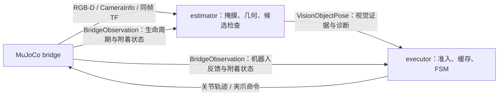
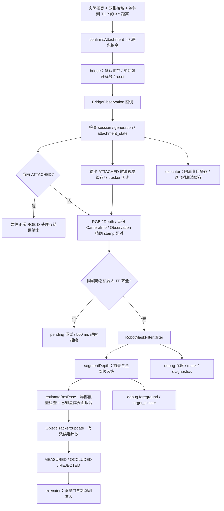
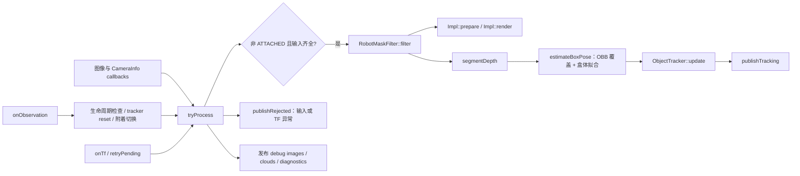

# Week 4 学习笔记

> Stage 1~5 已记录；Stage 5 当前采用 bridge 权威附着、视觉暂停/释放重测与 executor 缓存准入，见 [正式记录](#stage-5视觉接口收紧与简化状态机)。前文架构和 architecture.md 已同步；Stage 6 完整联调及 vision 抓放验收待完成。多色物体、bin、策略与数据契约见 [week4.5.md](week4.5.md)。

**Stage 4 历史现象（2026-10-01）：** 用户观察到 GRASP 遮挡后以 VISION_LOW_CONFIDENCE 停止。当时质量失败直接结束 episode，绕过 FSM 重试，增加 max_retries 无效；具体失败指标尚未核实。掩膜只能去除机器人表面，不能恢复遮挡像素。

当前质量失败记录诊断并等待新测量；ATTACHED 时视觉暂停，executor 复用最近接受的位姿数值，释放后重新测量。没有 TCP 预测或视觉独立夹持判断。bridge 的附着确认仍使用仿真真值/接触，锁存可能漏掉闭爪滑落；尚无完整 vision 成功证据。

## 学习重点范围

本周进入计划书 Chap 4 的 RGB-D 与几何位姿估计，建立从 MuJoCo 相机到 `world` frame 的可验证感知链。当前项目已有 ground-truth object pose、`BridgeObservation` 和 Cartesian waypoint；本周的工作是加入相机观测和视觉估计，同时保留 oracle 对照。

本周要掌握：

1. 相机内参、深度图、点云和外参的关系。
2. camera frame 到 `world` frame 的坐标变换和时间戳语义。
3. 桌面去除、目标分割、已知对应 SVD 配准和位姿残差。
4. 视觉置信度、低质量观测拒绝和任务层重新观察。
5. oracle、vision 与后续 policy 的输入边界。oracle 和 vision 是观测来源，policy 是执行方式，不能把三者当成互斥模式。

## 目录

- [架构视图：数据流、函数调用流与模块边界（动态）](#架构视图数据流函数调用流与模块边界动态)
- [1. 从前三周继承的事实和边界](#1-从前三周继承的事实和边界)
- [2. 本周 Stage 计划](#2-本周-stage-计划)
  - [2.1 Stage 1：RGB-D 相机和世界坐标观测](#21-stage-1rgb-d-相机和世界坐标观测)
  - [2.2 Stage 2：几何分割和刚体位姿估计](#22-stage-2几何分割和刚体位姿估计)
  - [2.3 Stage 3：oracle/vision 对照和任务接入](#23-stage-3oraclevision-对照和任务接入)
  - [2.4 Stage 4：同帧机器人几何掩膜](#24-stage-4同帧机器人几何掩膜)
  - [2.5 Stage 5：视觉接口收紧与简化状态机](#25-stage-5视觉接口收紧与简化状态机)
  - [2.6 Stage 6：任务证据门与完整抓放验收](#26-stage-6任务证据门与完整抓放验收)
- [3. 本周验收标准](#3-本周验收标准)
- [4. 失败模式和验证方法](#4-失败模式和验证方法)
- [5. 主动提示的问题](#5-主动提示的问题)
- [6. 开周悬挂问题快照](#6-开周悬挂问题快照)
- [7. Stage 1 讲解与追问记录](#7-stage-1-讲解与追问记录)
  - [7.1 RGB-D 数据基础](#71-rgb-d-数据基础)
  - [7.2 坐标系、TF 和像素投影](#72-坐标系tf-和像素投影)
  - [7.3 相机摆放、遮挡和渲染坐标转换](#73-相机摆放遮挡和渲染坐标转换)
  - [7.4 时间同步、消息契约和多相机边界](#74-时间同步消息契约和多相机边界)
  - [7.5 抓取判定：从 MuJoCo 接触到宽度和视觉](#75-抓取判定从-mujoco-接触到宽度和视觉)
  - [7.6 物体识别和形状先验](#76-物体识别和形状先验)
  - [7.7 性能、实测结果和验证结论](#77-性能实测结果和验证结论)
  - [7.8 尚未解决但必须保留的问题](#78-尚未解决但必须保留的问题)
- [8. Stage 2：几何分割和刚体位姿估计](#8-stage-2几何分割和刚体位姿估计)
  - [8.0 一句话总结](#80-一句话总结)
  - [8.1 改动清单与验证结果](#81-改动清单与验证结果)
  - [8.2 完整输入管线和模块关系](#82-完整输入管线和模块关系)
  - [8.3 为什么拆出独立感知包](#83-为什么拆出独立感知包)
  - [8.4 输入同步和消息契约](#84-输入同步和消息契约)
  - [8.5 几何处理链](#85-几何处理链)
  - [8.6 姿态、先验和输出语义](#86-姿态先验和输出语义)
  - [8.7 失败模式与验证手段](#87-失败模式与验证手段)
  - [8.8 你没问但值得注意的](#88-你没问但值得注意的)
  - [8.9 排查记录](#89-排查记录)
  - [8.10 本阶段边界与后续](#810-本阶段边界与后续)
  - [8.11 不引入深度模型时的泛化讨论](#811-不引入深度模型时的泛化讨论)
  - [8.12 流程鲁棒性：从初始检测到抓取过程](#812-流程鲁棒性从初始检测到抓取过程)
- [9. Stage 3：oracle/vision 对照和任务接入](#9-stage-3oraclevision-对照和任务接入)
  - [9.0 一句话总结](#90-一句话总结)
  - [9.1 改动清单与验证结果](#91-改动清单与验证结果)
  - [9.2 两种 observation 共用任务执行链](#92-两种-observation-共用任务执行链)
  - [9.3 视觉质量门与失败语义](#93-视觉质量门与失败语义)
  - [9.4 rqt_image_view 的订阅与可视化](#94-rqt_image_view-的订阅与可视化)
  - [9.5 权衡与替代方案](#95-权衡与替代方案)
  - [9.6 失败模式与验证手段](#96-失败模式与验证手段)
  - [9.7 排查记录](#97-排查记录)
  - [9.8 你没问但值得注意的](#98-你没问但值得注意的)
  - [9.9 本阶段边界与后续讨论](#99-本阶段边界与后续讨论)
- [10. Stage 4：同帧机器人几何掩膜](#10-stage-4同帧机器人几何掩膜)
  - [10.0 一句话总结](#100-一句话总结)
  - [10.1 改动清单与验证结果](#101-改动清单与验证结果)
  - [10.2 同帧掩膜如何工作](#102-同帧掩膜如何工作)
  - [10.3 抓取过程中的遮挡处理](#103-抓取过程中的遮挡处理)
  - [10.4 公开包、权衡与替代方案](#104-公开包权衡与替代方案)
  - [10.5 失败模式与验证手段](#105-失败模式与验证手段)
  - [10.6 排查记录](#106-排查记录)
  - [10.7 你没问但值得注意的](#107-你没问但值得注意的)
  - [10.8 本阶段边界与后续](#108-本阶段边界与后续)
- [Stage 5：视觉接口收紧与简化状态机](#stage-5视觉接口收紧与简化状态机)
  - [5.0 一句话总结](#50-一句话总结)
  - [5.1 改动清单与验证结果](#51-改动清单与验证结果)
  - [5.2 主要 STATE_REASON 解释](#52-主要-state_reason-解释)
    - [5.2.1 NO_CANDIDATE](#521-no_candidate)
    - [5.2.2 CANDIDATE_INVALID](#522-candidate_invalid)
    - [5.2.3 MULTIPLE_CANDIDATES](#523-multiple_candidates)
    - [5.2.4 INVALID_INPUT](#524-invalid_input)
    - [5.2.5 MISSING_ROBOT_TRANSFORM](#525-missing_robot_transform)
    - [5.2.6 LIFECYCLE_MISMATCH](#526-lifecycle_mismatch)
    - [5.2.7 OUT_OF_ORDER](#527-out_of_order)
  - [5.3 bridge：附着生命周期和机器人状态](#53-bridge附着生命周期和机器人状态)
    - [5.3.1 NOT_ATTACHED](#531-not_attached)
    - [5.3.2 ATTACHED](#532-attached)
    - [5.3.3 RELEASED](#533-released)
    - [5.3.4 为什么 contact flicker 不直接解除附着](#534-为什么-contact-flicker-不直接解除附着)
  - [5.4 task_executor：任务决策](#54-task_executor任务决策)
    - [5.4.1 kClose 和 kLift](#541-kclose-和-klift)
    - [5.4.2 kPreplace 和 kPlace](#542-kpreplace-和-kplace)
    - [5.4.3 kVerify](#543-kverify)
    - [5.4.4 视觉样本不可用时的处理](#544-视觉样本不可用时的处理)
  - [5.5 object_pose_estimator：视觉证据状态](#55-object_pose_estimator视觉证据状态)
    - [5.5.1 MEASURED](#551-measured)
    - [5.5.2 OCCLUDED](#552-occluded)
    - [5.5.3 REJECTED](#553-rejected)
    - [5.5.4 PREDICTED 当前为何不生成](#554-predicted-当前为何不生成)
    - [5.5.5 ATTACHED 时暂停视觉](#555-attached-时暂停视觉)
    - [5.5.6 RELEASED 后重新观测](#556-released-后重新观测)
  - [5.6 三个节点的接口语义与协作](#56-三个节点的接口语义与协作)
  - [5.7 旧 Stage 5 方案归档与弃用原因](#57-旧-stage-5-方案归档与弃用原因)
    - [5.7.1 旧方案做了什么](#571-旧方案做了什么)
    - [5.7.2 旧方案为什么会出现状态跳变](#572-旧方案为什么会出现状态跳变)
    - [5.7.3 为什么弃用](#573-为什么弃用)
    - [5.7.4 当前方案的改进](#574-当前方案的改进)
    - [5.7.5 历史实测与排查记录](#575-历史实测与排查记录)
  - [5.8 失败模式与验证手段](#58-失败模式与验证手段)
    - [5.8.1 排查记录：oracle 停在 CLOSE](#581-排查记录oracle-停在-close)
    - [5.8.2 排查记录：局部候选尺寸与中心偏差](#582-排查记录局部候选尺寸与中心偏差)
  - [5.9 你没问但值得注意的](#59-你没问但值得注意的)
  - [5.10 本阶段边界与后续](#510-本阶段边界与后续)
- [12. Week 4.5 交接](#12-week-45-交接)
- [13. 悬挂问题与反向清单](#13-悬挂问题与反向清单)

## 架构视图：数据流、函数调用流与模块边界（动态）

本节反映当前代码，机制和历史取舍见 [Stage 5](#stage-5视觉接口收紧与简化状态机)，项目事实以 [architecture.md](../../docs/architecture.md) 为准。bridge 提供附着生命周期，estimator 提供视觉证据，executor 决定是否继续。视觉节点不读取物体真值或接触；但 bridge 的附着确认仍使用仿真真值/接触，vision 模式尚不能宣称完全无 oracle 信息。

### 视觉与任务模块的连接



非附着时，vision 按 session/generation/sequence 配对，只接受质量合格的新 `MEASURED`。ATTACHED 时视觉暂停，executor 将最近已接受的视觉位姿数值与当前机器人反馈组成内部观测；没有 TCP 外推，也没有新视觉测量。退出附着后清缓存并重新测量。oracle 入口仍直接使用物体真值。

### 当前模块边界

```text
mujoco_bridge
  同一步反馈、实际指宽、附着确认/锁存/释放/reset
object_pose_estimator_node
  ROS 输入、精确配对、TF、生命周期与暂停/恢复、发布
  +-- robot_mask：渲染机器人预测深度、过滤自身表面
  +-- geometry_pipeline：反投影、桌面/ROI 分割、候选簇 OBB 覆盖检查与已知盒体表面拟合
  +-- ObjectTracker：候选有效性/唯一性、顺序检查、最近实测序号
task_executor
  视觉质量门、运输时缓存复用、释放后重新准入、FSM 与 episode
```

`ObjectTracker` 不再承担运动门、速度预测、TCP 附着或视觉滑移判断。`grasp_state/attachment_valid` 尚保留为 bridge 状态的派生副本，不能作为第二套权威。

### 运行时数据流



缺少相机输入时等待配对；TF 超时发布拒绝的前提是所需输入尚在缓存，已淘汰时只记录警告。暂停的是处理链，订阅回调和有界缓存仍可运行，不能仅凭结果 topic 静默判断节点掉线。

### 函数调用流



### 函数职责速查

| 模块/函数 | 当前职责 |
| --- | --- |
| bridge `confirmsAttachment()` / `publishObservation()` | 宽度、双指接触与 TCP 平面邻近确认抬升前夹持，不要求物体高度；维护锁存、释放/reset，记录状态切换 |
| `segmentDepth()` | 深度反投影、world ROI/桌面过滤与全部候选聚类 |
| `estimateBoxPose()` | OBB 尺寸上限/局部覆盖检查；支撑先验补 z，已知边长拟合可见侧面，输出位姿与质量 |
| `estimateKnownCorrespondences()` | 已知对应 SVD 配准；不在默认在线 OBB 路径 |
| `rejectionReasonName()` | 几何/输入拒绝枚举转字符串，不等于完整视觉原因词典 |
| `loadRobotVisualMeshes()` | 加载可见网格及 link 映射 |
| `RobotMaskFilter::filter()` / `Impl::prepare()` / `Impl::render()` | 设置相机与 link 位姿、渲染预测深度、过滤匹配表面像素 |
| `stampKey()` / `eigenTransform()` | 时间戳缓存键与 TF 到 Eigen 的转换 |
| `onRgb()` / `onDepth()` / `onColorInfo()` / `onDepthInfo()` | 缓存输入并调用 tryProcess |
| `onObservation()` | 生命周期过滤、附着状态更新、退出附着清缓存、tracker reset |
| `onTf()` / `hasRobotTf()` | 记录并检查同 stamp 动态机器人 TF 是否齐全 |
| `retryPending()` / `trim()` | 重试 TF 等待、超时拒绝；限制缓存大小 |
| `tryProcess()` | ATTACHED 早退；编排输入检查、TF、掩膜、分割、估计和发布 |
| `trackingSample()` | 适配生命周期、序号、stamp、bridge 附着状态；不用 TCP/宽度推断夹持 |
| `publishTracking()` / `publishRejected()` | 发布视觉结果/拒绝与诊断上下文 |
| `publishMaskImages()` / `publishCloud()` / `publishMaskDiagnostics()` | 发布同帧调试图像、点云和统计 |
| `ObjectTracker::anchorToSupport()` | 非 ATTACHED 才允许配置的支撑先验；不检查 55 mm 张爪门 |
| `ObjectTracker::update()` / `reset()` | 候选有效性/唯一性、生命周期/递增顺序、最近实测序号；清历史 |
| executor `onVisionObservation()` / `collectObservation()` | 缓存视觉消息、非附着质量准入、附着复用、交给 controller |
| FSM `step()` / `classifyGrasp()` | 前者消费 bridge 附着状态；后者在 executor 只分类 CLOSE 超时原因 |

### `/object_pose_estimator/object_pose` 的读取与诊断

#### 先看生命周期与 `evidence_state`

先核对 `bridge_session/generation/sample_sequence`，并同时查看 bridge 的 `attachment_state`。

| 值 | 名称 | 当前生产语义 |
| ---: | --- | --- |
| 0 | `REJECTED` | 输入、顺序或候选检查不通过；pose 不可执行 |
| 1 | `MEASURED` | 恰好一个有效候选，可有其他无效候选；仍需过 executor 质量门 |
| 2 | `PREDICTED` | 常量保留，当前生产路径不生成 |
| 3 | `OCCLUDED` | 候选为空；没有当前测量，等待重见 |

有效候选要求几何有效、至少 3 点、有限位置/四元数、四元数范数误差 ≤1e-3、有限且达到 `tracking.min_confidence=0.20` 的 confidence，以及有限 residual/inlier。没有测量时 residual/inlier 为 NaN，点数为 0，默认 pose 不可使用。`last_measurement_sequence` 记录最近实测序号，不是预测年龄；`processing_ms` 不包含相机渲染和配对等待。

#### 再看 `state_reason` 与 `diagnostic_stage`

| state_reason | evidence_state | diagnostic_stage | 触发条件与检查方向 |
| --- | --- | --- | --- |
| 空字符串 | MEASURED | NONE | 恰好一个合格候选；任务层仍需检查质量门 |
| NO_CANDIDATE | OCCLUDED | GEOMETRY | 候选为空；检查遮挡、深度、掩膜与聚类 |
| CANDIDATE_INVALID | REJECTED | GEOMETRY | 有候选但无合格候选；检查尺寸、点数和质量 |
| MULTIPLE_CANDIDATES | REJECTED | ASSOCIATION | 两个或更多合格候选；不靠历史运动门挑目标 |
| INVALID_INPUT | REJECTED | INPUT | 图像/掩膜/分割输入无效，或 tracker 序号为零、时间非法 |
| MISSING_ROBOT_TRANSFORM | REJECTED | INPUT | 同帧机器人 TF 超时或查询失败 |
| LIFECYCLE_MISMATCH | REJECTED | LIFECYCLE | tracker 的 session/generation 不匹配 |
| OUT_OF_ORDER | REJECTED | LIFECYCLE | sequence 或 stamp 小于或等于上一已处理样本 |

诊断名对应消息的 `DIAGNOSTIC_*` 常量；正常原因是空字符串，不是字符串 `NONE`。节点提前过滤已退休 session 和旧 generation，因此生命周期错误不保证每次都发布；tracker 单测覆盖其拒绝语义。PREDICTION/GRASP 诊断常量保留但没有当前正常生产路径。几何内部原因用于调试，不替代主结果的 `state_reason`。

#### 附着副本与诊断字段

| 字段 | 读取方式 |
| --- | --- |
| `grasp_state` | GRASP_NOT_ATTACHED=0、GRASP_HELD=1、GRASP_RELEASED=2，直接映射 bridge 生命周期 |
| `attachment_valid` | bridge 为 ATTACHED 的派生标记；正常附着期暂停发布，旧视觉消息不能代表当前反馈 |
| `candidate_count / eligible_candidate_count` | 所有/合格候选数，区分没候选、不合格与多候选 |
| `support_prior_used` | 配置与生命周期允许支撑锚定；不是接触或落桌证明 |
| `orientation_ambiguous` | 立方体姿态为规范代表值，yaw 不唯一可观测 |
| 夹爪宽度 | 读取 bridge 两根实际指关节位置之和，视觉消息不发布宽度 |

#### 排查顺序与任务行为

1. 查 bridge 生命周期，区分预期附着期静默与非附着期缺输入。
2. 核对生命周期/序号，读取证据状态、原因和诊断层。
3. 查候选计数、质量、先验及同帧 debug 深度/点云/TF。
4. 查 executor 更严格质量门（confidence ≥0.5、residual ≤0.005 m、inlier ≥0.7）与 controller 新鲜度。
5. 释放后确认新的合格 MEASURED；旧缓存或 RELEASED 本身不能证明落点。

`OCCLUDED / NO_CANDIDATE / GEOMETRY` 应查可见性与分割；`REJECTED / MULTIPLE_CANDIDATES / ASSOCIATION` 应查目标唯一性。质量失败当前记录诊断并等待，不再逐帧直接结束 episode；持续没有可准入观测仍可能触发 controller 的 `OBSERVATION_STALE`。

## 1. 从前三周继承的事实和边界

| 事实/约束 | Week 4 的处理 |
| --- | --- |
| `world` 是任务几何和 TCP 目标的表达 frame | 视觉输出必须明确是 `world -> object` 的绝对位姿；camera-frame 结果只能作为中间值 |
| `~/ground_truth/object_pose` 是唯一 oracle 源 | 正式视觉输出使用不同 topic 或消息字段，不能覆盖 oracle |
| `BridgeObservation` 保证同一物理步的关节、物体和 TCP 观测 | 相机数据要么进入新的观测 bundle，要么通过明确的时间戳同步；不能让 executor 静默拼接不同时间的数据 |
| `EpisodeController` 管理 generation、sequence 和 stale observation | 视觉节点不能自行绕过 reset 生命周期；过期估计必须被拒绝或标记 |
| `CartesianWaypointSource` 输出任务几何，后端可以是离线 IK、MoveIt 或 learned policy | 本周只验证 vision -> Cartesian task geometry；不接入 MoveIt planner、学习策略或障碍规划 |
| 相机外参只能由一处发布 | 相机模型、安装位姿和外参来源同步写入 `docs/architecture.md` |

本周不训练深度模型，不引入 VLA/RL/IL 运行时依赖，不把 `enable_debug_viewer` 的 GPU 性能问题混入视觉正确性验收。策略和数据边界另见 Week 4.5。

## 2. 本周 Stage 计划

### 2.1 Stage 1：RGB-D 相机和世界坐标观测

| 项 | 内容 |
| --- | --- |
| 改动 | 在 MuJoCo 场景加入固定 RGB-D 相机，发布标准 image、depth、CameraInfo 和唯一的相机 TF；记录相机内参、外参、分辨率、深度单位和发布频率 |
| 关键契约 | 深度像素反投影使用相机内参；相机外参通过 TF 查得；所有正式物体位姿最终表达在 `world` frame；消息带仿真时间戳 |
| 验证 | 用桌面平面、已知 box 中心和人工选取像素检查反投影；RViz2/离线脚本分别确认 camera frame 与 world frame 的方向 |
| 不做 | 不在相机节点内手写第二套外参，不把 ground truth 直接伪装成图像估计 |

相机观测和 `BridgeObservation` 的关系需要在实现时冻结：若图像和物理状态没有放入同一消息，就必须记录同步策略和允许的最大时间差。

### 2.2 Stage 2：几何分割和刚体位姿估计

| 项 | 内容 |
| --- | --- |
| 改动 | 完成 ROI/passthrough、桌面平面去除、目标聚类，以及已知对应 SVD 刚体配准；输出 pose、残差、inlier ratio、观测时间和拒绝原因 |
| 参考实现 | 先用 Eigen 自写已知对应 SVD 作为数学单测，再接工程化点云处理；ICP 或全局初始化属于后续增强，不把黑盒成功当作正确性证明 |
| 评测 | 改变物体位置、偏航、深度噪声、缺失点和遮挡，报告位置误差、姿态误差、失败率和 p50/p95 延迟 |
| 失败策略 | 错误初值、点数不足、残差过大、对称性不确定时输出低置信/拒绝，不生成可执行抓取目标 |

已知方形 box 的对称性必须显式定义姿态误差。若当前任务只关心位置和工具方向，应记录“等价姿态”规则，不能把不可观测的 yaw 误差误报为算法失败。

### 2.3 Stage 3：oracle/vision 对照和任务接入

| 项 | 内容 |
| --- | --- |
| 改动 | 在相同的任务执行入口提供 `oracle` 和 `vision` 两种观测来源；下游一次 episode 只能选择一种来源；记录选择、置信度和失败层级 |
| 验证 | oracle 作为规划/控制上限，vision 作为感知闭环；固定和 held-out 场景都保留两者结果，不把 oracle 结果混进 vision 统计 |
| 任务行为 | vision 低置信时重新观察或显式失败；不继续使用上一轮未经标记的旧 pose |
| 边界 | 本周不要求 learned policy 成功，也不要求障碍环境；但输出字段必须能被 Week 4.5 的 policy observation adapter 消费 |

Stage 3 的已完成验证只覆盖 vision 样本进入 `PREGRASP` 和拒绝后的停止语义，**没有完成 vision 模式的抓放**。Stage 4~6 最初采用 [ADR 009](../../docs/adr/009-robot-aware-stateful-vision.md) 的机器人感知与时序跟踪方案；当前简化与弃用部分见 Stage 5，下表保留阶段出口，Stage 4 的完成实测见第 10 节，不能回写为 Stage 3 的结果。

### 2.4 Stage 4：同帧机器人几何掩膜

| 项 | 计划与出口 |
| --- | --- |
| 输入边界 | 沿用 Stage 2 的 RGB-D、CameraInfo、同时间戳 `BridgeObservation` 和现有 TF；只取其关节/夹爪状态及生命周期字段，机器人 link 几何来自与仿真模型核对过的描述。在线分割不读取 `BridgeObservation.object_pose` 或仿真接触位。 |
| 实现 | 在感知包中把机器人各 link、手指的可见几何投影到相机，生成预测深度和 robot mask；用观测深度与预测表面深度的容差判断机器人像素，保留更靠近相机的非机器人点。掩膜在桌面去除、聚类之前应用；缺同帧 link 变换或几何失配时显式拒绝。 |
| 可观测性 | 输出按 session/generation/sequence 关联的原始深度、预测机器人深度、mask、过滤后点云和候选簇调试 artifact；统计机器人残留、目标误删、mask 耗时及误差容差。 |
| 验证出口 | 固定点云/图像 fixture 覆盖空场景、机械臂靠近、夹爪与盒体相接、盒体位于机械臂前方、TF 缺失和模型偏差；实际运行时检查相机图像与 mask 叠加，不再把机械臂和盒体的连通簇直接作为目标。`colcon build/test` 与运行时 smoke 均通过后进入 Stage 5。 |

<a id="25-stage-5目标关联与遮挡状态估计"></a>

### 2.5 Stage 5：视觉接口收紧与简化状态机

| 项 | 当前实现与出口 |
| --- | --- |
| 职责 | bridge 确认/锁存附着；estimator 检查候选有效性/唯一性；executor 做质量准入与阶段决策 |
| 视觉 | 唯一有效候选 → MEASURED；无候选 → OCCLUDED；零有效或多有效候选 → REJECTED。运动门、速度预测、视觉夹持/滑移推断已删除，PREDICTED 仅保留常量 |
| 搬运/释放 | ATTACHED 暂停 RGB-D 处理，executor 复用已接受位姿数值；退出附着清视觉历史与缓存，必须重新接受新测量 |
| 接口 | evidence_state、state_reason、diagnostic_stage 表达视觉结果；BridgeObservation.attachment_state 为附着权威。grasp_state/attachment_valid 仍是派生副本 |
| 验证 | 四包 build/test 通过，tracker 11 项通过；旧遮挡回放与预测预算只属历史，当前布局 replay 尚未执行；局部候选放宽后当前默认场景真实 vision 抓放 3/3 成功、零重试 |
| 边界 | 不保证跨遮挡身份连续性；闭爪滑落可能被锁存掩盖；支撑锚定依赖桌面先验；bridge 附着输入含仿真真值 |

旧关联/独立夹持/TCP 预测方案与原始追问保留在 [5.7 历史归档](#57-旧-stage-5-方案归档与弃用原因)。ICP/GICP 仅离线比较，默认在线仍为 OBB。

### 2.6 Stage 6：任务证据门与完整抓放验收

| 项 | 待完成的验证与决策 |
| --- | --- |
| 接入状态 | bridge 附着门、运输缓存复用、释放后新测量准入已在代码中；默认场景 vision 3/3 成功，扩展联调验收未完成。附着期持续视觉、TCP 位置推算与掉落检测留到 Stage 6 实现 |
| 防止伪成功 | 检查 CLOSE/LIFT/PREPLACE/PLACE 附着门、OPEN 实际指宽及 VERIFY 的 RELEASED+新测量落点。缓存位姿不能证明当前抬升，bridge 锁存不能证明持续未滑落 |
| 集成验证 | oracle 回归、vision 固定场景连续抓放、相同 seed 的 held-out 对照；注入遮挡、掉落、错误目标、缺帧/TF 和 reset，保存新布局录制并适配 replay 的附着期静默断言 |
| 目标判据 | 固定场景目标 20/20 完整 vision episode；held-out 至少 20 次报告成功率、落点误差、假成功与失败层。此项尚未达成 |
| 可观测性 | 统计视觉三态、bridge 三态、附着期暂停时长、释放到新测量延迟与最终证据序号；区分 processing_ms 与端到端延迟 |
| 后续决策 | Stage 6 联调持续视觉校验、由视觉初始化的 TCP→box 相对变换及掉落/主动放置区分，见 5.10；相关接口与状态决策新增 ADR。无 oracle 的附着确认另行设计，不能从当前验证推导可用 |

## 3. 本周验收标准

1. 相机内参、外参、frame、深度单位和时间戳语义写入 `docs/architecture.md`。
2. 已知几何经过 depth -> camera point -> world point 的坐标链后，位置误差和方向误差在预设容差内。
3. 已知对应 SVD 有独立单测，错误对应关系和退化点集能触发失败或低置信结果。
4. held-out 物体位姿、深度噪声和局部遮挡下报告位置误差、姿态误差、失败率和 p50/p95 延迟。
5. oracle/vision 使用同一任务执行入口和 Cartesian task geometry；FSM 消费统一的 bridge 附着生命周期，分别验证两种来源的证据准入。
6. vision 低置信估计不能发布抓取目标；任务层能重新观察或以结构化失败码结束。
7. 保留一条至少包含成功和失败样本的 rosbag，可离线复现点云和位姿估计结果。

## 4. 失败模式和验证方法

| 失败模式 | 可能表现 | 验证方法 |
| --- | --- | --- |
| 外参方向或父子 frame 错误 | 点云在 RViz 中镜像、上下颠倒或整体偏移 | 用桌面法向、已知 box 中心和 TF 树三者交叉验证 |
| 深度单位/截断范围错误 | 物体尺度或位置按固定倍数偏差 | 检查单像素原始值、反投影点和模型边长 |
| 图像与关节状态不同步 | 估计 pose 看似合理但运动时系统性滞后 | 扰动物体/相机，比较消息时间戳和估计误差随速度的变化 |
| 桌面分割失败 | 目标点云混入桌面或目标被全部去除 | 保留中间点云并统计平面内点比例 |
| ICP/SVD 局部或对应关系失败 | 残差低但 pose 错，或迭代不收敛 | 加入错误初值、错误对应和对称物体反例 |
| 低置信结果继续下游 | 机械臂进入错误抓取位姿 | 注入残差/inlier 阈值失败，断言没有目标命令发布 |

## 5. 主动提示的问题

1. **可观测性**：如何同时记录原始 RGB-D、过滤后的点云、估计 pose、oracle pose 和最终落点，使一次视觉失败可以定位到传感器、分割、配准还是执行？
2. **可测试性**：视觉节点是否能脱离 MuJoCo，使用固定图像/点云 fixture 重放并得到稳定结果？
3. **时间语义**：相机帧和 `BridgeObservation` 的最大允许时间差是多少？这个值应由实验测量，不应只写成实现细节。
4. **姿态定义**：当前方形 box 的对称性和抓取工具 yaw 是否足以支撑后续 policy observation？如果不够，应在 Week 4.5 前冻结等价姿态规则。

## 6. 开周悬挂问题快照

- 开周时相机安装位姿和标定方式尚未确定；Stage 1 已给出固定仿真相机配置与验证，见 [7.2](#72-坐标系tf-和像素投影)。
- 开周时尚未决定图像与 `BridgeObservation` 的同步方式；Stage 1 已选择标准话题按完全相同时间戳配对，见 [7.4](#74-时间同步消息契约和多相机边界)。
- 点云和图像的 rosbag 体积、压缩方式和是否进入 Git 尚未决定；大文件只能进入外部 artifact 存储。
- 开周时暂不决定是否使用 ICP、FoundationPose 或开放词汇分割；Stage 2 已完成可解释的几何基线，后续是否扩展由 held-out 失败样本决定。

## 7. Stage 1 讲解与追问记录

第 7～10 节保留 Stage 1～4 当时的实现、计划、追问与实测，包括旧质量拒绝和预测方案。当前职责、接口与恢复行为以前文架构索引及 [Stage 5](#stage-5视觉接口收紧与简化状态机) 为准；历史记录不作为当前实现的描述。

本节把两轮讲解按主题整理。原始问题包括：RGB-D 基础和相机摆放、单相机与多相机、oracle 接触与宽度判定、物体形状鲁棒性，以及 ROS optical frame 和两条相机 TF 是否属于先验。

原始问题索引：

- RGB-D 相机的摆放位置、深度图格式、处理方式和常用处理包是什么？
- 当前只有一个相机吗？代码能否扩展到多个相机？
- 接入相机后，能否从 MuJoCo 接触 oracle 改成通过宽度判定抓取？
- 当前物体识别是否对形状鲁棒？有哪些形状先验？
- 什么是 ROS optical frame？`T_world_camera_link` 和 `T_camera_link_optical` 是先验吗？

### 7.1 RGB-D 数据基础

RGB-D 相机同时提供彩色图和每像素深度。常见深度编码是 `16UC1`（通常单位为毫米）和 `32FC1`（通常单位为米），但单位必须以驱动约定和 `CameraInfo` 为准。还要区分 optical frame 的 z-depth 与相机到点的欧氏距离。当前 bridge 发布 `32FC1`、米单位、沿光轴的 z-depth，无效值为 NaN。

典型处理链是：

```text
检查时间戳和 frame_id
→ 过滤无效值、统一单位
→ ROI 和滤波
→ 根据 CameraInfo 反投影为点云
→ 通过 TF 变换到 world
→ 去桌面、聚类和位姿估计
```

常用 ROS 组件包括 `cv_bridge`、`image_transport`、`image_proc`、`depth_image_proc`、`tf2_ros`、`message_filters`、OpenCV 和 PCL。当前项目还没有接入真实相机、PCL、检测器或位姿估计器；Stage 1 只完成了仿真 RGB-D 输出和坐标链验证。

### 7.2 坐标系、TF 和像素投影

统一记号 `^A T_B` 表示把 B frame 中的点变换到 A frame。当前 TF 树为：

```text
world → camera_link → camera_optical_frame
```

ROS optical frame 的约定是：`+X` 向图像右方、`+Y` 向图像下方、`+Z` 沿光轴指向场景。`camera_link` 只是安装 frame，轴方向由项目或设备定义，不自动等于 optical frame。

一个深度像素先通过内参落在 optical frame：

```text
x = (u - cx) * depth / fx
y = (v - cy) * depth / fy
z = depth
```

再通过两条 TF 进入世界坐标：

```text
p_world = T_world_camera_link
        * T_camera_link_optical
        * p_optical
```

[场景文件](../../robot_description/mujoco/franka_emika_panda/pick_place_scene.xml:25)给出相机的固定位置 `(0.5,-0.45,1.0)m` 和姿态。它形成 `^world T_camera_link`，是仿真中的已知静态外参；真机中应由安装测量或标定得到。bridge 再在 `camera_link` 下发布绕 X 轴 180°、零平移的 `^camera_link T_camera_optical`，把 MuJoCo 的 `+Y` 向上、`-Z` 向前转换成 ROS optical 的 `+Y` 向下、`+Z` 向前。[bridge](../../src/mujoco_bridge/src/mujoco_bridge_node.cpp:436)负责发布这两条 TF，感知节点只查询。

因此：

- `CameraInfo` 内参回答“像素怎样变成相机点”；
- `^world T_camera_link` 回答“相机装在世界哪里”；
- `^camera_link T_camera_optical` 回答“安装 frame 怎样转换为图像 frame”。

这里的“运行时集成检查脚本”指
[`camera_probe.py`](../../src/mujoco_bridge/test/camera_probe.py:15)，不是新的传感器，也不是
算法模块。它作为一个 ROS 2 Python 节点运行，订阅 RGB、depth、两份 `CameraInfo`、静态 TF、
`BridgeObservation` 和 MuJoCo oracle；然后按**完全相同的时间戳**把这些消息配成一帧。
脚本还检查编码、尺寸、`frame_id`、session/generation/sequence，并用 `CameraInfo` 反投影
中心像素和桌面像素，再应用 `camera_optical_frame → camera_link → world` 的 TF。只有这些
检查都通过才打印 `PASS`；15 秒内没有匹配样本则失败。它是验证“ROS 消息、TF、深度单位和
仿真几何是否接通”的运行时 smoke test，不是单元测试，也不代表真实 RGB-D 硬件已经标定。

脚本的核心检查位于 [camera_probe.py:106-156](../../src/mujoco_bridge/test/camera_probe.py:106)：
中心像素反投影到 world 约为 `(0.5017,-0.0084,0.2605)m`；桌面参照点的 `z≈0.2206m`。
两个不同高度、不同像素的参照比只检查一个点更容易发现上下轴翻转或深度方向错误。这项
验证只证明坐标链和消息契约在当前仿真中接通，不等于已经完成物体位姿估计。

### 7.3 相机摆放、遮挡和渲染坐标转换

#### 从位姿到图像：机器人自过滤和视觉估计的方向

自过滤是前向投影：已知机器人模型、姿态和相机参数，预测机器人在图像中的深度。视觉估计则是逆问题：从 RGB-D 反推出物体的三维位置和姿态，结果可能存在遮挡、对称性和数据不足造成的歧义。

#### 深度缓冲的直观含义

深度缓冲把网格投影到图像后，对每个像素保留相机方向上最近的表面深度，因此能够表达遮挡关系；它只生成几何深度，不负责识别物体。

相机位置要在视野、工作距离、遮挡、入射角和分辨率之间折中。最初的斜视位置和随后尝试的正上方位置，在 reset 回 home 后都会让机械臂持续挡住中心视线；运行时集成检查脚本反投影出的点落在机械臂表面，而不是 box，这不是 TF 算错，而是传感器确实被遮挡。最终采用桌面负 Y 侧上方的 `(0.5,-0.45,1.0)m` 位姿，reset 前后都能看到 box；执行抓取时仍可能动态遮挡。

MuJoCo 的 `mjr_readPixels()` 使用 OpenGL 深度缓冲和左下角原点的像素数组。[相机实现](../../src/mujoco_bridge/src/rgbd_camera.cpp:67)先翻转行序，使其符合 ROS 图像的左上角原点，再用近、远裁剪面把缓冲值 `d` 转成米：

```text
depth_m = near * far / (far - d * (far - near))
```

把 `d` 直接当米会造成系统性的尺度错误；忘记翻行会让图像上下位置与深度错配。这里的上下翻转是图像存储坐标的适配，不是 `camera_link` 到 optical frame 的 TF 旋转；前者处理像素数组，后者处理三维坐标轴。远裁剪面和无效深度写为 NaN，后续点云处理必须跳过。

#### GLFW 在相机渲染中的作用

GLFW 在这里不是视觉算法，也不是负责画 MuJoCo 场景的高层模块；它负责创建一个隐藏的 OpenGL context。MuJoCo 的 `mjr_render()`/`mjr_readPixels()` 需要当前 OpenGL context，即使没有可见窗口也一样，所以 `RgbdCamera` 用隐藏 GLFW window 提供 offscreen framebuffer。debug viewer 也使用 GLFW，但那是另一条可见窗口路径；相机路径不会打开用户界面。

#### `capture()` 的职责

`capture()` 是“从当前 MuJoCo 状态得到一帧 CPU 图像”的底层函数。它的声明在
[rgbd_camera.hpp:41](../../src/mujoco_bridge/include/mujoco_bridge/rgbd_camera.hpp:41)，输入是
`mjData * data`，输出不是返回值，而是对象内部的 `rgb_` 和 `depth_` 两个 buffer。
它不创建 ROS 消息，也不发布话题；ROS 适配由
[publishCamera():971](../../src/mujoco_bridge/src/mujoco_bridge_node.cpp:971) 完成。

实际代码位于 [rgbd_camera.cpp:96-117](../../src/mujoco_bridge/src/rgbd_camera.cpp:96)：

```cpp
void RgbdCamera::capture(mjData * data)
{
  glfwMakeContextCurrent(window_);
  api_.setBuffer(mjFB_OFFSCREEN, &context_);
  const mjrRect viewport{0, 0, width_, height_};
  api_.updateScene(model_, data, &option_, nullptr, &camera_, mjCAT_ALL, &scene_);
  api_.render(viewport, &scene_, &context_);
  api_.readPixels(raw_rgb_.data(), raw_depth_.data(), viewport, &context_);
  ...
}
```

这几行分别对应以下操作：

1. `glfwMakeContextCurrent(window_)`（第 98 行）把 RGB-D 相机的 OpenGL context
   切回当前线程。debug viewer 可能在同一进程中使用另一个 context；不切换的话，后续
   MuJoCo 渲染调用可能操作错误的 framebuffer。
2. `setBuffer(mjFB_OFFSCREEN, &context_)`（第 99 行）选择 MuJoCo 创建的离屏 framebuffer，
   而不是可见 debug window 的 framebuffer。`viewport`（第 100 行）规定本次读写的矩形，
   原点为 framebuffer 的左下角，尺寸是初始化时传入的 `width_ × height_`。
3. `updateScene(..., data, ..., &camera_, ...)`（第 101 行）把这次物理步的 `mjData`
   转成渲染场景。`camera_` 在构造函数中被设为 `mjCAMERA_FIXED` 和 MJCF camera ID，
   所以这里不会使用用户拖动的自由视角；`mjCAT_ALL` 表示渲染所有几何类别。
4. `render`（第 102 行）把 `mjvScene` 光栅化到离屏 framebuffer；此时还没有 ROS 图像，
   只有 GPU/图形上下文中的颜色和深度结果。
5. `readPixels`（第 103 行）把结果读回 `raw_rgb_` 和 `raw_depth_`。构造函数在
   [rgbd_camera.cpp:29-31](../../src/mujoco_bridge/src/rgbd_camera.cpp:29) 按像素分配这些
   临时数组：RGB 是每像素 3 个 `uint8_t`，深度是每像素一个 `float`。此时深度仍是
   OpenGL/MuJoCo 的归一化深度 buffer 值，不是米。

读回后，第 105-106 行用模型的裁剪面得到实际距离：

```cpp
const double near_m = model_->vis.map.znear * model_->stat.extent;
const double far_m = model_->vis.map.zfar * model_->stat.extent;
```

`znear`、`zfar` 是相对于模型尺度的裁剪参数，`stat.extent` 把它们换成米。随后
[camera_geometry.hpp:30-38](../../src/mujoco_bridge/include/mujoco_bridge/camera_geometry.hpp:30)
中的 `metricDepth()` 使用

```text
z = near × far / (far - d × (far - near))
```

把归一化值 `d` 转成沿 optical `+Z` 的 z-depth；当 `d` 是 NaN、超出 `[0,1)` 或裁剪面
非法时，函数返回 NaN，避免把背景或无效值伪装成真实距离。

最后的双重循环位于 [rgbd_camera.cpp:107-116](../../src/mujoco_bridge/src/rgbd_camera.cpp:107)：

```cpp
const int src = (height_ - 1 - y) * width_ + x;
const int dst = y * width_ + x;
for (int channel = 0; channel < 3; ++channel) {
  rgb_[3 * dst + channel] = raw_rgb_[3 * src + channel];
}
depth_[dst] = static_cast<float>(metricDepth(raw_depth_[src], near_m, far_m));
```

`src` 和 `dst` 不同，是因为 OpenGL 读回数组以左下角为原点，而 ROS 图像约定以左上角
为第一行；RGB 和 depth 必须用同一个行映射，否则颜色与深度会错位。转换后，`rgb_`
是 ROS 行序的交错 RGB 字节，`depth_` 是 ROS 行序、米单位的 optical z-depth。

随后 [publishCamera():976-1007](../../src/mujoco_bridge/src/mujoco_bridge_node.cpp:976) 才把
两个 buffer 包装成消息：RGB 使用 `rgb8`，深度使用 `32FC1`，并给 RGB、depth 和两份
`CameraInfo` 写入同一个 `simTime()`。因此 `capture()` 负责“渲染、读回、坐标行序和深度
单位”，`publishCamera()` 负责“消息编码、frame_id、时间戳和发布”。

#### `mujoco_bridge_node` 中的相机初始化参数

这里的“初始化参数”分为三类：从 MJCF 读取的模型事实、由模型事实推导的内参，以及
为了让 ROS 消费端能够工作而作出的仿真假设。完整代码在
[mujoco_bridge_node.cpp:194-238](../../src/mujoco_bridge/src/mujoco_bridge_node.cpp:194)。

**1. 是否启用、多久采一帧。** `enable_rgbd_camera`（第 194 行）默认 `false`，因此普通
   bridge 启动时不会创建 GLFW context、相机渲染器或四个图像 publisher。只有显式打开后，
   才执行下面的初始化。`camera_decimation_` 在第 175 行由参数 `camera_rate_hz` 计算，
   默认值是 `10.0` Hz；它不是相机曝光频率，而是仿真中每隔多少个物理步调用一次
   `capture()`。第 195-199 行要求它是 `tf_decimation_` 的整数倍，保证每个相机帧都能和
   一个 episode observation 对齐，而不是落在两个状态样本之间。

**2. 相机和安装 body 的身份。** `kCameraName = "workcell_rgbd"`、
   `kCameraBodyName = "camera_link"` 和 `kOpticalFrameName = "camera_optical_frame"`
   定义在 [mujoco_bridge_node.cpp:104-112](../../src/mujoco_bridge/src/mujoco_bridge_node.cpp:104)。
   第 200-203 行通过 `name2id` 把前两个字符串解析成 MuJoCo 的 camera/body ID，并检查
   `model_->cam_bodyid[camera_id] == camera_body_id`。这个检查的意义是防止 MJCF 改名或换了
   挂载 body 后，程序仍然渲染一台相机却把 TF 发布到另一处。它们是模型和 TF 的命名契约，
   不是焦距或畸变标定值。

**3. `width`、`height` 和 framebuffer。** 第 208-210 行读取
   `model_->vis.global.offwidth/offheight`，当前场景文件的值是
   [pick_place_scene.xml:16](../../robot_description/mujoco/franka_emika_panda/pick_place_scene.xml:16)
   的 `320 × 240`。这两个值同时用于 `RgbdCamera` 的像素 buffer、MuJoCo viewport 和 ROS
   `Image.width/height`；这样渲染尺寸、读回尺寸和消息尺寸一致。它们不是物理相机的“分辨率
   标定”，而是当前仿真 offscreen framebuffer 的尺寸；改 MJCF 的 framebuffer 后，ROS 图像
   尺寸也会随之变化。

**4. `fovy_rad` 和 `focal`。** MJCF 中 [pick_place_scene.xml:28-29](../../robot_description/mujoco/franka_emika_panda/pick_place_scene.xml:28)
   的 `fovy="50"` 是垂直视场角，单位是度。第 211 行乘 `mjPI / 180` 转成弧度，因为
   `std::tan` 使用弧度。第 212 行使用针孔模型：

   ```cpp
   const double focal = height / (2.0 * std::tan(fovy_rad / 2.0));
   ```

   这里 `focal` 是像素单位的焦距，实际作为 `fy`；代码假设方形像素且没有额外的像素
     长宽比，所以令 `fx = fy = focal`。因此它不是从真实镜头标定文件读来的值，而是由
   仿真视场角和图像高度推导出的理想内参。

**5. `CameraInfo` 每个字段的定义和当前值。** 第 213-224 行把上述模型转换成 ROS
   `sensor_msgs/CameraInfo`：

   ```cpp
   camera_info_.width = width;
   camera_info_.height = height;
   camera_info_.distortion_model = "plumb_bob";
   camera_info_.d = {0.0, 0.0, 0.0, 0.0, 0.0};
   camera_info_.k = {focal, 0.0, (width - 1) / 2.0,
     0.0, focal, (height - 1) / 2.0, 0.0, 0.0, 1.0};
   camera_info_.r = {1.0, 0.0, 0.0, 0.0, 1.0, 0.0, 0.0, 0.0, 1.0};
   camera_info_.p = {focal, 0.0, (width - 1) / 2.0, 0.0,
     0.0, focal, (height - 1) / 2.0, 0.0, 0.0, 0.0, 1.0, 0.0};
   camera_info_.header.frame_id = kOpticalFrameName;
   ```

   - `width`、`height`：这份 CameraInfo 所对应的图像尺寸，必须和 Image 消息一致。
   - `distortion_model`：选择 ROS 常见的针孔加径向/切向畸变模型名称；它描述 `D` 如何
       被解释，不代表仿真真的存在畸变。
   - `D`：五个畸变系数 `(k1, k2, t1, t2, k3)`。MuJoCo 当前使用理想投影，故全为零；
       真机不能默认沿用零值。
   - `K`：原始相机内参矩阵 `[[fx,0,cx],[0,fy,cy],[0,0,1]]`。`cx=(width-1)/2`
       和 `cy=(height-1)/2` 把主点放在图像中心；它们是像素坐标，不是米。
   - `R`：校正图像相对于原始图像的旋转矩阵。当前没有立体校正或额外旋转，所以是单位阵。
   - `P`：校正后的 3×4 投影矩阵。这里是单目相机，基线为零，因此它等于 K 的前三列
       加上最后一列零；立体 RGB-D 设备通常不能这样填写深度相机的 P。
   - `frame_id`：告诉消费者这些内参对应哪个坐标系。这里使用 optical frame，因为
       `backproject()` 的公式把 `z=depth` 定义在该 frame 的 `+Z` 光轴上。

**6. publisher 参数。** 第 225-234 行建立四个 publisher：RGB 图像、depth 图像、color
   CameraInfo 和 depth CameraInfo。话题名分别是 `~/camera/color/image_raw`、
   `~/camera/depth/image_raw`、`~/camera/color/camera_info` 和
   `~/camera/depth/camera_info`，QoS 使用 `SensorDataQoS` 以适合高频、可丢旧帧的传感器流。
   这也是为什么 `capture()` 不应该直接发布：渲染器只负责填充 buffer，而 node 负责 ROS
   编码和时间戳契约。

因此，代码中的 `0.0`、`1.0`、图像中心公式和 `50°` 并不是“随便写的 hardcode”：它们分别
表示零畸变、齐次相机矩阵的固定元素、理想主点和 MJCF 视场角。真正依赖具体场景的事实是
相机名字、挂载 body、offscreen 分辨率和 `fovy`；真正的仿真假设是方形像素、零畸变、单目
投影模型。真实 RGB-D 设备如果有独立 color/depth 内参、畸变或两者之间的外参，必须用驱动
提供的两份 CameraInfo 和标定 TF 替换这套理想模型。

### 7.4 时间同步、消息契约和多相机边界

时间戳匹配分为发送端和消费端两步。发送端的
[`simTime()`](../../src/mujoco_bridge/src/mujoco_bridge_node.cpp:621)不使用墙钟，而是把
`mjData::time` 转成 ROS 时间：

```cpp
return rclcpp::Time(std::llround(data_->time * 1e9), RCL_ROS_TIME);
```

`llround` 把仿真秒数一次性量化为纳秒，避免浮点累加后直接截断造成一纳秒级的错位。
在 [onTimer():799-820](../../src/mujoco_bridge/src/mujoco_bridge_node.cpp:799) 中，回调先
执行一次 `mj_step`，然后在同一份 `mjData` 上发布 observation 和相机。相机发布函数在
[mujoco_bridge_node.cpp:976-1007](../../src/mujoco_bridge/src/mujoco_bridge_node.cpp:976)
只调用一次 `simTime()`，把得到的 `stamp` 复制给 RGB、depth 和两份 CameraInfo：

```cpp
camera_->capture(data_);
const auto stamp = simTime();
rgb.header.stamp = stamp;
depth.header = rgb.header;
camera_info_.header.stamp = stamp;
```

`publishEpisodeObservation()` 同样在 [mujoco_bridge_node.cpp:1022-1034](../../src/mujoco_bridge/src/mujoco_bridge_node.cpp:1022)
使用该物理步的 `simTime()`；`BridgeObservation` 中的时间键来自它内部的
`joint_state.header.stamp`。相机每 50 个物理步采样一次，observation 每 5 步发布一次；
启动时检查相机 decimation 必须是 observation decimation 的整数倍。因此相机帧所在的
物理步一定有一个同时间戳 observation。

消费端 `camera_probe.py` 不依赖 DDS 到达顺序。每个订阅回调都把消息按
`(stamp.sec, stamp.nanosec)` 放入字典，例如 [camera_probe.py:70-103](../../src/mujoco_bridge/test/camera_probe.py:70)：

```python
self.rgb[(msg.header.stamp.sec, msg.header.stamp.nanosec)] = msg
self.depth[(msg.header.stamp.sec, msg.header.stamp.nanosec)] = msg
stamp = msg.joint_state.header.stamp
self.observations[(stamp.sec, stamp.nanosec)] = msg
```

每次收到任意一类消息，`check()` 都求六个缓存键集合的交集
（[camera_probe.py:106-115](../../src/mujoco_bridge/test/camera_probe.py:106)）：

```python
matches = (self.depth.keys() & self.rgb.keys() & self.info.keys() &
           self.depth_info.keys() & self.observations.keys() & self.oracles.keys())
if matches:
    stamp = max(matches)
```

因此只有 RGB、depth、两份 CameraInfo、`BridgeObservation` 和 oracle 的
`sec/nanosec` **完全相等**时才会配成一帧；`max(matches)` 只是从已经匹配成功的样本中
选最新的一帧，不是按到达时间选最新消息。随后脚本还检查 RGB/depth 的编码、尺寸和
`camera_optical_frame`，并从 observation 读取 `bridge_session`、`generation` 和
`sample_sequence`，所以时间戳相等只是第一道门，不能替代生命周期检查。

缓存大小也有明确限制：RGB、depth 和 CameraInfo 保留最近 5 个键，observation/oracle
保留最近 30 个键；15 秒内没有完整交集就报告 timeout。静态 TF 不参与这组时间戳交集，
脚本只确认 `camera_link` 和 `camera_optical_frame` 已收到，并按 child frame 保存变换。

采用标准图像话题便于 RViz 和现有 ROS 工具消费，但 DDS 不保证跨话题到达顺序，也可能丢帧。消费者必须按时间戳精确匹配，不能从各话题分别取“最新一条”。图像本身没有 generation；匹配到 `BridgeObservation` 后才能取得 session、generation 和 sequence，并拒绝 reset 前的旧样本。运行时集成检查脚本在 generation 0 和 reset 后的 generation 1 都配对成功。延迟、丢帧时的等待上限和失败码仍属于 Stage 2 消费端工作。

当前只有一个 `workcell_rgbd`、一组 RGB/depth/CameraInfo publisher 和一组相机 TF。底层可以扩展到多相机，但每台相机都要有独立的 MJCF camera、frame、topic、内参、渲染缓冲区和频率，还要处理多相机外参、同步、重叠视野、遮挡和融合置信度。当前代码不能声称已经支持任意多相机。

### 7.5 抓取判定：从 MuJoCo 接触到宽度和视觉

当前接触来自 MuJoCo `mjData::contact`。`classifyGrasp()` 综合：

- 夹爪宽度；
- 左右手指是否接触；
- 物体是否达到抬升高度；
- 物体是否仍靠近 TCP。

相机可以替换物体位姿来源，但不能直接提供接触力；宽度通常应读取夹爪关节状态。建议逐步迁移为：

```text
宽度误差合理
+ 抬升时物体跟随 TCP
+ 物体与 TCP 的相对位置稳定
+ 没有超时或滑落
```

仅凭宽度会把空夹爪、单侧夹持、被桌面支撑和滑落误判为成功。因此应先并行记录 width-only 和 oracle 结果，再加入视觉抬升检查，最后才在 vision/真机模式中移除真值接触依赖。

### 7.6 物体识别和形状先验

Stage 1 没有物体识别，只验证固定 box 的深度反投影和坐标链。当前先验是：单个目标、固定 body 名 `box`、4 cm 立方体、已知桌面、已知相机参数和可用 MuJoCo oracle。因此当前不能称为对任意形状鲁棒。

立方体的 yaw 存在 90° 对称性。如果任务只关心抓取中心，应定义等价姿态；如果需要完整 6D pose，则必须显式处理对称性。Stage 2 再实现桌面去除、目标聚类和已知对应 SVD 配准，并输出 pose、残差、inlier ratio 和拒绝原因。

Stage 2 将在独立章节记录几何感知包、输入同步、成熟视觉组件和位姿质量输出，不把这些内容混入 Stage 1 的相机适配记录。

### 7.7 性能、实测结果和验证结论

当前默认相机频率是 **10 Hz 仿真时间**，运行日志的 RTF 约为 **0.5**，因此墙钟时间不能期待稳定收到 10 帧/秒。渲染、像素读回和消息发布与物理步进同一线程执行，慢渲染会拖慢整个仿真；目前没有分别测量三者耗时，不能把 RTF 下降精确归因到某一个环节。Stage 2 测量感知延迟时应同时记录仿真时间、墙钟时间和帧序号。

已完成验证：

- `camera_probe.py` 这个运行时集成检查脚本验证 RGB、depth、两份 CameraInfo、TF、oracle pose 和 `BridgeObservation` 时间戳完全匹配；
- reset 后 generation 从 0 变为 1，配对检查仍通过；
- box 顶面反投影高度误差约 `0.6mm`、XY 误差约 `8.6mm`；
- 桌面反投影 `z≈0.2206m`，与场景顶面 `0.22m` 一致。

`camera_probe.py` 在 `LIBGL_ALWAYS_SOFTWARE=1` 下重新通过：中心深度 `0.8613m`，box 顶面误差 `0.6mm`，桌面 `z=0.2206m`。未设置软件渲染时，当前 shell 的 GLFW context 创建会卡在图形环境中；这属于运行环境问题，排查时应先确认 DISPLAY/OpenGL，再判断相机代码。该检查只验证 Stage 1 的仿真相机消息和坐标链，不验证 Stage 2 的点云和姿态算法。

主要 Stage 1 失败模式是外参父子方向错误导致镜像、翻转或整体偏移，以及把 OpenGL 原始深度当米导致尺度错误。时间同步、桌面分割、聚类和位姿质量属于 Stage 2 的验证范围。

### 7.8 尚未解决但必须保留的问题

- 仿真零畸变、无噪声不代表真机；真机需要重新标定并使用驱动内参。
- Stage 1 只验证仿真相机消息和坐标链，不证明真实相机标定、噪声或运动中同步。
- Stage 1 只支持当前单相机配置；多相机外参、重叠视野和融合策略留到后续。
- Stage 2 的视觉输出质量、oracle/vision 接口隔离、遮挡时拒绝旧 pose，以及脱离 MuJoCo 重放点云和配准，见下一章。

## 8. Stage 2：几何分割和刚体位姿估计

### 8.0 一句话总结

Stage 2 把 Stage 1 发布的标准 RGB-D 输入转换成 world-frame 的目标物体位姿。它不把点云算法继续堆进 `mujoco_bridge_node`，而是在独立的 `mujoco_perception` 包中组合 `image_geometry` 和 PCL，并把时间戳、generation、质量指标和拒绝原因一起传给任务层。

### 8.1 改动清单与验证结果

本阶段的代码和接口改动如下：

- 新增 `mujoco_perception` 包，以及 `geometry_pipeline` 几何库和 `object_pose_estimator_node`；
- 使用 `image_geometry::PinholeCameraModel`、PCL `PassThrough`、`SACSegmentation`、`EuclideanClusterExtraction`、`TransformationEstimationSVD` 和 `MomentOfInertiaEstimation`；
- 新增 `manipulation_interfaces/msg/VisionObjectPose.msg`，包含 pose、evidence_state、confidence、residual、inlier ratio、point count、generation、state_reason 和 diagnostic_stage；
- 估计器按完全相等的仿真时间戳匹配 RGB、depth、两份 CameraInfo 和 `BridgeObservation`；
- bridge 继续负责 MuJoCo 渲染、ROS 图像封装和 TF，不负责点云或姿态算法。

包级测试覆盖 PCL SVD 正确变换、点数不匹配、共线退化、桌面去除/聚类、完整立方体 OBB、只有顶面可见和错误尺寸拒绝，共 7 个几何测试。`mujoco_perception` 的构建、gtest、copyright、cppcheck、cpplint、uncrustify 和 xmllint 全部通过。

全工作区回归结果为 6 packages、428 tests、0 errors、0 failures、64 skipped。真实 bridge + estimator 运行收到 `evidence_state=MEASURED`、180 个目标点、confidence 约 `0.8239`、residual 约 `0.000676m`，位置约 `(0.5000, 0.0002, 0.2400)m`。运行结束后 `/clock` 只有一个 publisher，且没有遗留 bridge 或 estimator 进程。

### 8.2 完整输入管线和模块关系

本节记录这次讲解的高层模型。Stage 2 不是把一个“大视觉函数”塞进 bridge，而是把仿真传感器、输入同步、几何处理和任务输出分成四层：

```text
MuJoCo mjData
  → mujoco_bridge：渲染 RGB-D、发布 CameraInfo/TF/BridgeObservation
  → object_pose_estimator：按仿真时间戳组成完整输入帧并校验契约
  → geometry_pipeline：反投影、world 变换、ROI（Region of Interest，感兴趣区域）、桌面去除、聚类、OBB（Oriented Bounding Box，有向包围盒）
  → VisionObjectPose：pose、质量指标、generation 和结构化拒绝原因
```

### 8.3 为什么拆出独立感知包

`mujoco_bridge` 仍拥有 MuJoCo 的 `mjData`。它的 `RgbdCamera` 是仿真专属适配层，负责从 MuJoCo 的离屏渲染缓冲区产生标准 ROS 图像；这部分不能直接由通用 ROS 视觉包替代。bridge 不负责点云聚类或物体姿态估计，也不订阅感知结果。

如果继续把 Stage 2 写进 bridge，一个节点会同时承担物理步进、渲染、状态发布、reset、点云分割和姿态估计。这样视觉计算会直接占用物理线程，算法单测也会被 MuJoCo 和 OpenGL 环境绑住。拆包后的代价是多一个节点、需要处理跨 topic 同步、并引入 PCL 版本依赖；收益是几何算法可以脱离 MuJoCo 做固定 fixture 测试，也可以以后替换为真实 RGB-D 驱动。

`depth_image_proc` 和 `pcl_ros` 是常见 ROS 运行时组件，但当前容器没有安装它们。因此本阶段使用已安装的 `image_geometry` 和 PCL C++ API。自有代码只负责参数、输入契约、TF/时间戳、生命周期字段、置信度和拒绝码，不重新实现通用点云算法。

### 8.4 输入同步和消息契约

`ObjectPoseEstimatorNode` 订阅 RGB、depth、两份 CameraInfo 和 `BridgeObservation`。每个回调只把消息按时间戳放入缓存；`tryProcess()` 只有在五类消息的时间戳完全相等时才处理。它还查询 bridge 发布的静态 `world <- camera_optical_frame` TF，并检查编码、尺寸、行步长、内参和 frame 一致性。RGB 当前主要用于同步和契约检查，几何信息来自 depth。

发送端在同一次 `mj_step` 后为 RGB、depth、两份 CameraInfo 和 `BridgeObservation` 使用相同的仿真时间戳。消费端不能按“每个 topic 最新一条”拼接，因为 DDS 到达顺序和丢帧行为不提供这个保证。

估计器用时间戳键保存五类输入。任何一类消息到达时都会尝试组帧；只有完整交集才处理。随后它还校验 RGB 为 `rgb8`、depth 为 `32FC1` 米单位、尺寸和数据长度匹配、CameraInfo 内参有效、image 与 CameraInfo 的 frame 一致，并查询 `world <- camera_optical_frame`。

时间戳匹配只回答“这些消息是不是同一仿真时刻”，generation 和 session 才回答“这是不是当前 bridge/reset 生命周期”。因此输出继续携带 `bridge_session`、`generation` 和 `sample_sequence`，不能因为时间戳相等就跳过生命周期检查。

### 8.5 几何处理链

`segmentDepth()` 是点云预处理入口。它使用 `image_geometry::PinholeCameraModel` 把 z-depth 反投影为 optical 点云，再使用 PCL 完成 world 变换、ROI 过滤、支持平面检测、桌面去除和欧氏聚类。它返回目标点簇和分割阶段的拒绝原因，而不是直接发布 ROS 消息。

处理顺序是：

```text
32FC1 z-depth
  → PinholeCameraModel 反投影到 optical 点云
  → TF/矩阵变换到 world
  → PCL PassThrough 做 world ROI（Region of Interest，感兴趣区域）
  → PCL SACSegmentation 检测水平桌面
  → 去除桌面点
  → PCL EuclideanClusterExtraction 聚类
  → 选择目标点簇
```

其中 `PinholeCameraModel` 负责内参和像素投影关系，项目代码不再手写一套相机投影公式。PCL `PassThrough` 负责轴向范围过滤，`SACSegmentation` 负责支持平面，`EuclideanClusterExtraction` 负责空间连通的目标候选。

**world ROI：动机、意义和结果。** 相机看到的不只有目标，还可能包含桌面外区域、机器人结构、场景边界和远处噪声。world ROI 用已知工作区的 `x/y/z` 范围先筛掉这些不可能成为目标的点，避免后面的平面检测和聚类处理整张视野。它的意义是把“目标应该出现在哪里”作为一个明确的场景先验，同时减少计算量和误检。当前结果是只保留 ROI 内点，再交给桌面去除和聚类；代价是物体移出 ROI 时会被当作没有目标，这不是通用检测器。

**检测并去除水平桌面：动机、意义和结果。** 桌面通常是点数最多、面积最大的平面。如果不先去掉它，桌面点会压过盒体点，或者和盒体底部连成一个错误的大簇。`SACSegmentation` 使用“接近 world Z 轴的水平平面”模型，在 ROI 内寻找支持面；检测到的平面内点被删除，只保留 foreground。这样后续聚类面对的是物体、机器人残留和噪声，而不是整张桌面。对于当前规则且很小的仿真 fixture，如果 RANSAC 没有稳定内点，则使用已知桌面高度附近的 PCL `PassThrough` 作为退化路径；结果仍是 foreground 点云，但这条路径依赖当前场景先验。

**聚类并选择目标点簇：动机、意义和结果。** 去掉桌面后，foreground 仍可能包含机械臂、支架或多个物体。Euclidean clustering 按点之间的空间距离把它们分成若干连通簇，避免把彼此分离的物体合成一个姿态。当前任务先验只有一个目标，因此选择最大的合法簇作为目标点簇。结果是 `SegmentationResult::target_cluster`，后续 OBB 只对这组点计算。这个选择不能解决多物体身份识别：多个物体都在 ROI 内时，最大的簇不一定就是任务目标，后续需要模型匹配、颜色/几何评分或显式目标 ID。

规则且很小的仿真 fixture 可能让 RANSAC 平面模型缺少足够统计特征。因此当平面分割没有内点时，代码使用已知桌面高度附近的 PCL `PassThrough` 作为确定性退化路径；这不是把桌面高度伪装成通用视觉算法，而是当前仿真任务先验的明确使用。

### 8.6 姿态、先验和输出语义

`estimateBoxPose()` 消费目标点簇，使用 PCL OBB 和已知的 4 cm 立方体先验计算位置、残差、inlier ratio 和 confidence。俯视相机通常只能看到顶面，所以隐藏的 z 厚度由桌面高度和模型先验补齐，立方体 yaw 只能作为对称不确定的规范姿态。`estimateKnownCorrespondences()` 是已测试的 PCL SVD 刚体配准入口，目前作为可复用几何能力保留，默认运行路径主要使用 OBB。

`estimateBoxPose()` 会比较可见主尺寸，计算点到盒体表面的 residual、inlier ratio 和 confidence，并把错误尺寸、点数不足、退化对应、低 inlier ratio 和高 residual 映射为结构化拒绝原因。固定俯视相机通常只能看到顶面，因此隐藏的 z 厚度不是观测量；当前只检查两个可见主尺寸，z 中心使用桌面高度加已知半高补齐。

**先解释 OBB：它输出什么。** OBB 是 Oriented Bounding Box，即有向包围盒。AABB（Axis-Aligned Bounding Box）只能沿 world 的 x/y/z 轴包住点云；OBB 则允许盒子的三个轴旋转，使包围盒跟随点云的主方向。对当前目标簇，PCL `MomentOfInertiaEstimation` 返回 OBB 的中心 `obb_position`、三个方向轴 `obb_rotation` 和每个方向上的最小/最大投影 `min_point/max_point`。代码用 `max-min` 得到三个包围尺寸，用中心和方向作为物体位姿的几何候选，再和已知立方体尺寸比较。

这里的 OBB 是“点云的几何包围和主轴估计”，不是物体识别器，也不是一定达到全局最小体积的最优包围盒；它主要提供一个快速、可解释的姿态基线。它的结果依赖输入点簇：机械臂点混入、离群点、遮挡或对称形状都会改变主轴。当前立方体的 x/y 尺寸相等，因此绕 world z 轴旋转 90 度不会改变几何证据，代码把这种 yaw 标为 `orientation_ambiguous`；俯视相机看不到厚度时，z 中心由桌面高度和半高先验补齐，而不是由 OBB 观测得到。

**再解释 source 和 target：它们不是两台相机。** 在刚体配准中，`source` 和 `target` 是两份点集：

- `source`：已知模型或模板点，通常用物体自身的 canonical/object frame 表示，例如 CAD 模型上的角点或采样点；
- `target`：RGB-D 观测到的点，当前管线会先从 camera optical frame 反投影，再变换到 world frame，通常是目标 cluster 中的对应点。

如果第 $i$ 个 source 点和第 $i$ 个 target 点确实表示同一个物理特征，SVD 求的就是把物体坐标变到世界坐标的变换：

$$
{}^{W}\mathbf{p}_i \approx {}^{W}\!R_{O}\,{}^{O}\mathbf{p}_i + {}^{W}\!\mathbf{t}_{O},
\qquad
{}^{W}\!T_{O}=\begin{bmatrix}{}^{W}\!R_{O} & {}^{W}\!\mathbf{t}_{O}\\0&1\end{bmatrix}.
$$

因此，视觉模块计算刚体变换不是在替机械臂执行运动，而是在回答任务层最需要的问题：“物体坐标系相对于 world 在哪里、朝向如何？”机械臂规划器随后才会使用这个 `object pose` 计算抓取位姿和运动轨迹。相机坐标到 world 的 TF 是传感器外参；source 到 target 的 SVD 变换是模型到观测的物体位姿，两者是不同层次的变换。

在当前实现中，`estimateKnownCorrespondences(source, target)` 并没有被默认的 `object_pose_estimator_node` 调用。真实运行路径是 `depth → world 点云 → target cluster → estimateBoxPose(OBB)`；SVD 单测使用人为构造的 source/target 对来验证这个通用配准入口。只有未来加入可靠的模型特征对应关系时，才适合把 SVD 接入主视觉路径。

**为什么在这里保留 PCL SVD。** 这里的 SVD 指 Singular Value Decomposition，奇异值分解。Stage 2 不只是要让当前这个已知尺寸的立方体通过 OBB 工作，还需要保留一个可以复用于“模型点集 ↔ 观测点集”的标准刚体配准入口。这样，后续如果换成带角点、特征点或 CAD 采样点的物体，只要上游能够建立可靠的对应关系，就可以用成熟的 PCL 求解器直接估计完整的旋转和平移，而不必再在项目中维护一套 Kabsch/SVD 实现。当前 `TransformationEstimationSVD` 的测试同时验证了正常变换、点数不匹配和共线退化；但默认盒体运行路径仍主要使用 OBB，因为俯视 RGB-D 通常只有顶面点，没有稳定的逐点对应关系。

PCL 的 `TransformationEstimationSVD` 求解“已知对应点集合之间的最佳刚体变换”：先计算 source 和 target 的质心，再对去中心化点集建立协方差矩阵，对协方差做 SVD，利用左右奇异向量恢复旋转，最后由质心差得到平移。它求的是 `R/t` 刚体变换，不改变尺度，也不负责寻找对应关系、去除外点或识别物体。

**引入 SVD 的后果。** 正面效果是求解器短小、确定、计算量低，并且显式约束结果为不含镜像的刚体旋转；输出的 RMS residual 还可以作为对应关系质量的一个检查信号。代价是 SVD 把正确性前提交给上游：第 $i$ 个 source 点必须确实对应第 $i$ 个 target 点，点集还必须具有至少非共线的几何分布。它不自动解决匹配、遮挡、外点、尺度变化或物体对称性；共线或近共线退化、错误对应和对称点集都可能使姿态不唯一，甚至产生 residual 很小但语义错误的结果。因此代码在调用前检查点数、有限值和退化，在调用后检查变换有限性、旋转行列式和 residual；未来接入真实模型配准时，还需要加入特征匹配、RANSAC/外点剔除和模型级验收。对于当前方盒，SVD 还不能消除 90 度 yaw 对称，不能把不可观测方向变成真实观测。

设第 $i$ 对对应点为 source 点 $\mathbf{x}_i$ 和 target 点 $\mathbf{y}_i$，目标是求 source $\rightarrow$ target 的刚体变换：

$$
\min_{R,t}\; \sum_i \left\|R\mathbf{x}_i + \mathbf{t} - \mathbf{y}_i\right\|^2,
\qquad R^T R = I,\; \det(R)=1.
$$

先计算两组点的质心并去中心化：

$$
\bar{\mathbf{x}}=\frac{1}{N}\sum_i\mathbf{x}_i,\qquad
\bar{\mathbf{y}}=\frac{1}{N}\sum_i\mathbf{y}_i,
$$

$$
\tilde{\mathbf{x}}_i=\mathbf{x}_i-\bar{\mathbf{x}},\qquad
\tilde{\mathbf{y}}_i=\mathbf{y}_i-\bar{\mathbf{y}},\qquad
H=\sum_i\tilde{\mathbf{x}}_i\tilde{\mathbf{y}}_i^T.
$$

对协方差矩阵做 SVD：

$$
H=U\Sigma V^T.
$$

旋转和平移为：

$$
R=V\,\operatorname{diag}\left(1,1,\det(VU^T)\right)U^T,
\qquad
\mathbf{t}=\bar{\mathbf{y}}-R\bar{\mathbf{x}}.
$$

中间的对角矩阵用于在数值计算产生镜像反射时强制 $\det(R)=1$，因为刚体旋转不能包含镜像。求出 $(R,\mathbf{t})$ 后，再用每对点的变换误差计算 RMS residual：

$$
\mathrm{RMS}=\sqrt{\frac{1}{N}\sum_i
\left\|R\mathbf{x}_i+\mathbf{t}-\mathbf{y}_i\right\|^2}.
$$

它适合“第 i 个 source 点明确对应第 i 个 target 点”的配准问题，因此当前单测专门覆盖点数不匹配和共线退化。错误对应、严重外点、对称点集或缺少可靠对应关系时，SVD 可能得到残差看似合理但语义错误的姿态。当前代码保留了这个 PCL SVD 入口并验证其退化行为，但默认盒体运行路径主要使用 OBB；如果以后接入 SVD，必须在它前面增加对应关系生成和质量验证。

对于立方体，yaw 存在 90 度对称性。当前输出采用规范姿态，但不应把它解释为已经观测到完整 6D 方向。`VisionObjectPose` 目前没有单独的 `orientation_ambiguous` 字段，任务层必须结合已知立方体先验处理这个限制。

最后，estimator 将成功或拒绝结果统一转换成 `VisionObjectPose`。拒绝样本也发布，并以新的 `evidence_state`、`state_reason` 和 `sample_sequence` 标识，这样任务层不会把上一帧 pose 静默当成新观测。oracle pose 继续使用独立 topic，视觉节点不覆盖真值接口。

### 8.7 失败模式与验证手段

验证按“纯算法 → ROS 契约 → 真实运行”三层进行：

| 层次 | 验证内容 | 通过标准 |
| --- | --- | --- |
| 纯几何单测 | PCL SVD 正确变换、点数不匹配、共线退化、桌面去除/聚类、完整 OBB、仅顶面可见、错误尺寸 | 7 项测试全部通过，失败输入返回结构化原因 |
| 包级构建和 lint | `mujoco_perception` 构建、gtest、copyright、cppcheck、cpplint、uncrustify、xmllint | 包级 7 个 CTest 项目全部通过 |
| 全工作区回归 | `colcon test` 和 `colcon test-result --all --verbose` | 6 packages，428 tests，0 failures，64 skipped |
| 运行时 smoke | 直接启动 bridge 和 estimator，启用 RGB-D，读取 `VisionObjectPose` | `evidence_state=MEASURED`、约 180 点、残差约 0.676 mm、位置约 `(0.5000, 0.0002, 0.2400)m` |
| 进程和时钟卫生 | 检查 `/clock` publisher 数量和结束后的进程列表 | `/clock` 只有一个 publisher，结束后无 bridge/estimator 残留 |

运行时 smoke 只能证明默认静态 fixture 的完整链路可工作，不能证明通用视觉鲁棒性。仍需单独补充随机物体位姿、深度噪声、局部遮挡、误分割、延迟 p50/p95 和固定图像/点云重放。

典型失败的定位顺序是：先检查时间戳交集和 frame，再检查 depth 单位与桌面平面，之后查看目标簇点数和尺寸，最后查看 residual/inlier ratio。若估计器没有输出，优先判断输入没有组成完整帧；若输出 `evidence_state=REJECTED`，再按 `state_reason` 和 `diagnostic_stage` 区分无目标、尺寸不符、点数不足、低 inlier 或高残差。

### 8.8 你没问但值得注意的

1. **可观测性**：后续应同时记录原始 RGB-D、目标点簇、估计 pose、oracle pose 和最终落点，否则只能知道“视觉失败”，不能区分传感器、分割、姿态估计还是执行失败。
2. **可测试性**：固定图像/点云 fixture 应脱离 MuJoCo 重放 estimator，运行时 smoke 不能替代离线回归。
3. **时间语义**：当前允许的时间差是精确 `0 ns`，适合仿真同源发布；真实设备需要测量采集延迟、传输延迟和 TF 查询年龄后再决定 exact 或 approximate policy。
4. **姿态定义**：方形 box 的对称 yaw 与抓取工具 yaw 还没有完整进入视觉任务契约，Week 4.5 前应冻结等价姿态规则。

### 8.9 排查记录

第一次真实运行把 OBB 的三个轴都强制和盒体尺寸比较，正常顶面观测被错误判定为尺寸不匹配。排查后确认相机没有观测到隐藏的盒体厚度，问题不是 PCL OBB 失败，而是把不可观测量错误地当成验收条件。修正为只比较两个可见主尺寸并用已知桌面补齐 z 后，单测和真实运行均通过。

另一次边界是小型规则平面在 PCL RANSAC 中没有稳定内点。实现保留了已知桌面高度的 PassThrough 退化路径，并在单测中覆盖桌面去除和目标聚类，避免把仿真 fixture 的统计退化误报成目标不存在。

新增代码最初还因 uncrustify 的单行大括号规则导致包级测试失败；修正格式后 `mujoco_perception` 的 7 个 CTest 项目全部通过。这类 lint 失败与几何逻辑失败必须分开记录。

### 8.10 本阶段边界与后续

Stage 2 当前是可解释的几何基线，不是通用物体识别系统。它支持单个已知尺寸立方体和已知桌面，不支持任意形状、完整可观测 6D yaw、随机遮挡恢复、多相机融合或真实相机噪声模型。

尚未完成的评测包括随机物体位姿、深度噪声、局部遮挡、误分割、长时间延迟统计和 rosbag/fixed fixture 重放。Stage 3 再决定如何把视觉输出接入 oracle/vision 对照和任务执行；在此之前不能把静态 smoke test 当成完整视觉验收。

### 8.11 不引入深度模型时的泛化讨论

如果不引入深度模型，泛化的核心不是把当前阈值调得更宽，而是把固定场景假设逐层替换成可验证的几何和模型选择：

1. **场景泛化**：把固定 world ROI 改成由工作台、安全区或多个平面估计出的可配置区域；用法向和高度约束检测支持面；对深度做统计滤波、法向估计和离群点剔除；需要更大视野时使用多相机或移动相机，并显式标定外参。
2. **目标泛化**：不再只选最大簇，而是保留多个候选，使用尺寸、法向、颜色直方图、几何描述子或 CAD/template 匹配给候选打分。对已知刚体物体，可以使用 RANSAC、FPFH、基于模板的匹配和 ICP 精配准；对未知物体，只能先得到“有一个独立物体”的几何簇，不能自然得到可靠的类别和完整 6D 姿态。
3. **姿态泛化**：为每个物体模型定义可观测面、对称性和允许误差；用 RANSAC/多假设验证拒绝错误配准；对遮挡或对称物体输出等价姿态集合、低置信度或不可见，而不是伪造唯一 yaw。
4. **任务泛化**：把 ROI、平面方向、聚类阈值、候选评分和模型尺寸从代码常量改成配置或模型描述，并让每个候选携带 residual、inlier ratio、可见比例和拒绝原因。

不使用深度模型时，通常可以做到“结构化桌面场景中的少量已知刚体物体”：在标定稳定、光照和深度质量可控、遮挡中等的条件下，完成桌面分割、多个候选物体分离、已知 CAD/template 配准和毫米到厘米级的位姿估计。再往前扩展到开放类别、严重遮挡、透明/反光物体、柔性物体、杂乱背景和可靠的未知物体 6D 姿态，就会快速受到几何信息不足的限制。

因此可按三步推进：先把当前“单目标立方体”扩展为“多候选但仍有模型先验”，再加入已知模型的 RANSAC/FPFH/ICP 组合，最后评估多相机和跟踪。每一步都应保留拒绝和不确定状态；无深度模型方案的上限不是“任何场景都能识别”，而是“对结构足够强、模型足够明确的场景保持可解释的鲁棒性”。

### 8.12 流程鲁棒性：从初始检测到抓取过程

物体/环境泛化回答“换一个对象或场景还能不能识别”，流程鲁棒性回答“同一个任务进行到一半、观测条件变化后，系统会不会继续使用错误结果”。当前 Stage 2 主要是**逐帧的几何估计器**：每个完整同步帧独立执行 ROI、平面去除、聚类和 OBB，不维护目标轨迹，不知道机械臂是否正在夹持，也不拥有“抓取中/已掉落/等待重新观察”等任务状态。

因此当前行为应按场景理解：

| 过程场景 | 当前管线的实际行为 | 主要风险 |
| --- | --- | --- |
| 初始静止、目标在桌面 ROI 内 | 桌面去除后得到目标簇，OBB 输出 `MEASURED` pose | 这是当前 smoke test 覆盖的主要情况 |
| 机械臂进入视野但与物体分离 | 机械臂点可能形成另一个簇；当前选择最大合法簇 | 机械臂簇更大时可能选错，或因尺寸不符而拒绝 |
| 机械臂和物体点云接触并连成一个簇 | 二者作为一个 cluster 交给 OBB 和尺寸检查 | 通常会因尺寸、residual 或 inlier ratio 失败；但污染较小时也可能产生偏移甚至错误接受，当前没有 robot mask 或语义检查 |
| 夹爪夹住后物体被抬起 | 物体仍可能形成目标簇，但 `anchor_z_to_plane=true` 会把 z 中心按桌面高度加半高补齐 | 即使 XY 和尺寸通过，输出 z 仍代表桌面先验，不是实际抬升高度；当前不能把它当作可靠的空中 6D pose |
| 夹持时被手指遮挡 | 可见点减少或形状变残，可能在聚类阶段变成 `NO_TARGET_CLUSTER`，或在 OBB 阶段因 `LOW_INLIER_RATIO`、`HIGH_RESIDUAL`、尺寸不符而拒绝 | 也可能留下有偏但阈值内的点簇，单帧几何没有时间上下文来发现跳变 |
| 夹持失败、物体掉回桌面且仍在 ROI | 下一帧可能重新检测到桌面上的物体并发布 `MEASURED` pose | 管线不会告诉任务层“发生了掉落”，只告诉它当前看到了一个符合先验的盒子 |
| 物体掉出 ROI、被完全遮挡或深度无效 | 完整输入到达但没有目标时发布拒绝；如果五类消息没有时间戳交集，则当前节点不处理该帧 | 下游必须区分新鲜拒绝和没有新输出，不能自行复用旧 pose |

这里有一个重要区分：当前 estimator 不会在内部自动“保持上一帧 pose”。完整帧但算法失败时会发布新的 `VisionObjectPose`，其中 `evidence_state=REJECTED`、`state_reason` 和新的 sequence；输入消息缺失或时间戳没有组成完整交集时，则可能没有输出。任务层如果把最后一次 `MEASURED` pose 永久当作当前目标，就会把视觉节点之外的旧值复用重新引入系统。

当前管线也没有显式的机器人背景处理。world ROI 只能限制空间范围，桌面分割只能去除支持平面，Euclidean clustering 只能按空间连通性分组；它们都不能回答“这片点属于机械臂还是物体”。要提高流程鲁棒性，至少需要：

1. 用关节状态和 TF 得到机器人 link 的几何占据，渲染或膨胀成 robot mask，在点云分割前去除已知机器人点；
2. 在抓取阶段使用 `BridgeObservation` 的夹持/接触状态和末端位姿，告诉感知层当前是“桌面检测”还是“持物检测”；
3. 引入跨帧目标跟踪和数据关联，检查位置、尺寸、速度和残差是否连续，发现突然跳变时拒绝而不是直接替换；
4. 为“桌面上”“夹持中”“可能掉落”“不可见”“重新搜索”定义显式状态，并规定每个状态允许的观测来源和超时动作；
5. 将视觉 `MEASURED` 结果与抓取状态、抬升位移和最终落点联合验证，而不是把单帧 OBB 当成抓取成功证明。

一个不依赖深度模型的可行流程是：初始阶段用桌面约束检测物体，夹持后切换到机器人 mask + 目标跟踪，抬升阶段用目标相对 TCP 的连续运动判断是否跟随，检测到遮挡或掉落时清除旧目标并重新搜索，最终用桌面重新出现和放置区域验证结果。这个方案能显著减少“机械臂混入”和“掉落后仍沿用旧目标”的风险，但仍不能从视觉单帧可靠推断接触力、滑落瞬间或完全遮挡下的真实姿态。

#### 夹爪遮挡与卡尔曼滤波

卡尔曼滤波可以在短暂遮挡期间预测位置并平滑噪声，但不能从完全遮挡的图像恢复真实姿态。确认夹持后，更强的约束是记录 `T_gripper_object`，用当前夹爪 TF 预测物体位姿；重新看见物体时再与预测比较，检查滑动或掉落。

先定义“可见、夹持、丢失、重新观测”等状态，再加入滤波器。否则错误检测也可能被滤波器平滑成看似稳定的轨迹。

## 9. Stage 3：oracle/vision 对照和任务接入

### 9.0 一句话总结

Stage 3 把 Stage 2 的视觉物体位姿接入已有任务执行器，同时保留 oracle 作为可比较的控制上限。`observation_source` 决定一个 episode 使用哪一种物体观测；两种来源共用 `EpisodeController`、FSM 和 waypoint source，不在视觉失败时偷偷回退到旧 pose。vision 样本必须和 bridge observation 的 `bridge_session`、`generation`、`sample_sequence` 三个字段精确匹配，并通过 confidence、residual 和 inlier ratio 质量门；拒绝或低质量样本结束 episode 且不发布新的运动目标。

### 9.1 改动清单与验证结果

改动集中在以下接口和适配层：

| 文件 | 改动 |
| --- | --- |
| [`EpisodeOutcome.msg`](../../src/manipulation_interfaces/msg/EpisodeOutcome.msg) | 增加 observation source、confidence、residual、失败层级和失败原因字段 |
| [`observation_frame.hpp`](../../src/task_executor/include/task_executor/observation_frame.hpp) | 领域 observation 增加 source、confidence、residual 和 rejection reason，不依赖 ROS 消息 |
| [`task_executor_config.hpp`](../../src/task_executor/include/task_executor/task_executor_config.hpp) / [`task_executor_config.cpp`](../../src/task_executor/src/task_executor_config.cpp) | 增加 `oracle`/`vision` 选择和三个视觉质量阈值，默认 `0.5 / 0.005m / 0.7` |
| [`task_executor_node.cpp`](../../src/task_executor/src/task_executor_node.cpp) | 订阅视觉 pose，按三字段配对，做质量准入，记录 outcome，并在失败时停止 episode |
| [`demo.launch.py`](../../src/mujoco_bridge/launch/demo.launch.py) | 暴露 `observation_source` 和三个视觉阈值 launch 参数 |
| [`test_task_executor_config.cpp`](../../src/task_executor/test/test_task_executor_config.cpp) | 覆盖默认 oracle、vision override、阈值和模式配置 |

验证结果（实测）：

| 验证 | 结果 |
| --- | --- |
| `colcon build --symlink-install` | 6 packages 构建通过 |
| task_executor 单包测试、lint、XML 检查 | 16/16 通过；`cpplint`、`uncrustify` 和独立 `xmllint` 通过 |
| oracle smoke | `/clock` 只有 1 个 publisher；完整 episode 成功，`NONE`、source=`oracle`、confidence=`1.0`、residual=`0.0`、retries=`0` |
| vision smoke | `MEASURED` 样本 confidence 约 `0.824`、residual 约 `0.000676m`、inlier ratio `1.0`；`PREGRASP` 使用视觉 y 值；遮挡后 `MODEL_EXTENT_MISMATCH` 以 `VISION_REJECTED` 结束 |
| 低置信度 smoke | `vision.min_confidence:=0.99` 时同一约 `0.824` 样本以 `VISION_LOW_CONFIDENCE` 结束 |

全量回归最终结果为 **428 tests，0 errors，0 failures，64 skipped**；6 个包构建通过，`task_executor/xmllint` 单独复核也通过。此前并行执行曾出现该 XML 检查偶发 timeout，重新读取结果并单独运行后结果稳定，因此没有把那次调度问题当作代码失败。

### 9.2 两种 observation 共用任务执行链

> 你好，请看到week4.md，接下来是stageR的实现。

本阶段只接入 oracle/vision 对照，不改 Stage 2 几何算法，不接入 learned policy、MoveIt 或障碍规划；当前低质量视觉样本拒绝并结束 episode，重新观察和跨帧跟踪留到后续阶段。

`BridgeObservation` 仍是任务状态的载体：它提供关节、接触信号、`world_to_hand_tcp` 以及生命周期字段。oracle 模式直接取其中的 ground-truth object pose。vision 模式只替换 object pose：节点从 `/object_pose_estimator/object_pose` 取得 pose 和质量指标，再从同 sample sequence 的 bridge observation 取得其余状态，最后构造同一个无 ROS 的 `ObservationEnvelope`。

这样复用的是领域控制流程，而不是复用数据来源。`EpisodeController` 不知道 pose 来自 oracle 还是 vision，只消费已经通过准入的 `ObservationFrame`；`TaskExecutorNode` 负责 ROS 订阅、缓存、配对、质量判断和消息转换。FSM、Cartesian waypoint 几何和 diff-IK 求解都没有为视觉另写一份分支，因此对照结果的差异可以归因到观测链，而不是两套任务逻辑。

### 9.3 视觉质量门与失败语义

默认阈值是 `confidence >= 0.5`、`residual_m <= 0.005` 和 `inlier_ratio >= 0.7`，同时要求 `evidence_state=MEASURED` 且数值有限。阈值是任务层准入条件，不是 estimator 内部的几何算法定义；这样可以在不改视觉节点的情况下做严格或宽松的对照实验。

`MEASURED` 且通过三项阈值的样本会进入正常 FSM。其它 evidence state 的样本以 `VISION_REJECTED` 结束；`MEASURED` 但阈值不满足的样本以 `VISION_LOW_CONFIDENCE` 结束。两种情况都不调用 `EpisodeController::onObservation()`，所以不会产生新的 waypoint 或 joint command，也不会把上一条视觉 pose 复制到当前帧。`EpisodeOutcome` 记录 source、最后一次质量指标、`observation_failure_layer=perception` 和任务级失败原因；它与视觉消息的 `state_reason` 属于不同接口和语义。

### 9.4 rqt_image_view 的订阅与可视化

> 我刚才看到了界面，可以选择查看 rgb 图还是深度图。是否只要满足 topic 命名规则，包里的节点就会自动订阅并可视化？

不是只按名称自动订阅。ROS graph 负责发现话题，但还必须满足 `sensor_msgs/msg/Image` 类型、QoS 兼容并且存在发布者；用户在下拉菜单选择话题或通过参数指定后，`rqt_image_view` 才订阅显示。RViz 也需要启用相应 Display 并选择数据源。bridge 发布 `/mujoco_bridge/camera/color/image_raw`（`rgb8`）和 `/mujoco_bridge/camera/depth/image_raw`（`32FC1`），感知节点显式订阅它们，rqt 只是独立观察者。

可复现命令：

```bash
scripts/start_demo.sh --no-build --vision
source /opt/ros/humble/setup.bash
LIBGL_ALWAYS_SOFTWARE=1 ros2 run rqt_image_view rqt_image_view /mujoco_bridge/camera/color/image_raw
```

GUI 中可切换深度话题；深度图的显示亮度不是米制值。此前未设置 `LIBGL_ALWAYS_SOFTWARE=1` 时窗口和 Ctrl+C 异常，设置后正常。验证时确认话题 publisher、类型、QoS 和 `/clock` publisher 数量。

### 9.5 权衡与替代方案

把视觉 pose 直接写进原有 oracle topic 会少一个订阅者，但会丢失来源和拒绝语义，oracle/vision 的统计也会被混合。让视觉失败时保持上一份 pose 可以减少短暂丢帧，却会把过期状态带入抓取和 reset 后的新 generation。当前选择精确配对并立即失败，牺牲短时连续性换取可审计的生命周期和失败边界；以后若需要重试，应显式增加“重新观察”状态，而不是隐式复用缓存。

### 9.6 失败模式与验证手段

| 失败模式 | 现象 | 验证或防护 |
| --- | --- | --- |
| 视觉与 bridge 无同 sequence | vision topic 有消息但 executor 不推进 | 检查两侧三字段；配对失败时确认没有新 command |
| reset 后旧 generation 到达 | 旧 pose 可能看起来合理但属于上一 episode | 精确比较 session/generation；用 reset generation probe 验证旧样本被拒绝 |
| estimator 明确拒绝 | `evidence_state=REJECTED`，例如 `MODEL_INCONSISTENT` | outcome 为 `VISION_REJECTED`，检查没有后续 waypoint |
| `MEASURED` 但 confidence/residual/inlier 不达标 | 日志出现 `VISION_LOW_CONFIDENCE` | 设置 `vision.min_confidence:=0.99` 注入低置信场景 |
| 失败时复用了旧视觉 pose | 机械臂继续向旧目标运动 | 监听 joint command 与 outcome；拒绝路径不调用 `onObservation()` |
| oracle/vision 统计混在一起 | outcome 没有来源或来源被推断 | 断言 `observation_source` 明确为 `oracle` 或 `vision`，按字段分组统计 |
| 视觉质量字段为 NaN/Inf | 无效数值绕过比较 | `std::isfinite` 是质量门的一部分，并用配置单测覆盖非法阈值 |

第一次 vision smoke 中，初始 `MEASURED` 样本能进入 `HOME` 和 `PREGRASP`，但抓取动作让机械臂与盒子在相机中连成不合法几何簇，estimator 发布 `MODEL_EXTENT_MISMATCH`。如果任务层只保存上一份 `MEASURED` pose，FSM 会继续执行一个视觉已经无法支持的目标。实际结果是 executor 收到新 rejected sample 后以 `VISION_REJECTED` 结束，未发布后续目标；这验证了“拒绝消息也是新观测”的语义。

低置信度实验把阈值提高到 `0.99`。estimator 的约 `0.824` confidence 样本仍是 `MEASURED`，但 executor 在任务层质量门拒绝它并记录 `VISION_LOW_CONFIDENCE`。这说明视觉证据状态与任务层的可执行质量不是同一个概念，阈值必须在 outcome 中留下可追溯配置和指标。

并行全量测试曾让 `xmllint` 偶发 timeout，单独运行通过。排查后将它视为测试调度/资源竞争信号，而不是 Stage 3 逻辑失败；最终回归需要确认全量结果稳定后才能关闭本阶段。

### 9.7 排查记录

上述 vision smoke、低置信度和测试调度问题分别记录了现象、线索、根因和验证结果；它们共同说明拒绝消息必须作为新观测处理，不能静默复用旧 pose。

### 9.8 你没问但值得注意的

1. **可观测性**：当前 outcome 已记录 source、质量指标和失败层级，但还没有把 RGB-D 原图、过滤点簇和 vision pose 作为同一 artifact 关联起来。后续应使用 sample sequence 和 generation 作为 rosbag/离线记录的主键，否则只能知道“视觉失败”，不能定位传感器、分割还是 OBB 阶段。
2. **可测试性**：运行时 smoke 依赖 MuJoCo 和 ROS graph，不能覆盖所有配对边界。应增加固定 `VisionObjectPose`/`BridgeObservation` fixture 的 ROS-free controller 测试，至少断言缺配对、旧 generation、重复 sequence、拒绝样本和 NaN 质量值都不发布目标。
3. **时间语义**：当前三字段匹配没有使用近似时间同步，适合 bridge 与 estimator 共享仿真 sample sequence 的场景。真实相机接入前必须测量采集和传输延迟，再决定是否引入近似同步及其最大年龄。
4. **恢复策略**：当前拒绝直接结束 episode，避免旧 pose 误用，但没有“等待下一帧并重新观察”的状态。若要支持恢复，必须同时定义超时、最大尝试次数和 outcome 中的每次拒绝记录。

### 9.9 本阶段边界与后续讨论

Stage 3 验证观测来源选择、生命周期配对、质量门和停止语义，不证明视觉在动态遮挡、随机物体姿态、深度噪声或真实硬件上可靠。Stage 4~6 将分别处理机器人掩膜、跟踪状态和任务证据门；Week 4.5 只消费 Stage 6 验收后的观测契约。

> 也就是说，当前现在视觉抓放还没能搞定？？？但是就我们当前无障碍的pick and place来说，不是只要object的初始位姿得到accept就可以了吗？有这个强先验还不够吗？？

> 实际上我认为应该直接做方案B。对于方案A来说，先验已经多到遮蔽了视觉模块的作用，并且还需要修改executor的原有逻辑。讲讲如果从视觉切入的话，工业界的common practice是怎么做的？

> 请你对本week的后续阶段进行设计，并且填入文档，如何划分阶段由你决定。这属于较为重大的架构决策，所以需要你写一份adr文档。

Stage 3 的 vision smoke 在 `PREGRASP` 后因机器人/盒体混簇报 `MODEL_EXTENT_MISMATCH`，当时只验证了拒绝即停止，没有证明视觉抓放成功。单次初始位姿足以为静止盒体生成抓取目标，但不能证明后续盒体已抬升、未滑落和最终落点；现有 `makeObservationSnapshot()` 又把当前物体 pose 同时用作规划与这些验收信号。用户选择从视觉端解决遮挡和目标身份问题，因此 Stage 4~5 负责机器人几何过滤与时序估计，Stage 6 只改任务层必须识别的证据状态和成功门，不把旧 pose 或仿真 oracle 伪装成实测。决策依据、替代方案和限制见 [ADR 009](../../docs/adr/009-robot-aware-stateful-vision.md)。本节保留当时的设计讨论；Stage 4 的实现与实测见第 10 节，当时 Stage 5~6 尚未实现；当前实现与默认场景抓放验证见 Stage 5。

## 10. Stage 4：同帧机器人几何掩膜

### 10.0 一句话总结

Stage 4 在 Stage 2 的桌面去除和聚类之前，使用同一图像时刻的机器人 TF 与可见网格生成预测深度，只去掉与机器人表面深度吻合的像素。最初手写 OBJ 解析和 CPU 栅格化，追问后改为 `geometric_shapes`/Assimp 和 MoveIt 2 的 `moveit_mesh_filter`，保留项目特有的时间戳、深度比较与诊断。固定几何测试、全量构建和运行时 oracle 探针均通过；vision episode 仍因 `VISION_LOW_CONFIDENCE` 停止，不能算完整视觉抓放。

### 10.1 改动清单与验证结果

| 改动 | 文件与职责 |
| --- | --- |
| 网格加载、预测深度与保守掩膜 | [robot_mask.hpp](../../src/mujoco_perception/include/mujoco_perception/robot_mask.hpp)、[robot_mask.cpp](../../src/mujoco_perception/src/robot_mask.cpp)：加载 58 份 Panda 可见 OBJ，以持久化 MoveIt 过滤器渲染；只在观测与预测深度相近时掩掉像素 |
| 同帧输入、拒绝与调试输出 | [object_pose_estimator_node.cpp](../../src/mujoco_perception/src/object_pose_estimator_node.cpp)、[RobotMaskDiagnostics.msg](../../src/manipulation_interfaces/msg/RobotMaskDiagnostics.msg)：按图像时间戳查 TF，掩膜先于分割，输出深度、mask、点云及 session/generation/sequence 诊断 |
| 依赖与运行条件 | [CMakeLists.txt](../../src/mujoco_perception/CMakeLists.txt)、[package.xml](../../src/mujoco_perception/package.xml)、[demo.launch.py](../../src/mujoco_bridge/launch/demo.launch.py)：声明 MoveIt/`geometric_shapes`/GLUT，感知节点使用软件 OpenGL |
| 固定几何与独立 oracle 评测 | [test_robot_mask.cpp](../../src/mujoco_perception/test/test_robot_mask.cpp)、[robot_mask_probe.py](../../src/mujoco_perception/test/robot_mask_probe.py)：测试前方物体、表面匹配、模型冲突、缺 TF、空深度、下一帧 link 位姿和标定变化；oracle 只在离线探针中给像素打标签 |
| 项目事实与决策 | [architecture.md](../../docs/architecture.md)、[ADR 009](../../docs/adr/009-robot-aware-stateful-vision.md)、[CLAUDE.md](../../CLAUDE.md)：记录数据契约、库选型与容器依赖 |

| 验证 | 实测结果 | 限制 |
| --- | --- | --- |
| `colcon build --symlink-install`；`LIBGL_ALWAYS_SOFTWARE=1 colcon test --ctest-args -j1` | 6 个包构建成功；451 tests、0 errors、0 failures、67 skipped | 并行 CTest 的 `xmllint` 曾 60 秒超时；串行复跑通过 |
| MoveIt 最小渲染探针 | 1 m 处 0.2 m 盒体的前表面预测深度为 `0.900 m`；未关闭默认 padding 时为约 `0.8845 m` | 因而项目将网格 padding 设为零，由像素比较单独控制 `0.012 m` 容差 |
| 手写版早期运行记录 | 13 个配对帧，mask 耗时 `5.84..16.31 ms`；缺 `/tf` 注入得到 `MISSING_ROBOT_TRANSFORM` | 这是替换前基线，不作为 MoveIt 版本的性能数值 |
| MoveIt 版同场景独立 oracle 探针 | 49 个配对帧、8110 个盒体像素、误掩 0；动态帧每帧预测 9484..13440 个机器人像素、掩掉 9334..13281 个，mask 耗时 `7.37..11.56 ms` | 盒体包络外前景点累计 2489 个；该代理指标本身不能判明每个点的来源 |
| 移除整帧比例门后复测 | 6 个包构建成功；全量 451 tests、0 errors、0 failures、67 skipped；运行时 52 帧、8622 个盒体像素误掩 0 | 包络外前景点 2608 个；当前单盒包络指标不能直接用于 bin/多 box 场景 |
| 恢复诊断计数复测（2026-10-01） | 6 个包构建成功；本次感知包串行测试通过（汇总含其他包历史结果仍为 451 tests、0 errors、0 failures、67 skipped）；43 帧、7480 个盒体像素误掩 0；`/clock` 一个 publisher | 每帧比较像素 3515..13455、冲突 29..126、比例 0.71%..1.05%；包络外点 1979；episode 仍为 `VISION_LOW_CONFIDENCE`；未做 TF/标定偏差注入 |
| vision episode | 机械臂接近后以 `VISION_LOW_CONFIDENCE` 结束 | 掩膜已工作，但 Stage 5 的目标关联和遮挡状态尚未完成 |

### 10.2 同帧掩膜如何工作

#### Visual mesh、collision mesh 与 OBJ

Visual mesh 和 collision mesh 都可以用 OBJ/STL 表示三角形表面；前者追求外观和相机可见轮廓，后者追求碰撞检测的速度和保守性。OBJ 主要列出顶点 `v`、法线 `vn`、纹理坐标 `vt` 和面 `f`；`f` 用索引把三个顶点组成一个三角形。

OBJ 通常为三角形的三个角分别指定法线，渲染器可以在角之间插值表现平滑曲面；硬棱边则可以让相邻三角形使用不同法线。深度主要由顶点位置和遮挡关系决定，法线主要影响光照外观。

Panda 的 `panda.xml` 将多个 visual OBJ 挂到同一个 link，并将 `.stl` 或带 `collision` 名称的网格用于碰撞。自过滤使用 visual mesh，因为目标是预测相机看到的机器人表面。

#### `observed`、`predicted` 与误删

`observed` 是相机实际测到的最近表面深度；`predicted` 是根据机器人网格、当前 TF 和相机参数预测的机器人表面深度。两者相差不超过容差时，像素被当作机器人并删除；更近的物体通常保留。

物体完全被夹爪挡住时，本来就没有可恢复的观测。露出的物体若与预测夹爪表面只差几毫米，过大的深度容差会把它误判成夹爪，因此容差应同时用“机器人残留”和“目标误删”两项指标校准。

同帧掩膜的完整处理流程如下：

1. RGB、深度、两份 CameraInfo 与 `BridgeObservation` 先按完全相等的仿真时间戳配对；`session/generation/sequence` 来自配对后的 observation。再用该图像时间戳查询相机和 `link0..link7`、`hand`、两指的 TF。缺动态 link TF 超时后输出 `MISSING_ROBOT_TRANSFORM`，不沿用上一帧位姿。
2. `geometric_shapes`/Assimp 读取 MJCF 所用的 58 份可见 OBJ；`moveit_mesh_filter` 用 CameraInfo 内参、每个网格的相机相对位姿和深度缓冲得到最近机器人表面深度 `d_model`。MoveIt 的默认 mesh padding 会改变表面位置，故这里设为零。
3. 对有效观测深度 `d_obs`，若 `|d_obs - d_model| <= 0.012 m`，判为机器人表面并从深度图删掉；更近或更远的像素都保留。在有效预测与有效观测同时存在的像素中累加 `comparison_pixels`；其中 `d_obs > d_model + 0.012 m` 时累加 `mismatch_pixels`，仅作为诊断，不触发整帧拒绝。过滤后的深度才进入桌面去除、点云聚类和盒体位姿估计。
4. 发布预测深度、`mono8` mask（255 表示被删）、过滤深度、前景点云、目标簇与 `RobotMaskDiagnostics`。所有输出带图像时间戳，诊断再带生命周期键、像素数、容差和耗时，便于把“模型投影错”“掩膜误删”“后续聚类失败”区分开。

### 10.3 抓取过程中的遮挡处理

抓取过程中应把遮挡当作观测状态变化，而不是直接把当前帧当成目标消失或新目标。可以按以下规则处理：

1. **短暂局部遮挡**：保留最近一次可信位姿，同时用夹爪 TF 和已记录的 `T_gripper_object` 做有界预测；预测只能在短时间窗口内有效，并逐步增大不确定度。
2. **完全遮挡**：不从当前 RGB-D 伪造新位姿，也不把旧位姿永久当作当前事实；等待重新观测或使用夹持状态专用的运动学预测。
3. **重新看见**：将新观测与预测的位置、尺寸和速度比较。差异过大时先标记可能滑动/掉落，不能直接覆盖跟踪状态。
4. **确认掉落**：清除夹持中的相对位姿，切换回桌面目标搜索；超时则发布明确的不可见或重新搜索状态。

卡尔曼滤波可以平滑噪声和短时遮挡，但不能解决目标身份、夹持失效或完全遮挡。实现时应先冻结状态、超时和证据契约，再选择滤波器；否则错误检测也可能被平滑成稳定轨迹。

### 10.4 公开包、权衡与替代方案

> 这些处理没有公开的包可以做到吗，我看你又是尝试自己实现的。
>
> 不止humble里现成的，可以另外安装的也行。

先前直接手写 OBJ 解析与 CPU 三角形栅格化，漏了可额外安装依赖的选型检查。容器中已执行 `apt-get install ros-humble-moveit-ros-perception`；该包导出 `moveit_mesh_filter` 库，`geometric_shapes` 用 Assimp 读取 OBJ。库接收网格、每个网格的位姿回调、`32FC1` 深度图，可返回模型预测深度；项目仍需适配同帧 TF 和业务诊断，因为 Humble 没有能直接满足这套时间戳/生命周期契约的独立 ROS 2 self-filter 节点。

| 候选 | 适合的部分 | 本场景取舍 |
| --- | --- | --- |
| MoveIt `moveit_mesh_filter` + `geometric_shapes` | 可见网格加载、OpenGL 深度渲染 | 已采用；减少自维护解析器与栅格器，但引入 X11/OpenGL、GLUT 和固定相机标定约束 |
| `robot_body_filter` | 基于 URDF collision 几何对点云做 containment/ray 过滤 | 几何基准与当前可见 OBJ 深度比较不同；调查时 ROS 2 分支仍有 ROS 1 依赖，不能直接当作可用的 Humble 节点 |
| `depth_image_proc`、PCL | 深度转点云和通用几何过滤 | 不提供本题需要的“同帧机器人可见表面预测深度” |
| 手写 CPU 渲染器 | 不依赖显示服务，单元测试直接 | 可作为早期原型；要自行维护 OBJ 边界、投影、遮挡和近裁剪，已被公开库替换 |

### 10.5 失败模式与验证手段

| 失败模式 | 可观察现象 | 验证/防护与实际覆盖 |
| --- | --- | --- |
| TF 缺失或用了旧 link 位姿 | 掩膜偏移、机械臂点留在前景 | 同时间戳查 TF；缺 `/tf` 注入曾得到 `MISSING_ROBOT_TRANSFORM`；固定测试覆盖缺变换与下一帧位姿更新 |
| 相机参数或网格投影错位 | 机器人表面大量留在前景，或盒体被误删 | 对照预测深度/原图与 oracle 像素；MoveIt 版 49 帧的 8110 个盒体像素误掩为 0；标定变化被显式拒绝 |
| 观测比预测机器人更远 | `mismatch_pixels` 增加，深度仍保留 | 固定几何测试以 `1.2 m` 深度覆盖预测 `~1.0 m` 表面，断言全部可比较像素计冲突、仍允许处理；这是合成投影冲突，不是后方物体可穿过机器人遮挡的正常观测 |
| TF/标定偏差导致机器人残留 | 前景点或目标簇混入机器人点 | 缺 TF 显式拒绝，标定变化显式拒绝；其余偏差用同帧调试图、oracle 标签和残余点分布定位 |
| 物体位于机器人前方 | 用轮廓 mask 会误删真实物体 | 固定几何测试把前方深度设为 `0.8 m`，确认保留；独立 oracle 探针计数误掩 |
| 无 X11/OpenGL 或硬件 GL 创建卡住 | MoveIt 过滤器无法正常渲染，节点不可用 | 容器中用 `LIBGL_ALWAYS_SOFTWARE=1` 和显示服务验证；无头部署仍需虚拟 X 或不同渲染后端 |
| 掩膜后目标仍低置信 | robot mask 已输出，但 episode 中止 | 运行时 outcome 为 `VISION_LOW_CONFIDENCE`；Stage 5 要处理残余前景、目标关联和局部遮挡 |

### 10.6 排查记录

1. **库选型被追问后修正。** 现象是代码含手写 OBJ 解析和三角形循环；调查发现 MoveIt 2 的公开库可安装、可提供预测深度，而独立 ROS 2 节点缺少本项目契约。最小盒体探针用软件 GL 成功输出 `0.900 m` 前表面深度，于是替换渲染核心。默认 padding 曾使同一探针输出约 `0.8845 m`；关掉 padding 后由本项目的 `0.012 m` 容差负责过滤。
2. **固定测试与 GL 渲染约定。** 原来 9×9 单面方片在 MoveIt 下没有可用投影，改成 64×64 的封闭薄盒后，表面、前方物体和后方冲突测试通过。构建时 CMake 还缺 `GLUT::GLUT` 目标，补 `find_package(GLUT REQUIRED)` 后通过。
3. **运行中标定变化。** 同尺寸连续帧的 link 横移符合内参预测；把相机改成 96×96 后，测试中的网格投影列落在 56..58，而预期约第 68 列。不能只断言“掩膜非空”，于是当前适配器在初次渲染后遇到尺寸或内参变化直接抛错，节点把该帧记为 `INVALID_INPUT`。动态重标定需要独立设计与验证。
4. **测试调度。** 并行 CTest 曾让 `xmllint` 在 60 秒内无结果，单独复跑约 1.8 秒通过；最终采用串行 CTest，全量 451 项测试 0 失败。该失败不证明感知算法有误，但需要在 CI 中保留可重跑日志。
5. **整帧失配门被追问后移除。** 原设计按可比较像素中的冲突比例拒绝。第一次修正连诊断计数一起删除，运行时 52 帧中 8622 个盒体像素误掩 0、包络外前景点 2608 个。这项实测不能证明删除计数的理由成立；用户再次指出遮挡关系后，恢复计数，保持未标定的整帧阈值关闭。

### 10.7 你没问但值得注意的

讲解后曾主动提示三项问题，按“手边能否验证”分流：

1. **可观测性：投影偏差怎样定位？** 同帧预测深度、mask、原始深度和 oracle 标签可定位异常区域；整帧比例门不作为当前掩膜的准入条件。
2. **可测试性：没有显示服务时这套渲染如何验收？** 当前只验证了容器的 X11 + 软件 GL；在目标无头环境部署前应启动虚拟显示并运行固定几何测试和一帧运行时仿真 RGB-D smoke。这是可立即做的环境实验，记入末尾反向清单，不作为抽象悬挂问题。
3. **可观测性：盒体包络外前景点究竟来自哪里？** oracle 探针只给出累计 2489 点，不能把它们全认作未掩净的机械臂。下一步应按同一 sample sequence 保存原深度、预测深度、mask、过滤点云及 oracle 标签，定位这些点的图像区域和 world 坐标；这也是眼前可做的回放实验。

这次修正后还需核查两个可立即实验的问题：后方保留深度是否进入目标候选；多 box/bin 时如何用逐实例标签替代单盒“包络外点数”指标。两者都归入下面的反向清单，不因缺参照系而悬挂。

恢复计数后还需注意两项：零比较像素不能解释为投影正确，固定测试已断言无效深度的两个计数均为零；正常冲突是否集中在轮廓边缘，需要按同帧像素位置检查，不能仅凭汇总比例确定根因。

### 10.8 本阶段边界与后续

Stage 4 只解决同帧机器人可见表面过滤及其诊断；它不建立跨帧目标身份，不把局部遮挡变成可靠测量，不证明盒体已抬升、未滑落或最终放置。当前 episode 仍以 `VISION_LOW_CONFIDENCE` 停止。Stage 5 需处理目标关联和有界预测，Stage 6 才能按新的实测证据完成完整视觉抓放验收；两者完成前不能把本阶段的掩膜成功写成任务成功。

## Stage 5：视觉接口收紧与简化状态机

### 5.0 一句话总结

本阶段将机器人附着生命周期、视觉证据与任务决策分开：bridge 确认并锁存附着，estimator 只报告当前帧的视觉结果，executor 决定是否继续任务。附着运输时暂停 RGB-D 处理，释放后清空旧缓存并等待新的 `MEASURED`。旧运动门、速度预测、短期预测和视觉侧夹持/滑移推断已删除；旧方案的追问、实验与排查留在 [5.7](#57-旧-stage-5-方案归档与弃用原因)，不作为当前实现的验收证据。

### 5.1 改动清单与验证结果

首次整理仅修改本节及目录；随后按用户要求同步前文架构索引、Stage 计划和 [architecture.md](../../docs/architecture.md)。此前两次整理未修改代码或测试；随后针对用户实测的 oracle 无法抬升问题，修复抬升前附着确认和 LIFT 到位门，补充测试及实跑探针。随后按单方块先验放宽局部可见面准入，并修正侧面中心拟合，完成真实视觉抓放对照。下表同时记录交接实现与本次修复，早期 Stage 与归档仍是历史记录。

| 文件 | 当前实现的改动 |
| --- | --- |
| [BridgeObservation.msg](../../src/manipulation_interfaces/msg/BridgeObservation.msg)、[mujoco_bridge_node.cpp](../../src/mujoco_bridge/src/mujoco_bridge_node.cpp) | 发布三态附着生命周期；确认后锁存，张爪释放，reset 清零 |
| [grasp_criteria.cpp](../../src/mujoco_bridge/src/grasp_criteria.cpp)、[test_grasp_criteria.cpp](../../src/mujoco_bridge/test/test_grasp_criteria.cpp) | 新增抬升前 `confirmsAttachment()`，保留原高度诊断；覆盖桌面夹持、单指接触、宽度/距离异常和非有限输入 |
| [oracle_attachment_probe.py](../../src/task_executor/test/oracle_attachment_probe.py) | 启动真实 bridge/executor，持续注入视觉拒绝，断言 oracle 成功、零重试、桌面附着后抬升、释放及 reset |
| [VisionObjectPose.msg](../../src/manipulation_interfaces/msg/VisionObjectPose.msg) | 以证据状态、唯一视觉原因和诊断层表达结果，删除旧有效性/原因别名和视觉消息中的宽度副本 |
| [object_tracker.hpp](../../src/mujoco_perception/include/mujoco_perception/object_tracker.hpp)、[object_tracker.cpp](../../src/mujoco_perception/src/object_tracker.cpp) | 单个合格候选测量、无候选遮挡、无合格候选或多合格候选拒绝；保留生命周期与顺序检查，删除预测及视觉夹持推断 |
| [object_pose_estimator_node.cpp](../../src/mujoco_perception/src/object_pose_estimator_node.cpp)、[geometry_pipeline.cpp](../../src/mujoco_perception/src/geometry_pipeline.cpp) | 消费 bridge 附着状态；附着时暂停处理，退出附着时清空视觉缓存和历史；支撑模式允许两个主尺寸各 ≥8 mm 的局部面，保持 55 mm 上限、残差/内点门；按已知盒体拟合侧面，并记录拒绝候选原始指标 |
| [task_executor_node.cpp](../../src/task_executor/src/task_executor_node.cpp)、[fsm.cpp](../../src/task_executor/src/fsm.cpp)、[episode_controller.cpp](../../src/task_executor/src/episode_controller.cpp) | 接受质量合格的测量，附着时复用已接受位姿；以 bridge 生命周期驱动阶段门，释放后等待新测量 |
| [test_object_tracker.cpp](../../src/mujoco_perception/test/test_object_tracker.cpp)、[test_geometry_pipeline.cpp](../../src/mujoco_perception/test/test_geometry_pipeline.cpp)、[test_fsm.cpp](../../src/task_executor/test/test_fsm.cpp) | 覆盖候选语义、bridge 状态消费、释放/reset、旧帧及 FSM 的附着门 |

| 本次核验（2026-10-03） | 实测结果与证据边界 |
| --- | --- |
| `colcon build --symlink-install --packages-select manipulation_interfaces mujoco_bridge mujoco_perception task_executor` | 4 packages finished；在已具备 Humble/MuJoCo 工具链的 Ubuntu 22.04 环境直接执行，没有嵌套 Distrobox |
| 相同四包 `colcon test` 与 `colcon test-result --all` | 四包测试命令通过；全工作区结果汇总为 `487 tests, 0 errors, 0 failures, 71 skipped`（含其他包既有结果，非本次四包独立用例数）；当前 tracker 11 项测试通过，跳过项为现有 cppcheck 检查 |
| 源码接口核对 | 七项主要原因的状态/诊断映射与 `ObjectTracker::update()`、`stageFor()` 一致；当前没有生成 `PREDICTED` 的生产分支 |
| 首次整理的文档范围、目录与链接 | 当次本节及对应目录之外与修改前逐字一致；`0 broken anchors`、本节无重复锚点、21 条原始追问全部保留，文件级 `git diff --check` 通过 |
| 前文与架构文档同步检查 | 已核对三张 Mermaid 图、函数职责、生命周期/质量门与当前代码；目录和跨文档链接检查通过，保留 ADR 的旧锚点；历史追问与实测归档保持原文。此次仅同步文档，沿用上述测试证据，未重复构建或运行 |
| oracle 附着回归修复（2026-10-03） | bridge/task_executor 两包重新 build/test 通过；工作区汇总 `492 tests, 0 errors, 0 failures, 71 skipped`（包含既有结果）。抓取判据 12 项、FSM 20 项通过；新增探针默认重试配置运行 20/20 成功、全部零重试，持续注入视觉拒绝；首次桌面附着 z≈0.24004 m 后实际抬升并释放/reset |
| 局部候选准入与表面拟合（2026-10-03） | perception build/test 通过；工作区汇总 `495 tests, 0 errors, 0 failures, 71 skipped`（含既有结果）。几何共 12 项，新增局部顶面、侧面拟合和微小点片/桌面残留对照。默认场景真实 bridge + estimator + vision executor 抓放 3/3 成功、全部零重试；每轮均经过 OPEN/RETRACT/VERIFY 获得释放后新 MEASURED |
| 当前消息布局的 replay 与扩展场景 | replay 未执行；旧录制不能直接作为新布局 fixture。上述默认场景实跑不覆盖不同相机、任意 yaw、多候选、完全遮挡或闭爪滑落 |
| Stage 5 提交前复核 | 接口、bridge、perception、executor 四包重新 build/test 通过；工作区汇总仍为 `495 tests, 0 errors, 0 failures, 71 skipped`。两份文档 213 条链接/锚点检查无断链，`git diff --check` 通过；Stage 6 新功能只记录讨论与交接，未实现 |

局部候选对照日志为 `/tmp/candidate_before_result.log`、`/tmp/candidate_after_result.log` 和 `/tmp/candidate_fit{,2,3}_result.log`；各轮原始视觉/离线真值对照保存在对应 JSON，构建和测试为 `/tmp/candidate_build.log`、`/tmp/candidate_test_result.log`。真值只用于离线误差核对，没有进入视觉拟合。

本次修复日志为 `/tmp/attachment_fix_build.log`、`/tmp/attachment_fix_test.log`、`/tmp/attachment_fix_result.log` 与 `/tmp/oracle_attachment_final.log`，节点日志为 `/tmp/oracle_attachment_probe_{mujoco_bridge,task_executor}.log`。此前文档核验的构建和测试日志分别保留在 `/tmp/week4_stage5_build.log`、`/tmp/week4_stage5_test.log`、`/tmp/week4_stage5_test_result.log`，不提交构建产物。旧回放中的预测帧、夹持预算和耗时只在 [5.7](#57-旧-stage-5-方案归档与弃用原因) 作为历史证据保留。

### 5.2 主要 STATE_REASON 解释

`state_reason` 是视觉原因的唯一字段，`diagnostic_stage` 表示处理停在哪一层，二者不决定任务成功。正常 `MEASURED` 的原因字符串为空，诊断层为 `DIAGNOSTIC_NONE`；空原因不能单独解释为“任务成功”。当前生产逻辑不会生成 `PREDICTED`。

#### 5.2.1 NO_CANDIDATE

- 触发条件：输入通过检查，但候选列表为空；没有当前几何支持，不表示已证明物体消失。
- 对应状态/阶段：`OCCLUDED / DIAGNOSTIC_GEOMETRY`。
- 恢复动作：检查遮挡、机器人掩膜、有效深度和聚类结果，等待后续帧重新形成唯一合格候选。
- 当前代码是否生成：是，空候选分支直接生成；历史测量序号可能保留，但不会输出历史位姿为新测量或预测。

#### 5.2.2 CANDIDATE_INVALID

- 触发条件：候选列表非空，但没有候选通过有效性检查。检查涵盖几何有效标记、至少 3 个点、有限位置/四元数、单位四元数、有限且达到阈值的 confidence，以及有限残差和内点比例。
- 对应状态/阶段：`REJECTED / DIAGNOSTIC_GEOMETRY`。
- 恢复动作：检查候选数量与合格候选数量，结合几何输出检查尺寸、点数、残差和内点比例；排除手指混簇或不足的可见面后重新观测。
- 当前代码是否生成：是。它是 tracker 汇总原因，不能仅凭该字符串确定具体哪项几何指标失败；executor 还会执行自己的质量门。

> 用户原始要求：“对于CANDIDATE的几何准入，我希望放宽。既然掩码已经足够把机械臂除去，我们又具有方块的几何先验，在假定只有单个方块的前提下，应该是很容易获得CANDIDATE才对。”

**当前放宽方式。** 单个 40 mm 方块的局部点云不必呈现完整边长。支撑锚定时，OBB 两个较大主尺寸下限从 25 mm 改为 `box_min_visible_extent_m=0.008 m`，全部三个主尺寸仍不能超过边长加 15 mm（默认 55 mm）。水平点片若高度低于模型中心且厚度 ≤6 mm，则拒绝，避免将残留桌面解释为盒底。未启用支撑锚定时，仍要求三个尺寸满足原完整尺寸下限。聚类最少 20 点保持不变。

**中心与质量。** 规范立方体姿态保持不变，z 使用桌面加半高。每个 XY 轴枚举可见 AABB 中点、最小边界加半宽、最大边界减半宽，组合为 9 个中心；取点到已知盒体表面的平方残差和最小者。这样可见侧面能落在盒体边界，而非被错误放在盒内。等代价时保留最先枚举的局部中点；仅剩顶面时真实 XY 仍不可辨识，不用历史 pose 或 oracle 补齐。残差只是拟合一致性，不能当作真实中心误差。

点数评分参考值从 200 改为 `box_confidence_reference_points=40`：`confidence = min(n/40,1) × inlier_ratio × clamp(1-residual/0.008,0,1)`。几何残差上限 8 mm、内点比例下限 0.7、tracker confidence 下限 0.20 保持；executor 的 0.5 confidence、5 mm residual、0.7 inlier 门也保持。提高分数代表改变工程评分尺度，并非新增统计意义的置信概率。

**权衡。** 已知单方块先验比强制完整可见尺寸更适合遮挡场景；但掩膜不是完美分离保证，局部碎片也可能符合盒体。保留二维覆盖、上限、水平低片拒绝和质量门，并新增每秒节流的候选日志（几何原因、原始点数、confidence、residual、inlier）。拒绝消息本身的 pose/点数/质量仍是不可用默认值，排查应查看原始候选日志和 debug 点云。简单全面降低残差或任务门会扩大污染点云进入任务的机会，因此本次采用模型拟合。

#### 5.2.3 MULTIPLE_CANDIDATES

- 触发条件：至少两个候选均通过 tracker 的质量检查；“出现两个簇”本身不充分，一个合格、一个不合格仍可测量。
- 对应状态/阶段：`REJECTED / DIAGNOSTIC_ASSOCIATION`。
- 恢复动作：减少场景歧义、检查分割和候选质量，直到只剩一个合格候选；当前不靠历史运动门或随意选择最大簇来消除歧义。
- 当前代码是否生成：是。ASSOCIATION 仍用于标记目标选择歧义，不表示旧运动关联算法仍存在。

#### 5.2.4 INVALID_INPUT

- 触发条件：tracker 收到零序号、非有限/负时间，或节点发现不合规则的 RGB-D 编码、尺寸、步长、数据长度、相机内参、frame 配对等；无效掩膜也会走该拒绝入口。
- 对应状态/阶段：`REJECTED / DIAGNOSTIC_INPUT`。
- 恢复动作：核对图像、CameraInfo、时间戳与 bridge 样本，修复生产者后发送合法新样本。未收齐配对输入时可能只是等待，并非每种断流都会产生此消息。
- 当前代码是否生成：是，tracker 与节点都具有对应入口。

#### 5.2.5 MISSING_ROBOT_TRANSFORM

- 触发条件：同帧机器人 TF 在待处理窗口内未补齐，或查询相机/机器人到 `world` 的变换失败。
- 对应状态/阶段：`REJECTED / DIAGNOSTIC_INPUT`。
- 恢复动作：检查 TF 发布、frame 名、同帧时间戳及缓存；补齐变换后处理新的完整帧，不能以任意最新 TF 冒充同帧 TF。
- 当前代码是否生成：是。待处理 TF 超时为 500 ms；若超时时深度或 observation 已被缓存淘汰，节点只告警，不能保证一定发布此原因。

#### 5.2.6 LIFECYCLE_MISMATCH

- 触发条件：传给 tracker 的 session 或 generation 与已建立的生命周期不一致。
- 对应状态/阶段：`REJECTED / DIAGNOSTIC_LIFECYCLE`。
- 恢复动作：由合法 bridge 生命周期切换触发 reset，清理旧缓存；旧会话数据不能通过改标识混入新任务。
- 当前代码是否生成：tracker 防线可以生成，且有构造序列测试。正常节点入口会随合法新生命周期 reset，并直接丢弃已退役 session 和旧 generation，因此通常在入口拦截，而非发布该拒绝消息。

#### 5.2.7 OUT_OF_ORDER

- 触发条件：在已有处理历史后，新样本序号不递增，或时间不递增；重复时间戳也不合格。
- 对应状态/阶段：`REJECTED / DIAGNOSTIC_LIFECYCLE`。
- 恢复动作：检查重复发布、缓存配对与录制顺序，发送递增的新样本；不能用旧帧刷新测量历史。
- 当前代码是否生成：是，tracker 有显式拒绝分支；节点的已处理集合也会提前过滤部分重复帧。

### 5.3 bridge：附着生命周期和机器人状态

bridge 是 `BridgeObservation.attachment_state` 的唯一权威来源，也是夹爪实际宽度的来源。宽度来自 bridge 反馈中的左右手指关节位置之和，视觉 pose topic 不再发布宽度副本。视觉模块不从 TCP、关节状态、宽度或候选自行判断夹持成功。

#### 5.3.1 NOT_ATTACHED

`ATTACHMENT_NOT_ATTACHED` 是启动/reset 后的初始状态，表示本生命周期尚未确认附着。它不等于“当前图像没有物体”，也不等于任务已经失败。bridge 的 reset 将锁存状态清回此值；合法视觉测量仍可用于抓取前规划。

#### 5.3.2 ATTACHED

bridge 用 `confirmsAttachment()` 检查实际宽度与盒宽之差小于 10 mm、双指均接触物体、物体到 TCP 的 XY 距离小于 50 mm；宽度和距离必须有限，距离非负。满足后进入 `ATTACHMENT_ATTACHED` 并锁存，**不要求物体先离桌抬高**。这仍依赖仿真物体真值位置/接触，不能称为纯视觉或真机可直接复用的检测。

`classifyGrasp()` 保留原诊断语义：成功还要求物体中心 z >0.26 m；桌面夹持可被它分类为 `SLIP`，单帧不能区分“尚未抬升”和“已经滑落”。它不再驱动附着状态。若用此成功结果作为 CLOSE 门，会形成“先抬升才附着、先附着才抬升”的循环，见 [排查记录](#581-排查记录oracle-停在-close) 和 [ADR 012](../../docs/adr/012-prelift-attachment-confirmation.md)。

`ATTACHED` 表示后续运输按已确认的夹持生命周期运行，不保证每一帧接触位都为真，也不保证完全遮挡期间从未发生物理滑落。

#### 5.3.3 RELEASED

已附着时，实际夹爪宽度超过 `box_width_m + width_epsilon_m`，bridge 进入 `ATTACHMENT_RELEASED`。这是反馈满足张开阈值后的状态变化，不是发出张爪命令就立即释放。reset 回到 `NOT_ATTACHED`；后续再次满足成功判据还可进入新的 `ATTACHED`。

`RELEASED` 不证明目标落在期望区域，也不提供新的视觉位置。estimator 恢复测量，executor 清除旧视觉缓存，之后才能以新证据验证放置。

#### 5.3.4 为什么 contact flicker 不直接解除附着

运输中的接触信号可能短暂抖动。每帧重新用接触位决定附着会使任务反复进入失败/恢复，因此当前选择“确认后锁存、实际张开后释放”。替代方案是持续接触判定或带迟滞的丢失检测，但需要独立定义去抖和滑落检测语义。

代价是锁存状态本身不能及时识别“夹爪仍闭合但物体掉落”。`kPreplace/kPlace` 能处理 bridge 已报告的附着丢失，却不能检测 bridge 未报告的物理滑落；验证时必须区分状态机稳定与真实夹持可靠。

### 5.4 task_executor：任务决策

executor 读取 bridge 的附着状态，结合视觉证据、质量、机器人反馈与阶段计时决定任务是否继续。视觉拒绝表示观测不能使用，不直接等于任务失败。oracle 模式仍使用 bridge 物体真值；下述视觉质量与重测规则针对非 oracle 路径。

#### 5.4.1 kClose 和 kLift

`kClose` 需要 bridge 报告 `ATTACHED`，并满足闭合 settle 时间，才推进。这里仍调用的 `classifyGrasp()` 只区分超时的 `UnexpectedContact` 与 `GraspEmpty`，不能生成第二套附着状态。

`kLift` 同时要求 `ATTACHED`、机械臂关节位置/速度达到抬升目标和最小 settle 条件；若机械臂已到抬升目标而宽限期后仍未附着，进入 `recover/slipped`，整体阶段超时则进入 timeout。不能将这条实现描述成“视觉测到目标高度后确认抬升”。

#### 5.4.2 kPreplace 和 kPlace

运输与接近放置阶段先检查 bridge 是否仍为 `ATTACHED`。若否，直接进入 `kRecover / kSlipped`；若是，再按机器人运动到达条件继续。运输中接触位短时抖动不会直接越过 bridge 生命周期改变任务阶段。

#### 5.4.3 kVerify

验证要求 bridge 为 `RELEASED`、目标平面位置进入放置区域、满足最小 settle 时间。视觉模式下释放已清空旧样本，区域检查必须基于重新接受的视觉测量；仅有释放状态不足以宣布成功。阶段超时可能进入 `recover/place_missed`，观测长期不可用也受控制器的新鲜度/超时机制约束。

#### 5.4.4 视觉样本不可用时的处理

非附着阶段只接受 `evidence_state == MEASURED` 且 confidence、残差、内点比例均有限并达到任务阈值的样本。节点还检查样本序号及 session/generation 与配对 bridge observation 一致；estimator 测量合格不自动意味着任务质量门通过。

`OCCLUDED`、`REJECTED` 或低质量测量不送入执行快照；executor 记录视觉 `state_reason`，等待新测量，由控制器处理长期无可用观测。当前不会把每次视觉拒绝都立即终止为任务失败。

`ATTACHED` 期间复用本 session/generation 最近一次已接受的视觉位姿，并使用当前机器人反馈和 bridge 状态继续运输；没有缓存就无法据此生成观测。**复用的是保存的位姿数值，没有按 TCP 更新成当前目标位置，也不是新视觉实测或 `PREDICTED`。** 因而此时不能用这个位姿证明目标抬升或运输中的实际高度。

从 `ATTACHED` 退出到 `RELEASED` 或 `NOT_ATTACHED` 时清空视觉缓存，等待新的合格 `MEASURED`，禁止用夹持前的旧位置验证放置。

### 5.5 object_pose_estimator：视觉证据状态

#### 5.5.1 MEASURED

合法输入中恰好有一个候选通过 tracker 检查，输出该候选的当前帧 pose 和质量，测量序号更新到当前序号。候选总数可以大于一，关键是合格候选只有一个。原因为空，诊断阶段为 NONE；它只表示视觉测量成立，不表示夹持或任务成功。

#### 5.5.2 OCCLUDED

候选列表为空时输出 `OCCLUDED / NO_CANDIDATE`，等待后续观测。这里的遮挡是证据类别，也可能由分割丢点导致，不能从名称反推唯一物理原因。没有当前测量时残差和内点比例为 NaN，pose 默认值不能作为目标位置消费。

#### 5.5.3 REJECTED

候选非空但都不合格、多个候选均合格，或输入/TF/生命周期/顺序违反规则时输出 `REJECTED`，原因与诊断层说明停下的位置。它与 OCCLUDED 的区别在于发现了明确的不合规则条件，而非仅缺少候选。

#### 5.5.4 PREDICTED 当前为何不生成

消息和枚举仍保留 `PREDICTED` 常量，发布函数也保留对应 pose 填充条件，但当前 tracker 不会进入该状态。速度模型、预测年龄、短期预测、运动门和视觉侧滑移判断已删除，缺少观测时直接报告遮挡或拒绝。

这样减少恢复路径和“预测究竟能否驱动任务”的歧义；代价是非附着阶段视觉中断时不再靠模型补 pose。若需要预测，必须另行设计准入、预算、恢复与任务消费规则，不能把常量存在当作功能已实现。

#### 5.5.5 ATTACHED 时暂停视觉

`tryProcess()` 在 bridge 报告 `ATTACHED` 时直接返回，停止正常 RGB-D 几何处理和测量发布，而不是持续生成遮挡或预测帧。接收/缓存回调仍可能工作，因此“休息”不等于节点关闭或所有订阅停止；排查 topic 静默时先查看 bridge 附着状态。

#### 5.5.6 RELEASED 后重新观测

从 `ATTACHED` 退出时 reset tracker 并清空 RGB、深度、CameraInfo、待处理与已处理集合，防止附着期间积累的旧图像进入新测量。此后等新输入完成同帧配对，再执行掩膜、候选几何与质量检查。

释放只是允许恢复观测，不保证下一帧就能测量。若仍无候选或几何不合格，应继续输出对应证据状态；executor 同样等新 `MEASURED`，不把释放转换成虚构视觉证据。

### 5.6 三个节点的接口语义与协作

| 事实 | 唯一来源 |
| --- | --- |
| 视觉测量是否存在 | `VisionObjectPose.evidence_state` |
| 视觉失败原因 | `VisionObjectPose.state_reason` |
| 视觉处理阶段 | `VisionObjectPose.diagnostic_stage` |
| 夹持生命周期 | `BridgeObservation.attachment_state` |
| 夹爪宽度 | bridge feedback topic（`/mujoco_bridge/episode_observation` 的手指关节反馈） |
| 任务是否继续 | `task_executor` |

一个事实只保留一个权威字段和来源，当前接口不承诺旧字段兼容。bridge 管机器人反馈和附着生命周期；estimator 管视觉结果及诊断；executor 管任务推进、等待、超时和恢复。

当前源码仍有 `VisionObjectPose.grasp_state` 与 `attachment_valid`，由 tracker 直接映射 bridge 状态，不是视觉夹持判据，消费者应以 bridge 字段为准。**“视觉不推断附着”已经实现，“视觉消息完全不携带任何附着副本”尚未完全实现**；不能把接口原则写成这些字段已经删除。后续清理需作为独立变更，不在本次文档修改中改消息或代码。

按“抓取前新测量 → bridge 确认附着 → 视觉暂停、任务运输 → bridge 释放 → 两侧清缓存 → 新测量验证落点”理解协作流程。任何一个视觉原因都不能代替 bridge 生命周期或 executor 的任务结果。

### 5.7 旧 Stage 5 方案归档与弃用原因

本节是历史记录。以下旧字段、门限、预测和实验只解释当时的设计及排查，均不描述当前生产状态机。[ADR 010](../../docs/adr/010-grasp-conditioned-object-state.md) 保留旧决策快照；字段收紧的决策快照见 [ADR 011](../../docs/adr/011-vision-object-pose-contract-tightening.md)，其中预测语义和验证数据仍属于此前版本，不代表本次简化生命周期后的当前实现。

#### 5.7.1 旧方案做了什么

旧接口曾同时表达 `pose_valid`、`accepted`、`rejection_reason`、`state_reason` 等重叠信息，还曾在视觉消息复制 `gripper_width_m`。新旧字段并行、同值原因和旧消费者兼容属于已弃用的历史设计，不是当前承诺。

旧 tracker 用尺寸/质量与历史位置关联候选，保存运动模型、速度及预测年龄；视觉侧根据宽度、TCP、近期测量和稳定窗口判断夹持，建立 `T_tcp_object`，再进行遮挡预测、滑移检查、释放重见。候选身份、视觉有效性、夹持和任务可继续因此混入同一套复杂状态机。

> 当前只修改了视觉模块对吗，和原先的流程相比有哪些变动，请比2.5这里的讲解详细一些。

旧回答是主要修改感知与消息、没有修改 executor 的 FSM，任务仍只接受测量。当前已不同：bridge 和 executor 都参与附着门与缓存处理，具体见 [5.3](#53-bridge附着生命周期和机器人状态) 和 [5.4](#54-task_executor任务决策)。

> 为什么需要额外建立TCP附着模型而不是直接只看TCP就行了，这个设计对物体的形状会更鲁棒吗？
>
> 判断夹住之后，位姿就可以被认为锁住tcp了不是吗？所以我们的策略是否要有一定的改变？

旧模型保存 `inverse(T_world_tcp) × T_world_object`，再随 TCP 推算，以保留偏心夹持的中心偏移和朝向。刚体变换可表达不同形状，但当时几何与夹持阈值仍针对 4 cm 立方体；遮挡连续性不等于任意形状鲁棒性。当前没有这个视觉附着预测模型。

> 可以利用到公开成熟的包吗？那么原来的物体跟踪还有必要存在吗？
>
> MoveIt Task Constructor的职能是不是和我们的task executor有重复了。

旧阶段复用 PCL；77 个录制点云与 3 个平面 fixture 比较中，OBB 接受 52/80，误差 p50/p95 为 1.50/14.62 mm；ICP 虽 80/80 收敛，误差中位数约 13.96 mm；GICP 约 2.04 mm，但耗时中位数约 108 ms、p95 468 ms。它们说明当时在线保留 OBB 的取舍，不证明当前状态机验收。MTC 与 FSM 有编排职责重叠，当时未接入；简化后 tracker 仍承担候选选择和序列边界检查。

> 如何区分空抓与稳定夹住？
>
> 你说“先需观察到张开至少55mm”，是视觉上的观察，还是从bridge获得的自体感知信息。

旧夹持门读取 bridge 的实际手指反馈，不是图像或命令宽度；先见张开至少 55 mm，再进入 40 ± 8 mm，结合近期目标/TCP 与 0.3 s 稳定窗口确认。空抓通常闭得更小，但同宽错误物体或阻塞仍可能误通过。上述视觉侧门已删除，当前以 bridge 生命周期为准。

> 旧视觉测量能否建立附着？
>
> “旧视觉测量能否建立附着”到底在讨论什么问题，什么叫做旧视觉测量？

旧测量指确认夹持之前最后一次由真实点云支持的位姿。例如 1.0 s 测到物体、1.1 s 遮挡、1.4 s 才确认夹持，确认时只能取得 1.0 s 样本。旧方案允许近期样本在“闭合期间桌面目标未移动”的假设下建立 TCP 偏移，同时检查年龄与预算；物体被推走会破坏假设。当前 executor 可在 ATTACHED 期间复用已接受位姿，但不再用它在视觉侧建立附着模型。

#### 5.7.2 旧方案为什么会出现状态跳变

旧运动门可能把噪声、短暂停滞后的估计变化或目标移动当成异常；候选数量/质量变化又使 MEASURED、REJECTED、OCCLUDED 交替。接触、TCP、宽度与视觉并非同一频率或时间戳，图像处理周期不足以代表机器人反馈连续性。多个布尔字段表达不同事实，消费者难以确定优先级；夹持和视觉失败共用状态机，使运输中几何诊断还会解除附着。

> 什么叫Supported模型；为什么放置过程中会出现几何冲突？为什么几何冲突设置Released？？？

旧 `Supported` 是采用桌面支撑策略的内部模型，不是识别器；`Transport` 是随 TCP 的模型；内部 `Released` 同时表示正常释放和附着失效后退出运输。几何冲突触发 Released 是停止沿用相对变换，不是证明物体真的松开；复用命名使诊断难读。旧 `MODEL_INCONSISTENT` 表示点云不符合盒体模型，可能来自手指混簇或可见面不足，不是“物体碰到桌子”。

> 滑移指的是在抓取过程中发生的滑动导致tf变化？重见怎样发现滑移？

旧滑移检查比较重见的视觉位置与 TCP 附着预测：偏差超过 25 mm 解除附着，但这也可能来自视觉误差或错误关联；没有旋转门，完全遮挡时更不能证明未掉落。当前已删除视觉侧滑移判断。

> ”抓取前用尺寸、最近**实测**位姿、运动门限和候选质量关联目标“，尺寸是物体先验？候选质量指的是什么？
>
> 对候选质量的讨论太简短，没看懂。

尺寸是已知 4 cm 盒体先验。候选质量看点够不够、尺寸是否可解释、点到拟合表面的残差及内点比例；点多不能抵消混簇，confidence 是启发式评分而非抓对概率。旧 tracker 的 confidence 门为 0.2，任务门更严格（默认 0.5、残差 5 mm、内点比例 0.7）；当前仍应区分感知合格与任务可用，但已删除位置运动门。

> 桌面先验开关是什么，为啥要设这个，我们不是一直都可以假定已知桌面高度吗？
>
> 为什么抬升后继续使用这个假设，会导致估计位置被压回桌面？此时不是已经接到TCP上了吗？
>
> “按桌面支撑条件估计物体”的整体流程是什么样的？何时加的，为什么需要它？

知道桌高不等于知道物体在桌面。Stage 2 已用桌高加半盒高补足顶面观测看不见的厚度，见 [8.6](#86-姿态先验和输出语义)；旧 Stage 5 按模型/夹爪状态切换先验，再逐候选检查高度。TCP 预测当时并未关闭视觉，错误启用先验仍会把候选中心压到桌面并污染校正。去掉桌面点与利用桌高是不同步骤。当前运输时暂停视觉，不再用旧 Supported/Transport/Released 模型控制它。

> 运动门限是怎么设计的？
>
> 运动门限的介绍太简短。

旧门为 `0.025 m + 0.6 m/s × min(测量间隔, 0.3 s)`：间隔 0.1 s 为 85 mm，上限 205 mm。它判断候选是否可能同一目标，不是测出速度；另有 25 mm 门判断是否仍符合无滑移假设。门太宽会关联错误目标，太窄会拒绝真目标。当前两类门均删除，多合格候选直接拒绝。

#### 5.7.3 为什么弃用

重复字段与多处状态来源让同一条消息难以预测消费者行为；视觉侧同时承担机器人状态推断和任务策略，恢复规则需要处理预测过期、几何冲突、附着异常、张爪和先验重启等组合。弃用是减少语义重叠和恢复路径，并不是声称旧实验从未工作，也不保证新方案已解决全部物理滑落问题。

#### 5.7.4 当前方案的改进

bridge 锁存附着生命周期，estimator 报告视觉证据，executor 决定任务推进；附着时暂停视觉，释放后重新测量。旧有效性字段、原因别名与宽度副本已经删除，不保留兼容别名。当前仍存在的 bridge 派生视觉字段及未实现的滑落检测边界见 [5.6](#56-三个节点的接口语义与协作) 和 [5.3.4](#534-为什么-contact-flicker-不直接解除附着)。

#### 5.7.5 历史实测与排查记录

**历史实测，不能代表当前代码。** 旧阶段记录的 2026-10-02 三包 build/test 汇总为 504 tests、0 errors、0 failures、71 skipped；tracker 28 项测试通过。旧运行 88 帧、8 帧附着，短/长遮挡断言通过且 oracle episode 成功，未证明 vision 成功。`log/stage5_release_final/` 的旧回放 54 帧为 MEASURED 10、PREDICTED 7、OCCLUDED 5、REJECTED 32、4 帧附着；无效 TCP 回放全 REJECTED，短夹持预算产生过期。输入配对后处理 p50/p95 为 10.98/13.82 ms，relay 到结果为 11.65/14.53 ms，不含相机渲染。抬升时 MODEL_INCONSISTENT 解除附着，最终缺少视觉落点证据。

下列是原来真实记录的排查过程，按反馈、几何、预算与恢复分类，不是一次故障的五个原因：

1. **反馈断流误判。** 旧实现只在处理图像时交给 tracker 机器人状态，将图像稀疏误当成 `ROBOT_STATE_GAP`。当时改为独立缓存反馈，按序消费到图像时刻，相关测试通过。用户日志首个解除原因是 MODEL_INCONSISTENT，没有证据归因于反馈断流；当前视觉夹持推断已删除。
2. **闭合边界的微小负位置。** 旧检查将任何负手指位置判作 `INVALID_ROBOT_STATE`；当时容忍每指最低 -10 μm，并在计算宽度时归零，更大越界仍拒绝。日志解除前已 HELD，未证明这次由负位置触发；该视觉侧检查不能当成当前附着来源。
3. **误删盒体顶面。** 无条件去平面会删掉离桌盒体的可见面，当时改为只删除已知桌面附近的平面，几何 fixture 覆盖。已修复后仍有 MODEL_INCONSISTENT，缺少过滤后点云就不能将此项认作该次根因。

> 11.9.4不就只是猜想吗？视觉上没有在测试中发生过吧？
>
> “建立一个不符合预测预算的附着”的后果是什么？你没说。

4. **确认时测量超预算：仅构造测试。** 旧 `CandidateCannotConfirmBeyondHeldPredictionBudget` 测试将预算设为 0.2 s，输入 1.0 s 测量、1.1 s 闭合、1.5 s 稳定反馈；确认时已过 0.5 s。缺少再检查会输出“HELD 但不能提供有效预测”，随后立即过期，若任务只读 HELD 还可能误推进。当时补预算检查；不是相机实测故障，也没有证明默认 5 s 预算不足。该旧测试与预测门已由当前简化测试替代，原始提问中的 11.9.4 是旧章节编号。
5. **异常释放后先验无法恢复：有用户日志，但根因边界明确。** 2026-10-01 日志在 31.5 s 仍有实测/HELD，31.7 s MODEL_INCONSISTENT 解附着，31.8 s 张爪，33.0 s 仍 PREDICTION_EXPIRED。当时发现异常路径先进入内部 Released/INVALIDATED，张爪变 UNCONFIRMED，旧先验开关未重新启用，导致顶面厚度不足、测量不恢复的循环。改为实际充分张开即可恢复先验尝试，构造“夹持→冲突→张爪→顶面重见”序列恢复 MEASURED；仍检查候选高度，不把张爪当成落桌。`log/stage5_support_recovery/` 保留旧验证；用户原日志没有 RGB-D，初始几何冲突及完整实测恢复尚未被证明。当前已删除这套异常解除和预测路径，不能继续建议增大预测时限来修它。

> 实际启动整个系统，并且进行肉眼的debug判断的方式是？我想看夹持结果？

旧回答同时观察 GUI、pose 的夹持字段和任务 outcome。当前应分开观察 `/mujoco_bridge/episode_observation.attachment_state`、`/object_pose_estimator/object_pose` 的证据/诊断与 `/task_executor/episode_outcome`，结合相机/掩膜图像；附着期间视觉正常静默。运行前按 [CLAUDE.md](../../CLAUDE.md) 检查遗留 bridge 进程，运行时 `/clock` 只能有一个 publisher；后台直接启动安装目录真实可执行文件并回收其 PID。旧字段 echo 与旧回放命令不能原样作为新接口验证脚本。

### 5.8 失败模式与验证手段

下表区分当前已有自动化断言与仍需联调的场景，验证方法不等于本次已经运行成功。

| 失败模式/场景 | 预期 | 验证方法与当前证据边界 |
| --- | --- | --- |
| 没有候选 | `OCCLUDED / NO_CANDIDATE` | tracker 空候选测试；运行时遮挡目标，再解除遮挡检查新帧恢复 MEASURED，不能用历史序号当新测量 |
| 候选几何不合格 | `REJECTED / CANDIDATE_INVALID` | 构造无效候选，检查总数/合格数和几何字段；节点级检查混簇及掩膜后点云 |
| 局部可见面与桌面残留 | 局部顶面/侧面可测，微小点片、低水平残留仍拒绝 | 12×12 mm 顶面、局部侧面中心恢复、3×3 mm 微片与 z=0.227 m 残留的几何单测；真实接近抓取对照见 5.8.2 |
| 多候选 | `REJECTED / MULTIPLE_CANDIDATES` | 构造两个合格候选；加入“一个合格加一个无效”的对照，避免误将总数当合格数 |
| 附着运输、接触抖动 | bridge 维持 ATTACHED，正常视觉处理暂停 | tracker/FSM 的 bridge 状态测试只能验证消费；需运行时注入 contact flicker，联合记录 bridge 状态、RGB-D 处理和阶段轨迹 |
| 实际滑落但夹爪未张开 | bridge 可能仍 ATTACHED，锁存不能独自发现滑落 | 对照仿真真值检查可观测性；不能把 kPreplace 的状态门宣称为独立物理滑落检测 |
| 释放或附着后 reset | RELEASED 或 NOT_ATTACHED，清空旧历史并等新 MEASURED | tracker 释放/reset 测试；节点联调需断言缓存清理、释放后序号/时间与新视觉证据，不能只检查生命周期名称 |
| 新帧合法但任务质量不足 | estimator 可 MEASURED，executor 拒绝用于执行并等待 | 在两级门之间构造质量样本，检查任务诊断、观测新鲜度与超时，不能将其误写成视觉预测 |
| TF/生命周期/旧帧错误 | 对应 REJECTED 或入口丢弃 | 检查具体入口，结合节点告警；入口已过滤时不能强求出现拒绝 topic 消息 |
| 接口与文档残留 | 旧字段不得继续作为当前契约 | `rg` 搜索消息、消费者和本节；旧字段在本节只出现在归档；前文当前架构已同步，早期 Stage 历史说明保留 |
| 构建、测试和 replay | 新接口可编译且契约断言成立 | 构建接口、感知、任务三包并包含 bridge，运行 colcon test；另用新布局录制做 replay。旧 CDR 不能直接反序列化，附着帧的无输出也需作为预期而非逐帧强求结果 |

本次文档检查命令：

```bash
git diff -- Job_guides/my_study/week4.md
git diff --check -- Job_guides/my_study/week4.md
rg -n 'Stage 5|stage5|]\(#' Job_guides/my_study/week4.md
```

涉及源码的旧字段搜索应限定消息与消费者语境；几何内部变量/方法或历史记录中的同名词不自动等于旧接口残留。阶段测试只能证明对应条件分支，不替代新消息布局的端到端录制、释放重测与完整视觉抓放验收。

#### 5.8.1 排查记录：oracle 停在 CLOSE

用户原始实测与提问：

> 我刚刚测试了两种情况，发送start episode命令：
>
> 1. 使用视觉pose estimation：先是MEASURED，然后进入REJECTED，状态是CANDIDATE_INVALID。从理论分析来说：一开始能够正常识别，然后由于机械臂靠近导致遮挡，所以候选没有通过。一定程度上认为这是正常行为。
> 2. 使用oracle：先是MEASURED，然后进入REJECTED，状态也是CANDIDATE_INVALID。但是，不能继续进行下去了，夹爪一直没能抬升。retry三次之后停止。明明按道理来说，oracle不使用视觉数据，不会受到影响才对？也就是说当前修改影响到了oracle的情况。

**来源判断。** `collectObservation()` 的 oracle 分支直接使用 bridge 真值，不消费视觉拒绝。因此屏幕上的视觉状态与 oracle 失败可以同时出现，却不是此次失败的因果关系。vision 中遮挡可能导致候选有效性失败，但 `CANDIDATE_INVALID` 本身只证明候选未通过；还需检查掩膜后点云、尺寸、点数、残差及内点比例，不能仅凭原因字符串确认遮挡。

**修复前复现。** 在独立 ROS domain 注入匹配生命周期/序号的视觉拒绝，将重试设为 0 以快速定位。episode 为 `GRASP_EMPTY`，轨迹停在 `HOME → PREGRASP → GRASP → CLOSE → RECOVER`，注入 777 条拒绝消息且无 ATTACHED。物理日志同时显示 `width=0.0387 m, box_z=0.2400 m, box_to_tcp=0.0001 m, L=1, R=1`：已经在桌面双指夹住，却因 `classifyGrasp()` 要求 z >0.26 m 被判 `SLIP`。CLOSE 等待 ATTACHED，bridge 等待先抬升，6.05 s 后 CLOSE 超时并被任务映射为 `GRASP_EMPTY`；该失败码不能证明实际空抓。

**修复与取舍。** 将抬升前确认独立为 `confirmsAttachment()`，不改旧分类器的高度语义，也不将所有 `SLIP` 都当作附着（远离 TCP 同样会落入该分类）。LIFT 再要求机械臂到达抬升目标。日志新增附着状态切换和同步宽度/高度/距离/接触，方便区分夹持确认、抬升动作及最终落点。锁存仍不能检测闭爪隐藏滑落。

**回归。** 修复后先以零重试运行 3 次，均完成全阶段。随后使用默认重试配置运行正式探针，持续注入 `REJECTED/CANDIDATE_INVALID`；结果见 5.1 的回归表。探针检查首次附着 z≈0.24004 m、随后 z >0.26 m、RELEASED 以及每轮递增 generation 的 NOT_ATTACHED reset。该实验验证真实物理链与 oracle 对视觉拒绝的独立性，没有运行真实相机/estimator，不证明完整 vision 抓放成功。

单元测试覆盖抬升前确认与异常输入，FSM 测试覆盖 ATTACHED 但尚未到位时继续 LIFT、阶段超时与到位后推进。初次检查发现新增 C++ 断言排版和 Python docstring 不符合仓库格式规范，已修正后重跑。运行前无遗留 bridge；探针检查 `/clock` 只有一个 publisher，直接管理真实可执行文件并在退出时回收进程。


#### 5.8.2 排查记录：局部候选尺寸与中心偏差

**基线。** 当前默认场景真实 vision episode 在 GRASP 以 `OBSERVATION_STALE` 结束，采到 12 帧 MEASURED、6 帧 CANDIDATE_INVALID；初始约 180 点、confidence≈0.824、residual≈0.676 mm。基线拒绝消息没有原始候选质量，不能由该字符串断言全部都是尺寸失败。

**第一次放宽。** 放宽主尺寸与点数评分后仍在 GRASP 超时，13 帧 MEASURED、5 帧拒绝。新增日志显示一个候选几何有效但有 96 点、confidence≈0.174、residual≈6.6 mm、inlier=1；残差使评分低于 tracker 门。原因是原来把可见 AABB 中点当盒体中心，遮挡后可见侧面被放到了盒内部。降低尺寸下限并不能修复中心错误。

**修正与实跑。** 加入 9 个先验中心的表面残差选择，并补水平低片拒绝。当前默认场景重复启动三次真实 bridge/estimator/vision executor，均完成 HOME 到 VERIFY、零重试。三轮分别为 23 帧 MEASURED、22 帧 MEASURED 加 1 帧 CANDIDATE_INVALID、29 帧 MEASURED；第二轮瞬时拒绝为 159 点候选的 MODEL_EXTENT_MISMATCH，随后恢复。该日志未记录具体主尺寸/高度，不能进一步断言是哪一个尺寸或水平低片条件触发；ATTACHED 期间按设计静默，释放后恢复实测。第一轮 23 帧；初始约 180 点、confidence≈0.946、residual≈0.430 mm，最终约 140 点、confidence≈0.941、residual≈0.476 mm。第一轮估计落点与目标 XY 距离≈4.51 mm；离线同帧真值可用于另行检查估计误差，在线算法不使用真值。三轮合格测量最大 residual≈1.899 mm，离线同帧最大 XY 真值误差≈1.588 mm；这些是当前场景实测数值，不是算法误差上界。每轮检查单个 /clock publisher 并回收自身节点。

**边界。** 这是当前固定相机、默认方块姿态和任务场景的回归，不等于局部顶面中心已唯一可观测，也不证明任意旋转、完全遮挡、多目标或真实滑落已解决。原 Stage 2~4 的失败记录保留为当时实现的历史证据。

### 5.9 你没问但值得注意的

1. **保留常量不等于启用预测。** 当前 PREDICTED 没有生产路径；若重新启用，必须单独定义预算、超时、恢复和任务准入，不能只添加枚举分支。
2. **释放状态不等于视觉放置成功。** bridge 说明夹爪生命周期，新 MEASURED 才提供落点证据。当前可检验的是“释放后旧缓存被清理、旧样本不能用于 kVerify”；本次默认场景已通过三轮释放后重测联调，扩展场景仍需验证。仅顶面局部点片的 XY 中心不可唯一确定，即使 confidence 很高，也需离线真值误差或专门点云 fixture 对照。
3. **夹持确认与抬升诊断是两件事，附着期间静默也需独立可观测。** 桌面已 ATTACHED 时分类器仍可记录 SLIP，不能由该字符串断言物理掉落；LIFT 必须看机械臂到位，oracle 必须看 outcome 的来源，不能从视觉 topic 推导任务使用了视觉。 先看 bridge ATTACHED，再看处理日志和任务阶段；锁存能消除接触抖动，却不能证明没有物理滑落。观察 pose 数值也无法区分复用与新实测，必须同时检查状态、序号与来源。
4. **旧录制和现有 replay 的断言需要一起审查。** 旧消息布局不承诺反序列化兼容；现有 replay 仍逐帧等待结果，而 ATTACHED 本就暂停输出。后续使用新录制时需先调整这条断言，避免把预期静默判为回放失败；本次未修改工具或伪造回放成功。

以上均是手边代码或一次联调可检验的问题，不因缺少设计参照系而新增悬挂项。此外，12 mm 掩膜容差可能误删邻近方块点或保留不匹配机器人点；本次不改变容差，原始候选日志与 debug 点云用于区分点云不足和模型拟合错误。tracker 与 executor 两级门需要分别观测，MEASURED 不自动等于任务准入。当前代码事实已在对应小节说明，未完成的节点级验证归入后续工作。

### 5.10 本阶段边界与后续

本阶段收紧职责和接口，不重新设计完整抓取策略，不给视觉模块加入任务级恢复，不恢复预测、运动门或视觉侧滑移推断，不承诺旧消息消费者兼容。视觉不应成为 bridge 的第二个状态权威；当前仍保留的派生字段是后续清理项，不应写成已经消失。

**Stage 6 联调功能交接（讨论方案，尚未实现）。** 用户原始追问依次为：“物体被夹起来的时候是什么情况，为什么观察pose不见更新？是因为视觉无法判断y轴变化吗？”、“当前放宽准入之后，可以重新启用了吗？”、“你认为是否还需要以tcp_box TF来实时更新位置呢？”以及“如果同时拥有估计的和校验的，采用哪个？”当前附着期 pose 不更新是主动暂停处理，不是无法观测 y；本次放宽依赖桌面先验，恢复运输视觉还需支持离桌局部点云。建议附着时由合格视觉和同时间 TCP 初始化相对变换，搬运由 TCP 连续推算、视觉独立校验。不能查询当前真值 box TF 冒充估计；估计 frame 与真值 frame 分开，输出明确标注来源，释放/reset 清除相对变换。

用户进一步要求：“中途因为少许遮挡导致视觉失效了呢？……视觉一直开着的还有一个好处就是，box掉落下来之后可以及时发现。你想一个鲁棒的方案。”随后明确：“可疑偏离和疑似掉落合并成一个状态”、“即使是多帧偏离，没有导致掉落也不应该停止”。Stage 6 据此设计正常搬运、视觉不可用、夹持异常待确认、确认掉落四种任务监测状态：无效/遮挡观测继续 TCP 推算；多帧位置偏离只记录异常并持续检查，不单独触发停止；确认目标身份、空间脱离及下坠或落桌证据持续可靠时才判掉落并受控停止。掉落候选搜索不能只限 TCP 邻域，多候选不能随意选最大簇。检测期间不自动调整夹持相对变换，避免把滑移吸收为校正；完全遮挡时无法证明掉落，观测超时策略仍待 Stage 6 明确定义。

针对“对于掉落，你打算如何跟最终的place做区分？”，联调方案以任务阶段、主动 OPEN 命令、实际张爪反馈和证据时间戳区分：PLACE 下降不代表授权释放；授权并确认张爪后分离属于预期释放，之后用新视觉验收落点。释放前脱手即使落在目标区域也属于掉落；正常释放但落点不合格属于放置失败。边界证据不明确时保持待确认，不能因当前已进入 OPEN 而重新解释更早的脱离。

用户最终决定：“这个新feat，我们留着和stage6一起做，因为现在基本上已经属于是和executor联调的阶段了……所以你还是先把当前的内容commit吧”。上述方案仅作为 Stage 6 交接，不属于本次 Stage 5 已实现或已验证的能力；届时需验证遮挡不误停、持续偏离不误停、可见掉落可检测、正常放置不误判，以及释放/reset 的估计清理。

默认场景 bridge、estimator、executor 联调与完整视觉抓放已通过三轮。后续扩展不同遮挡、任意 yaw、多候选和接触抖动场景；用新消息布局录制，并修改 replay 对附着静默的断言，验证更广场景的释放后新测量与任务结果。若需要 PREDICTED 或未张爪滑落检测，另行提出独立设计和验证条件。

后续状态字段或权威来源变更应新增 ADR，引用旧快照，并同步架构文档。本次后续同步已更新前文架构/信息流和 architecture.md；此次 oracle 回归修复同时更新 bridge/FSM、相关测试和探针，并新增 ADR 012；局部候选准入与拟合决策新增 ADR 013；既有 ADR 快照与其他周记保持不变，不据此宣称 Stage 6 已完成。

## 12. Week 4.5 交接

Stage 4 已提供带同帧机器人掩膜的视觉输入；Stage 5~6 完成并通过完整视觉抓放验收后，Week 4.5 才接收三类稳定输入：带证据状态的视觉 observation、oracle observation 和 episode 生命周期事件。Week 4.5 不改变视觉算法，而是定义这些输入怎样被记录、回放并交给传统规划器或 learned policy。具体计划见 [week4.5.md](week4.5.md)。

## 13. 悬挂问题与反向清单

| 真正悬挂的问题 | 现在缺少的参照系 | 解锁动作 |
| --- | --- | --- |
| 仿真相机标定与真实 RGB-D 设备标定的误差怎样比较 | 尚无接入的真实设备及标定样本 | 接入真实相机后采集标定板和机器人多姿态图像，对照重投影误差与掩膜误删率 |

| 眼前可做的反向清单 | 验证动作 |
| --- | --- |
| 剩余盒体包络外前景点的来源 | 用同一 sample sequence 的深度、预测深度、mask、点云和 oracle 标签做逐帧叠加与坐标分布检查 |
| 后方保留深度是否进入目标候选 | 回放包含机器人后方背景和多个物体的深度帧，记录过滤后点云、候选簇与拒绝原因 |
| 冲突诊断能否区分正常边缘误差与投影异常 | 保存同帧冲突像素位置；对照正常分布，注入 TF 时间偏差与内外参偏差；阈值验证前保持诊断用途 |
| bin/多 box 场景的误掩与残留指标 | 给各实例和 bin 分别打 oracle 标签，按实例统计误掩和残留，避免沿用单盒包络外点数 |
| 无 X11/OpenGL 的部署失败语义 | 在无显示服务和虚拟 X 两种环境分别跑固定几何测试与一帧运行时仿真 RGB-D smoke，记录启动失败和恢复条件 |
| RGB-D rosbag 体积与压缩选择 | 录制固定 20 秒图像、深度与诊断样本，测量体积和回放速率后决定外部 artifact 存储格式；不提交大文件到 Git |
