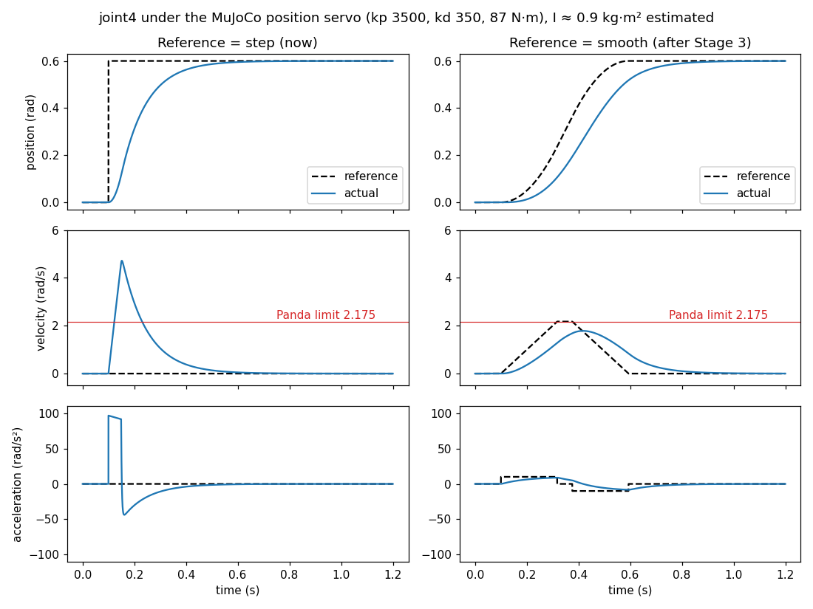
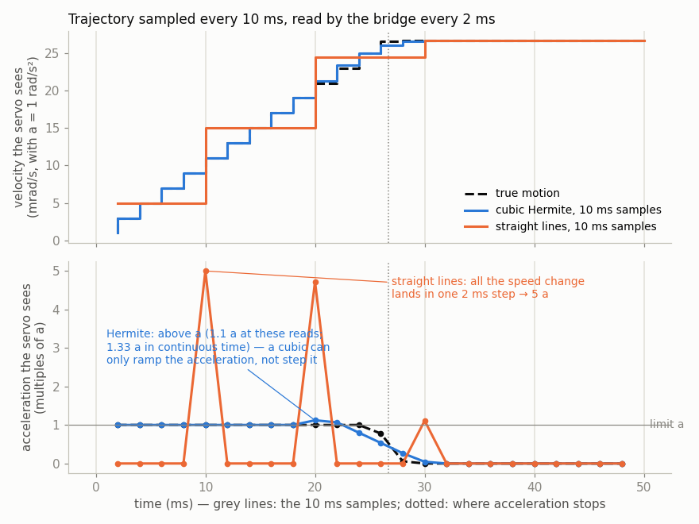
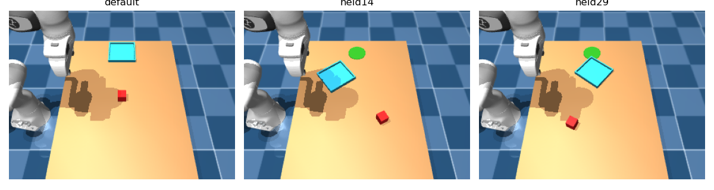
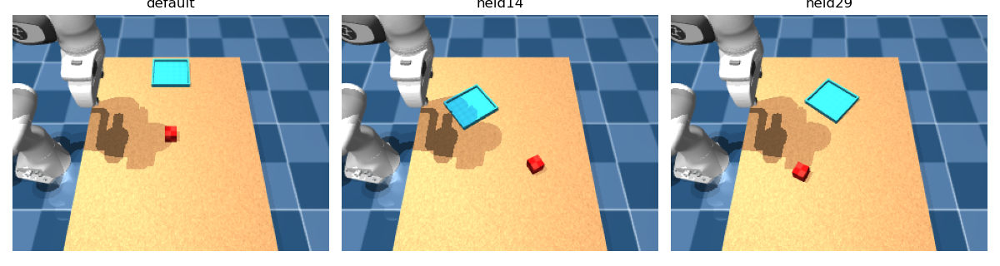

# Week 5 学习笔记

> **状态（2026-10-08）：进行中，Stage 1~8 已完成。** 本周承接 [Week 4.1](week4.1.md)（视觉初始位姿 + 离线 IK 的 pick-and-place，留出集验收 vision 39/40、oracle 40/40）。Week 4.5 的旧计划（多物体、多颜色）已于 2026-10-07 删除，原文见提交 `60293a2`。

## 学习重点范围

本周三个目标：

1. **更鲁棒、更稳定的抓取，更流畅的 demo**：去掉看得见的停顿和跳变，解决搬运中的打滑，并把运动约束到真实 Panda 能执行的范围内。
2. **数据质量足以给 VLA 用**：让仿真产出满足既有数据契约（`lerobot_begginer/pi05_remote/docs/dataset_contract.md`，本周改为 v0.2）的原始记录。**数据导出程序本身不在本周做。**
3. **README 是给别人看的技术报告，architecture 是给开发者看的最终细节。**

方法沿用 Week 4.1：每个阶段单一出口；先测量再改；验收规则在测量前写死；轻阶段 5 块笔记、重阶段完整骨架；提交前先问用户。

## 目录

- [1. 问题清单](#1-问题清单)
- [2. 关于运动的讨论：为什么要轨迹插值](#2-关于运动的讨论为什么要轨迹插值)
- [3. VLA 数据契约的审阅与差距](#3-vla-数据契约的审阅与差距)
- [4. 阶段计划](#4-阶段计划)
- [Stage 1：基线测量](#stage-1基线测量)
- [Stage 2：统一的新启动姿态兼 HOME](#stage-2统一的新启动姿态兼-home)
- [Stage 3 之前：executor 运动的技术路线](#stage-3-之前executor-运动的技术路线已定adr-020)（A 结论；B 位置伺服；C 数值 IK、前馈、反馈与 CLIK；D Lyapunov；E 在线笛卡尔控制；F 从几何 IK 到轨迹缺什么；G 查什么；H 更正）
- [Stage 3：时间参数化的关节轨迹](#stage-3时间参数化的关节轨迹)
- [Stage 4：抓取稳定、不打滑——先测](#stage-4抓取稳定不打滑先测)
- [Stage 5：去掉不必要的等待](#stage-5去掉不必要的等待)
- [Stage 6：满足数据契约 v0.2 的原始记录](#stage-6满足数据契约-v02-的原始记录)
- [Stage 7：清理旧检测路径](#stage-7清理旧检测路径)
- [Stage 8：box 与 bin 的纹理，去掉放置标记](#stage-8box-与-bin-的纹理去掉放置标记)
- [5. 本周最终出口](#5-本周最终出口)
- [6. 悬挂与暂缓](#6-悬挂与暂缓)

---

## 1. 问题清单

**用户在 demo 里发现的（2026-10-06）：**

| 编号 | 现象 | 已知事实 |
| --- | --- | --- |
| U1 | 开始时视觉识别停顿明显 | 窗口要装满 10 帧（相机 10 Hz，0.9 s 仿真）再连续 5 条一致才锁存；Week 4.1 Stage 7 实测约 3.4 s 墙钟。仿真 RTF 约 0.6 |
| U2 | 夹住盒子后停顿过长 | `fsm.close_settle_s` = 2.0 s：CLOSE 固定等满 2 s 才 LIFT；附着在合拢后约 0.25 s 就确认了（Week 4.1 Stage 13），中间约 1.7 s 是白等 |
| U3 | 搬运中打滑，盒子整体相对 TCP 偏移 | 实测见第 2 节：盒子在 TCP 坐标系里累计偏 16 mm、转 15°，滑动出现在高加速度段 |
| U4 | 启动后的初始状态与 start episode 后的状态之间有跳变 | （写计划时以为 bridge 启动用预设状态 `home`；Stage 2 实测是启动时不加载任何预设状态，见 2.1）executor 的 HOME 是 Cartesian 目标 (0.5545, 0, 0.5211) 经 IK 求得；HOME 时手臂还挡住相机看 bin 远侧（Week 4.1 14.6，用户用 rqt 证实） |
| U5 | 纯色的 box 和 bin 不好看 | 放到最后 |
| U6 | architecture.md 要成为给开发者的最终细节，结构简洁准确 | 放到最后 |
| U7 | README.md 还不够好 | 现在只有 18 行，停在 Week 3 的描述 |

**补充的（用户确认全部要做）：**

| 编号 | 问题 | 为什么重要 |
| --- | --- | --- |
| C1 | **关节命令是阶跃目标，没有轨迹插值**：bridge 只取 `JointTrajectory.points[0]`，PD 伺服以力矩上限冲向目标 | 速度超真实 Panda 限值约 2 倍、加速度约 3~7 倍（第 2 节）；打滑出现在加速度峰值处；VLA 的 action 是阶跃信号（第 3 节） |
| C2 | **VERIFY 时手挡住盒子**（Week 4.1 Stage 14 布局 16） | 与 U4 同源，改 HOME 和 RETRACT 时一起解决 |
| C3 | **RGB 在传输上丢帧，原因从没查过**（Week 4.1 Stage 3、5：只到达 16%~34%） | Week 4.1 因估计器不用 RGB 而绕开了；VLA 的主输入就是 RGB |
| C4 | **仿真 RTF 约 0.6** | demo 慢于真实时间 |
| C5 | **episode 结果信息不干净**：成功的 outcome 里残留 `VISION_REJECTED:…`（Stage 14：39 个里 7 个）；开度告警只保留最后一次尝试；VERIFY 看不见盒子被报成 `OBSERVATION_STALE`、执行层 | 挑选 VLA 训练数据（只要干净的成功）时会误判 |
| C6 | **旧检测路径还在**（`~/object_pose`、`VisionObjectPose`、三个已不起作用的 `vision.*` 参数） | 估计器每帧白算一遍旧流水线；architecture 越写越乱 |
| C7 | **Week 4.1 收尾没做完**：14.6 的“推断”改为“已由 rqt 证实”；补“视觉测试的 bin 都在 y ±0.22 内，Stage 14 的通过只在这个范围成立”；改 HOME 后扫 bin 的可见范围并重跑 HELD-A 回归 | 不做的话 Week 4.1 有一处结论写错 |
| C8 | 工具转角在 ±45° 处会在两个方向之间切换（Week 4.1 悬挂清单） | 同一布局两次的手臂动作可能完全不同，数据里混进无意义的分叉 |

---

## 2. 关于运动的讨论：为什么要轨迹插值

> 用户追问（2026-10-06）：“轨迹插值？我目前在 demo 里没有看到平滑轨迹的必要，似乎也没有抖动什么的？你能通过测量陈述其必要性吗？”

### 2.1 测量（一个 oracle episode，有 bin 的场景，2026-10-06）

**命令是阶跃的。** 一个 episode 只有 10 个不同的关节目标；相邻两个目标之间单个关节最多跳 0.60 rad。

**速度、加速度远超真实 Panda 的限值：**

| | 仿真实测峰值 | 真实 Panda 限值 |
| --- | --- | --- |
| 关节速度 | joint4 **4.54** rad/s，joint7 3.30，joint2 2.88，joint6 2.60 | joint1–4 **2.175**，joint5–7 **2.61** rad/s（libfranka `rate_limiting.h`） |
| 关节加速度 | joint4 **99** rad/s²，joint2 56，joint3 41 | joint1~7：15、7.5、10、12.5、15、20、20 rad/s²（FCI 的 FER 限值表；Stage 3 开始前已核实，见 Stage 3 的 3.1） |
| TCP 速度 | **2.3** m/s（夹着盒子时也是 2.3） | 1.7 m/s（旧 FER 表）或 2.0 m/s（当前 libfranka） |
| TCP 加速度 | **37** m/s²（夹着盒子时 33） | **13** m/s²（libfranka） |

真实 Panda 任何一项超限，控制器会立即中止运动（FCI 文档）。**所以现在的运动在真机上执行不了**，这一条与“看起来抖不抖”无关。

**打滑出现在高加速度段**（夹着盒子时盒子相对 TCP 的位移）：

| 时刻（附着后） | 盒子相对 TCP 的累计位移 / 转角 | 当时 TCP |
| --- | --- | --- |
| 0~1.74 s（LIFT） | 0.10 mm / 0.13° | |
| 1.83 s、2.38 s | 10 ms 内各滑 0.5~0.7 mm | 加速度 18、32 m/s² |
| 3.48 s | 累计 16 mm / 15° | |

**有一处不能只归因于加速度：** 约 3.47 s 时盒子仍在滑（每 10 ms 1~6 mm），而 TCP 几乎静止（0.005 m/s），更像夹爪开始张开或盒子已脱离下落。所以“打滑全由加速度造成”**没有被证明**，只说明加速度峰值处有滑动；Stage 1 要按阶段切开看。

**结论：** 插值的依据是**真机可执行性**和**打滑**，“demo 更流畅”只是附带效果。

### 2.2 为什么位置伺服也会超速

> 用户追问（2026-10-07）：“我印象中 mjcf 里是包含了速度和加速度上限的，既然我们只是位置控制，为什么 PD 伺服还会超过？”

**MJCF 里没有速度、加速度上限。** `panda.xml` 每个关节和执行器只有：

| 项 | 值 | 意义 |
| --- | --- | --- |
| `range` | 如 joint4 −3.07~−0.07 rad | 位置极限 |
| `ctrlrange` | ±2.8973 | 位置**目标**的允许范围 |
| `forcerange` | joint1–4 ±87 N·m，joint5–7 ±12 N·m | 力矩上限 |
| `damping` / `armature` | 1 / 0.1 | 关节阻尼、等效转子惯量 |
| `gainprm` / `biasprm` | joint4：kp 3500，kd 350 | PD 增益 |

MuJoCo 的关节没有“速度上限”这一属性。执行器是 `biastype="affine"` 的位置伺服，每步输出 τ = kp·(q_target − q) − kd·q̇，再截到 forcerange。一次跳 0.6 rad 的目标，joint4 的初始力矩是 3500 × 0.6 = 2100 N·m，被截到 87 N·m，**整个过渡都以最大力矩推**；能多快只由力矩上限、惯量和阻尼决定。前臂加手的惯量小，于是加速度到 99 rad/s²。（这是粗估，没有做实验分解。）

**位置伺服只管“去哪”，不管“多快”**，速度是增益、力矩上限和惯量的副产品。真实 Panda 不会这样，是因为它的控制器在 1 kHz 上检查每个周期的速度、加速度、加加速度，超限就中止；我们的仿真里没有这一层。

### 2.3 为什么插值能解决，约束 IK 为什么不行

> 用户追问（2026-10-07）：“为什么插值就可以缓解？能不能把当前的 Jacobian 利用带约束的最小二乘求解？但我们做的是位置控制，约束了速度和加速度怎么影响求解结果呢？”

插值管的是“目标随时间怎么变”，IK 管的是“目标是什么”，是两件事：

```
现在：  每个阶段一次 IK 求出 q_goal  ->  把 q_goal 直接当伺服目标（阶跃）
插值：  每个阶段一次 IK 求出 q_goal
        ->  在 q_current 到 q_goal 之间生成满足速度、加速度上限的 q_ref(t)
        ->  每个物理步把 q_ref(t) 当伺服目标
```

伺服始终只追“眼前”的目标，误差小、力矩小，实际速度和加速度跟着参考轨迹走，而参考轨迹本身满足限值。这是位置控制下限速的标准做法（真实 Panda、ros2_control 的 `joint_trajectory_controller` 都是这样）。

**约束 IK 对这件事没有作用，用户的直觉是对的：** 现在的求解器已有 `maximum_joint_step = 0.12 rad`，但它只约束**迭代**怎么收敛到 q_goal，最后给伺服的仍是同一个终点。IK 是离线求终点，加速度约束放进去没有意义。约束 IK 真正有用的是**在线速度级控制**（每个周期解 q̇ = J⁺v，把 q̇、q̈ 约束放进 QP），那等于把 executor 从“每阶段一个目标”改成“每周期一个速度”，改动很大。

**选择插值，代价要提前处理：** 关节空间插值时 TCP 走的不是直线，PREGRASP 到 GRASP 的下降可能偏离竖直而碰到盒子。Stage 3 要核对 TCP 偏离直线多少；需要时对“接近盒子”这类短段改为笛卡尔直线插值（每个插值点做一次 IK）。

**插值放在哪：** 倾向 executor 发带时间的多点轨迹、由 bridge 插值执行。理由：更接近真实控制器的接口；`pi05_remote_local_plan.md` 第 47 行指出 bridge 只执行 `points[0]`，VLA 推理端需要一个能按时间执行动作块的执行器，这个改动同时满足它。

---

## 3. VLA 数据契约的审阅与差距

> 用户追问（2026-10-07）：“你是否审阅过 VLA 的数据契约从 VLA 角度来看是否合理？以及我们当前的系统离这个契约有多大的 gap？”

**契约在别处已经定义**：`lerobot_begginer/pi05_remote/docs/dataset_contract.md`（数据格式）与本仓库 `docs/plans/pi05_remote_local_plan.md`（远程训练与本地仿真的整体计划，P1 是契约，P2 是采集）。最初我说“沿用”，**其实没有审阅过**；下面是审阅。

### 3.1 从 VLA 角度看契约本身

| 项 | 契约 v0.1 | 看法 |
| --- | --- | --- |
| action = 绝对关节目标 | 7 关节 + 夹爪宽度 | 合理，pi0.5 支持。但**契约没有规定 action 在时间上的形态**：按现在的系统，一个 episode 只有 10 个不同目标，大部分帧重复同一个值，是阶跃信号，模型要学的变成“什么时候跳”。这是本周改契约的原因 |
| 10 Hz | 一帧 0.1 s | 合理。现在关节命令以 20 Hz 发、目标每阶段才变一次，“10 Hz 的 action”只是对阶跃信号采样 |
| state 8 维 | 关节角 + 夹爪宽度 | 合理，pi0.5 默认不用速度；原始记录里应保留关节速度 |
| 深度 | float32，0 表示无效 | 保留合理；我们用 NaN 表示无效，导出时要转换 |
| 单个固定相机 | `table_rgb` | pi05 计划已写明“不能伪造腕部视角”；base checkpoint 期望的相机数要在 R1 核对，是已知风险 |
| 夹爪宽度（m） | 0~0.08 | 合理；但我们的夹爪是全开/全合两态，action 里只有 0.08 和 0 两个值 |
| task 文本 | 每个 episode 一个 | 合理；只有一个任务时语言不起作用（pi05 计划第 7 节已指出） |

### 3.2 契约改为 v0.2（2026-10-07，用户同意）

改动三处（v0.1 原文曾备份在 `/tmp`，2026-10-07 `/tmp` 被清空时丢失；契约所在目录不在版本控制里，此后过程文件放 `.claude/artifacts/`）：

- **action 的时间形态：** frame t 的 action 是控制器在那一刻实际采用的关节目标，来自满足速度、加速度限值的时间参数化轨迹；相邻帧平滑变化，不是“每阶段一个目标保持后跳变”。导出器拒绝相邻两帧之间任一臂关节目标变化超过“速度上限 × 帧间隔”的记录（10 Hz 时 joint1–4 0.2175 rad、joint5–7 0.261 rad）。夹爪豁免，只取 0.08 和 0.0。
- **无效深度：** 仿真用 NaN 表示，导出时把 NaN、Inf、非正值换成 0.0。
- **版本说明。**

### 3.3 当前系统离契约的差距

| 契约要求 | 现状 | 差距 |
| --- | --- | --- |
| RGB 每帧都有 | 只到达 16%~34%，原因未查 | **大** |
| action 平滑（v0.2） | 阶跃 | **大**（Stage 3 解决） |
| 原始记录 | 没有 recorder；只有 `record_demo_bag.sh`（`-a` 全话题，已知会漏话题） | **大** |
| action 是“实际采用的控制目标” | executor 每 50 ms 发一次，bridge 只取 `points[0]`，没有回执 | **中**：pi05 计划第 178 行要求命令生效证据 |
| episode 元数据（任务、物体、目标、种子） | 布局在探针里有，没写进任何记录；outcome 有残留原因（C5） | **中** |
| RGB、深度、state 同步 | bridge 的观测与相机同一物理步打戳，已验证 | 小 |
| 无 NaN/Inf | 深度用 NaN | 小，导出时处理 |
| 只用成功示范 | 成功判据可信（Week 4.1 Stage 11、14） | 小 |

**判断：** 契约格式合理，缺的是 action 的时间形态（已补）。系统离它最大的差距是 **RGB 丢帧、action 阶跃、没有可靠的记录与命令生效证据**。导出程序不在本周做，但这三条是它的前提，本周解决。

---

## 4. 阶段计划

**顺序的理由：** 先测量，再改会影响后面所有数据的起点（HOME）和运动（插值），再改抓取，然后是数据前提、清理，最后外观与文档。

| Stage | 分量 | 单一出口 | 对应 |
| --- | --- | --- | --- |
| 1 | 轻 | **基线测量**：一次 episode 的时间线（每个阶段多长、哪些是等待）；RTF；按阶段切开的打滑（搬运、张开、下落分开）；相机各话题的到达率 | U1、U2、U3、C3、C4 |
| 2 | 重 | **统一的新启动姿态兼 HOME**：bridge 启动即在该姿态，executor 的 HOME 就是它，start episode 不再跳；新 HOME 与 RETRACT 不挡相机看 bin 与 VERIFY 时的盒子；扫 bin 的可见范围；HELD-A 回归；Week 4.1 收尾 | U4、C2、C7 |
| 3 | 重 | **时间参数化的关节轨迹**：executor 发带时间的多点轨迹，bridge 按时间插值执行；速度、加速度在真实 Panda 限值内（先查 FER 加速度原表）；核对 TCP 偏离直线 | C1 |
| 4 | 重 | **抓取稳定、不打滑**：按 Stage 1 的切分找剩下的原因（夹持力、摩擦、抓取高度、张开时机），改了再量；限值在开始前写死 | U3 |
| 5 | 轻 | **去掉不必要的等待**：CLOSE 等附着确认而不是固定 2 s；锁存与 VERIFY 的等待按测量缩短；HELD-A 回归不退步 | U1、U2 |
| 6 | 重 | **满足数据契约 v0.2 的原始记录**（不写导出程序）：RGB 不丢帧、bridge 给出命令生效证据、记录器录全所需话题、episode 元数据干净；探针按契约核对 | C3、C5、C8 |
| 7 | 轻 | **清理旧检测路径** | C6 |
| 8 | 轻 | **box 与 bin 的纹理**（改外观后要重测检测器；深度不受影响，但要核对） | U5 |
| 9 | 轻 | **architecture.md 重写为开发者文档** | U6 |
| 10 | 轻 | **README.md 写成技术报告** | U7 |

C4（RTF）在 Stage 1 测量后决定要不要处理、放在哪个阶段。每个阶段开始前再细化预期、出口断言与不做的事。

**已定的：** C1~C8 全部做；启动姿态与 HOME 统一到一个新的姿态（选择标准是不挡相机）；插值由 bridge 按时间执行；数据契约改为 v0.2。

---

## Stage 1：基线测量

**状态（2026-10-07）：已完成（提交 `ef9608a`）。** 1.1 是测量之前写定的，没有改动；有效性检查 V1~V3 全部满足。**分量：轻。** 本阶段只测不改：Stage 2 起会改 HOME、运动和等待，这些数字是它们的“改之前”。

### 1.0 一句话总结

一个 episode 约 6.9 s 仿真（oracle）/ 7.8 s（vision），按 RTF 0.58 是 12~13.5 s 墙钟；其中**机械臂不动、纯粹在等的时间约占 40%（oracle）/ 47%（vision）**，最大的一块是 CLOSE 里附着之后多等的 1.7 s。打滑**全部发生在搬运期**（LIFT、PREPLACE、PLACE），到 PLACE 结束时盒子在 TCP 坐标系里偏 7~16 mm、转 5~41°，而夹爪开度一直在 37.6~40.5 mm，所以 Week 4.1 的开度窗口看不见它。RGB 在探针端也只到达 22~37%，深度和 camera_info 99~100%，丢帧发生在估计器之前。

### 1.1 测什么、怎么测（测量前写定）

**运行：** 有 bin 的场景，Week 4.1 Stage 6 起用的随机布局生成器（种子 20261008）的前 3 个布局，oracle 与 vision 各跑一遍，每个布局起一套新的 bridge + 估计器 + executor、跑一个 episode。新命令 `initial_box_probe.py timeline`。仿真是确定性的，所以不重复跑同一个布局。

| 编号 | 测量 | 怎么得到 |
| --- | --- | --- |
| M1 | **时间线：** 每个阶段的仿真时长，以及其中多少是“机械臂已经到位、在等” | 阶段时长取自 `EpisodeOutcome.phase_durations_s`，起点是本 generation 的第一个 bridge 样本（控制器在 reset 响应时开始给 HOME 计时）。“到位”用 FSM 自己的判据：各关节与该阶段目标差 < 0.05 rad 且速度 < 0.05 rad/s；目标取自探针收到的关节命令 |
| M2 | **开始前的停顿：** 从 reset 到第一条关节命令（vision 是等锁存）；以及从发出 start 到第一条命令的墙钟时间 | 第一条关节命令的接收时刻，换算到仿真时间用它之前最近的一个 bridge 样本 |
| M3 | **CLOSE 与 VERIFY 里的等待：** 合拢开始到附着、附着到 LIFT；释放到第一条新测量（vision）、VERIFY 开始到 DONE | bridge 的附着状态与估计器消息的时间戳 |
| M4 | **按阶段切开的打滑：** 附着后盒子在 TCP 坐标系里的位移与转角，每个阶段（CLOSE 剩余、LIFT、PREPLACE、PLACE、OPEN）的增量，以及该阶段的 TCP 峰值加速度与开度范围 | bridge 的盒子真值与 TCP（评测端）；OPEN 阶段一直算到盒子离开手 |
| M5 | **相机话题到达率：** RGB、深度、两个 camera_info 在 episode 期间到达探针的条数，除以“仿真时长 × 10 Hz” | 探针用与估计器相同的 SensorDataQoS（best effort）订阅 |
| M6 | **RTF：** 整个 episode 的仿真时长 / 墙钟时长 | 同上 |

**有效性检查（测量本身对不对，不是验收）：** V1 阶段时长之和 + 起点，与 outcome 发出时的仿真时间相差 ≤ 0.1 s；V2 附着时刻落在 CLOSE 阶段内；V3 episode 没有重试（有重试则该行单独标出，不混进统计）。

**没有验收门槛。** 结果用来给 Stage 2~6 定限值。

### 1.2 改动

只加了测量工具：[initial_box_probe.py](../../src/mujoco_perception/test/initial_box_probe.py) 的 `timeline` 命令。产品代码没有改。

```bash
ROS_DOMAIN_ID=84 /usr/bin/python3 src/mujoco_perception/test/initial_box_probe.py timeline --source oracle --count 3
ROS_DOMAIN_ID=84 /usr/bin/python3 src/mujoco_perception/test/initial_box_probe.py timeline --source vision --count 3
```

### 1.3 结果

**有效性：** V1 阶段时长之和与 outcome 时刻相差 +0.008~+0.014 s（≤ 0.1 s）；V2 附着都落在 CLOSE 内；V3 6 个 episode 都没有重试。

**M1 时间线（仿真秒；6 个 episode 的范围）。** “到位后在等” = 阶段时长 − 机械臂到达该阶段目标的时刻。

| 阶段 | 时长 | 到位后在等 | 这段时间里发生了什么 |
| --- | --- | --- | --- |
| HOME | oracle 0.53~0.55；vision 1.42~1.45 | 全部 | 机械臂已经在 HOME，不动；oracle 等的是最小 settle 0.5 s，vision 另加等锁存约 0.9 s |
| PREGRASP | 0.54~0.72 | 0.01~0.04 | 运动 |
| GRASP | 0.50~0.58 | 0.01~0.06 | 运动 |
| CLOSE | 2.00~2.06 | **全部（臂不动）** | 合拢后 0.24~0.30 s 附着，**之后 1.70~1.77 s 只是在等** `close_settle_s` = 2 s |
| LIFT | 0.50~0.55 | 0.02~0.03 | 运动 |
| PREPLACE | 0.51~0.68 | 0.01~0.06 | 运动 |
| PLACE | 0.50~0.55 | 0.02~0.08 | 运动 |
| OPEN | 0.50 | 臂不动 | 夹爪张开，结束时开度 79.5~79.7 mm，接近全开 |
| RETRACT | 0.50~0.54 | 0.04~0.09 | 运动 |
| VERIFY | oracle 0.50；vision 0.53~0.56 | 全部 | 等最小 settle 0.5 s |

“纯等”合计：oracle 约 2.8 s / 6.9 s，vision 约 3.7 s / 7.8 s。另一个现象：**每个运动阶段都是 0.5~0.7 s**，因为 FSM 要求“到位”且“满 0.5 s”，而阶跃目标下机械臂约 0.45~0.6 s 就冲到了。

**M2 开始前的停顿：** oracle 第一条关节命令在 reset 后 0.02~0.03 s，start 之后 0.03~0.04 s 墙钟；vision 在 reset 后 **1.40~1.44 s 仿真、2.42~2.47 s 墙钟**（等锁存）。Week 4.1 Stage 7 记的 3.4 s 是从状态话题的条数估的，这里是直接量的第一条命令。

**M3：** CLOSE 开始到附着 0.24~0.30 s，附着到 LIFT 1.70~1.77 s；vision 释放到第一条新测量 0.99~1.08 s（窗口重装 10 帧），VERIFY 本身 0.53~0.56 s。

**M4 按阶段切开的打滑**（盒子在 TCP 坐标系里相对附着时刻的位移 / 转角，阶段末的累计值）：

| 布局 | CLOSE 末 | LIFT 末 | PREPLACE 末 | PLACE 末 | 搬运期开度 |
| --- | --- | --- | --- | --- | --- |
| oracle 0 | 0.1 mm / 0.1° | 5.4 mm / 0.1° | 13.6 mm / 9.2° | 14.6 mm / 13.7° | 37.6~40.2 mm |
| oracle 1 | 0.1 / 0.2 | 4.5 / 1.6 | 11.6 / 14.2 | **15.8 / 39.4** | 38.2~40.3 |
| oracle 2 | 0.2 / 0.1 | 4.1 / 1.0 | 6.7 / 3.1 | 7.3 / 4.6 | 38.1~40.1 |
| vision 0 | 0.1 / 0.2 | 5.5 / 1.3 | 13.8 / 11.7 | 14.7 / 17.3 | 37.7~40.2 |
| vision 1 | 0.0 / 0.2 | 4.4 / 2.0 | 11.0 / 13.9 | **15.5 / 40.6** | 38.2~40.5 |
| vision 2 | 0.0 / 0.1 | 4.4 / 1.1 | 7.1 / 3.5 | 7.6 / 5.2 | 38.1~40.1 |

- CLOSE 期间几乎不动（≤ 0.2 mm）；**LIFT 一段就有 4~5.5 mm**（以平移为主），PREPLACE 再加 2.6~8.8 mm 且开始转，PLACE 主要是转（布局 1 从 14° 转到 40°）。
- 这一段的 TCP 峰值加速度：LIFT 17.7~18.9、PREPLACE 29.5~34.1、PLACE 28.1~29.8 m/s²。布局 2 的 PREPLACE 加速度和别的布局相近（29.5），滑得却少得多，所以**加速度不是唯一因素**，方向（相对手指的方向）可能更要紧，没有分解。
- 搬运期开度一直在 37.6~40.5 mm：**盒子在手里转了 40° 而开度不变**，Week 4.1 Stage 12 的开度窗口（34 mm）对它无能为力，这正是当时写下的局限。
- OPEN 阶段末盒子已离开手（附着状态不再是 ATTACHED），之后的“位移”是盒子落下、不是打滑。

**更正 2.1 节的一处推测：** 2.1 里我说“约 3.47 s 时盒子仍在滑而 TCP 几乎静止，更像夹爪开始张开或盒子已脱离下落”。按阶段切开后确认是后者：那段在 OPEN，盒子正在离开手。所以**搬运期打滑与 OPEN 无关**，它全部发生在 LIFT~PLACE。

**M5 相机到达率**（探针端，best effort，episode 期间 / 仿真时长 × 10 Hz）：

| 话题 | 6 个 episode 的范围 |
| --- | --- |
| RGB `color/image_raw` | **0.22~0.37** |
| 深度 `depth/image_raw` | 0.99~1.00 |
| 两个 `camera_info` | 0.99~1.00 |

RGB 在一个与估计器无关的订阅者那里也只到 22~37%，所以**丢帧发生在 bridge 发布或 DDS 传输这一侧**，不是估计器的配对。深度消息（320×240×4 = 307 KB）比 RGB（230 KB）大，却几乎不丢，所以不是简单的“消息太大”。原因留给 Stage 6。

**M6 RTF：** 0.58~0.59。墙钟时长约为仿真时长的 1.7 倍。

### 1.4 你没问但值得注意的

- **（E 可测试性）这些数字来自 6 个 episode、3 个布局。** 仿真确定性，所以同一布局不用重跑；但布局只有 3 个，打滑的范围（7~16 mm、5~41°）是这 3 个布局的，不是分布。Stage 4 定限值前，应当在更多布局上量打滑。
- **（C 可观测性）打滑现在只能在评测端用真值量。** 系统里没有任何信号能告诉 executor“盒子在手里转了 40°”：开度不变、附着锁存不变。真机上同样看不到（Franka Hand 没有触觉）。如果 Stage 4 之后仍有残余打滑，唯一能看见它的是相机，但搬运期视觉在 Week 4.1 已取消。
- **最小 settle 0.5 s 在两头起作用：** 它是 HOME、OPEN、VERIFY 里“纯等”的来源，也决定了运动阶段至少 0.5 s。Stage 3 加插值后，运动阶段会由轨迹时长决定（会更长），这条约束要和插值一起重新想，而不是只在 Stage 5 里砍。
- **RTF 0.58 让所有“停顿”在墙钟上放大 1.7 倍。** 用户看到的 CLOSE 停顿约 1.77 / 0.58 ≈ 3 s 墙钟。C4 要不要做，取决于 RTF 能不能提上去；Stage 2 之前先查是什么在占用时间（相机渲染、机器人遮罩、物理步）。

### 1.5 本阶段边界与后续

做完了：基线时间线、等待、按阶段切开的打滑、相机到达率、RTF。没有改产品代码。

给后续阶段的输入：Stage 3 的速度、加速度限值（第 2 节）；Stage 4 的打滑基线（PLACE 末 7~16 mm、5~41°，全部在搬运期）；Stage 5 的等待（CLOSE 多等 1.7 s、HOME 0.5 s、VERIFY 0.5 s、vision 锁存 1.4 s）；Stage 6 的 RGB 到达率（22~37%，在估计器之前就丢了）；C4 的 RTF 0.58。

## Stage 2：统一的新启动姿态兼 HOME

**状态（2026-10-07）：已完成（提交 `f102ac6`）。** 2.1、2.2 是实现之前写定的，没有改动（K4 的一个扫描点不合法，见 2.4 的更正）。**分量：重。**

### 2.0 目标

启动、每次 reset、executor 的 HOME、VERIFY 时机械臂停的位置，都是同一个关节姿态；这个姿态不挡相机看桌面工作区（初始检测 box 与 bin、VERIFY 时检测 bin 里的盒子）。

### 2.1 现状（实测）与候选

**用语：** 本节的“预设状态”指 MJCF 里的 `<keyframe>`：一份带名字、预先存好的完整仿真状态（各关节角 qpos、执行器目标 ctrl 等），`mj_resetDataKeyframe` 把仿真恢复成它。这个词借自动画，但与时间序列、图像帧无关；也不要和 executor 的**固定关节表模式**（参数值 `waypoint_source:=keyframe`，Week 2 的遗留模式，每个阶段查一张写死的关节角表，并不读 MJCF 的预设状态）混淆。

**跳变的来源（实测）：** bridge 用 `mj_makeData` 建状态，**启动时是 MuJoCo 的默认状态**（各关节约 0，手臂几乎竖直，TCP 在 (0.13, 0, 0.84)）；第一次 reset 才把它放到预设状态 `pick_place_home`，最大关节跳变 **1.52 rad**。之后每个 episode 结束在 bin 上方，下一个 reset 又把手臂瞬移回预设状态。executor 的 HOME 是 Cartesian 目标 (0.5545, 0, 0.5211) 经 IK，Stage 1 实测它与预设状态的手臂姿态一致（HOME 阶段手臂不动）。

**候选：Franka 标准 ready 姿态** `q = [0, −π/4, 0, −3π/4, 0, π/2, π/4]`，TCP 在 (0.307, 0, 0.487)，工具竖直向下，手的长轴（手指张开方向）沿世界 y。

**几何估计（只是估计，在线以机器人遮罩为准）：** 从相机 (0.5, −0.45, 1.0) 把机械臂各连杆点与手的外形投影到桌面（z = 0.22），看投影是否落进工作区 x ∈ [0.30, 0.70]、y ∈ [−0.30, 0.40]（各点按 5 cm 半径放大）：

| 候选 | 离工作区最近的距离 |
| --- | --- |
| 现在的 HOME | −199 mm（落在工作区里） |
| ready 姿态，但手腕转成手指沿世界 x（`j7 = −π/4`） | −126 mm |
| **ready 姿态（标准，`j7 = +π/4`）** | **+17.5 mm** |

手的长轴约 0.2 m，横在视线上就会挡住；标准 ready 姿态把它顺着视线方向放，所以只有它是正的。选它还因为它是 Franka 自己的标准姿态，换到真机上没有意外。

### 2.2 设计与出口断言（实现前写定，不因结果改动）

**改动：**

1. 预设状态 `pick_place_home` 的手臂部分与 ctrl 改为 ready 姿态。
2. bridge 启动时（建模、配置场景之后）就把仿真置为 reset 用的预设状态：启动即 HOME，不再从默认状态开始；generation 仍为 0。
3. executor 的 HOME 改为**关节目标**（不再经 IK）：新参数 `home.joint_positions`，默认 ready 姿态。单测读 MJCF 里的预设状态，核对两者一致。
4. **VERIFY 时机械臂回到 HOME**（RETRACT 仍是抬离 bin）：VERIFY 的目标改为 HOME 关节目标，VERIFY 的退出条件加上“机械臂到位”。这样 VERIFY 时手不在相机与 bin 之间；DONE 时机械臂已在 HOME，下一次 reset 只瞬移盒子，不瞬移手臂。
5. Week 4.1 的收尾（C7）：14.6 的“推断”改为“已由用户用 rqt 证实”，补覆盖缺口的说明。

| 编号 | 条件 | 预期 | 否定条件 |
| --- | --- | --- | --- |
| K1 | bridge 刚启动、第一次 reset 前后 | 启动时手臂就在 ready 姿态（各关节与预设状态差 ≤ 0.01 rad）；第一次 reset 的最大关节跳变 ≤ 0.01 rad | 任一超出 |
| K2 | 单测 | executor 的 `home.joint_positions` 默认值与预设状态的手臂部分逐项相等（≤ 1e-4 rad） | 不等 |
| K3 | 机械臂在 HOME，估计器的机器人遮罩 | 遮罩像素投到桌面后，落进工作区 x ∈ [0.30, 0.70]、y ∈ [−0.30, 0.40] 的：**0 个** | > 0 |
| K4 | bin 沿 y 扫：0.20、0.25、0.30、0.35（x = 0.5，yaw 0），机械臂在 HOME | 4 个位置 bin 都 MEASURED；`ros2 launch mujoco_bridge demo.launch.py scene_enabled:=true` 不加别的参数，vision 成功 | 任一检不出，或默认 launch 失败 |
| K5 | 连续两个 episode（vision，同一布局） | 第一个 DONE 时手臂在 HOME（各关节与 HOME 差 ≤ 0.05 rad）；第二个 episode 的 reset 前后手臂最大跳变 ≤ 0.05 rad | 超出 |
| K6 | HELD-A（现为回归集）40 个布局，vision 与 oracle | 不比 Week 4.1 Stage 14 差：vision ≥ 39、oracle ≥ 40 成功，零假成功；**布局 16 vision 成功**（VERIFY 不再被手挡） | 任一更差 |
| K7 | K6 同一批 | 从 HOME 到 PREGRASP 的 IK 全部收敛（没有 `IK_FAILED`） | 出现 `IK_FAILED` |

**不做：** 关节轨迹插值（Stage 3）；HOME 之外的姿态调整；固定关节表模式（`waypoint_source:=keyframe`）的 HOME 不改，它是遗留模式，记在边界里。

### 2.3 改动

| 文件 | 改动 |
| --- | --- |
| [pick_place_scene.xml](../../robot_description/mujoco/franka_emika_panda/pick_place_scene.xml) | 预设状态 `pick_place_home` 的手臂 qpos 与 ctrl 改为 ready 姿态 |
| [mujoco_bridge_node.cpp](../../src/mujoco_bridge/src/mujoco_bridge_node.cpp) | 解析出 reset 用的预设状态后立刻 `resetToKeyframe` 一次（在 `configureScene` 之后，所以盒子与 bin 的布局也在里面），不递增 generation |
| [waypoint_source.hpp](../../src/task_executor/include/task_executor/waypoint_source.hpp) | 常量 `kFrankaReadyPose` |
| [diff_ik_waypoint_source.cpp](../../src/task_executor/src/diff_ik_waypoint_source.cpp) | HOME、VERIFY 直接返回 HOME 关节目标（夹爪宽度仍取自任务），不求 IK；诊断里给出该构型的 TCP、残差 0；构造时检查 HOME 有限且在关节极限内 |
| [fsm.cpp](../../src/task_executor/src/fsm.cpp) | VERIFY 的完成条件加上“机械臂到达目标”（同运动阶段的 0.05 rad、0.05 rad/s） |
| [task_executor_config.cpp](../../src/task_executor/src/task_executor_config.cpp) | 参数 `home.joint_positions`（7 个值，默认 `kFrankaReadyPose`） |
| 单测 | `HomeIsTheBridgeResetKeyframe`（K2：用正则读 MJCF 里的预设状态，逐项比对）、`HomeAndVerifyCommandTheHomeJointsWithoutIk`（远离 HOME 的 seed 也给出同一目标，TCP 在 (0.307, 0, 0.487)、朝下）、`RejectsAHomeOutsideTheJointLimits`、`VerifyWaitsForTheArmToReturnHome`；`test_fsm` 的 HOME 常量改为新姿态，两个 VERIFY 用例补上“手臂已到位” |
| [initial_box_probe.py](../../src/mujoco_perception/test/initial_box_probe.py) | P1（及 Stage 7 的 A1）的判定改为按到达时间，见 2.4 的 P1 一段 |
| 文档 | architecture 2.3、5、6.1、6.2（HOME、启动状态、VERIFY、用语）；Week 4.1 14.6 的 C7 修订 |

**为什么 HOME 要改成关节目标，而不只是改个数值。** 改之前“HOME”有两份定义，用的不是同一种量：

| 在哪 | 存的是什么 |
| --- | --- |
| MJCF 预设状态 `pick_place_home` | 7 个**关节角** |
| executor 的 HOME | 一个 **TCP 位姿**（位置 (0.5545, 0, 0.5211)、工具朝下）；每个 episode 用 IK 从它反算出关节角再发给 bridge |

两者对得上，是因为那个 TCP 位姿当初就是从 MJCF 的关节角算出来的（Stage 1 实测 HOME 阶段手臂不动）。如果只把 executor 的 TCP 位姿改成 ready 姿态的 TCP (0.307, 0, 0.487)，会出问题：Panda 有 7 个关节，TCP 位姿只确定 6 个量（3 个位置、3 个转角），多出 1 个自由度，**同一个 TCP 位姿对应无穷多组关节角**（肘部可高可低、上臂可绕着转），IK 给出哪一组取决于迭代的初值。于是：

- IK 解出的不一定是 ready 姿态，开局手臂会动一下，“启动 = reset = HOME”不成立；
- K3 的“不挡相机”是按 ready 姿态下整条手臂的位置算的，TCP 相同而肘部不同，遮挡也不同，结论不适用。

所以 HOME（以及 VERIFY）直接发 7 个关节角 `home.joint_positions`，不经过 IK；executor 与 MJCF 存的是同一种量、同一组数，单测逐项比对。其余阶段的目标取决于盒子和 bin 在哪，只能给出 TCP 位姿，照旧用 IK。

**副作用（2.4 的 P1 就是它引起的）：** 以前 HOME 要先求一次 IK 才能发出第一条命令，锁存完成（LATCHED）和第一条命令之间总隔着一段计算；现在不用算，两条消息几乎同时发出。

一次性测量脚本（K1、K3、K4、K5、P1/P5 排查）放在 `.claude/artifacts/week5_stage2/`，不进仓库。

### 2.4 结果

| 编号 | 结果 | 判定 |
| --- | --- | --- |
| K1 | 启动后第一个样本离 ready 姿态 0.0004 rad；第一次 reset 的最大关节跳变 **0.005 rad**（改之前 1.52 rad） | 通过 |
| K2 | 单测通过（`colcon test` mujoco_bridge + task_executor：760 项，0 失败） | 通过 |
| K3 | 10 帧机器人遮罩的并集 8234 像素，投到桌面后落进工作区的 **0 个**，离工作区最近 79.6 mm；投影自检：TCP (0.306, 0, 0.484) 投到的像素在遮罩内 | 通过 |
| K4 | bin 在 y = 0.20、0.25、0.30、0.32 都 MEASURED（21/21 条，误差 ≤ 1.3 mm）；默认 launch `scene_enabled:=true` 不加参数，vision 成功、零重试 | 通过，但见下面的更正 |
| K5 | 同一 launch 连跑两个 episode，都成功、零重试；DONE 时手臂离 HOME 0.006 rad；两次之间的 reset 跳变 0.006 rad | 通过 |
| K6 | 见下 | |
| K7 | 没有 `IK_FAILED` | 通过 |

**K4 的更正（我的错误）：** 2.2 写的扫描点 y = 0.35 本身不是合法布局：bin 外沿半宽 71 mm，y = 0.35 时外沿到 0.421，超出桌面（y ≤ 0.4），bridge 按设计拒绝启动。写断言时没有核对桌面边界。bin 能放的最远处是 y ≈ 0.329，所以用 y = 0.32 代替 0.35；其余三个点不变。

**K6（HELD-A 回归，vision）：** 按改正后的 P1 判定重跑一遍：**40/40 成功、零重试、零假成功**，没有 `IK_FAILED`；**布局 16 成功**（Stage 14 里 VERIFY 被手挡住的那个）；P1~P4、P6 全部 40/40，**P5 39/40（布局 29 告警）**；估计器在 ATTACHED 样本上发出的消息 0 条（N1）。第一次回归（改判定之前）同样 40/40 成功，P1 5 个误报、P5 也只有布局 29。

HELD-A 是 Week 4.1 Stage 14 建的留出集：固定种子 20261006 生成的 40 个布局（box 与 bin 在 x ∈ [0.38, 0.62]、y ∈ [−0.22, 0.22] 内随机位置与朝向，太近的重抽），规则在第一次跑之前写定（[week4.1 14.1](week4.1.md)）。Stage 14 跑过之后它已不再“留出”，现在只当回归集，回答“改完有没有比以前差”；没碰过的 HELD-B（种子 20261009）留给本周最终验收。每个布局起一套新的 bridge、估计器、executor 跑一个 episode，记录成功与否、重试、失败归类，以及过程断言 P1~P6（如 P1：锁存完成之前没有关节命令；P5：搬运期没有开度告警）。

**用语：锁存（LATCHED）。** reset 之后估计器每帧给一个盒子、bin 位置，每帧都略有抖动；executor 先观察，等连续 5 条有效测量的 x、y 相差 ≤ 3 mm、朝向相差 ≤ 3°，就把最新那条“锁住”，这个 episode 一直用它（Week 4.1 Stage 7）。状态每 50 ms 发布到 `/task_executor/initial_pose_latch`：WAITING（还在等）、LATCHED（盒子与 bin 都锁住）、FAILED（10 s 内没锁住）。锁存之前 executor 不知道盒子在哪，按设计不发任何关节命令；Stage 1 量到的 vision 开局停顿约 1.4 s 主要就是在等它。

- **oracle 没有跑完。** 跑到 19 个（19/19 成功、零重试、P1~P6 全部成立）时，用户决定停掉 oracle、以后不再跑，所以 K6 里“oracle ≥ 40”一项**没有执行**，不算通过。
- **P1 的 5 次失败是探针的测量方法错了，不是 executor 提前发命令（第一次回归：布局 14、22、25、32、33）。** P1 原来按“两个话题的消息到达探针的先后”判定。executor 的 50 ms 定时回调里顺序固定：先发锁存状态（LATCHED），再发第一条命令；观测准入（`onObservation`）不产生命令。但这是两个话题，到达先后没有保证：重跑布局 14，命令比 LATCHED **早 0.12 ms** 到达；布局 32 晚 0.26 ms。真正提前的命令至少早一个回调（50 ms）。为什么 Stage 14 一次也没碰到：以前 HOME 要先求 IK，两条消息之间隔着一次求解；现在 HOME 不求 IK，只隔零点几毫秒（IK 的耗时没测，这是推断）。修法（用户同意）：断言不变，判定改为“命令比 LATCHED 早到超过半个周期（25 ms）才算”，Stage 7 的 A1 是同一个检查，一起改。
- **P5：布局 29 是真打滑掉盒，盒子碰巧落进 bin。** 逐帧看盒子相对 TCP 的位置：LIFT 时偏 9.6 mm，搬运到 bin 上方（TCP 峰值 1.72 m/s）累计偏到 37 mm，PLACE 下降时从指间滑出（开度降到 4 mm，bridge 的附着仍锁存为 ATTACHED），最后落在 bin 里，所以判为成功。Stage 14 里这个布局没有告警。**是不是 Stage 2 造成的没有证明**：换了起点，IK 的初值链跟着变，搬运时的关节构型也不同（这次搬运中 joint7 转了 0.43 rad），可能是原因；要确认需要用旧 HOME 对比，用户决定不做。现象与 Stage 1 的“打滑全在搬运期、伴随高速”一致，归 Stage 3、4。**布局 29 记为 Stage 3、4 必须通过的回归用例。**

**判定：** K6 没有完全满足——oracle 部分未执行，P5 比 Stage 14 多一次告警。用户同意按现状收尾（2026-10-07）。

### 2.5 你没问但值得注意的

- **（E 可测试性）跨话题的先后不能当断言。** P1 这次是按“到达顺序”判的，executor 内部一个很小的时序变化（不再求 IK）就让它误报。凡是比较两个话题先后的检查都有同样的问题；Stage 6 要做“命令生效证据”，那里应当让消息自己带时间戳或序号（executor 发命令时盖上它依据的观测序号），而不是靠到达顺序。
- **（C 可观测性）“成功”里混着掉盒。** 布局 29 的盒子从手里滑出、碰巧落进 bin，outcome 是干净的成功，只有探针的开度告警看得见。这正是 C5 担心的：挑 VLA 训练数据时，要把“搬运期出现开度告警”的 episode 排除，而现在 outcome 里没有这个字段（告警只在日志里）。
- **（E 可测试性）HELD-A 已不是留出集，而且它的 bin 只在 y ∈ [−0.22, 0.22]。** 这次 K4 单独扫了 y = 0.20~0.32，但完整 episode 的回归仍只覆盖 HELD-A 的范围。本周最终验收用 HELD-B 时，生成器的 bin 范围要按桌面实际可放的范围（y 到 ±0.329）重写，否则又是同一个覆盖缺口。
- **（C 可观测性）DONE 现在依赖“手臂回到 HOME”。** 如果将来 HOME 附近有东西挡住手臂（或 Stage 3 的轨迹回 HOME 很慢），VERIFY 会以 `PLACE_MISSED` 超时，但真实原因是手臂没到位；失败码分不出两者。

### 2.6 本阶段边界与后续

做完了：启动、reset、HOME、VERIFY 停在同一个关节姿态（Franka ready），启动与 reset 之间、episode 之间都不再瞬移手臂；HOME 时机器人遮罩不覆盖工作区；默认 bin 位置可见，默认 launch 直接成功；Week 4.1 的 C7。

没有做：
- 固定关节表模式（`waypoint_source:=keyframe`）的 HOME 仍是旧姿态（遗留模式，Stage 7 清理时一并处理）；Week 3 的对照场景 `stage_n_shifted_scene.xml` 的预设状态也没改，只有 Week 3 的实验用它。
- oracle 的回归（用户决定不再跑）。
- 布局 29 的打滑（Stage 3、4）。

给后续阶段的输入：布局 29 是打滑的回归用例；Stage 3 的轨迹从 ready 姿态出发、在 VERIFY 回到它，HOME 的时长要按轨迹重新算；Stage 6 的命令生效证据不要依赖跨话题的到达顺序。

### 2.7 各处的“初始姿态”对照（Stage 3 之后补）

> 用户（2026-10-08）：“区分一下各个地方的初值姿态吧，哪些是 mjcf 里的，哪些是其它各个模块里的，哪些考虑了什么重力补偿的，我还是混乱。”

**先分清三个量。** 下面所有混乱都来自把它们当成一个：

| 量 | 是什么 | 在哪 | 谁看得到 |
| --- | --- | --- | --- |
| 预设状态 | 写在文件里的一组数 | MJCF 的 `pick_place_home` | 只在 reset 时被读一次 |
| 伺服目标 `ctrl` | 伺服此刻要追的角度 | bridge 的 `mjData::ctrl` | 只有 bridge（不发布） |
| 实测关节 `qpos` | 关节此刻实际的角度 | bridge 的 `mjData::qpos` | 所有人（`/joint_states`、`BridgeObservation`） |

reset 时 bridge 把 `qpos` 和 `ctrl` **都**设成预设状态；之后 `ctrl` 由轨迹决定（静止时就停在最后一个值），`qpos` 由物理决定。两者的差 = 重力造成的静差（静止时）+ 跟踪延迟（运动时，约 0.1 s，见技术路线一节 B）。

**ready 姿态这组数现在定义在两处，由单测绑定：**

| 位置 | 内容 | 用途 |
| --- | --- | --- |
| [pick_place_scene.xml](../../robot_description/mujoco/franka_emika_panda/pick_place_scene.xml) 的 `<key name="pick_place_home">` | `qpos` 前 7 个、`ctrl` 前 7 个 = ready 姿态 | bridge 启动时、每次 reset 时把仿真设成它（Stage 2） |
| [waypoint_source.hpp](../../src/task_executor/include/task_executor/waypoint_source.hpp) 的 `kFrankaReadyPose` | 同一组数（C++ 常量） | 参数 `home.joint_positions` 的默认值；它再用于 HOME 与 VERIFY 的关节目标（`DiffIkWaypointSource`），以及 reset 后第一段轨迹的起点（`TrajectoryOptions::reset_arm_positions`，Stage 3） |

单测 `DiffIkWaypointSource.HomeIsTheBridgeResetKeyframe` 读 MJCF 文件，逐项比对两者（K2）。改其中一处而忘了另一处，这个单测会失败。

**executor 里的姿态全是“指令”，没有一个是实测：** HOME/VERIFY 目标 = `home.joint_positions`；reset 后第一段起点 = 同一组数（因为那就是 reset 后的 `ctrl`）；之后每段起点 = 上一段轨迹的终点（`reference_end_`，也是指令）；其余阶段的终点 = IK 解（`solveIk` 的 seed 才用实测关节，只影响落到哪组解）。实测关节只用于 FSM 判断“到位”（容差 0.05 rad，远大于 6 mrad 的静差）和日志。

**重力补偿：项目里哪里都没有。**

| 地方 | 和重力的关系 |
| --- | --- |
| MJCF（`panda.xml`） | 没有 `gravcomp`，执行器是纯 PD。静止时要靠位置差顶住重力：实测比 `ctrl` 低，ready 姿态下 joint4 −6.3 mrad（约 22 N·m）、joint6 −1.1 mrad、joint2 +0.9 mrad（Stage 3 的 3.5 第 2 条实测） |
| `arm_kinematics`（FK、IK、雅可比） | 纯几何，不涉及力，谈不上重力补偿 |
| executor、TOTG | 只产生位置指令，不做重力修正 |
| 真机 Franka | 内部关节控制器自带重力补偿，静差会小得多（未测）；我们发的仍是位置指令 |

**所以仿真里，预设状态和“静止下来的姿态”不一致（用户追问：“重力补偿是 franka 自带的，所以 mjcf 里的初始值和最开始仿真出来的是不一致的？”）。** 对。reset 那一刻 `qpos` 精确等于预设状态，之后约 0.2 s 内下垂，停在比它低几毫弧度的地方（joint4 −6.3 mrad），TCP 因此比预设状态的 TCP 低 3.3 mm、x 方向偏 0.9 mm（共 3.5 mm，独立 FK 算）。这是**仿真缺了真机有的东西**，不是真机的行为：真机没有“把关节瞬间设成某个值”的 reset，手臂停在哪就在哪，内部控制器带重力补偿去保持我们给的目标，静差会小得多（大小未测）。这是一处 sim2real 的偏差：仿真跟得比真机差。目前它的影响已被处理或可以忽略：轨迹起点取指令而不取实测（Stage 3），FSM 的到位容差 0.05 rad 远大于它，抓取用的是 IK 目标而 TCP 偏 3.5 mm 由视觉锁存的盒子位姿与夹爪的 20 mm 余量吸收。要让仿真更像真机，可以给 MJCF 加重力补偿（MuJoCo 有相应的 body / joint 属性，具体用法与 3.3.7 是否支持要先查），但这会改变所有运动的物理，要重跑回归；记在第 6 节。

**其他出现过的姿态（现在都不用于运行）：**

| 姿态 | 在哪 | 现状 |
| --- | --- | --- |
| vendor `home`：`[0, 0, 0, −1.571, 0, 1.571, −0.785]` | `panda.xml` 的 `<key name="home">`（menagerie 原样） | 不用；Stage 2 之前 `pick_place_home` 沿用它的手臂部分 |
| MuJoCo 默认状态 `qpos0`（各关节约 0，手臂竖直） | `mj_makeData` 建出来的初值 | Stage 2 起 bridge 启动后立刻覆盖为预设状态，不再出现 |
| SRDF ready | `franka_description` / MoveIt 配置 | 与 ready 姿态同一组数；我们的节点不读它 |
| 固定关节表的 HOME | `keyframe_waypoint_source.hpp`（`waypoint_source:=keyframe`） | 仍是 vendor home（遗留模式，未改） |
| Week 3 对照场景 | `stage_n_shifted_scene.xml` 的 `pick_place_home` | 仍是 vendor home，只给 Week 3 的实验用 |

## Stage 3 之前：executor 运动的技术路线（已定，ADR 020）

> 这一节原是 2026-10-06~08 的讨论记录（约 560 行），2026-10-08 按用户要求按主题重写：与项目直接相关的留下推导和数据，其余只留“该查什么”（G）。讨论中我说错又更正的地方列在 H。

### A. 结论

| 项 | 决定 |
| --- | --- |
| 总体 | 先定路径（几何），再定时间（时间参数化），两者分开；见 [ADR 020](../../docs/adr/020-path-then-time-parameterized-joint-trajectories.md) |
| 路径 | 关节空间直线 $q(s) = q_a + s\,(q_b - q_a)$；竖直的接近与离开（GRASP、LIFT、PLACE、RETRACT）走 TCP 直线（Stage 3 实测关节直线让抓取下降偏 5.7~9.2 mm 后改的） |
| 时间 | TOTG（moveit_core），速度上限取 FCI，加速度上限取 FCI 的 1/4（与 MoveIt 官方 Panda 配置相同） |
| 加加速度 | 不单独限：1/4 的加速度在 1 kHz 下已满足 FCI 的加加速度上限 |
| 执行 | executor 每阶段发一条 1 ms 采样的轨迹，bridge 按时间线性插值写进伺服目标 |
| 否决 | 用速度级 IK（CLIK）积分直接生成运动（C、F）；在线 QP 控制（E，现在不需要）；全部走 TCP 直线；自己写梯形（等价，但用户选 TOTG 以便以后处理曲线路径并对照教材） |

### B. 底层的位置伺服：一个轨迹跟踪器

> 用户追问（2026-10-07）：“底层的 PD 伺服是什么模式？”“最后速度加速度是什么样子不还是取决于 franka 的 PD 控制输出的力矩吗？中间有 gap……”“servo 的接口除了 target q 还有别的输入吗？”
>
> 用户总结（2026-10-08）：“关于底层的 PD 控制器，基本可以认为它是一个轨迹跟踪属性，可以跟踪我们制定轨迹的几何、速度、加速度。”

**结论：对光滑的参考，伺服就是一个延迟约 0.1 s 的跟踪器，参考的几何、速度、加速度都会传到实际运动上，且实际不比参考更快；对阶跃参考，它以力矩上限冲过去，运动与参考的形状无关。** 所以速度、加速度的限制要放在参考里，伺服不负责。

**模式。** `panda.xml` 的 7 个手臂执行器是 MuJoCo `general` 执行器（`biastype="affine"`），每个关节各自独立：

$$
\tau = \mathrm{clip}\Bigl(k_p\,(u - q) - k_d\,\dot{q},\ \pm\tau_{\max}\Bigr)
$$

唯一的输入是目标角度 $u$（`ctrl`）；没有目标速度、没有重力补偿、关节之间不协调。参数：joint1、2 为 4500 / 450，joint3、4 为 3500 / 350，joint5~7 为 2000 / 200，$k_d / k_p$ 都是 0.1 s；力矩上限 87 N·m（joint1~4）、12 N·m（joint5~7）。匀速、减速是靠**目标本身随时间移动**得到的：每个物理步把 $u$ 换成参考 $q_{\mathrm{ref}}(t)$。真机上对应 libfranka 的关节位置接口，由机器人内部 1 kHz 的关节控制器跟踪（带重力补偿，内部增益未查）。

**一个关节的数值仿真**（joint4，等效惯量取 2.1 节峰值加速度反推的 0.9 kg·m²，走 0.6 rad；脚本 `.claude/artifacts/week5_stage2/servo_sim.py`）：



| 参考 | 参考的峰值速度 / 加速度 | 实际的峰值速度 / 加速度 | 实际比参考晚 |
| --- | --- | --- | --- |
| 阶跃（Stage 3 之前） | 无穷大 | 4.72 rad/s / 96.7 rad/s² | — |
| 光滑（梯形，2.175 rad/s、10 rad/s²） | 2.17 / 10.0 | 1.78 / 8.9 | 约 90 ms |
| 光滑 + 速度前馈（目标写成 $q_{\mathrm{ref}} + 0.1\,\dot{q}_{\mathrm{ref}}$） | 2.17 / 10.0 | 2.19 / 10.3 | 约 1 ms |

阶跃一行与 2.1 的实测（4.54 rad/s、99 rad/s²）接近。Stage 3 在线实测：实际比参考晚 98~101 ms，加速度峰值 ≤ 参考上限的 1.008 倍，与这个模型一致。

**为什么晚 0.1 s。** 阻尼项刹的是**实际**速度，它不知道参考在动。关节要以 1 rad/s 走，阻尼产生 $(k_d + b) \times 1 = 351\ \mathrm{N\,m}$ 的反向力矩，弹簧项 $k_p \times$ 差距必须顶住它，差距约 $351 / 3500 \approx 0.1\ \mathrm{rad}$：落后量 ≈ 速度 × $T_s$，$T_s = (k_d + b)/k_p \approx 0.1\ \mathrm{s}$。两项各约 350 N·m 但几乎抵消，实际输出只有加速和克服阻尼所需的约 10 N·m，所以光滑参考下不饱和。

**为什么不比参考更快（推导，可跳过）。** 惯量项此时只有几 N·m，略去后运动方程是 $\dot{q} = (q_{\mathrm{ref}} - q)/T_s$。它的解是参考过去约 0.1 s 内的加权平均（权重为正、合计为 1）：

$$
q(t) = \int_0^{\infty} \frac{1}{T_s}\, e^{-s/T_s}\, q_{\mathrm{ref}}(t - s)\, ds
$$

两边求导，速度、加速度之间也是同样的平均；平均值不超过最大值，所以 $\max|\dot{q}| \le \max|\dot{q}_{\mathrm{ref}}|$、$\max|\ddot{q}| \le \max|\ddot{q}_{\mathrm{ref}}|$。前提：力矩不饱和，各关节 $T_s$ 相同（这也让关节空间直线在跟踪后仍是同一条直线）。

**阶跃时运动直不直（Stage 3 之前实测，布局 14）。** 竖直短段 TCP 离直线 5~9 mm，长的转移段 17~89 mm；关节进度最多相差 0.66，即并不走关节空间直线：力矩饱和时每个关节以自己的最大加速度冲向自己的目标，行程短的先到。

**真机上参考本身就被检查。** libfranka 对发出的指令做差分，速度、加速度、加加速度超限或不连续就中止运动。所以真机上参考满足限值是硬要求，与跟踪好坏无关。

**速度前馈（没做）。** 把目标写成 $q_{\mathrm{ref}} + (k_d/k_p)\,\dot{q}_{\mathrm{ref}}$，展开即 $k_p (q_{\mathrm{ref}} - q) + k_d (\dot{q}_{\mathrm{ref}} - \dot{q})$，延迟消失。是否做取决于真机控制器是否有速度前馈（未查），否则仿真比真机跟得好。

### C. 从 $x = f(q)$、$\dot{x} = J\dot{q}$ 出发：数值 IK、前馈、反馈与 CLIK

> 用户追问（2026-10-07）：“离线 IK 还有另一种方法：计算速度，这样就也可以加入速度约束”“为什么现在的 IK 是速度级的？”“v = K·e 这东西我学 IK 时都没见过，看起来很 heuristic？”“把推导写到文档里”“前馈和反馈，就像是末端的速度控制 + 位置控制结合在一起对吗”
>
> 用户要求（2026-10-08）：“最好能够从同一个 X=f(q)、dot x=J(q) dot q 出发，去分别了解它们怎么来的。”

**C.1 两个出发点。** $q \in \mathbb{R}^7$ 是关节角，$x = f(q) \in \mathbb{R}^6$ 是 TCP 位姿（$f$ 是正运动学），$J = \partial f/\partial q$ 是 $6 \times 7$ 的雅可比。链式法则给出速度关系，一阶泰勒展开给出它的离散形式：

$$
\dot{x} = J(q)\,\dot{q}, \qquad f(q + \Delta q) \approx f(q) + J(q)\,\Delta q
$$

（转角部分的误差用轴角表示、速度用角速度，下面的推导同样成立。）由此有两类**问题**：位置级 IK——已知 $x_d$，求 $q$ 使 $f(q) = x_d$；速度级 IK——已知 $\dot{x}$，求 $\dot{q}$ 使 $J\dot{q} = \dot{x}$（它的输出是速度，要积分才得到运动）。

**C.2 数值 IK（解位置级问题）。** 从猜测 $q_k$ 出发，用线性化要求 $f(q_k) + J\Delta q = x_d$，即 $J\Delta q = e_k := x_d - f(q_k)$。$J$ 是 $6 \times 7$，取最小模解，就是 Newton–Raphson：

$$
\Delta q = J^{+} e_k, \quad J^{+} = J^\top (J J^\top)^{-1}, \qquad q_{k+1} = q_k + \Delta q
$$

靠近奇异时改用阻尼伪逆 $J^{\#} = J^\top (J J^\top + \lambda^2 I)^{-1}$；多出的 1 个自由度用零空间项 $(I - J^{+}J)\,z$ 往关节中位拉。`solveIk` 就是这些，加上对 $e_k$、$\Delta q$ 的截断，只取终点；迭代序号 $k$ 没有时间含义。它借用了速度关系，解的仍是位置级问题。（步长也可以用线搜索选，这是 Newton 法的常规做法；我们 3~11 次迭代就收敛，没加。）

**C.3 把迭代摊到时间上。** Newton 步带步长 $\alpha$ 时 $\Delta q = \alpha J^{+} e$；把每一步看成时间间隔 $\Delta t$，两边除以 $\Delta t$：

$$
\dot{q} = J^{+}(K e), \qquad K = \alpha / \Delta t \ (\mathrm{s^{-1}})
$$

这就是“速度与剩余误差成正比”的来源：$K$ 是 Newton 步长换算到时间上。它的左边带点、右边不带点不矛盾：这是一条“用误差定速度”的规定，$K e$ 的单位是 m/s。

**C.4 一般形式与三种用法。** 目标 $x_d(t)$ 可以随时间运动（已知其速度 $\dot{x}_d$）。误差 $e = x_d - f(q)$ 的导数是 $\dot{e} = \dot{x}_d - J\dot{q}$。**设计选择**：要求误差按 $\dot{e} = -K e$ 消失，解出

$$
\dot{q} = J^{+}\bigl(\dot{x}_d + K e\bigr)
$$

它有三种用法：

| 用法 | 取法 | 是什么 | 问题 |
| --- | --- | --- | --- |
| 前馈（开环 resolved-rate） | $K = 0$：$\dot{q} = J^{+}\dot{x}_d$ | 按规划好的 TCP 速度积分 | 不看误差，线性化与离散积分的误差累积成漂移 |
| 反馈 | $\dot{x}_d = 0$：$\dot{q} = J^{+} K e$ | 只给终点，按剩余误差定速度 | 见下 |
| CLIK（两者合起来） | 都取 | 前馈驱动运动，反馈纠正漂移，像“速度前馈 + 位置的比例控制” | 需要先有一条规划好的 $x_d(t)$ |

*前馈的漂移（实测，独立 FK 脚本，布局 14 竖直下降 0.15 m、用时 0.5 s，`.claude/artifacts/week5_stage2/drift.py`）：*

| 积分步长 | 只用前馈 | 加反馈（$K = 10\ \mathrm{s^{-1}}$） |
| --- | --- | --- |
| 50 ms | 2.50 mm | 0.47 mm |
| 10 ms | 0.50 mm | 0.09 mm |
| 2 ms | 0.10 mm | 0.02 mm |

*只用反馈时误差怎么变。* 目标不动，$\dot{e} = -\dot{x} = -J J^{+} K e = -K e$（不在奇异处 $J J^{+} = I$），解是 $e(t) = e(0)\,e^{-Kt}$，TCP 速度 $K e(t)$。下降 150 mm、$K = 5\ \mathrm{s^{-1}}$：

| $t$（s） | 0 | 0.2 | 0.4 | 0.6 | 1.0 | 1.46 |
| --- | --- | --- | --- | --- | --- | --- |
| 剩余误差（mm） | 150 | 55 | 20 | 7.5 | 1.0 | 0.1 |
| TCP 速度（m/s） | 0.75 | 0.28 | 0.10 | 0.037 | 0.005 | 0.0005 |

三个问题：起点速度从 0 跳到 0.75 m/s（加速度无穷大）；越近越慢，最后 7.5 mm 要 0.86 s（长尾巴）；加大 $K$ 尾巴变短但起步跳得更狠，把速度、加速度截到上限后又不知何时开始刹车（只看眼前的误差，不知道还剩多远），会冲过头。

*离散形式。* 欧拉积分 $q_{n+1} = q_n + \Delta t\, J^{+}(\dot{x}_d + K e_n)$，不看前馈时误差每步变成 $e_{n+1} \approx (1 - K\Delta t)\,e_n$：$0 < K\Delta t < 2$ 才不发散，$K\Delta t < 1$ 才不振荡，**$K\Delta t = 1$ 一步消掉误差，正是 C.2 的 Newton 满步**。数值 IK 与 CLIK 是同一个式子的两个端点。

**C.5 约束放在哪。** 在 C.4 里算出 $\dot{q}$ 后逐关节截断，$J\dot{q}$ 就不再等于 $\dot{x}_d + K e$，推导失效，TCP 偏离路径（截断时有时无还会造成加速度尖峰）；整体等比缩放才保持方向。所以 CLIK 的标准用法是让 $x_d(t)$ 在规划时就满足限值，积分时不截断。问题由此落到“$x_d(t)$ 怎么来”，这就是 F 与 A 的路线。

### D. Lyapunov 分析在这里怎么用

> 用户（2026-10-07）：“都指数递减了应该不用 Lyap 再推一遍？这个角度可以验证别的设计方法对吗？……我们选的设计准则，要找到关于 e 的 Lyap 函数才行。”

对 $\dot{e} = -K e$，C.4 已有显式解，Lyapunov 多余。它的用处是**换了设计、闭环误差方程写不出解时，判断它是否收敛**：写出控制律，算出闭环的 $\dot{e}$，找 $V(e) \ge 0$（只在 $e = 0$ 处为 0），证明 $e \ne 0$ 时 $\dot{V} < 0$。

| 设计 | 闭环 $\dot{e}$（目标固定） | 用 $V$ 得到的结论 |
| --- | --- | --- |
| 伪逆（C.4） | $-K e$ | $V = \tfrac12 e^\top e$，$\dot{V} = -e^\top K e < 0$ |
| 雅可比转置 $\dot{q} = J^\top K e$（不求逆） | $-J J^\top K e$，随 $q$ 变 | $V = \tfrac12 e^\top K e$，$\dot{V} = -\lVert J^\top K e \rVert^2 \le 0$；等号在 $Ke$ 落在 $J^\top$ 的零空间时成立：奇异处误差方向恰好动不了，手臂停住 |
| 阻尼最小二乘（`solveIk`） | $-J J^{\#} K e$ | $J J^{\#}$ 的特征值 $\sigma_i^2/(\sigma_i^2 + \lambda^2) \in (0, 1)$，满秩即收敛，小奇异值方向变慢 |
| 截断 $\dot{q}$ | 等比缩放仍与 $e$ 同向 | 等比缩放 $\dot{V} < 0$ 仍成立；逐关节截断不保证 |
| 有限时间律 $\dot{e} = -c\,e/\lVert e \rVert$ | 恒速直奔目标 | $V = \lVert e \rVert$，$\dot{V} = -c$，在 $\lVert e(0) \rVert / c$ 精确到达，没有尾巴（但两端速度跳变） |

所以“误差按什么规律消失”可以自由选，**选了就要找到对应的 $V$**；$V$ 也不一定是 $\tfrac12 e^\top e$。

### E. 在线的笛卡尔运动控制

> 用户要求（2026-10-08）：“单开一节讲讲在线的笛卡尔坐标规划（或者 IK 什么的）。”

**和我们现在的做法的区别。** 现在是**离线**：进入阶段时一次算出整段轨迹，执行时不看实测值（只有伺服在跟踪）。**在线**是每个控制周期（100 Hz~1 kHz）用**实测**的 $q$ 重新算下一步的关节速度或目标：

$$
\min_{\dot{q}}\ \bigl\lVert J(q)\,\dot{q} - v_{\mathrm{des}} \bigr\rVert_W^2 + \lambda \lVert \dot{q} \rVert^2
\quad \text{s.t.} \quad
\begin{cases}
\dot{q}_{\min} \le \dot{q} \le \dot{q}_{\max} \\
\lvert \dot{q} - \dot{q}_{\mathrm{prev}} \rvert \le \ddot{q}_{\max}\,\Delta t \\
q_{\min} \le q + \dot{q}\,\Delta t \le q_{\max}
\end{cases}
$$

$v_{\mathrm{des}} = \dot{x}_d + K e$（C.4 的 CLIK），目标 $x_d$ 由上层给出（规划好的轨迹、遥操作、视觉伺服或学习策略输出的末端增量）。这是一个二次规划（QP），每周期解一次。

**什么时候需要在线：** 目标在动（追踪移动物体、视觉伺服）；有扰动要当场纠正（接触、被碰）；指令本身是流式的（遥操作、**输出末端动作的策略**）。我们现在的目标在每个阶段开始时就已知且静止，离线足够。

**在线做法自己的问题与补法：** 每周期只看一步，所以同样有 C.4 的“不知何时刹车”：加速度约束下可能来不及停（QP 无解）。常见补法：让上层给的 $x_d(t)$ 本身平滑（在线做法只负责跟踪）；或把刹车距离写进约束，例如对关节极限 $|\dot{q}_i| \le \sqrt{2\,\ddot{q}_{\max,i}\,d_i}$（$d_i$ 是到极限的距离）；或在关节空间每周期用在线轨迹生成（Ruckig：从当前位置、速度、加速度出发，算出满足速度、加速度、加加速度上限的下一步）。

**和本项目的关系：** 现在不做（ADR 020 否决理由）。以后若 VLA 用末端动作空间、或要在线重规划（例如盒子被碰歪），才需要；那时的接口可以沿用 Stage 3 的“bridge 按时间执行轨迹”。要查的见 G。

### F. 从只管几何的 IK 到满足速度、加速度的轨迹：缺什么、怎么补

> 用户（2026-10-08）：“从只管几何（configuration space 约束）的 IK 到能够真正处理速度、加速度约束的轨迹，还缺了哪些东西，大概如何补足。”
>
> 用户总结：“当前的离线 IK 只能解决几何问题……直接给出 IK 目标会导致底层关节拉满力矩，超出速度和加速度约束。”

| 缺的 | 为什么需要 | 怎么补 | 本项目 |
| --- | --- | --- | --- |
| 1. 时间（什么时候到哪） | IK 只给构型；伺服拿到终点就以力矩上限冲过去（B） | 时间参数化：在固定路径上求 $s(t)$ | Stage 3：TOTG |
| 2. 前瞻（提前刹车） | 有加速度上限就必须在终点前开始减速，只看眼前的做法做不到（C.4） | 对整条路径规划；在线时把刹车距离写进约束（E） | TOTG 的前后向积分 |
| 3. 路径形状 | 两端 IK 之间怎么连，决定 TCP 走哪里 | 关节空间直线（简单，TCP 走曲线）或 TCP 直线（逐点 IK） | 两者都用（A） |
| 4. 解的一致性 | 冗余：同一位姿有一族解，落到哪个取决于初值，相邻点可能跳到另一个分支 | 以上一点为初值；相邻点关节跳变检查；零空间往中位拉 | 有跳变检查（> 0.05 rad 判失败） |
| 5. 执行接口 | 伺服只认目标位置（B） | 带时间的轨迹，按时间插值；使用者读参考的时刻要落在采样点上，或采样足够密 | 1 ms 采样，与 2 ms 物理步对齐（Stage 3 的 3.5 第 1 条） |
| 6. 起点一致 | 参考起点与伺服当前目标不一致，就是一个小阶跃；实测关节在重力下比目标低几毫弧度 | 从指令（上一段参考的终点）出发，不从测量出发 | reset 后从预设状态出发（3.5 第 2 条） |
| 7. 加加速度 | 真机检查指令的加速度连续性 | 降低加速度上限，或在线平滑（Ruckig） | 加速度取 FCI 的 1/4 |
| 8. 跟踪层 | 实际 ≠ 参考：延迟、饱和、重力 | 验证实际运动；速度前馈、重力补偿 | 量了（晚约 0.1 s、不超限），没加前馈 |
| 9. 力矩（动力学） | 加速度限值不保证力矩够用（尤其 joint5~7 只有 12 N·m） | 带动力学约束的时间参数化（TOPP 带力矩约束） | 没做；实测未超限 |
| 10. 碰撞 | 路径可能碰桌面、bin | 碰撞检测与规划（MoveIt） | 没做，靠路径几何 |

**第 1 项具体做什么：TOTG 求 $s(t)$。** 路径定了（$q(s)$，$s$ 从 0 到 1），剩下唯一的自由是沿路径走的时间曲线 $s(t)$，而速度、加速度都由它决定。对一般路径，$q(t) = q(s(t))$ 对时间求导用链式法则（第二次求导时 $q'(s)$ 本身也随 $s$ 变，再用一次链式法则，并用乘积法则）：

$$
\dot{q} = q'(s)\,\dot{s}, \qquad
\ddot{q} = \frac{d}{dt}\bigl(q'(s)\bigr)\,\dot{s} + q'(s)\,\ddot{s} = q''(s)\,\dot{s}^2 + q'(s)\,\ddot{s}
$$

（$q' = dq/ds$，$q'' = d^2q/ds^2$。）关节空间直线 $q(s) = q_a + s\,\Delta q$ 时 $q'(s) = \Delta q$ 是常数、$q''(s) = 0$，第一项消失：

$$
\dot{q}_i = \Delta q_i\,\dot{s}, \qquad \ddot{q}_i = \Delta q_i\,\ddot{s}
$$

于是每个关节的限值变成对 $\dot{s}$、$\ddot{s}$ 的限值，取最紧的关节：

$$
|\dot{s}| \le \min_i \frac{\dot{q}_{\max,i}}{|\Delta q_i|}, \qquad |\ddot{s}| \le \min_i \frac{\ddot{q}_{\max,i}}{|\Delta q_i|}
$$

用时最短的解是梯形速度（行程短时为三角形）：以最大 $\ddot{s}$ 加速、到 $\dot{s}$ 上限匀速、提前以最大减速度停在 $s = 1$。对两点直线这是闭式解（单测 T1：TOTG 与闭式梯形的时长相差 < 1 ms）；TOTG 真正的用处在 $\dot{s}$、$\ddot{s}$ 的上限沿路径变化时——曲线路径（TCP 直线在关节空间里是曲线，$q'' \ne 0$，加速度多出与 $\dot{s}^2$ 成正比的一项，允许的 $\ddot{s}$ 随所在位置和当时的速度变化）和多点路径的拐角。按布局 14 各段的目标、FCI 全限值算（只为示意；Stage 3 实际用 1/4 加速度）：

| 段 | 卡速度的关节：$\lvert\Delta q\rvert$，$\dot{q}_{\max}$ | $\dot{s}$ 上限 | 卡加速度的关节：$\lvert\Delta q\rvert$，$\ddot{q}_{\max}$ | $\ddot{s}$ 上限 | 形状 | 时长 |
| --- | --- | --- | --- | --- | --- | --- |
| HOME → PREGRASP | joint7：2.28 rad，2.61 rad/s | 1.14 /s | joint2：1.00 rad，7.5 rad/s² | 7.5 /s² | 梯形 | 1.03 s |
| 下降、抬起 | joint6：0.35 rad，2.61 | 7.54 /s | joint4：0.24 rad，12.5 | 53 /s² | 三角形 | 0.27 s |
| 搬运 | joint4：0.72 rad，2.175 | 3.03 /s | joint2：0.67 rad，7.5 | 11 /s² | 梯形 | 0.60 s |
| 放入、退出 | joint6：0.28 rad，2.61 | 9.48 /s | joint4：0.19 rad，12.5 | 65 /s² | 三角形 | 0.25 s |
| 回 HOME | joint7：1.77 rad，2.61 | 1.47 /s | joint7：1.77 rad，20 | 11 /s² | 梯形 | 0.81 s |

卡速度的总是行程最大的关节（各关节速度上限相近）；卡加速度的常常是 joint2（加速度上限最低）。

**TOTG 与 IK 算法无关。** TOTG 只拿一串关节构型和限值；IK 换成解析解或别的数值方法它都不用变。IK 的选择只影响路径本身（第 3、4 项）。C 讨论的不是“TOTG 配哪种 IK”，而是要不要绕开“先定路径”、直接用 CLIK 积分生成运动；否决它之后 IK 与时间就分开了。

### G. 相关知识查什么

| 主题 | 查 |
| --- | --- |
| 逆运动学、微分运动学、CLIK | Lynch & Park《Modern Robotics》第 6 章；Siciliano 等《Robotics: Modelling, Planning and Control》第 3 章（3.7 CLIK） |
| 数值优化里的步长与线搜索 | Nocedal & Wright《Numerical Optimization》第 3 章（Armijo 条件、回溯） |
| 时间参数化、时间最优 | Lynch & Park 第 9 章（9.4 沿路径的时间最优参数化）；Kunz & Stilman 2012（TOTG 原论文）；Pham 2014（TOPP-RA，带力矩约束） |
| 关节伺服、前馈与反馈 | Siciliano 第 8 章（8.3 独立关节控制）；Lynch & Park 第 11 章；任意自控教材的“前馈 + 反馈（两自由度控制）” |
| Lyapunov 稳定性 | Khalil《Nonlinear Systems》第 4 章；Siciliano 3.7.2（雅可比转置法的收敛） |
| 在线笛卡尔控制 | MoveIt Servo；QP 微分 IK 库（Pink、mink）；TSID；Khatib 1987 操作空间控制；Ruckig（Berscheid & Kröger 2021） |
| Franka 的接口与限值 | FCI 文档 “Control Interface Specification and Robot Limits”；libfranka 的 `JointPositions`、`rate_limiting.h` |

### H. 讨论中更正过的说法

- “现在的 IK 本身就是速度级 IK”：错，它是借用速度关系的位置级数值 IK（C.2）。
- 把 $\dot{x} = K e$（只用反馈）当作用户提法的代表：那是最朴素的特例，CLIK 的标准用法带前馈（C.4）。
- “外环决定参考、现在的系统没有外环”：叫法错，轨迹生成不读测量，不是反馈环；executor 的 FSM 倒是读实测（改称“参考生成层 / 跟踪层”，见 B）。
- “7 个关节各自匀速变到终点”：混淆了路径与时间，关节空间直线对 $s$ 线性，对时间是“慢—快—慢”（A）。
- “要从误差得到速度”：不是必须，速度可以来自规划（C.4 的前馈）。
- “只用前馈误差会慢慢漂走”：对短段夸大了，2 ms 步长只漂 0.1 mm（C.4）。
- “用 TOTG 要把关节构型包成 RobotTrajectory”：错，底层 `Path`、`Trajectory` 类直接用向量（Stage 3 的 3.1）。
- “卡速度的不一定是行程最大的关节”：错，卡速度的是行程最大的，卡加速度的才常常是另一个（F）。

---

## Stage 3：时间参数化的关节轨迹

**状态（2026-10-08）：已完成（提交 `fcb5ed0`）。** 3.4 的断言在实现前写定，看到结果后改过一处（3.6）；T3 在最终运行里有一段差 0.001 没满足（3.7）。 **分量：重。** 路线见上一节与 [ADR 020](../../docs/adr/020-path-then-time-parameterized-joint-trajectories.md)。

### 3.0 目标

每个阶段的手臂运动是一条按时间执行的关节轨迹：路径为两端 IK 构型之间的关节空间直线，时间由 TOTG 按 Panda 的关节速度、加速度上限定出；bridge 按时间执行。实际运动（不只是参考）的关节速度、加速度在上限内。

### 3.1 开始前核实的事实

**Panda（FER）的关节限值**（FCI 文档 “Control Interface Specification and Robot Limits”）：

| | joint1 | joint2 | joint3 | joint4 | joint5 | joint6 | joint7 |
| --- | --- | --- | --- | --- | --- | --- | --- |
| 速度 $\dot{q}_{\max}$（rad/s） | 2.175 | 2.175 | 2.175 | 2.175 | 2.61 | 2.61 | 2.61 |
| 加速度 $\ddot{q}_{\max}$（rad/s²） | 15 | 7.5 | 10 | 12.5 | 15 | 20 | 20 |
| 加加速度（rad/s³） | 7500 | 3750 | 5000 | 6250 | 7500 | 10000 | 10000 |

速度与容器里 `franka_description/robots/fer/joint_limits.yaml` 一致；加速度与第 2 节凭记忆写的数一致（现已证实）。

**MoveIt 官方 Panda 配置用的是这组加速度的 1/4**（`moveit_resources_panda_moveit_config/config/joint_limits.yaml`：3.75、1.875、2.5、3.125、3.75、5、5）。文件里的注释说明了原因：MoveIt 不限加加速度，于是把加速度取得足够小，使得加速度在 1 ms 内从 $-\ddot{q}_{\max}$ 跳到 $+\ddot{q}_{\max}$ 也不超过加加速度上限：$2 \times 3.75 / 0.001 = 7500$。也就是说，**用 1/4 的加速度，TOTG 的分段常数加速度在真机 1 kHz 的检查下也满足加加速度上限，不需要 Ruckig。**

**TOTG 的接口不需要 MoveIt 的机器人模型。** `moveit/trajectory_processing/time_optimal_trajectory_generation.h`（moveit_core 2.5.10）里有底层类 `Path`（一串 `Eigen::VectorXd` 路径点）和 `Trajectory`（给定每个关节的速度、加速度上限，`getDuration()`、`getPosition(t)`、`getVelocity(t)`、`getAcceleration(t)`），直接用 Eigen 向量，链接 `moveit_trajectory_processing` 即可，不必加载 URDF/SRDF、不必构造 `RobotTrajectory`（上一节写的“要包成 RobotTrajectory”是错的）。

**原型（`.claude/artifacts/week5_stage3/totg_check.cpp`，HOME → 布局 14 的 PREGRASP）：**

- TOTG 的时长与闭式梯形**完全相同**（全限值 1.0256 s；1/4 加速度 1.4813 s），轨迹离关节空间直线 $< 10^{-15}$ rad。
- **`getAcceleration(t)` 不可信：** 它在 1026 个采样里有 39 个报出超过上限的加速度（最大到上限的 2.13 倍），而用 `getPosition` 每 1 ms 做二阶差分，峰值恰好是上限的 1.0000 倍。所以检查与执行都要以位置（和 `getVelocity`）为准，不用它报的加速度。

**两组加速度上限下，布局 14 各段的时长**（闭式梯形，与 TOTG 相同）：

| 段 | 全限值 | 1/4 加速度 |
| --- | --- | --- |
| HOME → PREGRASP | 1.03 s | 1.48 s |
| 下降、抬起（各 2 段） | 0.25~0.27 s | 0.50~0.55 s |
| 搬运 | 0.60 s | 1.20 s |
| 回 HOME | 0.81 s | 1.20 s |
| 7 段合计 | 3.5 s | 6.0 s |

对照：现在 7 个运动阶段合计约 3.8 s（Stage 1，每段被最小 settle 0.5 s 撑到 0.5~0.7 s）。

### 3.2 设计（实现前的草案；实现时改了三处，见 3.5）

1. **executor：** 进入一个运动阶段时，终点照旧由离线 IK 求出（HOME、VERIFY 用 `home.joint_positions`）；起点取**上一段参考的终点**（不是实测关节：实测比参考晚约 0.1 s，用它当起点会让参考在段首跳一下）；每次 reset 或重试后的第一段，起点取当时实测的关节（reset 后 bridge 的目标就是实测姿态）。用 TOTG 的 `Path`、`Trajectory` 求轨迹，每 10 ms 采一个点（`positions`、`velocities`、`time_from_start`），**每个阶段只发一次** `JointTrajectory`（现在是每 50 ms 重发同一个目标；重发会让 bridge 重新计时，所以改为只发一次）。只动夹爪的阶段（CLOSE、OPEN）不发手臂轨迹。
2. **bridge：** 收到多点轨迹时记下当时的仿真时间，此后每个物理步按经过的时间在相邻两点之间做三次 Hermite 插值（用两端的位置和速度；TOTG 的轨迹是分段二次，Hermite 在不跨越加减速切换点的区间里是精确的），写进 `ctrl`；轨迹走完后保持最后一点。新轨迹到达时替换旧的。单点消息保持现在的行为（立即把目标写进 `ctrl`），旧的固定关节表模式和现有探针不受影响。
3. **FSM：** 运动阶段的“到位”加一条：本段轨迹已走完（仿真时间 ≥ 发出时刻 + 时长）。其余判据（0.05 rad、0.05 rad/s、最小 settle 0.5 s）本阶段不动，留给 Stage 5。
4. **不做：** 速度前馈（写进 `ctrl` 的仍只是参考位置；真机控制器有没有速度前馈未查）；加加速度（除非 3.3 选 1/4）；TCP 直线；阶段之间不停顿地衔接；等待的缩短（Stage 5）。

### 3.3 用户定的（2026-10-08：“1. 用 1/4；2. 同意你的容差选择；3. 同意。”）

1. **加速度上限用全值还是 1/4？** 全值：运动快（7 段 3.5 s），但真机上 TOTG 的加速度突变会违反加加速度检查，迁移前必须补 Ruckig。1/4：慢（7 段 6.0 s，每个 episode 多约 2.5 s），但这是 MoveIt 官方 Panda 配置的做法，真机上直接满足加加速度检查，打滑也可能更少（加速度小 4 倍）。**我倾向 1/4。**
2. **实际运动的容差。** 仿真里实际不比参考快的推论只在单关节、力矩不饱和时成立；关节耦合与重力会让实际略超。提议：bridge 观测到的关节速度（`joint_state.velocity`，即 MuJoCo 的 qvel）峰值 ≤ 上限 × 1.05，加速度（qvel 的差分）峰值 ≤ 上限 × 1.10。
3. **布局 29（打滑掉盒）在 Stage 3 的要求。** Stage 2 写的是“Stage 3、4 必须通过的回归用例”。打滑是 Stage 4 的出口，Stage 3 只改运动；提议：Stage 3 量布局 29 和 Stage 1 那 3 个布局的打滑（M4 同一方法）并报告，不设门槛，门槛在 Stage 4。

### 3.4 出口断言（实现之前写定，不因结果改动）

| 编号 | 条件 | 预期 |
| --- | --- | --- |
| T1 | 单测：TOTG 对两点直线 | 时长与闭式梯形相差 < 1 ms；所有采样点离直线 < 1e-9 rad；位置的一阶、二阶差分（1 ms）不超过上限 × (1 + 1e-6)；加速度用 FCI 的 1/4 时，二阶差分在 1 ms 内的变化（加加速度）不超过 FCI 的加加速度上限 |
| T2 | 单测：bridge 插值 | 多点轨迹在采样点处等于给定位置；两点之间与 TOTG 的位置相差 < 1e-4 rad；走完后保持终点；单点消息行为不变 |
| T3 | 在线，vision，HELD-A 布局 14、29 与 Stage 1 的 3 个布局（种子 20261008 的前 3 个） | 每段运动实际的关节速度峰值（`joint_state.velocity`）≤ $\dot{q}_{\max}$ × 1.05，加速度峰值（相邻观测 qvel 的差分）≤ 所用加速度上限（FCI 的 1/4）× 1.10；关节进度相差 ≤ 0.05（关节空间直线；**3.6 改为只适用于关节空间直线的段**） |
| T4 | 同上 | 竖直段（下降、抬起）实际 TCP 离直线 ≤ 5 mm |
| T5 | HELD-A vision 40 个布局 | ≥ 39 成功、零假成功、没有 `IK_FAILED`；P1~P6 不比 Stage 2 差（P5 只允许布局 29） |
| T6 | 同 T3 | 报告：每个 episode 的仿真时长、各段时长、参考与实际的延迟、TCP 峰值速度与加速度、按阶段切开的打滑（与 Stage 1 对照）。不设门槛 |

**测量的具体定义（写探针时补，运行之前；门槛不变）：** 探针命令 `initial_box_probe.py motion`。“关节进度”从该段**实际**的起点量到**实际**的终点（终点取关节首次与最后一个样本相差 < 1 mrad 的时刻），只算实际移动 > 0.05 rad 的关节：用指令的起止点会把重力造成的几毫弧度静差放大成小行程关节的“进度差”。“竖直段”按实际 TCP 判：水平移动 < 20 mm 且竖直移动 > 50 mm。加速度用相邻两个观测（100 Hz）的关节速度之差。一段的时间窗从探针收到该段轨迹时最新的 bridge 样本开始，到下一段轨迹到达为止。

### 3.5 实现中的发现与改动（按发生顺序）

1. **bridge 怎样从轨迹得到每一步的伺服目标：采样要密、要与物理步对齐。**

   > 用户追问（2026-10-08）：“插值的部分要再细讲讲，它是 TOTG 的 args？还是说 TOTG 本身输出不了足够高频的轨迹？还有我不理解为什么 Hermite 不行，变成线性插值就行了，因为三角形转角的速度变化不仍然是突变的吗？”

   *TOTG 输出的是连续的轨迹。* `Trajectory::getPosition(t)` 可以在任意时刻求值，不是只能给出低频的点。采样周期是我们在 `planJointLine()` 里自己选的（`sample_period_s`），不是 TOTG 的参数；TOTG 构造函数里的 `time_step`（1 ms）是它内部积分 $s(t)$ 的步长。（MoveIt 上层的 `TimeOptimalTrajectoryGeneration` 另有 `resample_dt`，默认 0.1 s，把轨迹重采样成 10 Hz 的路径点，再由控制器在点之间插值——这是 ROS 里常见的做法，也就会遇到下面同样的问题。）

   *为什么要采样、插值。* 轨迹要作为一条 `JointTrajectory` 消息发给 bridge，消息里只能放有限个点；bridge 每个物理步（2 ms）都要一个目标值写进 `ctrl`，所以要有一条规则从这些点算出任意时刻的目标——这就是插值。

   *为什么 10 ms 采样不行（用户追问：“没看懂 10 ms 采样为什么不行，但是看懂了 1 ms 采样为什么行”）。* 关键是：bridge 每 2 ms 读一次，10 ms 采样时每 5 次读里有 4 次落在两个采样点**之间**，那些时刻的值 bridge 手里没有，只能**猜**；猜法就是插值方式，猜错了，伺服拿到的就是一条和 TOTG 不同的参考。1 ms 采样时每次读都正好落在采样点上，不用猜。

   下图是一个关节先以加速度 $a$ 加速、在 26.7 ms 停止加速、之后匀速的运动（停止加速落在 20~30 ms 这个区间的 2/3 处），10 ms 采一个点，画的是 bridge 每 2 ms 读到的值算出的速度和加速度（`.claude/artifacts/week5_stage3/sampling_figure.py`）：

   

   - **直线连接（橙）：** 两点之间速度不变，只在采样点处跳。10 ms 里攒下的速度增量 $a \times 10\ \mathrm{ms}$ 全挤在一次 2 ms 的读数里，加速度就是 $5a$。这就是用户说的“转角处速度突变”，在这里它确实造成了问题，因为 bridge 在转角之间读了。
   - **三次 Hermite（蓝）：** 它用区间两端的位置和速度拼一条三次曲线，三次曲线的加速度随时间是一条直线。区间里加速度不变时（0~20 ms）它与真实运动完全一致；但 20~30 ms 这个区间里真实加速度在中途从 $a$ 跳到 0，一条直线做不出“跳”，只能斜着降下来。为了在 30 ms 处仍对上同样的位置和速度，它在区间开头必须比 $a$ 更大：区间里有 2/3 的时间以 $a$ 加速、1/3 的时间不加速，要用一条线性变化的加速度得到同样的速度增量和位移，解出来是“从 $1.33a$ 线性降到 0”。bridge 每 2 ms 读、做差分时这个峰被平均掉一部分，图上是 $1.1a$；单测在 1 ms 上读到 1.15~1.24 倍。切换落在区间的不同位置时，最坏 $1.33a$；三角形顶点（从 $+a$ 直接跳到 $-a$）最坏 $1.67a$（`hermite_overshoot.py`）。
   - **真实运动（黑虚线）：** 加速度 $a$，到 26.7 ms 降为 0（2 ms 读数把这个跳变摊在两次读里）。

   所以两种插值在 10 ms 下都会超限，原因不同：直线连接把速度变化挤到采样点上；Hermite 用光滑曲线去猜一个不光滑的运动。根子是同一个——**两个采样点之间要猜，而 TOTG 的运动在那里恰好不光滑**。

   *线性插值的速度确实是突变的——用户说得对。* 点与点之间走直线，参考的速度就是阶梯状的，每个点处跳一次（1 ms 采样时每级 $a \times 1\ \mathrm{ms} \le 0.005\ \mathrm{rad/s}$），连续时间里看加速度是一串尖峰。它没有造成问题，是因为**没有谁在两个采样点之间读参考**：采样从轨迹开始每 1 ms 一个，bridge 每 2 ms 读一次，读的时刻恰好落在采样点上，“插值”返回的就是 TOTG 在那一刻的精确位置，点之间的直线段从来没被用到。真机也一样，每 1 ms 收一个位置。所以要紧的是**使用者实际看到的那串离散值**：TOTG 精确位置的差分，速度、加速度恰为上限的 1.00000 倍（`sample_period.cpp`）。反过来，如果有人在点之间读，阶梯就会暴露：2 ms 采样、在 1 ms 上检查时，中间点落在直线段上，差分出的加速度是上限的 2 倍。

   *所以真正起作用的是采样密度与对齐，不是线性对 Hermite。* 1 ms 采样时 Hermite 在物理步上也只返回采样点本身，结果一样；选线性只是因为更简单（不需要速度）。我原先写成“Hermite 不行，改为线性插值就行”，把两件事混在了一起，这里更正。代价：一段 1.5 s 的轨迹约 1500 个点、约 170 KB，每个阶段发一次。

2. **第一次在线运行（`.claude/artifacts/week5_stage3/motion1.log`）：T3 加速度、T4 都没过。**
   - 加速度：5 个布局里 3 个在 HOME 结束、第一段轨迹开始的那一刻，joint4 的加速度到参考上限的 1.5~1.7 倍（4.7~5.3 rad/s²）。

     > 用户追问（2026-10-08）：“不理解实测关节，和预设状态的区别，代码里为什么会出现这种差异。”

     *两个不同的量。* reset 时 `mj_resetDataKeyframe` 把关节角 `qpos` 和伺服目标 `ctrl` **都**设成预设状态（ready 姿态）。之后物理开始运转：MJCF 里没有重力补偿，伺服是纯 PD，静止时要用弹簧项顶住重力，$k_p\,(u - q) = \tau_g$，于是实测关节 $q$ 会下垂到 $u - \tau_g / k_p$ 才停住；目标 $u$（`ctrl`）仍是预设状态。实测（`.claude/artifacts/week5_stage3/sag.py`，reset 后 1.5 s）：

     | | joint1 | joint2 | joint3 | joint4 | joint5 | joint6 | joint7 |
     | --- | --- | --- | --- | --- | --- | --- | --- |
     | 实测 − 目标（mrad） | 0.00 | +0.90 | +0.18 | **−6.30** | −0.32 | −1.13 | 0.00 |
     | 反推的重力力矩 $k_p\,(u - q)$（N·m） | 0 | −4.0 | −0.6 | **+22.0** | +0.6 | +2.3 | 0 |

     下垂约 0.2 s 内就建立起来（reset 时 0.44 mrad，0.05 s 2.8 mrad，0.2 s 5.6 mrad）。

     *代码里差异是怎么进来的。* executor 只看得到实测关节（`BridgeObservation.joint_state`，即 `qpos`），看不到伺服目标（`ctrl` 不发布）。第一版里 reset 后第一段轨迹的起点写的是 `reference_end_.value_or(frame.arm.positions)`：还没有上一段时取实测关节。于是轨迹的第一个点把 `ctrl` 从预设状态挪到了“预设状态 − 6.3 mrad”，等于一个 6.3 mrad 的阶跃；伺服按 B 的规律以约 $6.3\ \mathrm{mrad} / T_s \approx 0.06\ \mathrm{rad/s}$ 的速度去追，在几毫秒里建立起这个速度，按 10 ms 差分就是约 6 rad/s² 量级，与实测的 4.7~5.3 rad/s² 同一量级（粗估）。3.2 的草案里写的“reset 后 bridge 的目标就是实测姿态”是错的，正是这个错误假设。

     *换个角度看（用户：“这个角度更好理解”）：要保证的是“起点等于伺服当前的目标”，不是“起点等于手臂当前的位置”。* 约束管的是指令，所以只要指令连续就行。reset 后 `ctrl` 停在预设状态，轨迹第一个点也是预设状态，目标从静止平滑地开始移动；实际关节一开始就比目标低约 6 mrad，但这个下垂量随姿态缓慢变化，不是突然加进来的，所以实际运动是“参考 + 缓慢变化的小偏差 + 约 0.1 s 延迟”，速度、加速度仍跟随参考（改后实测峰值 ≤ 参考上限的 1.008 倍）。反过来，起点取实测，轨迹第一个点就把目标一下子挪 6 mrad，等于一个阶跃。

     *改法。* reset 后的第一段从预设状态的臂构型出发（`TrajectoryOptions::reset_arm_positions`，默认 `home.joint_positions`，Stage 2 的 K2 保证它与 MJCF 一致），这才是伺服当时真正的目标；之后每段从上一段参考的终点出发，同理不用实测。真机上关节控制器有重力补偿，下垂会小得多，但“起点取指令而不是测量”的原则相同。
   - T4：抓取下降（PREGRASP→GRASP）与抬起（CLOSE→LIFT）的实际 TCP 离竖直线 5.7~9.2 mm，超过 5 mm；放进 bin 的下降与退出只有 2.7~3.7 mm。按 ADR 020 第 2 条的约定（“超了再对那几段改为 TCP 直线”），把 GRASP、LIFT、PLACE、RETRACT 四段改为 TCP 直线：起止的关节构型做正运动学得到两个 TCP 位姿，中间每 5 mm 一个位姿（转角按四元数球面插值），逐点 IK、以上一点为初值，相邻两点任一关节差 > 0.05 rad 判失败（`DiffIkWaypointSource::cartesianLine`）；这串关节路径交给 TOTG，拐角允许偏离 1 mrad（否则 TOTG 会在每个路径点停下）。四段一起改而不是只改超了的两段：它们是同一种运动（竖直接近、离开物体）。PLACE、RETRACT 也一起改，记在这里。
3. **第二次在线运行（`motion2.log`）：** 加速度峰值降到参考上限的 0.994~1.008 倍；竖直段实际 TCP 离直线 0.7~1.5 mm。但 T3 的“关节进度相差 ≤ 0.05”在每个 episode 的 4 段 TCP 直线上都不满足（0.13~0.41）——**这是 TCP 直线本身的性质**：TCP 走直线时关节不按比例运动，关节空间直线与 TCP 直线二者只能取一。关节空间直线的段仍满足（≤ 0.044）。见 3.6。

### 3.6 看到结果后改动的断言（用户同意，2026-10-08：“选项 A 吧”）

**T3 的“关节进度相差 ≤ 0.05”只适用于关节空间直线的段。** 这条是在“全部用关节空间直线”的前提下写的，用来检查实际运动是否仍在那条关节直线上。T4 超标后，按事先约定把 4 段竖直运动改成了 TCP 直线；TCP 走直线时关节本来就不按比例运动，所以那 4 段不可能满足它，其前提已不成立。TCP 直线段由 T4（实际 TCP 离直线 ≤ 5 mm）检查。另一个选项（维持原文、判 T3 不通过并记为已知不满足项）未选。这是看到结果之后改的断言，按惯例记在这里。

### 3.7 结果

**单测与 lint：** `colcon test` mujoco_bridge、task_executor、mujoco_perception：801 项，0 失败。新增 `test_trajectory_interpolator`（4 项）、`test_joint_trajectory_planner`（7 项：三段轨迹在 1 ms 差分下的速度、加速度、FCI 加加速度，时长与闭式梯形一致，稠密路径）、`DiffIkWaypointSource.CartesianLineKeepsTheTcpOnTheLine`、`EpisodeController` 的 3 项（每阶段只规划一次、未走完不换阶段、无限值时仍是阶跃）。

| 编号 | 结果 | 判定 |
| --- | --- | --- |
| T1 | 三段（HOME→PREGRASP、下降、回 HOME）时长与闭式梯形相差 < 1 ms；离直线 < 1e-9 rad；1 ms 差分下速度、加速度 ≤ 上限 × (1 + 1e-6)，加加速度 ≤ FCI 上限 | 通过 |
| T2 | bridge 插值在采样点处精确、点间线性；走完保持终点；单点消息行为不变 | 通过 |
| T3 | 速度峰值 FCI 上限的 0.82~1.00 倍（≤ 1.05）；加速度峰值参考上限的 0.994~1.008 倍（≤ 1.10）；关节空间直线段的进度差：最终运行里 Stage 1 布局 0 的搬运段 **0.051**，其余 ≤ 0.044 | **未完全满足**（见下） |
| T4 | 竖直段实际 TCP 离直线 0.7~1.5 mm（≤ 5 mm） | 通过 |
| T5 | HELD-A vision 40/40 成功、零重试、零假成功，没有 `IK_FAILED` 或 `TRAJECTORY_FAILED`；P1~P6 全部 40/40（Stage 2 的 P5 有布局 29 一个告警，这次没有）；N1 0 条 | 通过 |
| T6 | 见下表 | 报告 |

**T3 那一段：** Stage 1 布局 0 的 LIFT→PREPLACE（搬运，关节空间直线），最终运行进度差 0.051，门槛 0.05。同一布局另外三次运行是 0.037、0.047、0.039（vision 每次锁存的位姿略有不同）。差最大的是 joint6 与 joint1：joint6 只走 0.077 rad，0.04 的进度差对它只是 3 mrad。搬运时手里多了盒子、重力力矩沿路径变化，伺服的静差 $\tau_g / k_p$ 也跟着变，几毫弧度的差对行程小的关节就被放大成较大的“进度差”。按事先的规则，最终运行就是判定依据，**T3 判为未完全满足**，不放宽门槛。教训：用“进度比例”衡量关节空间直线，对行程小的关节过于敏感；以后应改用不依赖行程的量（例如关节空间里离直线的距离，单位 rad）。

**T6（5 个布局，最终运行；对照 Stage 1）：**

| | Stage 3 | Stage 1（阶跃） |
| --- | --- | --- |
| episode 时长（仿真） | 11.2~12.0 s | vision 7.8 s |
| TCP 峰值速度 | 0.46~0.68 m/s | 2.3 m/s |
| TCP 速度变化率峰值 | 1.6~1.9 m/s² | 37 m/s²（TCP 加速度） |
| 实际比参考晚（中位数） | 98~101 ms | — |
| PLACE 末的打滑（位移 / 转角） | 2.5~3.4 mm / 0.7~6.1° | 7~16 mm / 5~41° |
| 布局 29 | 2.5 mm / 0.7°，不再掉盒 | Stage 2 时掉盒 |

各阶段时长（布局 14）：HOME 1.44（等锁存）、PREGRASP 1.75、GRASP 0.89、CLOSE 2.01、LIFT 0.89、PREPLACE 1.37、PLACE 0.79、OPEN 0.55、RETRACT 0.75、VERIFY 1.56 s。episode 变长约 4 s：加速度只用 FCI 的 1/4（3.3 第 1 条，预期每个 episode 多约 2.5 s），加上每段多出约 0.1 s 的跟踪延迟和收敛。CLOSE 的 2 s 固定等待没动（Stage 5）。

### 3.8 你没问但值得注意的

- **（E 可测试性）断言的量要对“小行程”稳健。** T3 的进度比例在行程 0.077 rad 的关节上把 3 mrad 放大成 0.04，门槛 0.05 就落在运行间的波动里（0.037~0.051）。门槛不应该落在噪声里：写断言前应先跑几次看波动，或选一个不随行程放大的量。
- **（C 可观测性）executor 现在知道“参考”，却不报告它。** 参考与实际之间的延迟（约 0.1 s）、跟踪误差只有探针能量。数据契约要求 action 是“控制器实际采用的目标”，Stage 6 应让 bridge 发布它每一步写进 `ctrl` 的参考（或时间戳 + 轨迹编号），而不是让录制端去猜。
- **（E 可测试性）打滑变小了，但不知道是因为哪一项。** 加速度降了约 20 倍、速度降了约 4 倍、竖直段走直线，三者同时变。Stage 4 若要定打滑的原因，要分开改（例如只把加速度放回全值）。
- **（C 可观测性）`TRAJECTORY_FAILED` 是新的失败码。** TCP 直线逐点 IK 失败或关节跳变都会落到它，HELD-A 上没出现过；它不在 Week 4.1 的失败归类里，探针目前会把它归为执行失败。

### 3.9 边界与后续

做完了：每个运动阶段一条带时间的关节轨迹（关节空间直线；竖直接近/离开为 TCP 直线），TOTG 按 FCI 速度与 1/4 加速度限值；bridge 按时间线性插值 1 ms 采样；FSM 等轨迹走完；实际运动在限值内，打滑大幅减小，HELD-A 全部通过。

没有做：速度前馈（延迟 0.1 s 留着）；阶段之间不停顿；等待的缩短（Stage 5）；参考的记录与发布（Stage 6）；固定关节表模式仍是阶跃（遗留）。

给后续阶段的输入：Stage 4 的打滑基线变为 PLACE 末 2.5~3.4 mm、0.7~6.1°；Stage 5 的时间基线是 11.2~12.0 s；Stage 6 需要发布实际采用的参考。

## Stage 4：抓取稳定、不打滑——先测

**状态（2026-10-08）：已完成，只测不改（用户同意到此为止）。** 用户：“现在的打滑应该没有那么严重了吧（至少我看起来是这样），先测再说。”另两件可选的事（MJCF 加重力补偿、把加速度放回 FCI 全值以分离原因）用户决定不做。

**测量：** HELD-A 40 个布局，vision，每个一个 episode（Stage 3 的代码），盒子在 TCP 坐标系里相对附着时刻的位移 / 转角，取 LIFT、PREPLACE、PLACE 结束时的值（与 Stage 1 的 M4 同一方法；探针 `motion` 的逐 episode 报告，脚本 `.claude/artifacts/week5_stage4/slip_held.py`）。40 个都成功。

| 阶段末 | 中位数 | 90% 分位 | 最大 | Stage 1（3 个布局，阶跃） |
| --- | --- | --- | --- | --- |
| LIFT | 1.4 mm / 0.9° | 1.6 mm / 1.7° | 1.7 mm / 1.9° | 4.1~5.5 mm / 0.1~2.0° |
| PREPLACE | 2.2 mm / 1.6° | 3.0 mm / 3.9° | 3.7 mm / 4.5° | 6.7~13.8 mm / 3.1~14.2° |
| PLACE | 3.2 mm / 3.0° | 3.9 mm / 5.8° | **4.8 mm / 7.9°** | 7.3~15.8 mm / 4.6~40.6° |

转角最大的几个布局：8（4.7 mm / 7.9°）、17（2.6 / 7.1）、19（2.8 / 5.9）、10（3.8 / 5.9）、14（2.6 / 5.8）。

**读法：** 位移最大 4.8 mm，相对 40 mm 的盒子和 bin 内每侧约 25 mm 的余量很小；转角最大 7.9°，盒子放进 bin 时转一点不影响入 bin 判据（判据按盒子实际的 yaw 算四角）。用户的观察成立：Stage 3 之后打滑已不是问题。打滑仍然随搬运累积（LIFT < PREPLACE < PLACE），原因没有分解（3.8 第 3 条）。

## Stage 5：去掉不必要的等待

**状态（2026-10-08）：已完成（提交 `615e9cc`）。** 5.2、5.3 在改动前写定；W1 的“减少 ≥ 2.0 s”未满足（5.4）。**分量：轻。**

### 5.0 目标

去掉看得见的白等，不牺牲稳定性：CLOSE 里附着确认后固定等到 2 s，以及 OPEN 里手臂不动却等 `min_settle_s`。

### 5.1 改前的测量（vision，3 个布局，Stage 3 的代码；`.claude/artifacts/week5_stage5/timeline_before.log`）

episode 11.54~11.73 s 仿真（Stage 3 之前 7.8 s；变长主要因为加速度只取 FCI 的 1/4）。各阶段的“纯等”：

| 阶段 | 时长 | 纯等 | 原因 |
| --- | --- | --- | --- |
| HOME | 1.41~1.43 | 全部 | 等初始位姿锁存（第一条命令在 reset 后 1.46~1.48 s 仿真） |
| CLOSE | 2.01~2.03 | **1.70~1.77** | 附着在 CLOSE 开始后 0.26~0.30 s 就确认了，之后等满 `close_settle_s` = 2.0 s |
| OPEN | 0.50~0.53 | 0.50~0.53 | 手臂不动，判据是夹爪宽度（39.8 → 79.6 mm），却被 `min_settle_s` 挡住 |
| VERIFY | 1.68~1.99 | 0.05~0.08 | 主要是手臂回 HOME（1.6 s 轨迹）与等释放后的新检测（0.92~1.28 s）；`min_settle` 只占零头 |
| 其余运动阶段 | — | ≤ 0.05 | 由轨迹时长决定 |

另记：RGB 到达率现在是 0.52~0.59（Stage 1 是 0.22~0.37），原因未查，留给 Stage 6。

### 5.2 改动（实现前写定）

1. **CLOSE：等“附着之后一小段”，而不是固定 2 s。** 新参数 `fsm.close_after_attach_s`（默认 0.2 s 仿真）：条件是 bridge 报 ATTACHED 且已持续该时长；`phase_timeout_s` 仍是上限，`close_settle_s` 保留为“附着确认失败时 CLOSE 的最短观察时间”但不再决定正常路径。理由：附着确认本身已经要求“两指停下 < 20 mm/s 并持续 0.1 s”（ADR 019），确认时夹爪已经稳定；实测附着后 1.7 s 的宽度变化是 38.3 → 39.7 mm，都在手指行程内。预期 CLOSE 从 2.0 s 降到约 0.5 s。
2. **OPEN：不受 `min_settle_s` 限制。** OPEN 的判据是夹爪实际宽度 > 0.06 m，而 CLOSE 结束时是 0.038~0.040 m，不存在“读到上一阶段的残留值而误判”的风险（`min_settle_s` 的用途）。其余阶段不动——运动阶段现在由“轨迹走完”把关，`min_settle_s` 对它们已无实际作用，但删除它是 Stage 3 之后的清理，不在本阶段。预期 OPEN 从 0.50 降到约 0.3 s（夹爪本身张开的时长）。
3. **不做：** 锁存（`latch.frames`=5 的鲁棒性不砍，1.45 s 的等待留到 Stage 6 与 RGB/窗口一起看）；VERIFY 的新检测等待（感知所需）；`phase_timeout_s`、`lift_settle_grace_s`；阶段之间不停顿。

### 5.3 出口断言（实现前写定）

| 编号 | 条件 | 预期 |
| --- | --- | --- |
| W1 | 3 个布局 + 布局 14、29，vision | CLOSE 时长 ≤ 0.7 s 仿真；OPEN ≤ 0.4 s；episode 总时长相较 5.1 减少 ≥ 2.0 s |
| W2 | 同 W1 | 每个 episode 成功、零重试；附着确认（bridge 的 ATTACHED）仍发生在 CLOSE 内，且 CLOSE 退出时已附着 |
| W3 | 同 W1，打滑 | PLACE 末的位移 ≤ 4.8 mm、转角 ≤ 7.9°（Stage 4 的 40 个布局最大值）——缩短夹持后的等待不得让打滑变差 |
| W4 | HELD-A 40 个布局，vision | ≥ 39 成功、零假成功；P1~P6 不比 Stage 3 差（Stage 3 全部 40/40） |
| W5 | 报告，不设门槛 | 每个 episode 的仿真时长、各阶段时长、附着时刻、打滑，与 5.1 对照 |

### 5.4 结果

**测量结果（vision）：** 时间线探针跑了 Stage 1 的 3 个布局（`timeline_after.log`）；W1~W3 写定的是 5 个布局，补跑了 `motion`（`motion_after.log`，含 HELD-A 14、29）。

| | 改之前（5.1；14、29 取 Stage 3 的最终运行） | 改之后 |
| --- | --- | --- |
| CLOSE | 2.01~2.05 s，其中白等 1.70~1.77 | **0.49~0.51 s**（附着在 0.25~0.28 s，再等 `close_after_attach_s` = 0.2 s） |
| OPEN | 0.50~0.55 s | **0.11~0.18 s** |
| episode | 11.23~12.00 s | **9.54~10.25 s** |

| 布局 | 改之前 | 改之后 | 减少 |
| --- | --- | --- | --- |
| Stage 1 布局 0 | 11.54 | 9.92 | 1.62 |
| Stage 1 布局 1 | 11.60 | 9.83 | 1.77 |
| Stage 1 布局 2 | 11.73 | 9.94 | 1.79 |
| HELD-A 14 | 12.00 | 10.25 | 1.75 |
| HELD-A 29 | 11.23 | 9.54 | 1.69 |

- **W1：** CLOSE ≤ 0.51（门槛 0.7）、OPEN ≤ 0.18（门槛 0.4）满足；episode 减少 **1.62~1.79 s，低于写定的 2.0 s**，**未完全满足**，不放宽门槛。差在哪：CLOSE 省 1.52~1.53 s、OPEN 省 0.32~0.41 s，合计 1.86~1.93 s，已经低于 2.0；我估 2.0 时把 OPEN 当成能省 0.5 s，忽略了夹爪张开到 60 mm 本身要 0.1~0.2 s。其余的差是运行间的波动（VERIFY 等新检测的时间每次差 0.1~0.3 s）。
- **W2：** 5 个 episode 都成功、零重试；附着都在 CLOSE 内（0.25~0.28 s），CLOSE 退出时已附着（LIFT 在附着后 0.22~0.24 s 开始）。满足。
- **W3：** PLACE 末打滑 2.4~3.6 mm / 0.8~6.0°，在 Stage 4 的最大值（4.8 mm / 7.9°）以内；CLOSE 末 0.06~0.13 mm / 0.05~0.11°（改前 0.04~0.24 mm）。满足。
- **W5：** 见上两表；RGB 到达率 0.52~0.60，与改前同量级。

### 5.5 HELD-A 回归（W4）

HELD-A 40 个布局，vision：**40/40 成功、零重试、零假成功**，P1~P6 全部 40/40，N1 0 条（`held_vision.jsonl`）。与 Stage 3 相同。**W4 满足。**

### 5.6 你没问但值得注意的

- **（E 可测试性）我估门槛时把“去掉的等待”当成“省下的时间”。** OPEN 去掉 0.5 s 的 `min_settle` 后仍要 0.1~0.2 s 等夹爪真的张开，这部分省不掉。W1 的 2.0 s 是这样估出来的，结果没达到。下次估“省多少”应先从时间线里把“纯等”与“真正在动”分开量，只把纯等算进去。
- **（C 可观测性）`close_settle_s` 现在只在“附着确认失败”的路径上起作用。** 正常路径不再经过它，HELD-A 也从没走到失败路径，所以它目前没有被任何测试在线覆盖；单测仍覆盖超时分类。
- **（E 可测试性）`min_settle_s` 对运动阶段已经没有作用了。** Stage 3 之后运动阶段由“轨迹走完”把关，轨迹都比 0.5 s 长；只有 HOME（等锁存时更长）和 VERIFY 名义上还受它限制。留着无害，但它的注释（防止读到上一阶段的残留值）已不再描述实际的保护来源，清理时应一起改。
- **剩下最大的等待是开头的锁存（1.4 s 仿真、约 2.5 s 墙钟）和 VERIFY 等新检测（约 1 s）。** 两者都是感知所需，本阶段按计划没动；要缩短得改估计器的窗口（10 帧）或锁存条数（5 条），会动到 Week 4.1 写定的鲁棒性，需要单独决定。

### 5.7 边界与后续

做完了：CLOSE 按附着确认后 0.2 s 结束、OPEN 按夹爪宽度立即结束，episode 从约 11.6 s 降到约 9.9 s 仿真；成功率与打滑不变。没有做：锁存与 VERIFY 的感知等待、`min_settle_s` 的清理、阶段间不停顿。W1 的减少量未达到写定的 2.0 s（1.62~1.79 s）。


## Stage 6：满足数据契约 v0.2 的原始记录

**状态（2026-10-08）：已完成（提交 `7f33ae3`）。** 6.4 的断言在运行前写定；探针的两处测量错误与 D2 的处理见 6.5。**分量：重。** 导出程序（LeRobot 格式）不在本周。

### 6.0 目标

一次 episode 录下来的原始记录，能逐帧（10 Hz）给出契约要求的四样东西：RGB、深度、state（7 关节 + 夹爪宽度）、action（控制器**实际采用**的 7 关节目标 + 夹爪目标宽度），同一帧来自同一个物理步；外加 episode 元数据。探针按契约 v0.2 核对。

### 6.1 测量：RGB 丢帧的原因（已查明）

**现象：** 从 Week 4.1 起 RGB 只到达 16%~60%（随运行环境变化），深度和 camera_info 99%~100%。

**实验**（只起 bridge、开相机，一个与估计器无关的 best-effort 订阅者数 20 s 仿真时间的帧数，`.claude/artifacts/week5_stage6/rgb_loss.py`）：

| 订阅 | RGB 到达率 | 深度到达率 |
| --- | --- | --- |
| 只订 RGB | 1.00 | — |
| 只订深度 | — | 1.00 |
| 同时订 RGB 和深度 | **0.655** | 1.00 |
| 同时订，Fast DDS 共享内存段改为 4 MB | **1.00** | 1.00 |

**原因：** 同一台机器上的进程之间，Fast DDS（ROS 2 Humble 的默认中间件）走**共享内存**传输，每个进程的共享内存段默认 512 KB。bridge 每帧连着发 RGB（320×240×3 = 230 KB）和深度（320×240×4 = 307 KB），合计 537 KB 超过 512 KB；best-effort 的话，订阅者还没读走 RGB，后到的深度就占了它的位置，RGB 被丢掉，深度留下。单订一种时每帧不超过 512 KB，所以不丢。这解释了之前的几个疑点：丢的总是 RGB 而不是更大的深度；与估计器无关（独立订阅者也丢）；到达率随机器负载变化（读得快就丢得少）。

**改法（候选）：** 仓库里放一个 Fast DDS XML 配置（共享内存段 4 MB，保留 UDP），demo launch 与探针通过环境变量 `FASTRTPS_DEFAULT_PROFILES_FILE` 使用它。这是中间件配置，不改代码；真机上相机驱动会有同样的问题，做法相同。

### 6.2 当前与契约的差距（逐项）

| 契约要求 | 现状 | 计划 |
| --- | --- | --- |
| RGB 每帧都有 | 丢 35%~80% | 6.1 的配置 |
| RGB、深度、state、action 同一个样本 | RGB、深度、`BridgeObservation` 同一物理步打戳（已验证）；**action 没有任何话题给出“这一刻实际采用的目标”**：executor 每阶段发一条 1 ms 采样的轨迹，bridge 插值后写进 `ctrl`，`ctrl` 不发布 | `BridgeObservation` 增加两个字段：本步写入的 7 个手臂目标、夹爪目标宽度（m）。它与 state、图像同一物理步，天然同步，也就是“命令已生效”的证据 |
| action 平滑（v0.2：相邻帧手臂目标变化 ≤ 0.2175 / 0.261 rad） | Stage 3 之后参考满足限值（理论上每 0.1 s 最多变 0.2175 rad） | 探针按契约核对 |
| 无效深度 NaN → 0 | 原始记录保留 NaN（导出器转换，契约这样规定） | 不改 |
| episode 元数据（task、objects、targets，schema 不允许额外字段） | 没有 | 录制器写一个元数据 JSON（契约的三个字段）；布局、种子、选的抓取转角等**另写**一个 sidecar（schema 不允许放进元数据） |
| 只用成功示范、结果可信 | 成功的 outcome 里可能残留 `observation_failure_reason`（Week 4.1 Stage 14：39 个里 7 个） | 成功时清空；探针核对 |
| 原始记录本身 | 只有 `scripts/record_demo_bag.sh`（`-a` 录全部话题，已知漏话题） | 新录制脚本：`ros2 bag record` 显式列出话题、best-effort 的话题用 QoS 覆盖 |

**C8（工具转角在 ±45° 处跳 90°）的结论：** 方盒子有 4 个等价的抓取转角，选哪个，在“盒子转角”这个圆上必然有某处不连续——无论规则怎么定，总有两个几乎一样的盒子会对应差 90° 的两种抓法（这是拓扑性质，不是实现问题）。所以不“修”，而是**把选中的抓取转角和盒子转角写进 sidecar**，让导出时可以按“离切换点多近”筛掉或标出这类 episode。

### 6.3 要用户定的

1. **改 `BridgeObservation`（加两个字段）。** 这是 bridge 与 executor、估计器、探针之间的接口契约，按 CLAUDE.md 的规则要写 ADR。替代方案：bridge 另发一个话题（与观测同一物理步打戳），不动现有消息。我倾向加字段：同步是天然的，录制和导出少一个配对。
2. **Fast DDS 配置放哪、谁设环境变量。** 我倾向放在 `mujoco_bridge/config/fastdds_shm.xml`，由 demo launch 给所有节点设 `FASTRTPS_DEFAULT_PROFILES_FILE`，探针的 Rig 同样设置；手动 `ros2 topic` 调试时不设也能用（只是会丢 RGB）。
3. **录制器的形式：** 一个 `scripts/record_episode.sh`（`ros2 bag record` + 写元数据 JSON + sidecar），沿用 `record_demo_bag.sh` 的“先确认只有一套节点在跑”的做法；旧脚本删掉。
4. **C8 按上面的结论处理（只记录，不修）。**

**第 1 条：用户选 A（2026-10-08：“同意A”）。**

**用户的回答（2026-10-08）：** “1. 没看懂。2. Fast DDS 改就改嘛，感觉不是什么大问题。3. 同意新建。4. 同意不修 C8。”第 2~4 条已定；第 1 条解释如下，待用户定。

**第 1 条在说什么。** 数据集里每一帧（0.1 s 一帧）要存一对东西：这一刻机器人“看到什么、在哪”（RGB、深度、state = 关节实测角度 + 夹爪实测宽度），和这一刻“被命令去哪”（action = 7 个关节的目标角度 + 夹爪目标宽度）。VLA 学的就是从前者到后者的映射。前三样现在都有话题、都在同一个物理步打时间戳：图像在 `camera/*`，实测关节在 `BridgeObservation.joint_state`。**action 没有**。目标角度只存在 bridge 进程内部：executor 进入阶段时发一条 1 ms 采样的轨迹，bridge 每个物理步按时间插值出这一刻的目标，写进 MuJoCo 的 `ctrl` 数组——这个数从来没有被发布出来。

要拿到它有两条路：

| | 做法 | 优点 | 缺点 |
| --- | --- | --- | --- |
| A（倾向） | 在 bridge 已经每 10 ms 发布的 `BridgeObservation` 里加两个字段：`arm_command`（7 个数，这一步写进 `ctrl` 的手臂目标）和 `gripper_command_width_m`（夹爪目标宽度） | state 和 action 在同一条消息里，同一个物理步，天然对齐；录制和导出不用配对 | 改了一个多个包共用的消息格式（executor、估计器、探针都订阅它），按规则要写 ADR |
| B | bridge 另发一个话题（例如 `~/applied_command`），打与 `BridgeObservation` 相同的时间戳 | 不动现有消息 | 录制器和导出器要多配对一个话题；两条消息有可能一条丢一条没丢 |

为什么不在录制端用 executor 发出的轨迹自己算：可以算，但那是“发了什么”，不是“bridge 实际用了什么”——如果某条轨迹消息晚到、丢了或被下一条替换，算出来的就错了；契约要的是“实际采用的目标”，只有 bridge 知道。

**用语：sidecar（用户追问，2026-10-08：“sidecar 是啥？”）。** 字面是“挎斗”（摩托车旁边挂的那个小车厢），软件里指**跟在主文件旁边、补充主文件装不下的信息的小文件**。这里每个 episode 的目录里有：`bag/`（主体：所有帧）、`metadata.json`（契约规定的三个字段：task、objects、targets；schema 写了 `additionalProperties: false`，不许多放任何东西）、`sidecar.json`（其余所有信息）。sidecar 里放的是导出时筛选、事后排查要用、但契约没有字段的东西：

**`metadata.json` 的三个字段（用户追问，2026-10-08：“task、objects、targets 这三个字段是什么含义？”）。** 它们描述“这个 episode 要做什么”，是 VLA 的语言输入和数据筛选的依据（契约 `episode_metadata.schema.json`）：

| 字段 | 含义 | 我们写的值 |
| --- | --- | --- |
| `task` | 一句自然语言的任务指令。pi0.5 这类 VLA 以“图像 + 这句话”为输入输出动作，训练时每一帧都配着它 | `"put the red box into the bin"` |
| `objects` | 要被操作的物体，列表 | `[{"id": "box", "class": "box", "color": "red"}]` |
| `targets` | 物体要去的地方，列表 | `[{"id": "bin", "class": "bin", "color": "teal"}]` |

每个物体或目标有三项：`id` 是这一场景里的唯一名字（区分同类的多个，例如 `box_1`、`box_2`）；`class` 是类别；`color` 是颜色（盒子材质 `0.85 0.1 0.1` 为红，bin 为 `0.15 0.55 0.65`，我记作 teal，即青绿色）。做成列表是为了以后多物体、多目标的任务不用改格式（契约原文：“list-shaped metadata keeps the format extensible”）。

**现在的局限：** 只有一种任务，所有 episode 的 `task` 都是同一句话，语言对模型不提供任何区分信息（pi05 计划第 7 节已指出）；颜色、类别也都只有一种。要让语言起作用，需要多物体或多种指令（例如“把红盒子放进左边的 bin”），这是原 Week 4.5 的方向，不在本周。

| 字段 | 用途 |
| --- | --- |
| `git_commit`、`git_dirty` | 这条数据是哪个版本的代码录的（`git_dirty` 为 true 表示录的时候有未提交的改动） |
| `layout` | bridge 收到的盒子与 bin 位姿（12 个 `scene.*` 参数），用来复现 |
| `outcome` | 是否成功、失败码、重试次数、失败原因、开度告警、各阶段时长；导出器据此只取干净的成功 |
| `latched_box_yaw_deg`、`grasp_tool_yaw_deg`、`grasp_yaw_distance_to_switch_deg` | C8：抓取转角及其离 ±45° 切换点多远，导出时可以把离切换点太近的 episode 筛掉或标出 |
| `topics` | 录了哪些话题 |

### 6.4 出口断言（用户选 A 后、运行之前写定）

| 编号 | 条件 | 预期 |
| --- | --- | --- |
| D1 | 在线，vision，5 个布局（同 Stage 3、5），每个 episode 用录制器录一个 bag | 每个 bag 里：相机 10 Hz 帧中 RGB、深度、`BridgeObservation` 三者按时间戳精确配对的比例 = 100% |
| D2 | 同上 | 每帧的 action（新字段）有限、7 维 + 1；相邻帧手臂目标变化 ≤ 0.2175 rad（joint1~4）/ 0.261 rad（joint5~7）；夹爪目标只取 0.0 与 0.08 |
| D3 | 同上 | action 与 executor 发出的轨迹一致：每个观测的手臂目标都等于 bag 里某条轨迹的一个采样点（≤ 1e-6 rad；物理步 2 ms 落在 1 ms 采样点上，所以应当精确相等），轨迹按发送顺序被使用；第一条轨迹之前等于 reset 的姿态。（写探针时把“等于该时刻的插值”具体化成这个可检查的形式：bridge 开始执行某条轨迹的确切时刻录制端不知道） |
| D4 | 同上 | 元数据 JSON 通过契约的 schema 校验；sidecar 有布局、种子、抓取转角、outcome |
| D5 | 同上 | 成功的 outcome 的 `observation_failure_reason` 为空 |
| D6 | HELD-A 40 个布局，vision | ≥ 39 成功、零假成功；P1~P6 不比 Stage 5 差 |

### 6.5 第一次在线运行（`.claude/artifacts/week5_stage6/record1.log`）

5 个 episode 都成功、零重试。D3（action 都是 bag 里轨迹的采样点、按顺序使用：0 / 1024~1094 个观测不符）、D4（元数据与 sidecar）、D5（成功的 outcome 原因为空）全部满足。两条报了失败：

1. **D1 是探针算错了“应有帧数”，数据没有问题。** 所有录到的深度帧都与 RGB、观测精确配对（103/103、104/104……），帧之间没有缺口（逐帧检查相邻时间戳，`inspect_bag.py`）。探针按“(最后 − 最初) / 0.1 s + 1”估应有帧数，而相机帧落在 0.1 s 的整数倍上，窗口两端不是整数倍时多算一帧（例：观测从 0.74 s 到 11.10 s，相机帧是 0.8~11.1 s 共 104 帧，公式给 105）。改为数窗口里 0.1 s 整数倍的个数，并把门槛改为“相等”而不是原来写的“少于应有帧数 − 1”。这是测量方法的修正，记在这里。
2. **D2：参考的速度正好卡在限值上，相邻帧的变化恰好等于契约门槛。** 5 个里 3 个 episode 的 joint7 在匀速段以 2.61 rad/s 运动，0.1 s 正好变 0.261 rad，比值打印到 9 位小数都是 1.000000000，超出部分只是浮点舍入。按契约原文（“超过限值才拒绝”）这些帧是合格的，但**没有任何余量**：导出器做 `>` 比较时会被舍入误差随机拒绝，真机上贴着速度上限运行也不稳妥。待用户定（见下）。

**D2 的处理（用户，2026-10-08：“同意余量”）：** 参考的速度上限改为 FCI 的 95%（`kPandaReferenceLimits`、`trajectory.max_velocity` 的默认值：2.066 / 2.480 rad/s），相邻帧变化最多为契约门槛的 0.95。另一个选项（数据不变、判定加 1e-9 的数值容差）未选。长段运动约慢 5%；要重跑 D1~D6。

**第二次运行（`record2.log`，95% 速度上限）：** D2 满足（相邻帧变化最多为契约门槛的 0.950 倍），D3~D5 满足。D1 在 4 个 episode 里又差一帧，查明是**探针对“episode 的范围”定义错了**（第二处测量错误）：我取的是“本 generation 的第一个到最后一个观测”，而录制器在 outcome 之后还多录 1 s、在一帧的中途被停掉，最后那个观测的同一步的 RGB、深度来不及写进 bag（缺的都是录制里的最后一帧：10.8、11.2、11.1、11.5 s）。outcome 之后的帧本来就不属于这个 episode。改为“从 reset（本 generation 第一个观测）到 outcome（bag 用仿真时间记录接收时刻）”。导出器也应按同样的范围截取，记在 6.6。

### 6.6 结果

**最终在线运行（`record3.log`，5 个布局，vision，95% 速度上限）：**

| 编号 | 结果 | 判定 |
| --- | --- | --- |
| D1 | 每个 episode 从 reset 到 outcome 的相机帧（95~103 帧）都有 RGB、深度与同一时间戳的观测，没有缺帧（应有帧数按 0.1 s 整数倍数，与实际相等） | 通过 |
| D2 | action 有限、7 + 1 维；夹爪目标只有 0.0 与 0.08；相邻帧手臂目标变化最多为契约门槛的 0.891~0.950 倍 | 通过 |
| D3 | 每个观测的 `arm_command` 都是 bag 里某条轨迹的一个采样点，按发送顺序使用：0 / 1009~1095 个不符（共约 5300 个观测） | 通过 |
| D4 | `metadata.json` 正好是契约的三个字段；`sidecar.json` 有 12 个布局参数、outcome、抓取转角 | 通过 |
| D5 | 成功的 outcome 失败原因为空 | 通过 |
| D6 | HELD-A 40 个布局：40/40 成功、零重试、零假成功；P1~P6 全部 40/40；N1 0；成功的 outcome 里残留失败原因 0 个（Week 4.1 Stage 14 时是 39 个里 7 个） | 通过 |

单测与 lint：`colcon test` manipulation_interfaces、mujoco_bridge、task_executor、mujoco_perception 816 项，0 失败；`scripts/record_episode.py` 用 flake8（行宽 99）检查通过。在线运行之后改过录制器一行（best-effort 话题列表改为从 `TOPICS` 里筛出相机话题，同样四个话题，为了行宽），没有重跑。

两处测量错误（6.5）都在探针里：应有帧数的公式、episode 范围的定义；数据本身没有问题。

### 6.7 你没问但值得注意的

- **（C 可观测性）中间件配置是“环境变量没设就静默退化”。** 不经 demo launch、也不经探针起的节点（例如手动 `ros2 run`、别的脚本）不会读到 `fastdds_shm.xml`，RGB 又会丢 35%~80%，而且不报错。录制器现在不检查这一点：它只录到什么算什么，D1 才会发现。可以让录制器在开头检查 bridge 进程的环境变量，或者在 bag 里数一遍帧再写 sidecar。
- **（E 可测试性）录制器没有单测，只有探针的在线核对。** 元数据、sidecar 的内容与 bag 的话题列表都靠 `record` 命令在 5 个布局上检查；`scripts/` 不在任何 colcon 包里，lint 也要手动跑（这次是手动跑的 flake8）。
- **（C 可观测性）`git_dirty` 只说“有改动”，不说是什么改动。** 这次录的 5 条都是 `git_dirty: true`（Stage 6 的改动还没提交）。正式采集数据时应在干净的提交上录，或者把 `git diff` 的摘要也写进 sidecar。
- **（E 可测试性）速度余量 5% 是按契约门槛反推的，不是按真机。** 真机上 libfranka 的速度检查本身是否需要余量、需要多少，没有查。

### 6.8 边界与后续

做完了：RGB 不再丢帧（中间件配置）；bridge 发布实际采用的指令（ADR 021）；录制器录全所需话题并写契约元数据与 sidecar；成功的 outcome 干净；参考速度留 5% 余量；C8 只记录不修。

没有做：导出程序（LeRobot 格式，不在本周）；无效深度 NaN → 0（按契约由导出器转换）；录制器检查中间件配置；多物体、多指令（语言不起作用）。

给后续的输入：导出器按“reset 到 outcome”截取帧；按 sidecar 的 `outcome` 只取干净成功，按 `grasp_yaw_distance_to_switch_deg` 可筛掉离切换点近的；episode 约 10 s、约 100 帧。

## Stage 7：清理旧检测路径

**状态（2026-10-08）：已完成（提交 `e61d6ed`）。** **分量：轻。**

### 7.1 旧路径是什么、现在还剩什么

Week 3~4 的检测路径：估计器对每帧深度做“背景平面分割 → 聚类 → 盒子模型拟合（配准）→ 跟踪”，发布 `~/object_pose`（`VisionObjectPose` 消息：位姿 + confidence + residual + inlier ratio + 拒绝原因）。Week 4.1 起 executor 改用初始位姿检测（`~/initial_box_pose`、`~/initial_bin_pose` + 锁存），不再订阅它；但估计器每帧仍在算一遍，三个 `vision.*` 参数（`min_confidence`、`max_residual_m`、`min_inlier_ratio`）在 executor 里声明了却不起作用。

| 层 | 只属于旧路径的东西 |
| --- | --- |
| 估计器源码 | `geometry_pipeline.cpp`（437 行）、`object_tracker.cpp`（167 行）及头文件；节点里的跟踪与发布部分；约 20 个参数（`depth_min_m`、`plane_*`、`cluster_*`、`roi.*`、`box_size_*`、`box_*` 拟合、`tracking.min_confidence`）；调试点云 `~/debug/foreground_cloud`、`~/debug/cluster_cloud` |
| 消息 | `manipulation_interfaces/msg/VisionObjectPose.msg` |
| executor | `vision.*` 三个参数及其校验、日志；demo launch 的三个对应参数 |
| 单测 | `test_geometry_pipeline`、`test_object_tracker` |
| 实验工具（Week 3~4 的探针、回放、对比脚本） | `compare_registration.cpp`、`baseline_replay.cpp`、`registration_benchmark.py`、`tracking_probe.py`、`tracking_replay.py`；`frame_recorder.py`、`initial_box_probe.py` 里订阅旧话题的几处；task_executor 的 `oracle_attachment_probe.py`、`tolerance_probe.py`（发假的 `VisionObjectPose`） |

**保留：** 机器人遮罩（`robot_mask.cpp`、调试图像与诊断）、初始位姿检测（深度窗口、两个检测器、估计器类）、它们的单测与探针。`EpisodeOutcome` 的 `observation_confidence`、`observation_residual_m` 两个字段保留（vision 来源时已是 NaN），不为清理改消息。

### 7.2 要用户定的

1. **旧的实验工具删不删。** 它们是 Week 3~4 笔记里结果的出处（笔记里有链接）。删除后 git 历史里仍在，链接会指向不存在的文件。我倾向删除：它们依赖要删的消息和类，留着就得一起留旧路径；在对应的周笔记里不改原文（历史快照），只在本节列出删除清单和最后存在它们的提交号。
2. **删 `VisionObjectPose` 消息。** 这改了接口包，但没有任何在用的订阅者；按 CLAUDE.md 是“回滚或废弃一条路线”，要写 ADR（废弃 ADR 009/011 定下的视觉位姿契约）。我倾向写一条短 ADR。

**用户的回答（2026-10-08）：** “1. 删。2. 为什么没人订阅它来着？”

**为什么 `~/object_pose` 没人订阅了（Week 4.1 分两步换掉的）：**

1. **Stage 5（ADR 018）：旧检测器不够用，另起一条并行路径。** 在 40 个布局上重放，旧检测器只接受 28 个（被拒的 12 个都是 3D 有向包围盒边长超过 55 mm 的上限），而且 yaw 恒为 0，抓取朝向误差就等于盒子本身的转角。于是新增 `~/initial_box_pose`（深度窗口 + 最小外接矩形，给出 yaw），旧话题一字不改、executor 暂时继续读它。
2. **Stage 7、11：executor 改读新路径，最后一个用途也没了。** Stage 7 起抓取前所有阶段用锁存的初始位姿；Stage 11 起 VERIFY 也改用新检测器重新测的盒子——旧检测器对“盒子在 bin 里”一律拒绝（`CANDIDATE_INVALID`），bin 场景的 episode 会以 `OBSERVATION_STALE` 结束。此后 executor 不再订阅 `~/object_pose`。

ADR 018 写了“以后若删除旧路径，由新 ADR 记录”，所以删消息要写 ADR（第 2 条按此办）。

### 7.3 出口断言（改动前写定）

| 编号 | 条件 | 预期 |
| --- | --- | --- |
| R1 | 全部包编译、单测与 lint | 通过；仓库里（`build/`、`install/`、笔记之外）搜不到 `VisionObjectPose`、`geometry_pipeline`、`ObjectTracker`、`vision.min_confidence` |
| R2 | 估计器在线 | 只发布 `~/initial_box_pose`、`~/initial_bin_pose` 和机器人遮罩的调试话题；参数列表里没有旧路径的参数 |
| R3 | HELD-A 40 个布局，vision | ≥ 39 成功、零假成功；P1~P6 不比 Stage 6 差 |
| R4 | 报告 | 估计器每帧处理耗时（或 CPU 占用）改前改后各量一次 |

### 7.4 改动

用户（2026-10-08）：“1. 删”“确认（写 ADR）”“然后你 commit，直接开始下一个 stage 吧”。见 [ADR 022](../../docs/adr/022-remove-the-older-object-pose-path.md)。

| 删除 | 内容 |
| --- | --- |
| 估计器 | `geometry_pipeline.cpp/.hpp`、`object_tracker.cpp/.hpp`；节点里的分割、拟合、跟踪与 `~/object_pose`、`~/debug/foreground_points`、`~/debug/target_cluster`；参数 `plane_tolerance_m`、`cluster_tolerance_m`、`min_cluster_points`、`roi.*`、`box_*` 拟合参数、`max_residual_m`、`min_inlier_ratio`、`anchor_z_to_plane`、`tracking.min_confidence`；PCL 依赖 |
| 消息 | `VisionObjectPose.msg`；`RobotMaskDiagnostics` 的 `foreground_points`、`target_cluster_points` |
| executor、launch | `vision.min_confidence`、`vision.max_residual_m`、`vision.min_inlier_ratio` 及其校验、日志、launch 参数 |
| 单测 | `test_geometry_pipeline`、`test_object_tracker` |
| 实验工具（最后存在于提交 `7f33ae3`） | `compare_registration.cpp`、`baseline_replay.cpp`、`baseline_compare.py`、`registration_benchmark.py`、`tracking_probe.py`、`tracking_replay.py`、`robot_mask_probe.py`（读前景点云）、`frame_recorder.py`、`initial_box_compare.py` 与 `initial_box_replay.cpp`（依赖 `baseline_compare`）、task_executor 的 `oracle_attachment_probe.py`、`tolerance_probe.py`；`initial_box_probe.py` 的旧话题订阅与 `episode --baseline` |

保留：机器人遮罩与其调试图像、诊断；初始位姿检测；场景先验参数 `plane_z_m`、`box_size_*`、`depth_min_m`、`depth_max_m`（直接配置检测器，默认值与检测器自己的一致）。Week 3~4 笔记里指向被删工具的链接不改（历史快照）。

### 7.5 结果

| 编号 | 结果 | 判定 |
| --- | --- | --- |
| R1 | 4 个包从头编译通过；单测与 lint 734 项、0 失败（少了被删的两个单测与其 lint）；源码里搜不到 `VisionObjectPose`、`geometry_pipeline`、`ObjectTracker`、`vision.min_confidence` | 通过 |
| R2 | 估计器只发布 `initial_box_pose`、`initial_bin_pose` 与四个机器人遮罩调试话题；参数只剩 `plane_z_m`、`box_size_*`、`depth_min_m`、`depth_max_m`、`initial_box.frames`、`robot_mask.depth_tolerance_m`（及 ROS 自带的） | 通过 |
| R3 | 见下 | |
| R4 | 估计器每帧 CPU：改前 35.0~35.1 ms（单核 21%），改后 24.4~24.6 ms（14~15%），两次各 30 s | 报告 |

**R3（HELD-A 40 个布局，vision）：** 40/40 成功、零重试、零假成功；P1~P6 全部 40/40；N1 0。与 Stage 6 相同。**通过。**

### 7.6 你没问但值得注意的

- **（C 可观测性）视觉现在只在两个时刻看盒子：开局锁存与 VERIFY。** 搬运中掉盒只能靠夹爪宽度（Stage 12 的开度窗口）和 VERIFY 发现；旧路径虽然没被 executor 用，但它的逐帧输出曾是事后排查“盒子什么时候离手”的一个旁证，现在没有了（真值仍在 `~/ground_truth/object_pose`，仅评测用）。
- **（E 可测试性）被删的工具里有 Week 4.1 Stage 5 的“新旧检测器对照”。** 以后若改初始检测器，没有现成的对照基线；HELD-A 与 `initial_box_probe.py static` 仍可用作回归。

### 7.7 边界

做完了：旧的逐帧检测路径、`VisionObjectPose`、三个无效参数、依赖它们的工具全部删除；估计器每帧 CPU 降约 30%。没有做：话题改名（`initial_box_pose` 也用于 VERIFY，名字不改，用户同意）。

## Stage 8：box 与 bin 的纹理，去掉放置标记

**状态（2026-10-08）：已完成（A4 推迟到 Week 5 收尾）。** **分量：轻。** 用户：“除了纹理，原目标点位上还有一个绿色的圆圈，请也一起去除掉。”

### 8.1 预期与断言（改动前写定）

改动：box、bin、桌面换成 MuJoCo 内置的程序纹理（`<texture builtin=...>`，不引入图片文件）；删掉 `place_marker`（Week 2 的放置目标标记：(0.5, 0.3) 处半径 5 cm、厚 1 mm 的绿色半透明圆片，无碰撞，只作视觉参考；有 bin 之后它被 bin 盖住或孤零零留在桌上，见下图）。只改外观，不改几何、质量、摩擦。



| 编号 | 条件 | 预期 |
| --- | --- | --- |
| A1 | 默认布局与 HELD-A 14、29，HOME 时的一帧深度 | 除标记所在的像素外逐像素相等；标记处深度变化 ≤ 2 mm（标记厚 1 mm） |
| A2 | 同上，初始检测 | box 与 bin 的 MEASURED 位姿与改前相差 ≤ 0.1 mm、0.01° |
| A3 | 单测与 lint | 通过（`test_scene_ops` 等读 MJCF 的单测） |
| A4 | HELD-A 40 个布局，vision | ≥ 39 成功、零假成功；P1~P6 不比 Stage 7 差 |

### 8.2 改动

| 对象 | 之前 | 之后（MuJoCo 内置程序纹理，不引入图片文件） |
| --- | --- | --- |
| 桌面 | 纯色 `0.55 0.4 0.25` | 浅木色底加随机深色斑点（`builtin="flat" mark="random" random="0.5"`，铺 2×2） |
| 盒子 | 纯红 | 立方体纹理：两种红的棋盘格，深红棱边（`type="cube" builtin="checker" mark="edge"`） |
| bin | 纯青绿 | 青绿瓷砖，深色缝线（`builtin="flat" mark="edge"`，铺 6×6） |
| 放置标记 | (0.5, 0.3) 处的绿色半透明圆片 | 删除 |

文件：[pick_place_scene.xml](../../robot_description/mujoco/franka_emika_panda/pick_place_scene.xml)、[pick_place_bin_scene.xml](../../robot_description/mujoco/franka_emika_panda/pick_place_bin_scene.xml)。几何、质量、摩擦未动。



试过一版桌面用 `builtin="gradient"` 铺 3×4，渐变在每块重复处形成一圈圈亮斑，不像木纹，改成了斑点。320×240 的相机里，盒子只有约 12 像素宽，棋盘格基本看不出来，棱边能看出。

### 8.3 结果

| 编号 | 结果 | 判定 |
| --- | --- | --- |
| A1 | 3 个布局 HOME 时的一帧深度**逐像素完全相同**（0 个像素变化，NaN 位置也相同），**包括标记所在处**：标记是半透明的（alpha 0.5），MuJoCo 渲染半透明几何时不写深度缓冲，它从来没出现在深度图里。所以断言里“标记处变化 ≤ 2 mm”这条是多余的 | 通过 |
| A2 | box 与 bin 的 MEASURED 位姿与改前**逐位相同**（检测器只用深度） | 通过 |
| A3 | `colcon test` robot_description、mujoco_bridge、task_executor：734 项，0 失败 | 通过 |
| A4 | 用户决定（2026-10-08：“别等了，都是轻的改动。最后来一次就够了”）：Stage 8~10 不各自跑 HELD-A，Week 5 收尾时跑一次 | 推迟到收尾 |

RGB 每帧约 35 000 个像素（46%）变了，深度一个没变：外观的改动只影响 RGB，对 VLA 数据有意义，对现在的检测与控制没有影响。

**你没问但值得注意的：**

- **（C 可观测性）放置标记从来不在深度图里。** 它是半透明的，深度渲染跳过它；Week 4.1 以来的所有检测结果都不受它影响，这次删除也不影响。若以后有人加“半透明的障碍物”，深度相机同样看不见它，这是仿真与真机的一处差别（真机的结构光或 ToF 对半透明物体的表现另有规律）。
- **（E 可测试性）纹理让 RGB 与之前录的数据不再可比。** Stage 6 录的 5 个 episode 是旧外观；正式采集要在这次提交之后。
- **桌面纹理是随机的，但每次编译相同。** MuJoCo 的 `random` 标记用固定种子生成，同一个 MJCF 每次渲染一样；若以后想做外观随机化（数据增强），需要另加机制。

---

## 5. 本周最终出口

1. 一次 demo 从启动到放进 bin 没有可见的跳变和不必要的停顿；关节速度、加速度在真实 Panda 限值内；搬运中盒子相对 TCP 的偏移小于 Stage 4 写定的限值。
2. 默认参数直接 launch 能成功；bin 在默认位置可见；HELD-A 回归不退步。
3. 原始记录满足数据契约 v0.2，探针核对过：RGB 不丢帧、action 平滑、命令生效有证据、元数据干净。
4. README 是技术报告，architecture 是开发者文档。

## 6. 悬挂与暂缓

| 项目 | 安排 |
| --- | --- |
| 数据导出程序（LeRobot 格式等） | 不在本周；Stage 6 的原始记录是它的输入 |
| 在线速度级控制（约束 QP） | 不做；插值已能限速，见 2.3 |
| 多物体、多颜色任务（原 Week 4.5，已删除） | 不在本周；需要时按单物体的实际需求重新规划 |
| 真机、真实相机噪声 | 继续暂缓 |
| 加加速度（jerk）限制 | 不单独做：Stage 3 取 FCI 加速度上限的 1/4，TOTG 的加速度突变在 1 kHz 下也不超过加加速度上限（ADR 020）；若以后改用全值，需要补 Ruckig |
| MJCF 加重力补偿（仿真里静止时 joint4 下垂 6.3 mrad、TCP 低 3.5 mm；真机控制器自带重力补偿） | 未定；改变所有运动的物理、要重跑回归。见 2.7 |
| HELD-B（种子 20261009） | 只记录种子；Stage 2 改了 HOME 后的回归用 HELD-A，HELD-B 留给本周最终验收 |

## 参考

- [libfranka rate_limiting.h](https://github.com/frankarobotics/libfranka/blob/master/include/franka/rate_limiting.h)：关节速度上限、笛卡尔加速度上限
- [FCI：Control Interface Specification and Robot Limits](https://frankarobotics.github.io/docs/robot_specifications.html)：超限即中止
- [libfranka Gripper / GripperState](https://docs.ros.org/en/humble/p/libfranka/generated/classfranka_1_1Gripper.html)：`is_grasped` 的含义（Week 4.1 Stage 13）
- `lerobot_begginer/pi05_remote/docs/dataset_contract.md`、[pi05_remote_local_plan.md](../../docs/plans/pi05_remote_local_plan.md)
