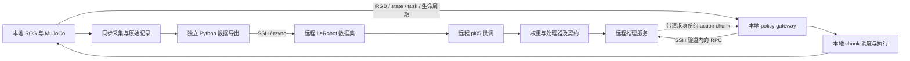

# LeRobot pi0.5 远程微调与推理、本地 ROS 仿真计划

日期：2026-10-01。状态：待实施方案，未连接远程服务器、未完成模型训练或端到端验证。

## 1. 目标与职责

使用 LeRobot 部署 pi0.5（代码中的策略类型为 `pi05`）：示范数据来自本地 ROS/MuJoCo，微调与模型推理均在远程 GPU 服务器运行，动作返回本地执行。

| 位置 | 运行内容 | 主要产物 |
| --- | --- | --- |
| 本地 ROS 环境 | 仿真、专家示范、同步采集、动作执行、episode 管理、评测 | 原始记录、执行证据、评测报告 |
| 本地独立 Python 环境 | LeRobot 数据导出和校验；可选的通信客户端 | 版本化数据集、manifest、通信日志 |
| 远程 Python/GPU 环境 | 数据复检、模型加载、微调、checkpoint 管理、推理服务 | checkpoint、训练日志、推理指标 |
| 本地 Codex + SSH | 编辑两端代码、运行命令和收集证据 | 可复现的配置与操作记录 |

远程主机不需要安装 Codex，也不需要 OpenAI API key。pi0.5 权重在远程 GPU 上直接计算。Hugging Face 的受限模型访问凭据是另一回事；如远程不能保存任何凭据，则在允许的机器上完成授权下载，再传输模型、tokenizer 和必要配置，以离线方式运行。不得将任何 token 写入配置、代码或日志。



两条链独立验收：离线训练链先验证数据与梯度更新；在线推理链先用 mock/scripted 服务验证通信和动作调度，再接真实模型。

## 2. 已知事实与实施前提

项目事实以 [architecture.md](../architecture.md) 为准。以下内容是规划依据，不是新增的已实现能力。

| 当前情况 | 对计划的影响 |
| --- | --- |
| ROS 2 Humble、MuJoCo C++ 在 `robotics-dev`，ROS Python 为 3.10 | ROS 节点使用 `/usr/bin/python3`，或现有 C++ 节点 |
| 邻近 `lerobot_begginer` 已安装 LeRobot 0.6.1，要求 Python >=3.12 | 保留独立 venv；不把 LeRobot 安装到 ROS Python 中 |
| 本地 RTX 4060 Laptop 为 8 GB；已有全尺寸模型搬到 GPU 时 OOM 的记录 | 本计划不要求本地加载 pi0.5 权重 |
| 远程已提供单卡 NVIDIA A800 80GB PCIe，Driver 580.65.06，`nvidia-smi` 报告 CUDA 13.0，Python 3.12.3 | 满足单卡 R1/R2 的候选资源；仍需在 PyTorch 中确认 CUDA runtime、实际峰值和可用磁盘 |
| 相机 RGB-D 默认 320×240、10 Hz；同一步观测为 100 Hz；物理步长 0.002 s | 第一版策略动作采样选 10 Hz，其他频率不混作模型训练帧率 |
| 当前只有一个固定相机，没有已实现的腕部相机 | 首版按真实单相机训练；若选双相机 checkpoint，先解决配置与视角适配，不能复制图片伪造腕部视角 |
| bridge 的 JointTrajectory 只执行 `points[0]`，不支持整段定时跟随 | 本地需要 chunk 调度器，逐个时间点发布单点关节目标 |
| 夹爪命令为两指总开口宽度，单位 m，范围 0..0.08 | 不直接套用 LIBERO 的夹爪符号或 actuator 的 0..255 数值 |
| learned-policy 接口和数据导出尚未完成；视觉完整抓放尚未通过 | 将契约、采集、调度作为前置工作；首轮可用现有固定场景专家基线 |
| LeRobot 0.6.1 的 async server 支持 `pi05` | 可复用模型服务机制；现成 robot client 不是本项目 ROS 客户端 |

实施时重新检查工作区：当前有用户正在进行的视觉跟踪修改，不把未完成的修改当作已验证能力，也不覆盖它们。

范围先限定为一个 Panda、一个稳定抓放任务、一种动作表示。多物体/bin、腕部相机和复杂语言任务在第一条闭环通过后扩展，不要求 MoveIt 成为 learned policy 的前置依赖。

## 3. 两端目录与版本管理

建议目录如下，远程路径在 P0 中按服务器实际存储调整。

```text
本地 robotic_manipulation_practice/
  src/<新增 ROS adapter/recorder/executor 包>/
  docs/plans/pi05_remote_local_plan.md

本地 lerobot_begginer/
  <数据导出器、校验器、共享 schema 与配置>
  data/raw/<capture_id>/
  data/exports/<dataset_version>/{train,val,test}/
  outputs/<run_id>/

远程 `$REMOTE_ROOT`（由服务器实际磁盘选择）/
  code/
  .venv/
  datasets/<dataset_version>/{train,val,test}/
  models/<model_id>/<revision>/
  runs/<run_id>/
  deployments/<deployment_id>/
```

已确认源码仓库位于 `/root/lerobot_pi/robotic_manipulation_practice_remote`（提交 `33088a6`）。后续 Git 同步在此目录操作。模型、数据和训练输出使用独立数据盘目录，避免占满系统盘；不要假设 `/workspace` 存在：

```bash
export REMOTE_CODE_ROOT=/root/lerobot_pi/robotic_manipulation_practice_remote
export REMOTE_ROOT=/root/autodl-tmp/pi05_ros   # 数据、模型和训练输出
mkdir -p "$REMOTE_ROOT"/{code,datasets,models,runs,deployments,logs}
df -h "$REMOTE_ROOT"
```

后续命令中的 `/workspace/pi05_ros` 都替换为 `$REMOTE_ROOT`。

共享的小型交付文件：`observation_action_contract.json`、`dataset_manifest.json`、`requirements.lock`、训练配置、`deployment_manifest.json`、`eval_protocol.json`。这些文件是拟新增产物，当前还不存在。

manifest 至少固定：两端代码 commit/补丁、LeRobot 版本、Python/PyTorch/CUDA runtime、模型与 tokenizer revision、数据格式与文件 SHA256、相机顺序、动作语义、采样率、统计量版本、场景/模型版本和随机种子。源码和配置进入版本控制；bag、视频、权重、venv、训练输出不进入 Git。

## 4. 低连接成本的执行方式

不要把 P0～P7 理解为八次远程操作。实际只安排 **3 个远程窗口**；其余工作全部在本地完成。每个窗口开始前先准备完整交付包，窗口结束前一次性下载全部日志和产物，然后释放服务器。

| 窗口 | 服务器用途 | 开始前必须完成 | 结束条件 |
| --- | --- | --- | --- |
| R1 环境与 smoke（一次性，约 1~3 小时） | GPU/依赖核对、模型下载、真实前向、20~100 步训练 smoke | 本地契约、导出器、5~10 条数据、固定样本和安装脚本均已通过 | 真实权重可加载、单步训练可更新、checkpoint 可恢复；失败则不进入正式训练 |
| R2 正式训练（按租用计费，集中完成） | 上传最终数据并运行完整微调、离线验证、打包 checkpoint | 本地数据已冻结，R1 的 config/显存结论已确定，训练命令可无人值守 | 下载所有候选 checkpoint、最终 checkpoint、日志和 manifest；随后释放 GPU |
| R3 在线推理（按需启动，可与评测批次合并） | 只运行已冻结 checkpoint 的推理服务 | 本地 gateway、chunk executor、mock、协议/超时测试已完成 | 完成本轮本地评测或达到时间预算；下载服务日志后停止 |

R1 之后的契约或数据变更，不在服务器上临时修补：在本地修改、重新导出并形成新版本，再决定是否值得开启新的 R1/R2。R3 不承担训练，也不在服务器上运行 ROS/MuJoCo。

**本地优先的工作顺序**：

1. 本地完成 P0（环境基线）、P1（契约和 adapter）、P2（采集、导出、回放、全部校验）以及 P5 的 mock 通信和本地动作调度。
2. 集中开启 R1，完成所有会消耗 GPU 费用的环境和模型事实确认；不要只做一次临时命令后退出。
3. R1 成功后关闭服务器，本地根据结果冻结正式训练配置和数据版本；需要补数据时只在本地补，不重新连接。
4. 集中开启 R2，完成正式训练、验证和 checkpoint 打包；训练期间不让本地代码或数据目录继续变化。
5. 下载并校验 checkpoint 后关闭服务器。本地先用离线/录制样本验证输入输出，再按需要开启 R3 做在线评测。

P0..P7 下面是技术清单，不是连接清单。涉及 ROS 实现的每个学习 Stage 仍遵循：写代码 → `colcon build` + 实测 → 机制/权衡/失败模式讲解 → 用户追问 → 记录到所属 week 文件。

### P0：本地基线、远程 R1 准备与一次性环境检查

**本地操作**

1. 确认 SSH 主机别名、远程用户、GPU 分配方式、存储配额和是否需要跳板机。若使用调度集群，SSH 登录节点只提交任务，模型服务必须运行在已分配 GPU 的计算节点。
2. 检查 ROS/MuJoCo 基线和相机，保存现有代码状态、场景配置和一次基线结果。
3. 确认 rsync 可用、SSH 隧道可达，并测小包往返时间和代表性图像包的往返时间。隧道从 ROS 容器还是宿主机发起要固定下来，客户端必须能访问该监听地址。

ROS 操作进入容器；已经在容器中时不要再次进入：

```bash
distrobox enter robotics-dev -- bash -ic '
  source /opt/ros/humble/setup.bash
  cd /home/anby/robotics/robotic_manipulation_practice
  colcon build --symlink-install
  colcon test
  colcon test-result --all --verbose
'
```

运行前按 [CLAUDE.md](../../CLAUDE.md) 过滤污染 PATH 的裸 pyenv 路径；必要时使用只包含 Docker 的最小 shim。先检查无遗留 bridge，运行后 `/clock` 必须只有一个 publisher。后台验证使用安装目录的真实可执行文件并管理实际 PID。

**远程 R1 操作（集中执行一次）**

```bash
nvidia-smi
df -h "$REMOTE_ROOT"
free -h
python3 --version
nvidia-smi --query-gpu=name,memory.total,memory.used,driver_version --format=csv
python3 -c 'import torch; print(torch.__version__, torch.version.cuda, torch.cuda.is_available(), torch.cuda.get_device_name(0) if torch.cuda.is_available() else "no-cuda")'
```

已知初始盘点：单卡 A800 80GB PCIe；Driver 580.65.06；`nvidia-smi` 报告 CUDA 13.0；Python 3.12.3；`/workspace` 不存在；内存总量约 1 TiB。R1 仍需记录 PyTorch wheel 的 CUDA runtime、实际可用磁盘、网络出口和作业最长运行时间。多张 GPU 的显存不能当作单张显存直接相加，必须有对应分布式训练实现。

先建立独立 Python 3.12 环境，依据驱动选择并锁定可用 PyTorch，再安装 `lerobot[pi,training,grpcio-dep]==0.6.1`。不得复制本地 venv 到服务器；本地 CUDA wheel 不自动适合远程 GPU。无需因 `nvidia-smi` 的 CUDA 字样而默认安装 CUDA Toolkit。

这台 A800 80GB 与全参数微调的保守 80GB 参考目标相符，因此 R1 首选 bfloat16 + gradient checkpointing 的标准配置；这只是资源匹配，不是训练一定成功的证明。仍需实测单步峰值。若接近上限，再考虑 batch=1、`train_expert_only` 或已验证的 PEFT 配置；这些会改变训练范围和效果，不能静默替换全参数微调。

**交付与验收**：`environment_report.md`；远程 CUDA 张量运算通过、代表性传输成功、可用存储足够。把 GPU/显存/驱动/依赖结论写回 manifest，R1 结束即释放服务器。

### P1：本地冻结 observation/action/episode 契约

**本地操作**

首版候选方案选择与现有 bridge 一致的关节空间表示：

| 字段 | 候选定义 |
| --- | --- |
| `observation.images.front` | 当前固定相机 RGB；原始 RGB 保留，模型 resize 由远程处理器负责 |
| `observation.state` | `[joint1..joint7, gripper_width_m]`，共 8 维 |
| `action` | `[joint1_target..joint7_target, gripper_width_target_m]`，共 8 维，绝对目标 |
| `task` | episode 内固定的任务文本；首版优先英文指令，与采集/评测保持一致 |
| 模型外证据 | q/dq、TCP、RGB-D/标定、session/generation/sequence、专家来源、执行和 outcome 日志 |

所有角度使用 rad，夹爪总开口使用 m。state/action 的关节名与顺序写入 schema；`use_relative_actions=false` 为首版候选。深度和 oracle pose 保留在原始记录/评测中，不作为首版 RGB VLA 的隐含输入。

这是针对本项目的数据方案，不是 LIBERO schema。LIBERO 的 state 为 TCP+夹爪，action 为末端增量+夹爪，不能靠改维度解释成关节动作。若改选 Cartesian 动作，必须同时实现并验证 delta 坐标系、旋转组合、缩放、IK 失败路径和夹爪映射后，再采集训练集。

时间契约：在相机 stamp 上精确匹配同一步 BridgeObservation，构造 `observation_t`；记录根据它发出的命令、实际生效时间与持续时间。训练标签是该观测后实际采用的控制目标，不是下一帧实测关节角，也不是实际运动结果。首版每 0.1 s 形成一个动作样本；专家目标若持续不变，重复记录当时有效的目标。缺帧/错代际不能用“最新值”填补。

需要区分三种记录：专家或模型名义输出、调度后实际采用的命令、仿真实测状态。topic 被发布不证明 ctrl 已生效；拟在 bridge 或执行确认接口中增加实际采用命令和物理步身份的证据。

**服务器工作延后到 R1，不在 P1 单独连接。** 本地先把候选 schema、相机键、state/action 维度和处理器覆盖写入版本化配置；R1 只做一次集中核对。

核对候选基础 checkpoint 的机器人表示、相机键/顺序、state/action 配置和处理器。通用 pi05 checkpoint 用于自定义 ROS 数据的候选；`lerobot/pi05_libero_base` 优先用于 LIBERO 环境 smoke，不直接承诺适配本项目。模型仓库 ID、可访问性和 revision 在 P0/P1 实際获取时确认。

LeRobot 0.6.1 默认 chunk_size=50、最大 state/action 维度=32、图像模型输入为 224×224；这些是模型配置，不能据此手动把数据集保存成 32 维。保留原始 8 维特征，使用官方处理器完成所需 padding。远程预检必须确认最终 config 的 input/output features 与 ROS 数据相符，不能沿用基础 checkpoint 的错误相机或 state 字段。

**交付与验收**：双方使用同一版本契约；完成已知单关节目标、夹爪开合、reset 的往返实验，核对 state、action 与实际运动。单相机配置必须通过模型完整预处理和前向后再冻结。

### P2：本地采集、导出、回放与数据冻结

**本地操作**

1. 先采集 5~10 个完整专家 episode，覆盖开合、接近、抓取、搬运、释放和结束；数量用于检查管线，不代表足够训练。
2. 使用现有 scripted/diff-IK baseline 或遥操作作为专家。oracle 辅助专家可以用于生成示范，但必须注明 expert source，模型输入白名单仅包含已声明的 RGB/state/task。
3. rosbag2/中间格式保存 RGB-D、CameraInfo、同一步观测、命令采用证据、reset/outcome。原始时间使用 int64 纳秒，并保留 session/generation/sequence。
4. ROS Python 3.10 导出一个不依赖 rclpy 的中间格式；独立 Python 3.12 使用 LeRobot 官方 dataset writer/API 生成数据集 v3.0，不手写内部 Parquet/视频布局。
5. 按 episode 和场景 seed 划分 train/val/test，避免同一轨迹不同帧泄漏。首版可选 80/10/10，但小型 smoke 集不用于判断泛化。
6. 分别导出三份数据集，只用 train 统计量建立模型归一化。val/test 的存在不能自动保证训练器使用了 train-only 统计量，必须检查保存的处理器。

LeRobot shell 使用现有 Python 3.12 venv，并先清理 ROS 环境污染：

```bash
cd /home/anby/robotics/lerobot_begginer
unset PYTHONPATH PYTHONHOME LD_LIBRARY_PATH
unset AMENT_PREFIX_PATH COLCON_PREFIX_PATH CMAKE_PREFIX_PATH
unset ROS_DISTRO ROS_VERSION ROS_PYTHON_VERSION
export PYTHONNOUSERSITE=1
source .venv/bin/activate
```

导出器检查：RGB 能解码且颜色/相机顺序正确；state/action 无 NaN/Inf；episode 时间递增；动作窗口不跨 reset；尾部 `action_is_pad` 被正确处理；task 不丢失；采样率真实为 10 Hz。缺帧默认拒绝该段，不静默伪造固定频率。

原始命令回放用于检查动作语义和记录完整性。回放需声明是按原始动作调度开环执行，还是重新运行专家闭环；后者不能替代前者。接触仿真用轨迹误差和 outcome 验收，不承诺逐 bit 重现。

**服务器工作延后到 R1/R2，不在 P2 单独连接。** P2 的输出必须是可直接上传的完整数据包，不依赖服务器现场转换。

只接收冻结版本，不训练仍在增长的目录。以下为已有 rsync 的传输模板，替换版本和实际远程目录后使用：

```bash
REMOTE_DATA_ROOT='/root/autodl-tmp/pi05_ros'   # 替换为远程真实路径；这是 rsync 的目标字符串
rsync -av --partial --progress \
  /home/anby/robotics/lerobot_begginer/data/exports/ros_panda_v001/ \
  "pi05-server:${REMOTE_DATA_ROOT}/datasets/ros_panda_v001/"
```

不要传 venv、整个 home 或凭据。两端比较 manifest 的 SHA256、episode/frame 数及拆分；服务器重新解码视频并构造完整训练 batch。必要时先用 PyAV，TorchCodec/FFmpeg 是否可用以远程实测为准。

**交付与验收**：原始记录、可读取的 LeRobot 数据集、校验报告、拆分清单、train 统计量和 SHA256 manifest；至少一个 episode 原始动作回放通过。

### P3：远程 R1 模型加载与短微调验证

**本地操作**

准备同一组固定 RGB/state/task 样本、少量示范和动作边界案例，交给远程复检；此时不允许未验证模型控制仿真。

**远程 R1 操作（与环境检查合并）**

1. 获取并固定权重和 `google/paligemma-3b-pt-224` tokenizer 所需文件/revision。检查受限资源授权和加载日志，不能用随机权重替代缺失预训练权重而宣称部署成功。
2. 用官方 PI05Policy 和 pre/post processors 运行真实前向；记录冷启动、热启动、峰值显存、输出维度和有限值检查。
3. 用自有数据集执行一次完整 forward/backward/optimizer step，然后运行约 20~100 个短训练步。batch=1 起步，关闭 compile 和在线仿真评测，W&B/Hub 上传默认关闭。
4. 保存 checkpoint 后在新进程重新加载；恢复 optimizer、scheduler 和 step，并继续训练。只重新加载权重不算训练恢复成功。
5. 检查 checkpoint 的相机、8 维 state/action、归一化模式/统计量、task tokenizer 和动作 absolute/relative 处理。基础模型使用 QUANTILES 或 MEAN_STD 必须与最终训练配置共同验证，不能仅凭 shape 决定。

基础命令模板如下。只有 P1 的 feature/config 预检通过后才能用于自有数据；若基础 checkpoint 的 input_features 不一致，先生成经核对的配置覆盖参数，再附加到命令，不能原样开训。

```bash
python -m lerobot.scripts.lerobot_train \
  --policy.path=$REMOTE_ROOT/models/approved_base \
  --policy.device=cuda \
  --policy.dtype=bfloat16 \
  --policy.gradient_checkpointing=true \
  --policy.compile_model=false \
  --policy.use_relative_actions=false \
  --policy.push_to_hub=false \
  --dataset.repo_id=local/ros_panda_train \
  --dataset.root=$REMOTE_ROOT/datasets/ros_panda_v001/train \
  --dataset.video_backend=pyav \
  --batch_size=1 \
  --num_workers=0 \
  --steps=50 \
  --save_freq=25 \
  --env_eval_freq=0 \
  --wandb.enable=false \
  --output_dir=$REMOTE_ROOT/runs/smoke_v001
```

`approved_base` 是部署时需要准备并校验的本地模型目录占位名，不是当前已存在的文件。首次实际执行前核对 0.6.1 CLI 与处理器覆盖路径，并保存最终展开配置。

**交付与验收**：真实预训练权重加载、有限 loss/gradient、optimizer 更新、checkpoint 新进程推理和恢复训练均通过；保存 step time、trainable 参数范围、显存峰值。此阶段不以任务成功率作为通过标准。

### P4：远程 R2 正式微调与离线筛选

**本地操作（R2 之前完成，R2 期间不改数据）**

R1 smoke 通过后，先关闭服务器，再在本地扩充示范的初始位置、遮挡、背景和抓放变化。固定场景成功不代表这些变化已支持；随机 reset 或多物体场景需要先在 ROS 侧实现验证。建议以 50~100 条成功示范作为第一轮预算起点，根据评测缺口补数据，不将数量当作充分条件。完成后重新导出、校验并冻结 R2 数据包。

失败/recovery 数据保留用于诊断；首版 BC 训练默认采用标记明确的成功专家示范，避免无区分地学习失败动作。任务阶段的长静止段占比、动作跳变和稀少的夹爪事件都要统计。

**远程 R2 操作（一次性正式训练）**

固定 train 数据版本与配置，运行正式微调。保存多个 checkpoint、训练 loss、验证 loss/动作指标、step time、显存、学习率、梯度和恢复记录。模型筛选使用 val；test 保留到配置选定后使用，不反复据 test 调参。

服务器不运行本地 ROS 仿真。因此离线 loss 只是诊断，任务成功率由 P6 的本地仿真闭环产生。固定场景微调与 LIBERO benchmark 结果分别记录。

**交付与验收**：候选 checkpoint、可恢复训练状态、最终配置和数据 manifest。显存或时间不够时明确记录改为 action-expert-only/PEFT 的决定和对比，先复跑 P3 再长训。

R2 退出清单：停止训练作业，确认最后 checkpoint、训练日志、展开配置、处理器、统计量和 manifest 均已下载并通过 SHA256；确认远程 GPU/计算节点已释放。不要为了查看一个日志重新租用 GPU，优先使用本地下载的日志和 TensorBoard/W&B 导出。

### P5：本地 mock 闭环与远程 R3 gateway 准备

**远程 R3 操作（仅在本地 mock 和协议测试通过后）**

优先复用 LeRobot 模型加载、处理器和 `predict_action_chunk`；RPC 使用现有 gRPC/Protobuf 库。原生 async server 可用于独立模型服务 smoke：

```bash
python -m lerobot.async_inference.policy_server \
  --host=127.0.0.1 --port=8080 --fps=10
```

此命令只启动服务，模型由客户端初始化指令加载，不等于模型已 ready。现成 robot_client 不能直接用于当前 Panda/ROS。原生协议也未承诺本项目 session/generation/reset/取消契约，需适配或增加项目 gateway。

第一版推荐薄的项目 RPC gateway：仅负责契约校验、请求生命周期、单会话隔离和调用官方 pi05 模型；不重写模型、归一化或通用通信机制。拟提供 health/ready、infer、reset_session/cancel，服务在 warm-up 和 checkpoint/schema 验证通过后才报告 ready。单 GPU worker 串行处理；训练和推理第一版分时运行，避免争抢显存。

**本地操作**

建立 SSH 隧道，下面端口仅为建议，冲突时换端口并同步配置：

```bash
ssh -N -T \
  -o ExitOnForwardFailure=yes \
  -o ServerAliveInterval=15 \
  -o ServerAliveCountMax=3 \
  -L 127.0.0.1:18080:127.0.0.1:8080 \
  pi05-server
```

客户端连接 `127.0.0.1:18080`。若服务在调度分配的计算节点，调整隧道目标/跳板链路，不能默认登录节点 localhost 就是 GPU 节点。服务不直接公开到公网。

ROS gateway 使用 Python 3.10/C++；远程模型服务使用 Python 3.12。共享的是 Protobuf/schema，不能让 ROS 节点 import LeRobot。若复用 LeRobot Python 客户端，则在本地 Python 3.12 CPU sidecar 与 ROS 进程之间再设 IPC 边界。

请求与回包至少带：`schema_version`、deployment/checkpoint ID、client/episode ID、bridge_session、generation、sample_sequence、request_id、原始 sim stamp、task、camera keys、动作采样周期和 action chunk shape。回包必须回显请求身份，附服务端处理耗时和错误码。

先以 mock 服务返回保持/小幅已知动作，完成相机与状态打包、请求回包、reset、错版本、错维度、断网和迟到包实验，再加载真实 checkpoint。

**本地调度规则**

- 第一版只允许一个有效在途推理请求，消费最新完整观测；队列有界，不因服务慢而堆积图像。
- 模型可预测 50 步，但初始只执行前 K=1..5 步，然后重新观测。10 Hz 下 50 步相当于 5 s，不应未经评测整段盲执行。
- 调度器按仿真时间逐步发布单点 arm target 和 gripper target；不把 50 点轨迹直接发送给当前 bridge。
- 仿真时间决定动作时间线；本地 steady clock 决定 RPC 等待与断流时限。远程时钟不用于判断本地动作是否过期；RTF 与本地观测年龄共同记录。
- 第一版采用收到有效回包后开始执行短 chunk 的语义，并限制原始观测年龄；不自动跳过未知数量动作以追赶延迟。异步重叠/RTC 作为后续单独验证项。
- chunk 执行完仍无新动作时，停止推进旧 chunk，发布当前实测关节位置的保持目标，保留夹爪宽度，并进入超时/失败路径；接触场景中的保持不等于真机急停。
- reset/episode 切换/断线后立即清空缓存与待执行动作，调用服务端会话 reset；旧请求即使后来成功返回，也不能影响新 episode。
- 数据包非法、NaN/Inf、错代际、错误部署版本或超过声明的动作/速度边界时拒绝并记录，不静默裁剪。这里检查违反契约，不替策略重新规划；不宣称已提供碰撞规避。
- 推理模式与原 task_executor 专家控制互斥，本地只有一个 arm/gripper 命令所有者。

**交付与验收**：mock 闭环无错代际动作、无重复执行、无无限队列；真实 checkpoint 固定样本 RPC 与进程内推理处理流程一致。先完成 100 次热推理延迟统计，再确定 K、观测年龄和看门狗阈值。

### P6：本地仿真评测与按需远程 R3 推理

**本地操作**

1. 停止专家命令发布者；启动 bridge、相机、recorder、gateway、chunk executor 和独立 evaluator。
2. 先执行保持/低幅动作，再进行一个完整模型 episode，检查关节、夹爪、时间线与安全拒绝。
3. 固定测试 seed/任务/相机/RTF，以现有专家 baseline 和微调模型对照；第一轮可用 20 个 episode，结果只作为初步估计。
4. 单独报告完成任务的 episode、模型失败、网络超时、动作拒绝、视觉证据不足和仿真异常，不能从成功率分母中删掉失败。
5. evaluator 可用 oracle/contact 判断仿真结果，但其数据不能送入模型输入；需要 vision 成功证据时沿用实际已验证的视觉门槛，不能把预测位姿当作最终实测。

**远程 R3 操作**

启动固定 deployment 的服务，关闭训练进程，记录每次请求来源、checkpoint、推理耗时和错误。模型重启或换 checkpoint 必须让本地结束/重置会话，不在同一 episode 中无记录地切换模型。

**交付与验收**：至少一个完整模型控制 episode 的可追踪记录；固定测试集的结果表、专家对照和失败分类。协议正确、动作正确与任务能力分别验收；单次成功或 loss 下降不代表泛化能力。

R3 退出清单：先停止本地 episode，再停止 gateway 客户端，最后停止远程服务并下载服务日志。模型评测所需的固定输入、回包和结果必须在本地落盘，避免下次为重算同一结果再次付费。

### P7：本地复现、结果固化与下一轮决策

**本地操作**：提供独立专家/远程策略启动配置、停止与恢复流程、数据采集和评测入口；将失败轨迹送入补数清单，而不是直接混入下一版 BC 数据。

**远程 R2/R3 收尾**：在对应窗口结束前固化依赖/镜像、模型缓存、训练恢复与推理服务配置；保存 checkpoint、处理器、归一化统计量和 deployment manifest，不只保存一个权重文件。窗口结束后本地保存这些交付物。

双方在新 shell/进程中重新跑通“读取同一数据 → 加载同一模型 → 重放固定请求 → 本地测试 episode”。实施后将已验证项目事实更新到 architecture.md；实际架构决策各自新增 ADR；讨论与实测归入所属周记，不把本计划当作已完成学习记录。

## 5. 延迟预算与停止条件

测量 `T_pack + T_upload + T_queue + T_preprocess + T_gpu + T_postprocess + T_download + T_apply`。单向跨机器时延需要时钟同步，第一版优先用本地 steady clock 测总 RTT，服务端只报告自身阶段耗时。

若需要连续运行，剩余动作缓冲对应的时间必须能覆盖实测 P95/P99 往返时间和抖动；增大 K 会降低反馈频率，增加对旧观测的依赖。同步短 chunk 模式允许可记录的等待/保持，但必须在等待期间继续检查观测年龄与超时。

暂不预设“网络一定支持 10 Hz 闭环”。测试后选择缩短输入编码、降低请求频率或调整 K；超出观测年龄预算就停止该 episode。若只能暂停仿真等待推理，需先实现并验证暂停/步进接口，并明确标记为离散步进评测，不计作实时闭环。

## 6. 失败模式与验证

| 失败模式 | 现象 | 必做验证/处理 |
| --- | --- | --- |
| ROS/LeRobot Python 混用 | rclpy 扩展加载失败、包冲突 | 独立进程与解释器，检查 sys.executable |
| 加载/训练 OOM | 模型搬卡或 backward 失败 | 实测单步峰值；降低 batch/改变训练范围后重新 P3 |
| LIBERO 动作误当关节目标 | shape 可用但控制方向/尺度错误 | 已知动作回放；schema 与 checkpoint 语义核对 |
| 相机或归一化错配 | loss/动作异常，线上离线不一致 | 固定样本检查、处理器快照、train stats hash |
| topic 发布被误当实际执行 | 记录与 ctrl 生效时间不一致 | bridge 命令采用证据与同一步状态比对 |
| 50 点 chunk 仅执行第一点 | 模型输出正常但机器人几乎不动 | 单点调度计数与 applied-action trace |
| reset 后迟到包被采用 | 新场景执行旧动作 | 推理中 reset + 延迟注入，确认拒绝旧 generation |
| 网络断开/服务重启 | 旧目标持续推动机器人 | 有界缓存、保持/失败、重连后新会话 |
| 专家与模型同时发布 | 控制目标来回跳变 | 模式互斥、检查命令所有者 |
| 数据泄漏/虚假能力判断 | 离线很好但新 episode 失败 | episode/seed 拆分、train-only stats、独立 evaluator |

## 7. 值得提前明确的四个问题

1. **命令究竟何时生效？** 当前 topic 无执行确认，P1/P2 要用 bridge 物理步证据解决，不能仅通过 rosbag 推断。
2. **模型是否真的看图和指令？** 第一轮固定任务可能靠状态记忆完成；P6 增加遮图/替换指令诊断，先检查输入路径，不能据固定场景成功宣称语言泛化。
3. **50 步预测中实际用了多少？** 逐个记录预测、执行、替换、丢弃和过期动作，P5 用 mock 实验验证。
4. **失败来自网络还是策略？** P5/P6 记录 RTT、推理分段耗时、RTF、观测年龄和拒绝原因；这些一次实验即可回答，直接实施，不列作悬挂问题。

## 8. 完成标准与参考

完成标准：本地 ROS 数据可导出并校验；远程真实 pi0.5 微调可保存恢复；远程服务输出的短 chunk 在本地按契约执行；reset/断网/迟到包有实测证据；模型任务结果与 baseline 可比较；两端无需远程 OpenAI API key。

本计划依据仓库 architecture、Week 4.5、邻近 LeRobot 实验记录和本地安装的 LeRobot 0.6.1 源码编写。当前执行环境直连 GitHub 原始文档失败，未将未获取的最新网页作为已核实依据；实施时以锁定版本源码和实际下载的模型配置复核。

- 现有接口周计划：Week 4.5 已于 2026-10-07 删除（原文见提交 `60293a2`）；当前计划见 [Week 5](../../Job_guides/my_study/week5.md)
- [本地 LIBERO 数据契约记录](../../../lerobot_begginer/docs/libero_dataset/README.md)
- [本地 LeRobot 环境约定](../../../lerobot_begginer/AGENTS.md)
- [LeRobot pi0.5 文档](https://huggingface.co/docs/lerobot/pi05)
- [LeRobot 异步推理文档](https://huggingface.co/docs/lerobot/async)
- [LeRobot 源码](https://github.com/huggingface/lerobot)
